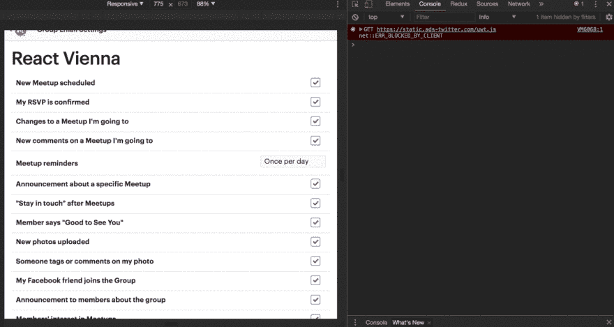
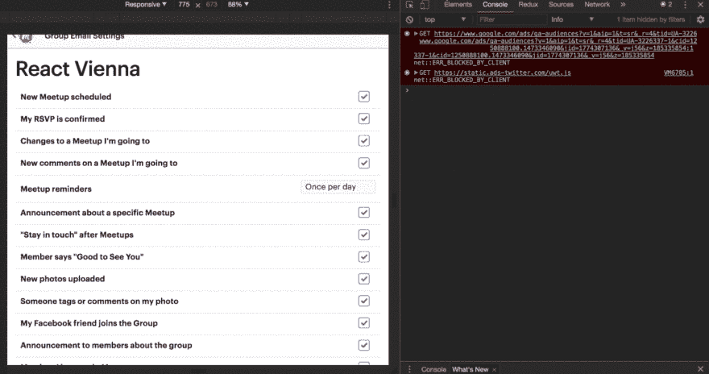

# 减少你点击网络元素的时间

> 原文:[https://dev . to/createdd/reduce-your-time-clicking-elements-on-the-web-238](https://dev.to/createdd/reduce-your-time-clicking-elements-on-the-web-238)

# 减少你点击网页元素的时间

[【https://un flash . com/photos/7 nsqsnycoy】](https://unsplash.com/photos/7nsqPSnYCoY)[【Aziz achar arki】](http://unsplash.com/@acharki95?utm_medium=referral&utm_campaign=photographer-credit&utm_content=creditBadge)

因为我是 meetup ( [FCC Vienna](https://www.meetup.com/de-DE/Free-Code-Camp-Vienna/) )的组织者，需要花时间在他们的平台【meetup.com上。我认为他们的网站可以在用户体验方面进行更新，但我真的很喜欢它的功能和概念。然而，真正困扰我的一件事是管理你的电子邮件通知设置的有限选项。在当今快速发展的世界中，我没有时间去点击成百上千的复选框来避免垃圾邮件，所以我找到了一个使用 JavaScript 的更快的解决方案。

## ðÿ"„目录

*   [在网络上使用 JavaScript 的力量](#using-the-power-of-javascript-on-the-web)
    *   [问题](#the-problem)
    *   [解决方案](#the-solution)
    *   [如果一个 meetup.com 的开发者正在读这篇文章](#if-a-developer-of-meetupcom-is-reading-this)
*   [有用链接&学分](#useful-links-credits)

* * *

> ## "The less strength, the faster the speed and the greater the strength." -Bruce Lee

## 在网络上利用 JavaScript 的力量

事实上，所有网页都由 JavaScript 控制，这为那些能够在控制台中使用 JavaScript 的人提供了额外的机会。

### 问题

要更改每个 meetup 的电子邮件通知设置，您必须单击每个 meetup 并取消选中每个复选框。当我现在是许多团体的成员时，我不得不多次经历这个过程，这在某种程度上冒犯了我，因为我的时间是非常宝贵的。

[T2】](https://res.cloudinary.com/practicaldev/image/fetch/s--bvbbdXHs--/c_limit%2Cf_auto%2Cfl_progressive%2Cq_auto%2Cw_880/v1/../assets/REDCLICK/emailUpdates.png)

因此，为了以编程方式解决该任务，我在 chrome 检查器中标识了 checkbox 元素:

[T2】](https://res.cloudinary.com/practicaldev/image/fetch/s--kyCSHs4y--/c_limit%2Cf_auto%2Cfl_progressive%2Cq_auto%2Cw_880/v1/../assets/REDCLICK/inspector.png)

之后，我使用`document.querySelector`来获取这些元素，并将其存储在一个数组中:

`[...document.querySelectorAll('.icon-s')]`

[T2】](https://res.cloudinary.com/practicaldev/image/fetch/s--kNOg8fKQ--/c_limit%2Cf_auto%2Cfl_progressive%2Cq_66%2Cw_880/http://recordit.co/yWtOhgoZju.gif)

### 解

现在在数组上使用`.foreach`并点击每个项目。

`[...document.querySelectorAll(".icon-s")].forEach(box=> {
box.click();
})`

[T2】](https://res.cloudinary.com/practicaldev/image/fetch/s--rVfvHBnW--/c_limit%2Cf_auto%2Cfl_progressive%2Cq_66%2Cw_880/http://g.recordit.co/LcTYPfxEEj.gif)

* * *

ðÿš€:这就是你解决问题的速度和容易程度

* * *

当你需要点击很多次时，这 3 行代码可以节省你很多时间。请确保在日常工作中使用您对 JavaScript 的丰富知识。😃

### 如果一个 meetup.com 的开发者正在阅读这篇文章

请调整网页的 UX。非常感谢:D

## 有用链接&学分

*   [MDN 查询选择器](https://developer.mozilla.org/en/docs/Web/API/Document/querySelector)
*   [韦斯·博斯以编程方式对抗招聘者的垃圾邮件](https://www.youtube.com/watch?v=Ddu1T3BdATg)

如果你从这篇文章中有所收获，请告诉我你的意见或想法。请确保关注更多内容:)