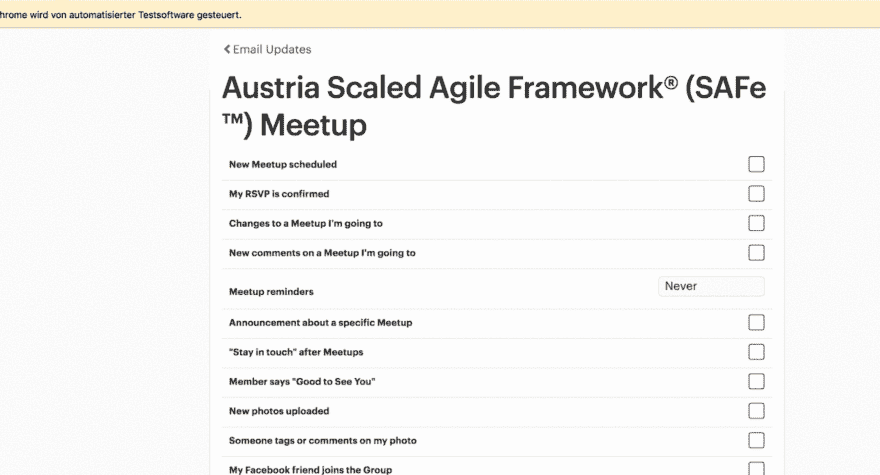

# 使用 JavaScript 自动设置电子邮件

> 原文:[https://dev . to/createdd/automate-email-settings-with-JavaScript-5p](https://dev.to/createdd/automate-email-settings-with-javascript-5p)

# 使用 JavaScript 自动设置电子邮件

[](https://unsplash.com/photos/Ya3FqJdKVaw)
[【https://un flash . com/photos/ya 3 fqjdkvaw】](https://unsplash.com/photos/Ya3FqJdKVaw)照片由 samuele errico piccarini 制作

在我的上一篇文章中，我描述了如何在浏览器控制台中使用 JavaScript 来更快地完成繁琐的 web 任务。当然这种方法是有局限性的。更进一步的方法是使用像 Selenium 这样的自动化框架。在这篇文章中，我展示了如何灵活快速地编写一个脚本来帮助您节省大量时间。

[Github 回购可在此处获得…](https://github.com/DDCreationStudios/seleniumExample)

## ðÿ"„目录

*   [问题](#the-problem)
*   [如何使用 Selenium webdriver 实现自动化](#how-to-automate-with-selenium-webdriver)
*   [用它点击 meetup.com 上的垃圾邮件复选框](#using-it-on-clicking-spam-checkboxes-on-meetupcom)
    *   [设置](#setup)
    *   [转到设置](#going-to-the-settings)
    *   [识别元素并迭代它们](#identify-the-elements-and-iterate-over-them)
*   [在 Youtube 上看结果](#see-the-result-in-youtube)

* * *

> ## "The first rule of any technology used in business is that automation applied to efficient operations will amplify efficiency. Second, the application of automation to inefficient operations will magnify inefficiency. " Bill Gates

## 问题

Meetup.com 页面要求我选中每个组的电子邮件通知的复选框。

[T2】](https://res.cloudinary.com/practicaldev/image/fetch/s--11nBQJNo--/c_limit%2Cf_auto%2Cfl_progressive%2Cq_auto%2Cw_880/v1/../assets/SELEX/emailUpdates.png)

我不会浪费时间点击我所有的群。Meetup.com 提供了一个禁用所有通知的选项，但我希望接收一些选定组的更新。另一件事是他们有“提醒”，需要更多点击下拉菜单。我在上一篇文章中展示的控制台代码甚至不能处理这个下拉菜单。

因此，我决定写一个自动化的脚本来为我做所有的事情。

[T2】](https://res.cloudinary.com/practicaldev/image/fetch/s---AiSm1hz--/c_limit%2Cf_auto%2Cfl_progressive%2Cq_66%2Cw_880/http://g.recordit.co/wc1jG5oRLW.gif)

## 如何用 Selenium webdriver 实现自动化

Selenium 允许使用 web 驱动程序浏览浏览器并执行人类也能做的动作(比如点击元素)。

自动化的过程很简单:

*   用浏览器中的检查器
    [](https://res.cloudinary.com/practicaldev/image/fetch/s--KSKR3Fau--/c_limit%2Cf_auto%2Cfl_progressive%2Cq_auto%2Cw_880/v1/../assets/SELEX/inspector.png) 找到元素

*   用`driver.findElement`获取元素

*   使用`.then`(JS 中的承诺)或来自框架的函数(如`.click()`)对该元素执行操作

*   执行完任务后，务必`driver.quit();`结束驱动程序

## 用它点击 meetup.com 上的垃圾邮件复选框

### 设置

在这个例子中，我使用的是 [Selenium webdriver](https://github.com/SeleniumHQ/selenium/tree/master/javascript/node/selenium-webdriver) 。

Node.js 中的设置非常简单:

```
var webdriver = require('selenium-webdriver'),
    By = webdriver.By,
    until = webdriver.until;

var driver = new webdriver.Builder().forBrowser('chrome').build();
driver.manage().window().maximize(); 
```

<svg width="20px" height="20px" viewBox="0 0 24 24" class="highlight-action crayons-icon highlight-action--fullscreen-on"><title>Enter fullscreen mode</title></svg> <svg width="20px" height="20px" viewBox="0 0 24 24" class="highlight-action crayons-icon highlight-action--fullscreen-off"><title>Exit fullscreen mode</title></svg>

### 前往设置

要进入通知部分，我只需进入他们的登录页面，发送我的登录凭据，然后一直点击设置。

```
driver.get('https://secure.meetup.com/login/');

var mail = driver.findElement(webdriver.By.id('email'));
var pass = driver.findElement(webdriver.By.id('password'));

mail.sendKeys(cred.cred.user);
pass.sendKeys(cred.cred.pass);

driver.findElement(webdriver.By.name('submitButton')).click();
driver
    .findElement(
        webdriver.By.className(
            'valign--middle display--none atMedium_display--inline'
        )
    )
    .click();
driver.findElement(webdriver.By.xpath('//a[text()="Settings"]')).click();
driver.findElement(webdriver.By.xpath('//a[text()="Email Updates"]')).click(); 
```

<svg width="20px" height="20px" viewBox="0 0 24 24" class="highlight-action crayons-icon highlight-action--fullscreen-on"><title>Enter fullscreen mode</title></svg> <svg width="20px" height="20px" viewBox="0 0 24 24" class="highlight-action crayons-icon highlight-action--fullscreen-off"><title>Exit fullscreen mode</title></svg>

### 识别元素并迭代它们

我识别所有的复选框和下拉菜单，并对每个元素调用一个函数(`clickingAll`)。

```
const list = driver.findElements(
    webdriver.By.xpath('//li[@class="list-item"]/a')
);

list.then(function(elements) {
    var links = elements.map(elem => {
        return elem.getAttribute('href');
    });
    promise.all(links).then(linkRefs => {
        linkRefs.forEach(element => {
            driver.navigate().to(element);
            clickingAll();
        });
    });
}); 
```

<svg width="20px" height="20px" viewBox="0 0 24 24" class="highlight-action crayons-icon highlight-action--fullscreen-on"><title>Enter fullscreen mode</title></svg> <svg width="20px" height="20px" viewBox="0 0 24 24" class="highlight-action crayons-icon highlight-action--fullscreen-off"><title>Exit fullscreen mode</title></svg>

`clickingAll()`函数实际上单击元素并测试复选框是否已经被取消选中(因为我们不想简单地单击所有内容，而是取消选中所有复选框)。

```
var clickingAll = () => {
    driver
        .findElements(
            webdriver.By.xpath('//i[@class="icon-s icon-checkbox pseudocheckbox "]')
        )
        .then(elements => {
            elements.map(elem => {
                elem.getAttribute('aria-checked').then(check => {
                    if (check === 'true') {
                        elem.click();
                    }
                });
            });
        });
    driver
        .findElement(webdriver.By.xpath('//select[@class="j-selectbox"]'))
        .click();
    driver
        .findElement(webdriver.By.xpath('//option[@value="NO_RECEIVE"]'))
        .click();

    try {
        driver
            .findElement(webdriver.By.xpath('//option[@value="OFF]'))
            .then(null, err => {
                if (err) {
                    return false;
                }
            })
            .click();
    } catch (e) {
        return false;
    }
    driver.navigate().back();
}; 
```

<svg width="20px" height="20px" viewBox="0 0 24 24" class="highlight-action crayons-icon highlight-action--fullscreen-on"><title>Enter fullscreen mode</title></svg> <svg width="20px" height="20px" viewBox="0 0 24 24" class="highlight-action crayons-icon highlight-action--fullscreen-off"><title>Exit fullscreen mode</title></svg>

## 在 Youtube 上查看结果

[T2】](https://youtu.be/-fPcsgR6uHk)

如果你从这篇文章中有所收获，请告诉我你的意见或想法。请确保关注更多内容:)