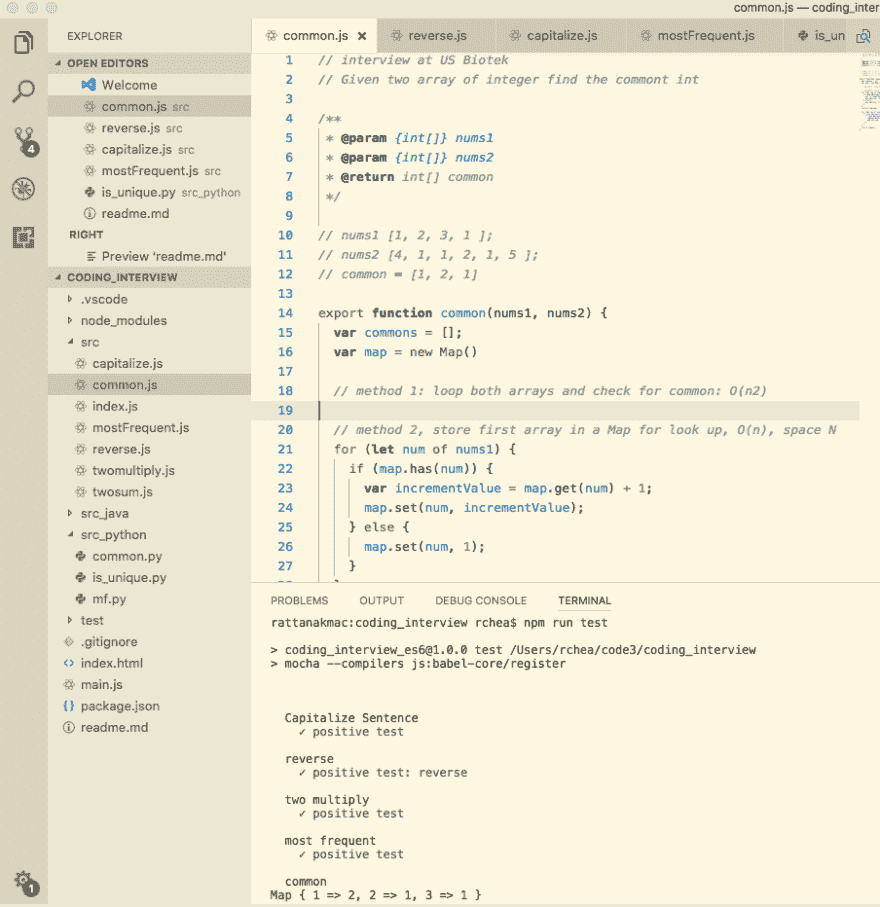

# 编码面试问答项目

> 原文:[https://dev.to/rattanakchea/coding-interview-questions-7k9](https://dev.to/rattanakchea/coding-interview-questions-7k9)

我在进行一次成功的白板编码面试时遇到的最大挑战之一是，我没有练习编写面试中被问到的算法(例如，反转一个链表，检查二叉树是否平衡，等等..)在我的日常任务上。就像其他技能一样，如果我们不练习，它们就会生锈。

在过去的几年里，我参加了几次编码面试。每次面试后，不管结果如何，我都把面试的问题写下来，有机会再练一遍。

因此我做了一个开源的测试驱动项目，[编码 _ 面试](https://github.com/rattanakchea/coding_interview)收集了面试中常见的问题。到目前为止，我有一些用 JavaScript、Python 和 Java 编写的问题、答案和测试。这是一个正在进行的项目。正在添加更多的问题和答案。

一些示例问题包括

1.  如何找出两个数列之间的公数？
2.  写一个函数，把句子中除了 *a，the，to，at，in，with，and but，or* 以外的每个单词都大写？
3.  写一个函数检查一个字符串是否唯一？(即没有重复字符)

[T2】](https://res.cloudinary.com/practicaldev/image/fetch/s--oRKclAED--/c_limit%2Cf_auto%2Cfl_progressive%2Cq_auto%2Cw_880/https://raw.githubusercontent.com/rattanakchea/coding_interview/master/screenshot.png)

## 特性

*   用 JavaScript、Python、Java 编写的代码
*   使用 Mocha 库进行测试，Python 的单元测试
*   每个问题都附有说明和例子
*   有组织和可重用的代码

## 如何运行

*   克隆 repo，然后`npm install`克隆所有依赖项
*   `npm run test`运行 JavaScript 的所有测试用例
*   `npm run test-p`运行 Python 测试用例

## 你能帮上什么忙

*   如果你想了解更多，请访问:[编码 _ 采访](https://github.com/rattanakchea/coding_interview)
*   如果你想贡献，请提交一份简历。我很感激。