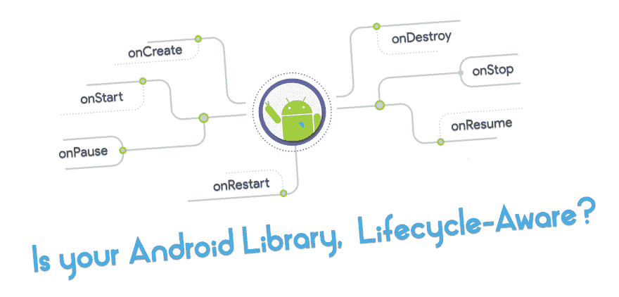
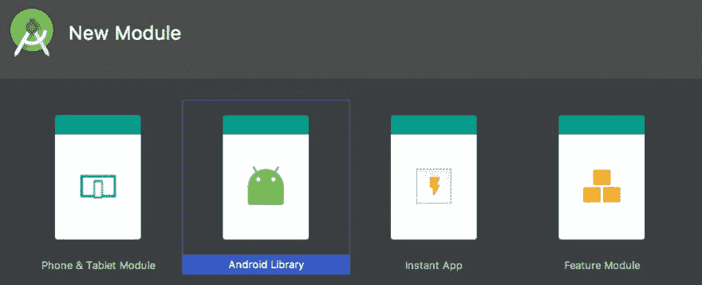
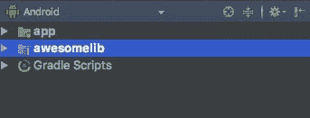

# 你的 Android 库有生命周期意识吗？

> 原文:[https://dev . to/nisrulz/is-your-Android-library-life cycle-aware-2di](https://dev.to/nisrulz/is-your-android-library-lifecycle-aware-2di)

[T2】](https://res.cloudinary.com/practicaldev/image/fetch/s--LimFRzhb--/c_limit%2Cf_auto%2Cfl_progressive%2Cq_auto%2Cw_880/https://thepracticaldev.s3.amazonaws.com/i/bwtapw7v91tetikgayje.png)

Android 中的生命周期事件。

一直是全世界安卓开发者的痛点。显而易见，大多数情况下，代码库内存泄漏的主要原因是因为访问了与应用程序活动/片段的生命周期不同步的无效状态。这意味着作为一名 Android 开发者，你必须进行大量的检查，确保你的代码状态与活动/片段的生命周期同步。

当你希望别人这么做的时候，事情会变得有些混乱，当你是一个 Android 库开发者的时候就是这样。作为一名 android 库开发人员，你需要其他应用程序开发人员遵守取消注册回调/调用清理方法或特定函数，以便在活动/片段生命周期的某些点重新初始化，例如 onDestroy()、onResume()、onCreate()等。

现在，这是一个很大的期望和要求。我们都知道开发人员倾向于避免阅读文档(..为了快速构建功能并按时完成任务，显然是ðÿ˜…)。这意味着有时候清理部分被遗漏了，或者没有被正确理解，以至于他们没有把它放在代码中正确的位置。例如，如果一个`Activity`在被停止后收到一个回调，那么你的应用很可能会因为内存泄漏而崩溃。在 Activity 被销毁之前取消注册回调是必要的，如果应用程序开发人员从您的 android 库中调用`cleanup()`方法，这是可能的，但这是他们所期望的。你不能确保他们会遵守它。

### 嗯这是一个问题，那么有什么解决办法呢？

解决方案是让你的 android 库 ***感知生命周期*** 。让 android 库知道活动/片段的生命周期的状态给了我们，Android 库开发人员更大的控制权，以确保回调未被注册，并且对清理方法的调用或重新初始化在活动/片段的生命周期中的正确状态发生。同时，这意味着减少对应用程序开发人员的依赖，让他们在应用程序中加入更多的代码和检查来处理 android 库的状态。 ***听起来像是双赢，嗯！***ðÿ˜ž

### 但是我们如何让我们的库代码生命周期提前呢？

#### 回车，生命周期拱门组件！

[Lifecycle Arch 组件](https://developer.android.com/topic/libraries/architecture/lifecycle.html)是一组新的生命周期感知组件，可以跟踪活动或片段的生命周期，并相应地调整它们的行为。

它们是由谷歌的优秀员工创建的，在 2017 年谷歌 I/O 大会上推出，目前正处于`beta`阶段。进入`beta`并不意味着他们没有准备好。随着库本身变得稳定，它们似乎是大多数人在不久的将来前进的方式。但是我们现在就可以跟进，因为他们已经准备好了。

> 更新:*核心生命周期工件(运行时、公共)已经达到稳定版本`v1.0.0`。生命周期编译器和扩展现在是版本`v1.0.0-beta1`*

无需花费太多时间，让我们直接了解如何为您自己的 android 库连接这些生命周期组件…

我将使用一个简单的例子来演示布线过程，这是 github [这里](https://github.com/nisrulz/android-examples/tree/develop/LifeCycleCompForLib)上的一个功能完整的示例应用程序。

让我们从创建一个新的应用程序开始。完成后，您可以添加新的库模块

[T2】](https://res.cloudinary.com/practicaldev/image/fetch/s--R1nuHpE1--/c_limit%2Cf_auto%2Cfl_progressive%2Cq_auto%2Cw_880/https://thepracticaldev.s3.amazonaws.com/i/phl0zzgpp7dtbv7pw39t.jpeg)

您的文件夹结构应该如下所示

[T2】](https://res.cloudinary.com/practicaldev/image/fetch/s--XDB7zI-X--/c_limit%2Cf_auto%2Cfl_progressive%2Cq_auto%2Cw_880/https://thepracticaldev.s3.amazonaws.com/i/fxx19ztyxe3g99bp3q52.jpeg)

接下来添加这个`awesomelib`模块作为对`app`模块的依赖，这样`app`模块就可以访问`awesomelib`库模块包含的公共类。为此，将以下内容添加到`app`模块的`build.gradle`中。

```
implementation project(':awesomelib') 
```

<svg width="20px" height="20px" viewBox="0 0 24 24" class="highlight-action crayons-icon highlight-action--fullscreen-on"><title>Enter fullscreen mode</title></svg> <svg width="20px" height="20px" viewBox="0 0 24 24" class="highlight-action crayons-icon highlight-action--fullscreen-off"><title>Exit fullscreen mode</title></svg>

接下来，您想要向您的`awesomelib`库模块添加一个类。我创建了一个名为`AwesomeMainLib`的名字。这个类只是为了展示库的代码，稍后将在`app`模块中引用。为了简单起见，让我们将`AwesomeMainLib`类设为单例。这种情况下的代码如下所示