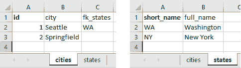

# 到 VBA 和更远的地方——使用普通的 Microsoft Excel 宏构建 RESTful 后端

> 原文:[https://dev.to/michaelneu/to-vba-and-beyond-building-a-restful-back end-using-plain-Microsoft-excel-macros-76n](https://dev.to/michaelneu/to-vba-and-beyond---building-a-restful-backend-using-plain-microsoft-excel-macros-76n)

当我和我的同事讨论一个即将到来的项目的后端技术时，有人开玩笑地提到 Excel，因为人们广泛滥用它作为一个可怕的数据库替代品。虽然我们勉强接受了。NET，用 Excel 做后端的想法让我着迷。因为我最近刚刚完成了我的学士论文，有一些空闲时间，我想我应该试一试，看看我能走多远。

本文由三个主要部分组成，介绍 webserver 的内部结构，让 Excel 响应 http 请求，并添加一些特殊的调料使其成为 RESTful 后端。如果您迫不及待地通读源代码，您可以查看存储库 [webxcel](https://github.com/michaelneu/webxcel) ，我将在本文通篇引用它。

**新** : Webxcel 也支持 PHP——参见[擅长 PHP](https://dev.to/michaelneu/excel-ing-at-php-14i9) 。

## 网络服务器

当使用 express 或 ASP.NET 时，我们通常会考虑 http 路由和请求体，但我们从来没有真正关心过请求在框架内部是如何处理的。实际上，每个 http 请求都包含一个 TCP 连接，客户端和服务器交换各种消息并最终关闭连接。一个非常基本的请求可能是这样的:

```
POST /api/cities HTTP/1.1
Host: localhost
User-Agent: Mozilla/5.0 (Windows; U; MSIE 6.0; Windows NT 5.1; SV1; .NET CLR 2.0.50727)
Content-Type: application/json
Content-Length: 29

{  "name":  "Springfield"  } 
```

<svg width="20px" height="20px" viewBox="0 0 24 24" class="highlight-action crayons-icon highlight-action--fullscreen-on"><title>Enter fullscreen mode</title></svg> <svg width="20px" height="20px" viewBox="0 0 24 24" class="highlight-action crayons-icon highlight-action--fullscreen-off"><title>Exit fullscreen mode</title></svg>

这个 post 请求向`/api/cities`发送一个 JSON 负载，我们通常期望服务器创建一个名为“Springfield”的城市。如果我们的后端是一个简单的 express 服务器，它可能看起来像这样:

```
const express = require("express"),
      app = express();

function handler(req, res) {
  // create city

  res.status(201)
     .send("woo hoo!"); // 
}

app.post("/api/cities", handler);
app.listen(8080); 
```

<svg width="20px" height="20px" viewBox="0 0 24 24" class="highlight-action crayons-icon highlight-action--fullscreen-on"><title>Enter fullscreen mode</title></svg> <svg width="20px" height="20px" viewBox="0 0 24 24" class="highlight-action crayons-icon highlight-action--fullscreen-off"><title>Exit fullscreen mode</title></svg>

在执行`handler`之前，express 解析请求，提取请求方法和请求的资源，以确定要执行什么动作。它还解析请求头和请求体——取决于`Content-Type`。这看起来有点像下面这段伪 js:

```
// ...

const requestText = socket.readToEnd(),
      request = parseRequest(requestText),
      contentType = request.headers.get("Content-Type");

if (canParseRequestBody(contentType)) {
  request.body = parseRequestBody(body, contentType);
}

const handler = registeredHandlers.findHandler(request.method, request.url),
      response = new HttpResponse();;

if (handler) {
  handler(request, response);
}

sendResponse(response);

// ... 
```

<svg width="20px" height="20px" viewBox="0 0 24 24" class="highlight-action crayons-icon highlight-action--fullscreen-on"><title>Enter fullscreen mode</title></svg> <svg width="20px" height="20px" viewBox="0 0 24 24" class="highlight-action crayons-icon highlight-action--fullscreen-off"><title>Exit fullscreen mode</title></svg>

上面的 express 示例还展示了使用`res.send()`向响应添加任意文本，以及使用`res.status()`设置响应的状态。在 pseudo-js 中可以看到，调用请求处理函数后，底层框架会将 response 对象转换成类似如下的 HTTP 响应并发送回客户端:

```
HTTP/1.1 201 Created
X-Powered-By: Express
Content-Length: 8

woo hoo! 
```

<svg width="20px" height="20px" viewBox="0 0 24 24" class="highlight-action crayons-icon highlight-action--fullscreen-on"><title>Enter fullscreen mode</title></svg> <svg width="20px" height="20px" viewBox="0 0 24 24" class="highlight-action crayons-icon highlight-action--fullscreen-off"><title>Exit fullscreen mode</title></svg>

在我们的客户端中，我们将在再次解析所有内容后评估状态代码、标题和响应文本。

## 你好，这是 Excel

现在，我们如何让 Excel 响应我们的请求呢？Microsoft Office 附带了一个非常酷的工具带，名为 macros，人们现在因为勒索软件而讨厌它。你可能会说宏现在已经过时了，用 Visual Basic 编写宏并不酷，因为你可以用任何现代编程语言来代替，但是它们背后的概念实际上非常简洁。

### VBA 宏

宏最初是为了避免用户一遍又一遍地重复同样的任务。为此，用户可以*录制*宏，然后重复他们之前做的事情。在内部，宏主机将创建一个正在发生的“脚本”并在以后解释它。这些脚本碰巧是在 Visual Basic 中生成的，或者——更具体地说——*Visual Basic for Applications*(VBA)。为了与应用程序进行交互，宏宿主将功能“注入”到 VBA 解释器中，就像 Excel 中的`Range`函数，它可以用来访问一组单元格。因为如果你没有编程背景，VBA 是非常容易学习的，所以用户很快采用了注入的函数和类并将其组合到`Sub`和`Function`中，例如，基于更复杂的计算自动生成单元格值。

### 制作 Excel 文件进行版本控制

开发宏的一个主要问题是版本控制。Office 文件通常是 zip 容器，所以以二进制形式添加它们会阻止任何合理的区分方式。如果宏没有在一个单独的容器中使用一种叫做 OLE 的特殊格式进行二进制编码，那么提取并重新压缩项目将是一种可行的方法。有一些 OLE 宏提取器，比如 [decalage2 的 oletools](https://github.com/decalage2/oletools) ，但是奇怪的是，我没有找到任何库来简单地创建这些容器。

与其阅读规范并创建我们自己的库，我们可以先尝试一些别的东西:我们可以使用。NET，让 Excel 为我们做所有的艰苦工作。使用这种方法，我们需要纯文本文件中的宏代码，以及一个导入器，它启动 Excel 并导入我们的宏。为此，我们将使用 PowerShell，它提供了对。因为我们不需要编译这些脚本。

在 PowerShell 中，我们可以创建一个 Excel 实例，然后用它来创建工作簿和导入宏。你可以看看存储库中的构建脚本 [build.ps1](https://github.com/michaelneu/webxcel/blob/master/build.ps1) 。

### 逃离互操作地狱——在 VBA 使用 Windows 套接字

在我们解决了版本控制问题之后，我们可以直接进入创建服务器的核心。如前所述，构建 web 服务器需要处理 TCP 连接。坏消息是，VBA 没有默认提供 TCP 实现，我实在想不出它应该提供的理由。但是不要担心，微软认为有人需要有问题的特性，所以他们把 C interop 也植入了 VBA。

每个从像 C#这样的高级语言中做过 C interop 的人都知道当错误地编组参数时`AccessViolationException`的痛苦。在 VBA，基本上是一样的，除了调试器和 IDE 都不是真正用来开发大量互操作的应用程序，因此调试不像你习惯的那样容易。

让 TCP 服务器只使用 interop 而不使用外部库(比如已经实现 HTTP 服务器的 C#库——这对我们来说太容易了)运行的“最简单”方法是使用 Windows Sockets (winsocks)。如果你还没有用过 winsocks，这是它在 C++中的基本样子:

```
// we can skip all variable declarations as they're not that important here

// setup winsocks
WSAStartup(mode, &wsa);

// create a server socket, this is similar to bsd sockets
server = socket(AF_INET, SOCK_STREAM, 0);

// bind the server socket to an address and port, which it'll listen to later
addr.sin_port = htons(8080);
result = bind(server, &addr, sizeof(sockaddr_in));
// usually we'd check the result and handle errors, but that's not important here

// start listening on the server socket and allow queuing up `backlog` clients
result = listen(server, backlog);
// check result, see above

// get the first client socket in the backlog queue
client = accept(server, &clientAddr, sizeof(sockaddr));

// at this point, the connection is active and we can send/receive data
send(client, message, messageLength, flags);

// cleanup after we're done
closesocket(client);
closesocket(server);
WSACleanup(); 
```

<svg width="20px" height="20px" viewBox="0 0 24 24" class="highlight-action crayons-icon highlight-action--fullscreen-on"><title>Enter fullscreen mode</title></svg> <svg width="20px" height="20px" viewBox="0 0 24 24" class="highlight-action crayons-icon highlight-action--fullscreen-off"><title>Exit fullscreen mode</title></svg>

第一个好消息是:我们可以通过在一个[模块](https://github.com/michaelneu/webxcel/blob/master/src/Modules/wsock32.bas#L55-L67)中导入所有需要的方法，并简单地以正确的顺序调用所有这些方法[来让一个 TCP 服务器启动并运行](https://github.com/michaelneu/webxcel/blob/master/src/Classes/TcpServer.cls)，从而将这一点直接转化为 VBA。

由于现在我们已经有了一个工作的 TCP 连接，我们可以通过解析传入的 HTTP 请求来继续我们的服务器开发。如上所示，请求由协议行、头部和请求体组成。解析协议行可能是最简单的，我们可以把它分成三个部分:请求方法、资源和 http 版本。

在实际拆分代码行之前，我们应该确保我们正在处理一个 http 请求。为此，我们可以使用 VBA 的文本比较特性`Like`，它检查一些文本是否匹配一个非常简单的模式，类似于正则表达式。通过评估

```
' prevent comparison errors if clients send lower case requests
Dim upperLine As String
upperLine = UCase(line)

' this is somewhat similar to
'   /.* HTTP\/1\.1/.test(upperLine)
' in js
If Not upperLine Like "* HTTP/1.1" Then
  ' we're concentrating on http 1, since version 2 is a bit more complex to implement
  Err.Raise StatusCode.ErrorHttpRequestInvalidFormat
End If

' now we know the request is an http request and can continue parsing it 
```

<svg width="20px" height="20px" viewBox="0 0 24 24" class="highlight-action crayons-icon highlight-action--fullscreen-on"><title>Enter fullscreen mode</title></svg> <svg width="20px" height="20px" viewBox="0 0 24 24" class="highlight-action crayons-icon highlight-action--fullscreen-off"><title>Exit fullscreen mode</title></svg>

我们可以确保只处理 http 请求，并提取请求方法和资源。分割标题也是小菜一碟，我们只需要在每个标题行上使用`Split(line, ":", 2)`，其中`2`代表分割函数应该返回的部分的最大数量，我们就完成了。为了简单起见，我们现在不打算解析请求体。因为我们希望服务器返回一个非常简单的响应，所以我们只回显请求。

类似于 express，我们将使用响应对象来处理请求。我们的[响应类](https://github.com/michaelneu/webxcel/blob/master/src/Classes/HttpResponse.cls)包含标题、状态和主体。使用这个类，我们可以创建一个简单的 echo 服务器，读取所有输入的文本，解析请求并发送我们的响应:

```
Dim server As TcpServer
Set server = New TcpServer

' listen for incoming connections on port 8080
server.BindTo 8080

' accept an incoming connection ...
Dim client As TcpClient
Set client = server.AcceptTcpClient()

' ... and receive the request text
Dim requestText As String
requestText = client.ReceiveString()

Dim request As HttpRequest
Set request = New HttpRequest

request.Parse requestText

Dim response As HttpResponse
Set response = New HttpResponse

' send "200 OK" and the body
response.StatusCode = 200
response.Body = "Called " & request.Url & " with this body:" & vbCrLf & vbCrLf & request.Body

Dim responseText As String
responseText = response.ToString()

' actually send the response back to the client
client.SendString responseText

' and do some cleanup
client.Dispose
server.Dispose 
```

<svg width="20px" height="20px" viewBox="0 0 24 24" class="highlight-action crayons-icon highlight-action--fullscreen-on"><title>Enter fullscreen mode</title></svg> <svg width="20px" height="20px" viewBox="0 0 24 24" class="highlight-action crayons-icon highlight-action--fullscreen-off"><title>Exit fullscreen mode</title></svg>

像 nginx 和 apache 这样的 web 服务器可以配置为发送服务器版本，所以我们将对 Excel 做同样的事情。在我们的响应类中，我们使用一个  方法将我们的对象转换为包含所有响应信息的字符串。当用 axios node.js 模块检查我们的服务器时，我们将收到一个非常令人满意的响应:

```
> const axios = require("axios");
> axios.post("http://localhost:8080", "it works").then(response => {
...   console.log(response.status, response.statusText);
...   console.log(response.headers);
...   console.log(response.data);
... });

// outputs
200 'Nobody Needs This Anyway'

{ 'content-length': '39',
  connection: 'close',
  server: 'Microsoft Excel/16.0' }

Called /hello with this body:

it works 
```

<svg width="20px" height="20px" viewBox="0 0 24 24" class="highlight-action crayons-icon highlight-action--fullscreen-on"><title>Enter fullscreen mode</title></svg> <svg width="20px" height="20px" viewBox="0 0 24 24" class="highlight-action crayons-icon highlight-action--fullscreen-off"><title>Exit fullscreen mode</title></svg>

正如你所看到的，我们还在我们的响应中添加了一个头`Connection: close`，但是大多数服务器通常会发送`Connection: keep-alive`。这是由于 http 规范，它允许为将来的请求重用当前的套接字，web 服务器利用这一点来获得一些额外的性能。由于我们的 web 服务器无论如何都不会像其他服务器一样快，我们不妨跳过这一步，关闭套接字，这也比保持连接打开容易。

### 它挡住了 gui，我现在该怎么阻止它？

我们有一个回声服务器工作，太好了！但是它只对一个请求起作用，而且我们必须在每次客户请求时重新启动宏，所以让我们把它放在一个循环中，我们就可以开始了。

不完全是。如果我们在一个宏中执行一个`while (true) {Â }`样式的循环，我们会看到很多白色和一个“Microsoft Excel(无响应)”类型的标题栏。这是由于 Excel 处理宏执行的方式。正如你可能猜到的，宏是在主线程上执行的，所以无论我们做什么，我们的服务器都会阻止我们访问 Excel，甚至停止宏。

然而，在我们的宏中，我们可以做任何我们想做的事情，例如实现一个 kill-switch。我们的 kill-switch 将是一个文件，我们将在服务器启动时创建该文件，服务器将对其进行监控。如果文件被删除，服务器就会停止，就这么简单。

但是我们还没说完。调用`accept`来获取客户端套接字也会阻塞宏的执行，直到客户端连接到我们的服务器。搜索“winsocks accept timeout”将带我们进入另一个 C++冒险:将`FD_SET`和`FD_ZERO`宏移植到 VBA 以使用`select`方法，这反过来会给我们提供可用客户端套接字的数量。

在我们成功地[将这些 C++宏移植到 VBA](https://github.com/michaelneu/webxcel/blob/master/src/Modules/wsock32.bas#L70-L93) 之后，我们可以将一个`timeval`对象传递给`select`，并在用`accept`阻塞之前检查是否有客户端。将它添加到我们的服务器中，我们终于可以随心所欲地处理任意多的请求了，此外，我们还可以使用 kill-switch 来停止服务器。厉害！

**更新 2017-10-09:** 正如 [Michiel van der Blonk 指出的](https://dev.to/michaelneu/to-vba-and-beyond---building-a-restful-backend-using-plain-microsoft-excel-macros-76n/comments/125a)，从 VBA 调用`DoEvents`会暂停宏的执行，直到 Excel 处理完它的事件队列。将它添加到我们的服务器循环中，允许我们在服务器运行时访问 Excel。

### 创建模块化服务器架构

如果我们想与 express 或任何真实世界的 web 服务器处于同一水平，我们必须能够配置 http 路由。VBA 不包含任何形式的内联函数，但它包含基本的继承。我们可以使用这个特性创建一个抽象的 [`IWebController`](https://github.com/michaelneu/webxcel/blob/master/src/Classes/IWebController.cls) 基类，然后为我们的特定控制器创建子类。

除了实际处理请求，每个控制器还应该包含一个类似于`MatchesUrl`的方法，服务器可以用它来为请求找到合适的控制器。将它封装在一个`WebControllerCollection`中，并将这样一个集合添加到我们的服务器中，我们现在能够将任何业务逻辑添加到我们的服务器中(就像一个 [`FileSystemWebController`](https://github.com/michaelneu/webxcel/blob/master/src/Classes/FileSystemWebController.cls) 来提供静态文件)。

## 休息一下

这篇文章的标题承诺在 Excel 中实现 RESTful 后端，到目前为止我们只得到一个基本的 http 服务器。由于 Excel 基本上是一组表格，我们可以用它来推进并使用一个`IWebController`子类读取/修改表格的数据。

### 创建表格

当我们在任何现实世界的关系数据库中创建一个表时，我们使用类似这样的东西:

```
CREATE TABLE cities (
  id INT PRIMARY KEY,
  name VARCHAR(200),
  fk_states VARCHAR(200)
); 
```

<svg width="20px" height="20px" viewBox="0 0 24 24" class="highlight-action crayons-icon highlight-action--fullscreen-on"><title>Enter fullscreen mode</title></svg> <svg width="20px" height="20px" viewBox="0 0 24 24" class="highlight-action crayons-icon highlight-action--fullscreen-off"><title>Exit fullscreen mode</title></svg>

在 Excel 中，我们可以将工作表用作表格，将当前工作簿用作数据库。但是我们如何创建列呢？我们不能改变列标题“A”，“B”，“C”，...所以我们最好的办法是使用我们列的第一行。定义列中的主键也需要很容易。显示某件事情很重要的最简单的方法就是把它变成红色或者加粗。Excel 支持许多不同的红色调，因此将我们的主键标记为粗体可能是最好的主意:

[T2】](https://res.cloudinary.com/practicaldev/image/fetch/s--7C_S5eGS--/c_limit%2Cf_auto%2Cfl_progressive%2Cq_auto%2Cw_880/https://github.com/michaelneu/webxcel/raw/mastimg/wrm-schema.png)

从表中读取所有实体也很容易，我们只需要遍历所有行，直到主键列为空。插入的工作方式是一样的，只是我们要寻找第一个空的主键单元格来插入我们的记录。

对于任何创建或更新 REST 操作，我们都需要解析请求体。由于大多数前端框架只使用 JSON，我们将需要一个新的 [`JsonParser`](https://github.com/michaelneu/webxcel/blob/master/src/Classes/JsonParser.cls) ，它发出`JsonObject`和`JsonArray` s。为了简单起见，我们使用一个手写的递归下降自顶向下解析器，它计算大括号/方括号，然后递归调用适当的解析方法。

现在我们有了包含主键和 JSON 解析器的表，我们可以继续在 [`WorkbookWebController`](https://github.com/michaelneu/webxcel/blob/master/src/Classes/WorkbookWebController.cls) 中创建 REST 端点。为了不在每个请求中遍历所有的表，我们可以添加一个路由前缀，比如`/workbook`(例如`/workbook/cities`)。在控制器的`ProcessRequest`方法中，我们可以分析哪个工作表被请求，我们应该执行哪个 REST 方法。这产生了一个基本的 REST 后端，它可以返回表中的所有条目，并返回、更新或删除单个实体。

### 姑且称之为 WRM 吧

但是，做基本的 REST 工作还不够好:像 ASP.NET 这样的真正的 web 框架映射实体的关系。如果我们在 ASP.NET 应用程序使用的数据库中有上述模式，底层持久性框架将解析所有外键(例如`fk_states`)并将这些映射到它们的实际实体。我们可以在 Excel 中创建类似的东西，不使用对象关系映射器，而是使用一个*工作表*关系映射器(WRM)。

在我们的 WRM 中，我们可以读取所有的表条目，但是在将数据返回给客户机或插入到表中之前，我们要遍历所有的列，并尝试解析以“fk_”开头的每一列。每当我们找到这样的列时，我们将获得外部表的匹配实体，并使用它来代替原始值。一旦一切都解决了，当从上面的模式
中访问`/workbook/cities`时，我们可能会得到这样的结果

```
[  {  "id":  "1",  "city":  "Seattle",  "states":  {  "short_name":  "WA",  "full_name":  "Washington"  }  },  {  "id":  "2",  "city":  "Springfield",  "states":  null  }  ] 
```

<svg width="20px" height="20px" viewBox="0 0 24 24" class="highlight-action crayons-icon highlight-action--fullscreen-on"><title>Enter fullscreen mode</title></svg> <svg width="20px" height="20px" viewBox="0 0 24 24" class="highlight-action crayons-icon highlight-action--fullscreen-off"><title>Exit fullscreen mode</title></svg>

## 把所有的东西放在一起

我们现在可以结合本文的内容，在 Excel 中构建高度复杂的数据库模式，我们可以使用 REST 方法来访问这些模式。如前所述，我们的 Excel 服务器还支持静态文件服务，因此它是构建未来 web 应用程序原型的理想平台——至少如果您正在 Windows 上构建原型(也许有一天会支持 macOS)。

为了展示 webxcel 的易用性，存储库在[示例文件夹](https://github.com/michaelneu/webxcel/tree/master/example)中包含一个带有 Excel 后端的 React todo 应用程序。

**编辑于 2018-03-27 23:00**
修复 VBA 语法高亮显示。

**编辑于 2019-07-31 12:30**
添加了 FastCGI 帖子的链接。