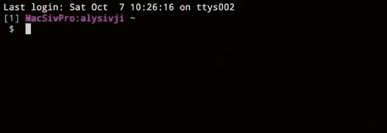
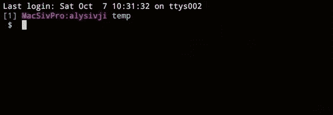
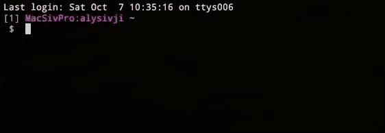

# 终端技巧:目录书签

> 原文:[https://dev . to/alysivji/terminal-tricks-directory-bookmarks-329](https://dev.to/alysivji/terminal-tricks-directory-bookmarks-329)

*本帖最初发表在 [Siv 脚本](https://alysivji.github.io/)T3 上*

即使我的开发文件夹组织得很好，当我寻找一个项目目录时，我仍然不得不在文件系统中摸索。这就像试图在黑暗的房间里找到一个电灯开关:这里一个`cd`,那里一个`ls`,当我被卡住的时候，也许还有一个`find`。

我总能到达我想去的地方，但一路上难免会遇到挫折。此外，所有花费在浏览目录上的时间开始累积。

***等一下。我在浏览器中使用书签，为什么我不在 shell 中使用它们呢？*T3】**

快速的谷歌搜索让我找到了 Bashmarks。绝对的游戏改变者。我可以轻松地在文件系统中移动。

感觉有点像神秘博士。

[T4】](https://res.cloudinary.com/practicaldev/image/fetch/s--oR18SklJ--/c_limit%2Cf_auto%2Cfl_progressive%2Cq_auto%2Cw_880/https://alysivji.github.img/11-20/17_tardis_meme.jpg)

在这个[快速点击](https://alysivji.github.io/category/quick-hits.html)中，我们将探索 Bashmarks，浏览安装过程，并感受一下最常用的命令。

* * *

## Bashmarks

> Bashmarks 是一个[bash] shell 脚本，允许您保存和跳转到常用目录

它支持制表符结束(！！！)并且有一个非常简单的界面，只有 5 个需要记忆的命令。

用别的壳？没问题。有巴斯马克的港口供[鱼](https://github.com/techwizrd/fishmarks)和 [zsh](https://github.com/jocelynmallon/zshmarks) 使用。

### 安装

将文件下载到一个临时目录中，并使用 [GNU make](https://www.gnu.org/software/make/manual/make.html) :
进行安装

```
mkdir temp && cd temp
git clone git://github.com/huyng/bashmarks.git
cd bashmarks
make install echo "source ~/.local/bin/bashmarks.sh" >> ~/.bash_profile
source ~/.bash_profile 
```

<svg width="20px" height="20px" viewBox="0 0 24 24" class="highlight-action crayons-icon highlight-action--fullscreen-on"><title>Enter fullscreen mode</title></svg> <svg width="20px" height="20px" viewBox="0 0 24 24" class="highlight-action crayons-icon highlight-action--fullscreen-off"><title>Exit fullscreen mode</title></svg>

我们准备好了！

### 命令

```
s <bookmark_name>  - Saves the current directory as "bookmark_name"
g <bookmark_name>  - Goes (cd) to the directory associated with "bookmark_name"
p <bookmark_name>  - Prints the directory associated with "bookmark_name"
d <bookmark_name>  - Deletes the bookmark
l                 - Lists all available bookmarks 
```

<svg width="20px" height="20px" viewBox="0 0 24 24" class="highlight-action crayons-icon highlight-action--fullscreen-on"><title>Enter fullscreen mode</title></svg> <svg width="20px" height="20px" viewBox="0 0 24 24" class="highlight-action crayons-icon highlight-action--fullscreen-off"><title>Exit fullscreen mode</title></svg>

我们可以使用`s [bookmark_name]`命令保存书签:

[](https://res.cloudinary.com/practicaldev/image/fetch/s--1-2410-j--/c_limit%2Cf_auto%2Cfl_progressive%2Cq_66%2Cw_880/https://alysivji.github.img/11-20/17_bashmarks_save.gif)

用`l` :

[](https://res.cloudinary.com/practicaldev/image/fetch/s--VP1yqCF8--/c_limit%2Cf_auto%2Cfl_progressive%2Cq_66%2Cw_880/https://alysivji.github.img/11-20/17_bashmarks_list.gif) 列出所有 bashmarks

使用`g [bookmark_name]` :

[](https://res.cloudinary.com/practicaldev/image/fetch/s--vBw54WVX--/c_limit%2Cf_auto%2Cfl_progressive%2Cq_66%2Cw_880/https://alysivji.github.img/11-20/17_bashmarks_jump.gif) 导航到项目目录

* * *

## 结论

Bashmarks 是一个提高开发人员生产力的工具。

有没有有趣的终端工作流程或窍门分享？请在下面评论！