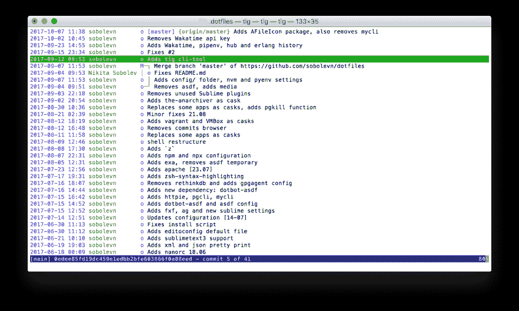
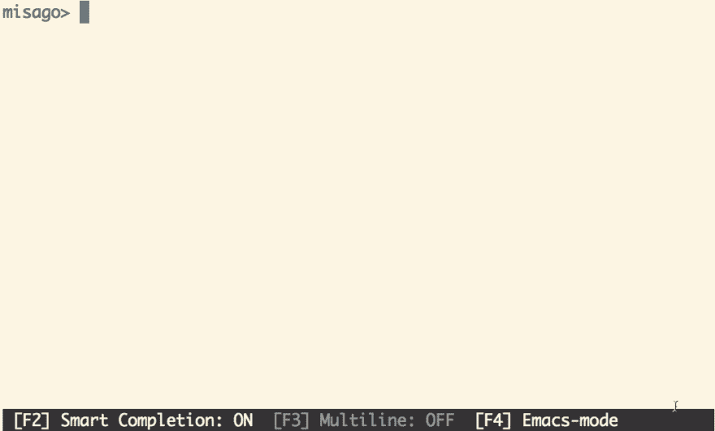
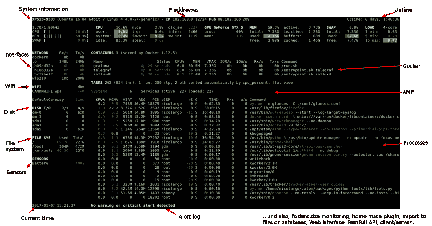
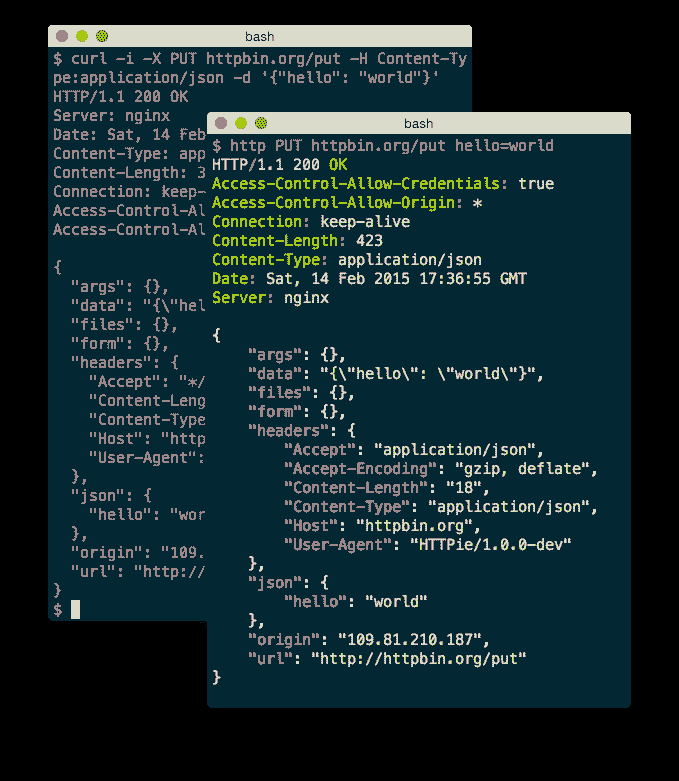

# 使用更好的 CLI

> 原文:[https://dev.to/sobolevn/using-better-clis-6o8](https://dev.to/sobolevn/using-better-clis-6o8)

对于在终端上度过半生的人来说，用户体验和功能非常重要。让你变得更快乐。

这里有一些非常好的替代默认命令行应用程序的方法。

## TLDR

我的完整设置包括本文中讨论的所有内容，甚至更多。来看看:[https://github.com/sobolevn/dotfiles](https://github.com/sobolevn/dotfiles)

## 去吧

### 枢纽

当经常使用开源(和 Github)项目时，有时`git`是不够的。于是，Github 创造了一个叫做 [`hub`](https://hub.github.com/) 的工具。

它允许从远程分支获取，浏览问题，并轻松地创建拉请求！

```
# Open the current project's issues page
$ git browse -- issues
  → open https://github.com/github/hub/issues

# Fetch from multiple forks, even if they don't yet exist as remotes:
$ git fetch user1,fork2

# Browse issues:
$ git browse -- issues
  → open https://github.com/github/hub/issues

# Create a pull request:
$ git pull-request -F message-template.md 
```

<svg width="20px" height="20px" viewBox="0 0 24 24" class="highlight-action crayons-icon highlight-action--fullscreen-on"><title>Enter fullscreen mode</title></svg> <svg width="20px" height="20px" viewBox="0 0 24 24" class="highlight-action crayons-icon highlight-action--fullscreen-off"><title>Exit fullscreen mode</title></svg>

### tig

让我们面对现实吧。`git log`烂透了。它允许浏览提交历史，但是当您想要查看特定提交的变更集或树结构时...你将不得不记住所有这些命令或者使用大量的外部插件。

`tig`解决了一切。首先，它允许浏览提交历史。然后就可以潜进去了！浏览变更集，文件树，责任，甚至 blobs！

[T2】](https://res.cloudinary.com/practicaldev/image/fetch/s--PgZQ3tRC--/c_limit%2Cf_auto%2Cfl_progressive%2Cq_auto%2Cw_880/https://i.imgur.com/0EVZxQb.png)

## Utils

### postgres(还有 mysql 也是！)

使用`postgres`时，我们必须使用`psql`。而且挺好的。它有历史，一些基本的自动完成和命令，很容易记住。但是，有一种更好的工具叫做 [`pgcli`](https://github.com/dbcli/pgcli) 。

[T2】](https://res.cloudinary.com/practicaldev/image/fetch/s--eQFZ870_--/c_limit%2Cf_auto%2Cfl_progressive%2Cq_66%2Cw_880/https://raw.githubusercontent.com/dbcli/pgcli/7c720a07652d705376af6bf4fcfe6a65e0df3ddc/screenshots/pgcli.gif)

特点:

*   智能自动完成
*   语法突出显示
*   表格数据的漂亮打印

它还有一个版本的`mysql`叫做 [`mycli`](https://github.com/dbcli/mycli) 。

对了，昨天发布了`postgres`的新[第十版](https://www.postgresql.org/about/news/1786/)。🎉

### 对视一眼

系统监控是每个开发人员的共同任务。像`top`和`htop`这样的标准工具是优秀且值得信赖的软件。但是看看这个美女， [`glances`](https://github.com/nicolargo/glances) :

[T2】](https://res.cloudinary.com/practicaldev/image/fetch/s--X0X_Edmb--/c_limit%2Cf_auto%2Cfl_progressive%2Cq_auto%2Cw_880/https://raw.githubusercontent.com/nicolargo/glances/develop/docs/_static/glances-summary.png)

`glances`有很多插件可以监控几乎所有的东西:[https://github.com/nicolargo/glances#requirements](https://github.com/nicolargo/glances#requirements)

它还有一个 web 界面和一个预构建的`docker`-容器来轻松集成它。我最喜欢的插件列表:

*   `docker`
*   `gpu`(对矿工和币友们非常有用！)
*   `bottle`(网络界面)
*   `netifaces` (IPs)

如果你想的话，创建你自己的！

## httpie

`curl`和`wget`众所周知，应用广泛。但是它们对用户友好吗？我不这么认为。`httpie` **是**界面友好，能做这些工具能做的一切:

[T2】](https://res.cloudinary.com/practicaldev/image/fetch/s--6tfBVHyI--/c_limit%2Cf_auto%2Cfl_progressive%2Cq_auto%2Cw_880/https://httpie.org/static/img/httpie2.png%3Fv%3D72661be530fde9d07e03be9df60312da)

甚至还有[更多的](https://httpie.org/doc#main-features)。我不后悔用它来代替`curl`。

### jq

[`jq`](https://stedolan.github.io/jq/manual/) 好比`sed`对于`json`。它在自动化、配置读取和发出请求方面非常有用。

可以在线试试[。](https://jqplay.org/)

### doitlive

有时候你必须现场做一些事情:一个截屏，一个 gif，一个演讲。但是一切都可能出错。你可以打错字，或者拼错一个单词。这就是 [`doitlive`](https://github.com/sloria/doitlive) 出手相救的地方。

只需创建一个名为`session.sh`的文件，其中包含需要执行的命令，然后运行:

```
doitlive play session.sh 
```

<svg width="20px" height="20px" viewBox="0 0 24 24" class="highlight-action crayons-icon highlight-action--fullscreen-on"><title>Enter fullscreen mode</title></svg> <svg width="20px" height="20px" viewBox="0 0 24 24" class="highlight-action crayons-icon highlight-action--fullscreen-off"><title>Exit fullscreen mode</title></svg>

现在你是一个命令行魔术师。

## 巨蟒

我做了很多`python`开发。所以，这里是我的工具，让它变得更好。

### pipsi

[`pipsi`](https://github.com/mitsuhiko/pipsi) = `pip`脚本安装程序。它为每个脚本创建一个`virtualenv`，并将其符号链接到您的`/usr/local/bin`。所以不会污染你的全球环境。

### pipenv

[`pipenv`](http://pipenv.org) 是一个工具，旨在带来所有包装世界的最佳(捆扎机，作曲家，npm，货物，纱线等。)到 Python 世界。

[T2】](https://camo.githubusercontent.com/2287c881cb3a045f4f70f20f0326ec4ef1474ccd/687474703a2f2f6d656469612e6b656e6e657468726569747a2e636f6d2e73332e616d617a6f6e6177732e636f6d2f706970656e762e676966)

Pipenv 寻求解决的问题是多方面的:

*   你不再需要单独使用 pip 和 virtualenv。他们一起工作。
*   管理 requirements.txt 文件可能会有问题，因此 Pipenv 使用即将推出的 Pipfile 和 Pipfile.lock，这对于基本用例来说更好。
*   哈希总是无处不在。安全。自动暴露安全漏洞。
*   让你深入了解你的依赖图(例如`$ pipenv graph`)。
*   通过加载`.env`文件简化开发工作流程。

### ipython

[`ipython`](https://ipython.org/) =互动`python`。

`ipython`为`python` shell 带来了自动完成、漂亮的历史和多行编辑功能。它不需要任何配置就可以很好地集成到`django`和`flask`中。这是我所有项目的必备。如果你喜欢，也可以看看 [`jupyter`](https://jupyter.org/) 。

## 以前的系列

*   [命令行工作效率瞬间提升 100%](https://dev.to/sobolevn/instant-100-command-line-productivity-boost)