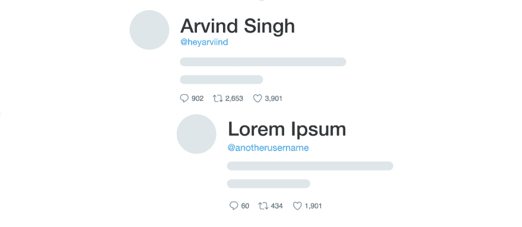

# 关于 Twitter 评论插件的思考

> 原文：<https://dev.to/heyarviind/a-thought-about-twitter-comments-plugin-579>

[T2】](https://res.cloudinary.com/practicaldev/image/fetch/s--O5WPajIn--/c_limit%2Cf_auto%2Cfl_progressive%2Cq_auto%2Cw_880/https://thepracticaldev.s3.amazonaws.com/i/tb78klrs6adqtcupc083.png)

我正在写我的博客，想用 [Disqus](https://disqus.com/) 作为我的评论系统。我去 Disqus 复制了他们的`widget`代码并粘贴在我的网站上。

但是等等...现在人们会来到我的网站，他们必须注册或登录 Disqus 才能开始评论...

为什么我们不能使用任何 twitter 的插件，并使用 twitter 的功能？

如果 twitter 为网站创建了一个评论系统，我们可以享受的好处不多:

*   人们可以在博客上发表评论，因为他们只是在发微博
*   他们可以通过在推特上标记某人来收录他们
*   人们可以喜欢或转发评论，以便其他人可以看到它并加入(如果他们愿意)
*   人们会在他们的 Twitter 应用中收到通知

你对此有什么想法？