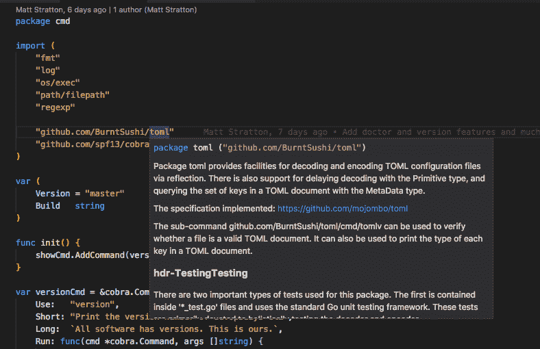

# 尝试新事物

> 原文：<https://dev.to/mattstratton/on-trying-new-things-cel>

我们很容易成为习惯动物，尤其是使用我们的工具。我们知道什么对我们有用，我们为他们开发肌肉记忆。

### 编辑人员

<figure> 

<figcaption>*形象经由**[https://www.prismnet.com/~dierdorf/emacsvi.html](https://www.prismnet.com/%7Edierdorf/emacsvi.html)*</figcaption>

</figure>

自从 2015 年 [Visual Studio Code](https://code.visualstudio.com/) 发布以来，我(理论上)一直是它的粉丝。完成了从[文本伴侣](https://macromates.com/)到[崇高文本](https://www.sublimetext.com/)再到[原子](https://atom.io/)的旅程，这似乎是一个自然的过程。我记得我的第一反应是“太讽刺了——来自微软文本编辑器的 git 集成比来自 GitHub 的更好。然而，我仍然坚持使用 Atom。

尤其是当我开始写 Go 的时候，这似乎是一个正确的选择。老实说，我不记得我遵循的哪一个教程推荐了优秀的 [go-plus 插件](https://atom.io/packages/go-plus)，但它确实让开始使用 go 成为一种乐趣。

事实上，我对 Atom 如此着迷，以至于我甚至写了两个插件———[linter-cookstyle](https://atom.io/packages/linter-cookstyle)(帮助你的厨师食谱)和[语言-hugo](https://atom.io/packages/language-hugo) (为 [Hugo](https://gohugo.io/) 文件突出显示语法)。我了解 Atom，也有自己喜欢的插件。

最近在听[和](https://changelog.com/gotime/49) [Ramya Rao](https://twitter.com/ramyanexus) 的[围棋时间](https://changelog.com/gotime)的一集。Ramya 在微软的开发者部门工作，是 VS 代码的 [Go 扩展的维护者(难道我们不应该称之为“代码”吗？我想微软的一切都必须是“视觉的东西……我能想到的唯一例外是 InterDev。哦，等等，那是视觉互动。)听了那集，尤其是 Ramya 开始说](https://github.com/Microsoft/vscode-go) [CodeLens](https://code.visualstudio.com/blogs/2017/02/12/code-lens-roundup) 的时候，让我觉得是时候再给 VS Code 一次机会了。

老实说，在我开始一个 Go 项目的 VS 代码之前，大概花了两周的时间。我一直在为 devopsdays.org[网站的维护者开发一个](https://www.devopsdays.org)[命令行工具](https://github.com/devopsdays/devopsdays-cli)，所以为了好玩，我决定把它放在 Atom 旁边的 VS 代码中。

哇哦。VS 代码只是…对初学者来说看起来更好。这个扩展似乎还有一些我在 go-plus 中没有的特性(完全公开:我可能只是不知道如何访问它们)。CodeLens 特性非常棒(例如，将鼠标悬停在一个包导入上，会告诉您关于该包的许多信息):

<figure> 

<figcaption>将包上的 CodeLens 导入到 VS 中</figcaption>

</figure>

我的体验中最显著的改进之一是嵌入式终端。Atom 有一个插件，可以在按钮窗格中给你一个终端，这真的很有用。但是很慢。就像，几乎不能用的慢。

对于 VS 代码，这是一个包含的特性。我立即发现它比我的 Atom 体验更具性能。当然，当我最初四处闲逛时，VS Code 告诉我有一个更新需要安装。安装 1.7 版本后，其中一个发布说明告诉我，1.7 提高了终端的性能！确实如此。

关于终端唯一奇怪的是，我认为我的电力线字体没有包括在内，所以我的提示看起来有点奇怪:

<figure>

<figcaption>VSA 代码中的 zsh 提示</figcaption>

</figure>

<figure> 

<figcaption>zsh 提示 in iTerm</figcaption>

</figure>

总的来说，我看到 VS 代码在我看来似乎更清晰，尽管我还没有充分使用它来看看是否有性能改进(每个人都在抱怨 Atom 太慢，但对我来说一般来说还不错)。我仍然需要加载扩展(因为到目前为止我所做的一切都是 Go，我还没有安装我在 Atom 中使用的 HTML/CSS/SASS 类型的东西来看看它如何比较)。

但是，我要如何真正通过它的步伐呢？我觉得为了确定我是否能让它成为我的日常驱动，我需要，嗯，让它成为我的日常驱动一段时间。我的解决方案是退出 Atom“冷火鸡”,从我的 MacBook 上卸载它，然后花几个星期的时间只提供 VS 代码给我。我将在 11 月 17 日(一个多月之后)再次讨论这个决定，并期待那时的后续帖子。这个日子的意义将在下面解释。

### 浏览器

你说的浏览器，我肯定都试过。从 Lynx 开始，然后是 Mosaic，然后是 Netscape……cyber dog 有人知道吗？我甚至在一瞬间震撼了歌剧。

但是，当 Chrome 突然出现时，我和其他互联网潮人一起，为了谷歌的新热点，把我亲爱的朋友 Firefox 推到了一边。尽管 Chrome 不具备 Firefox 的所有功能，但它是一款精简的浏览器。还记得 Chrome 声称它不像 Firefox 那样占用大量资源吗？哦，有趣的讽刺。

你可能知道也可能不知道， [Firefox Quantum](https://www.mozilla.org/en-US/firefox/quantum/) 离 11 月 17 日的发布只有一步之遥(看我在那里做了什么？)应该是快得要命，完全谋杀 Chrome。我期待着尝试一下。

有一件事我不确定我能放弃，那就是 Chrome 的个人资料功能。我有很多谷歌登录账户(我的个人账户，我的工作账户，我的播客账户，devopsdays，等等)，我为每个账户创建了一个谷歌个人资料。这让我有了多个 Chrome 实例，每个实例都有自己的设置——这有优点也有缺点。这对谷歌账户非常有帮助——我可以把我的电子邮件分开。对于我有各种登录方式的系统(Trello，Twitter 等)，这也很有帮助。例如，当登录到我的“主 Chrome 个人资料”时，我会登录到 [@mattstratton](https://www.twitter.com/mattstratton) Twitter 账户。当登录我的 ADO Chrome 个人资料时，我登录了 [@arresteddevops](https://www.twitter.com/arresteddevops) Twitter 账户。同样，我有一个个人的 Trello 帐户和一个工作的 Trello 帐户…拥有多个浏览器配置文件(可以并行运行)使我可以处理这些事情。

我得看看 Firefox 是如何处理这个问题的。到目前为止，我不看好它。从[档案文件](https://developer.mozilla.org/en-US/Firefox/Multiple_profiles)中:

> 当 Firefox 正在运行时，您不能更改配置文件。虽然在某些情况下可能有多个 Firefox 实例在不同的配置文件中运行，但为了避免混淆，您应该首先退出/退出/终止所有正在运行的 Firefox、FirefoxDeveloperEdition 或 Nightly 实例。

然而，OS X 有一款名为 [MultiFirefox](https://github.com/themartorana/MultiFirefox) 的工具似乎可以做到这一点。它有点旧(最近一次提交是在 9 个月前)，我们将看看它是否适用于 Quantum。我将汇报我的发现。