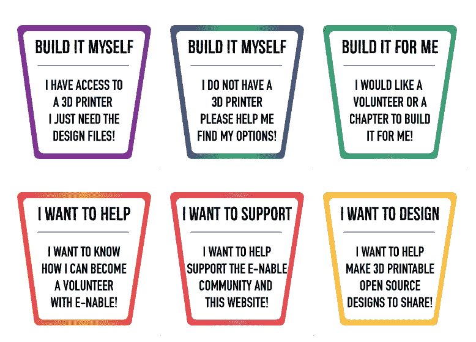

# 我在技术部的最后一周

> 原文:[https://dev . to/guergana/my-own-private-last-week-in-tech-6cc](https://dev.to/guergana/my-own-private-last-week-in-tech-6cc)

这是第一篇关于柏林的科技发现的文章，我希望是第一篇，它越来越多地生长在这个分支上，并使这个城市与它一起成长(好的和坏的)，新的硅 Allee。好的一面是，我当然可以去参加所有这些精彩的活动，见到那些从事非常有趣项目的人，不好的一面是...中产阶级化等等)。

所以，在我陷入对柏林的思考之前:上周的事件！

星期三:

下班后，我参加了一个名为“吸引和留住 IT 行业女性”的聚会，组织者是 DarwinRecruitment 的优秀招聘团队。这是我第一次参加科技界女性的活动，这是我多年来一直想做的事情，但不知何故一直没有机会去做。

第一次谈话特别有帮助，因为柏林的一些女性程序员团体被列了出来....当然，我已经注册成为其中几所学校的学生和导师。(虽然我希望我能找到时间真正去做)。

> 这些是一些编码社区，女性和其他在技术领域代表不足的少数群体可以在这里得到指导，开始或变得更擅长编码。#让我们走吧，女士们。
> 
> @ichimila 于 2017 年 9 月 30 日<time>美国太平洋时间</time>凌晨 1:01 分分享的帖子

星期四:

上周，我的一位同事，在我们私下举办的名为“创造性交流”的会议上，分享了他的一个爱好:他设计并打印 3d 假肢！他们以后可以通过电子网站捐赠或购买。

这些是我们任何人都可以参与的方式。

[T2】](https://res.cloudinary.com/practicaldev/image/fetch/s--MQRzapgJ--/c_limit%2Cf_auto%2Cfl_progressive%2Cq_auto%2Cw_880/https://thepracticaldev.s3.amazonaws.com/i/nynvlaqb68ee1bpdha90.png)

这个项目给了我很大的动力。我们真的可以用技术改变世界，帮助人们，即使我们有时会迷失在更节俭的方面。

> [这是我的一个同事制作的低成本 3D 打印义肢，送给那些无法获得高端医疗义肢的人，主要是那些曾经处于战争状态、有地雷问题的地区的人。Www.enablingthefuture.org 是一个惊人的例子，它展示了我们可以用科技创造一个更美好的世界的许多方式。](https://www.instagram.com/p/BZqECQwhx4t/)
> 
> @ichimila 于 2017 年 9 月 30 日上午 12:44 分分享的帖子

下一篇文章将是关于角度合成器、电子合成器和老式合成器的会议，以及关于本周末将在柏林德国技术博物馆举行的复古计算节的会议。

如果你知道这里发生的任何有趣的事情，请在评论中告诉我！！！