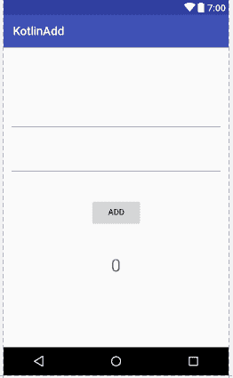
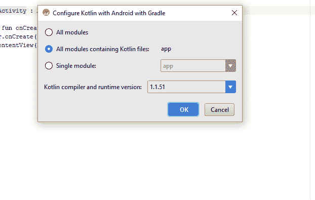

# Kotlin Android 扩展

> 原文:[https://dev.to/lemuelogbunude/kotlin-android-extensions-am3](https://dev.to/lemuelogbunude/kotlin-android-extensions-am3)

## 科特林扩展

我写了一篇关于[黄油刀](https://dev.to/lemuelcco/intro-to-butter-knife-for-android-views-d4e)的文章，它的美丽特性减少了样板代码。如果你认为这是令人印象深刻的，你会更加眼花缭乱的 Kotlin Android 扩展。Kotlin Android 扩展使我们能够获得与使用多个 findViewById()函数相同的结果，而无需编写任何额外的代码。

所以我将使用一个基本的 Android 应用程序，将两个数字相加并显示答案。这里的目的不是演示功能，而是用很少的代码就能轻松完成工作。

# 用户界面

[](https://res.cloudinary.com/practicaldev/image/fetch/s--T-ckAQR9--/c_limit%2Cf_auto%2Cfl_progressive%2Cq_auto%2Cw_880/https://thepracticaldev.s3.amazonaws.com/i/u2adyz6yb4lxzownw0kv.PNG)T3】

所以上面我们有一个按钮来添加用户输入的两个数字，使用按钮下面的文本视图显示答案。

为了清楚起见，我将显示 XML 代码，以便可以注意到视图的**id**，我们稍后将使用它们。

```
<?xml version="1.0" encoding="utf-8"?>
<RelativeLayout xmlns:android="http://schemas.android.com/apk/res/android"
    xmlns:tools="http://schemas.android.com/tools"
    android:layout_width="match_parent"
    android:layout_height="match_parent"
    android:padding="10dp"
    tools:context="com.example.charl.kotlinadd.KotlinActivity">

    <EditText
        android:id="@+id/firstDigitEdit_Txt"
        android:layout_width="match_parent"
        android:layout_height="wrap_content"
        android:layout_alignParentTop="true"
        android:layout_centerHorizontal="true"
        android:layout_marginTop="91dp"
        android:ems="10"
        android:inputType="number" />

    <EditText
        android:id="@+id/secondDigitEdit_Txt"
        android:layout_width="match_parent"
        android:layout_height="wrap_content"
        android:layout_below="@+id/firstDigitEdit_Txt"
        android:layout_centerHorizontal="true"
        android:layout_marginTop="33dp"
        android:ems="10"
        android:inputType="number" />

    <Button
        android:id="@+id/addBtn"
        android:layout_width="wrap_content"
        android:layout_height="wrap_content"
        android:layout_below="@+id/secondDigitEdit_Txt"
        android:layout_centerHorizontal="true"
        android:layout_marginTop="38dp"
        android:text="ADD" />

    <TextView
        android:id="@+id/answerTxt"
        android:layout_width="wrap_content"
        android:layout_height="wrap_content"
        android:layout_below="@+id/addBtn"
        android:layout_centerHorizontal="true"
        android:layout_marginTop="49dp"
        android:hint="0"
        android:textSize="30dp" />

</RelativeLayout> 
```

<svg width="20px" height="20px" viewBox="0 0 24 24" class="highlight-action crayons-icon highlight-action--fullscreen-on"><title>Enter fullscreen mode</title></svg> <svg width="20px" height="20px" viewBox="0 0 24 24" class="highlight-action crayons-icon highlight-action--fullscreen-off"><title>Exit fullscreen mode</title></svg>

你需要像往常一样配置你的 Kotlin

[](https://res.cloudinary.com/practicaldev/image/fetch/s--04gdTnk0--/c_limit%2Cf_auto%2Cfl_progressive%2Cq_auto%2Cw_880/https://thepracticaldev.s3.amazonaws.com/i/u15iub07srjqdsfxzdsw.PNG)T3】

在你的模块的 **build.gradle** :
中，你应该会自动注意到这些插件和其他一些变化

```
apply plugin: 'com.android.application'
apply plugin: 'kotlin-android' 
```

<svg width="20px" height="20px" viewBox="0 0 24 24" class="highlight-action crayons-icon highlight-action--fullscreen-on"><title>Enter fullscreen mode</title></svg> <svg width="20px" height="20px" viewBox="0 0 24 24" class="highlight-action crayons-icon highlight-action--fullscreen-off"><title>Exit fullscreen mode</title></svg>

## 开始使用 Android 扩展

为了开始，你所需要的是在你的模块的 **build.gradle** 文件:
中启用 Android 扩展 Gradle 插件

```
 apply plugin: 'kotlin-android-extensions' 
```

<svg width="20px" height="20px" viewBox="0 0 24 24" class="highlight-action crayons-icon highlight-action--fullscreen-on"><title>Enter fullscreen mode</title></svg> <svg width="20px" height="20px" viewBox="0 0 24 24" class="highlight-action crayons-icon highlight-action--fullscreen-off"><title>Exit fullscreen mode</title></svg>

## 导入合成属性

虽然这通常是在你开始编码时由编译器自动完成的，但是你也可以自己完成:

```
import kotlinx.android.synthetic.main.<layout>.* 
```

<svg width="20px" height="20px" viewBox="0 0 24 24" class="highlight-action crayons-icon highlight-action--fullscreen-on"><title>Enter fullscreen mode</title></svg> <svg width="20px" height="20px" viewBox="0 0 24 24" class="highlight-action crayons-icon highlight-action--fullscreen-off"><title>Exit fullscreen mode</title></svg>

***布局*** 取决于你的 Kotlin 布局文件的文件名，例如如果我的是 ***activity_kotlin*** 我正在导入:

```
import kotlinx.android.synthetic.main.activity_kotlin.* 
```

<svg width="20px" height="20px" viewBox="0 0 24 24" class="highlight-action crayons-icon highlight-action--fullscreen-on"><title>Enter fullscreen mode</title></svg> <svg width="20px" height="20px" viewBox="0 0 24 24" class="highlight-action crayons-icon highlight-action--fullscreen-off"><title>Exit fullscreen mode</title></svg>

所以主要代码如下，你需要知道的实际上是视图的 id，这基本上是我用来访问视图的:

```
 class KotlinActivity : AppCompatActivity() {

    override fun onCreate(savedInstanceState: Bundle?) {
        super.onCreate(savedInstanceState)
        setContentView(R.layout.activity_kotlin)

        addBtn.setOnClickListener {

/*get value from first text*/
            val A = Integer.parseInt(firstDigitEdit_Txt.text.toString())

/*get value from secondtext*/
            val B = Integer.parseInt(secondDigitEdit_Txt.text.toString())

/*sum it up*/
            val C=A+B

/*display using text ID*/
            answerTxt.setText(C.toString())
        }
    }
} 
```

<svg width="20px" height="20px" viewBox="0 0 24 24" class="highlight-action crayons-icon highlight-action--fullscreen-on"><title>Enter fullscreen mode</title></svg> <svg width="20px" height="20px" viewBox="0 0 24 24" class="highlight-action crayons-icon highlight-action--fullscreen-off"><title>Exit fullscreen mode</title></svg>

现在你知道了，如果我使用 findViewById()，它会大大增加代码的行数。Kotlin 真的很好，而且发展非常强劲，Java 在游戏中仍然很好，它还没有死，但我必须说 Kotlin 真的很美。