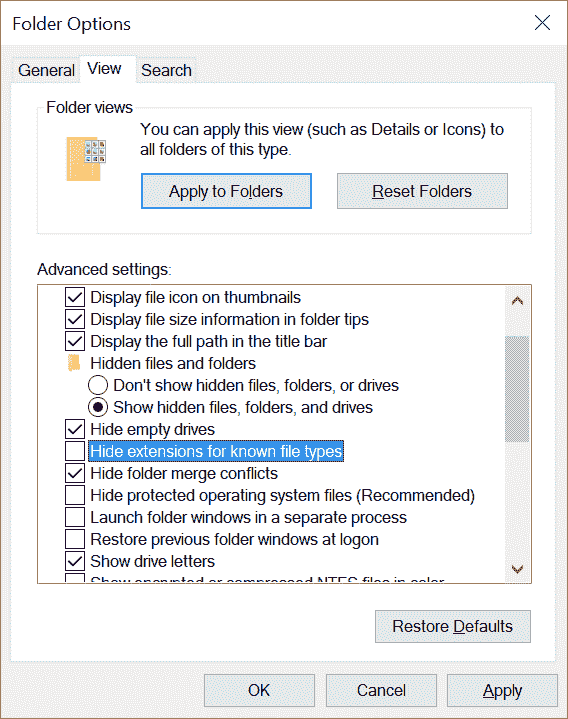
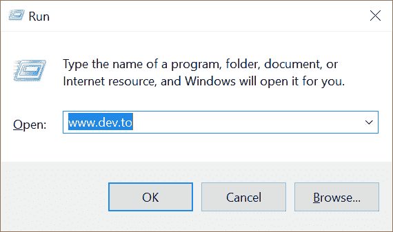
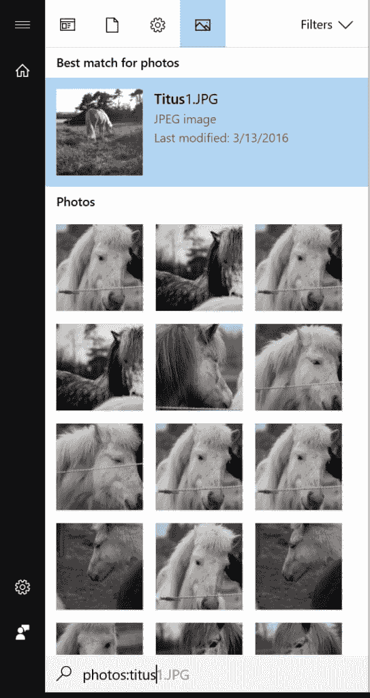
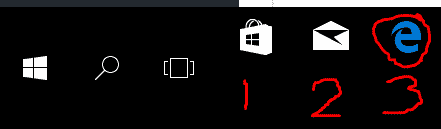
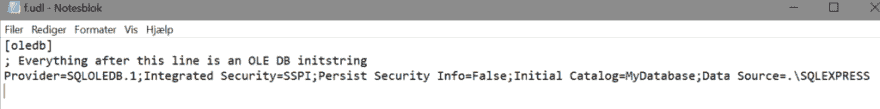

# 作为(非)开发人员有效地使用 Windows

> 原文：<https://dev.to/t4rzsan/working-effectively-with-windows-as-a-non-developer-40h>

*这篇文章最初出现在我的[个人博客](http://leruplund.dk/2017/10/05/working-effectively-with-windows-as-a-non-developer/)上。*

有很多关于如何了解你的工具成为一个更好的程序员的好文章。我想我应该给出 10 个技巧，告诉你如何成为一个好的 Windows 用户，从而成为一个更好的开发者。这些技巧非常简单，已经成为 Windows 的一部分有一段时间了(有些甚至在 Windows 10 之前)，但许多 Windows 用户并不知道。

关于 macOS 和 Windows 哪个更好，一直有一场持续的战争。我是这两个系统的用户，我对它们又爱又恨(尽管我在 Windows 上更有效)。我希望下面的技巧能对有时需要使用 Windows 的 Mac 用户有所帮助，也能对现有的 Windows 用户有所帮助，他们也许能学到一两个新技巧。

我很乐意听听你用什么方法让生活变得更简单，所以请加入评论。

这些招数都适用于 Windows 10。

### 1。在资源管理器中显示文件扩展名

出于某种原因，Windows 的默认设置是隐藏所有已知的文件扩展名。

应该有法律禁止这样做。

因此，第一个也是最重要的技巧是让 Windows 在 Windows 文件资源管理器中显示所有已知的文件扩展名。

例如，我有一个客户固执地声称双击 MyApp.exe 文件只会在记事本中显示一些乱码。过了一会儿我突然想到。NET 配置文件 MyApp.exe.config 文件在客户端机器上显示为 MyApp.exe，因为文件扩展名。exe 被隐藏。

所以，你在一个新的 Windows 系统上做的第一件事就是打开浏览器，点击选项->改变文件夹和搜索选项。转到“视图”选项卡，清除“隐藏已知文件夹选项的扩展名”复选框。

[T2】](https://res.cloudinary.com/practicaldev/image/fetch/s--03qHOnDv--/c_limit%2Cf_auto%2Cfl_progressive%2Cq_auto%2Cw_880/http://leruplund.dk/wp-content/uploads/2017/09/Show-extensions.png)

### 2。使用运行命令

第二个最重要的技巧是 Windows 中的“运行”命令。Mac 有非常有用的 Spotlight 搜索，Windows 在开始菜单中也有同样有用的搜索功能，但我觉得 Run 命令更有用。

Run 命令允许您运行一行命令行指令。您可以通过在键盘上键入 Windows+R 来获得 Run 命令。这将在左下方打开一个小对话框，您可以在其中键入任何命令。

[T2】](https://res.cloudinary.com/practicaldev/image/fetch/s--te-pTi6g--/c_limit%2Cf_auto%2Cfl_progressive%2Cq_auto%2Cw_880/http://leruplund.dk/wp-content/uploads/2017/09/Run.png)

“运行”命令为您提供了一种快速启动应用程序或打开网页的方式。以下是一些常见的例子:

*   calc(启动计算器)
*   记事本(启动记事本)
*   excel(启动 Excel)
*   winword(启动 word)
*   mstsc(启动远程桌面终端)
*   inetmgr(启动 IIS 管理器)
*   cmd /f:on(启动带有制表符结束的命令提示符)
*   [www.dev.to](http://www.dev.to) (打开默认浏览器，进入 dev.to)
*   [http://dev.to](http://dev.to) (同上)
*   %programfiles%(打开资源管理器并转到 programfiles 文件夹，通常是 C:\Program Files)
*   控制面板(打开控制面板)
*   services.msc(打开服务面板)

### 3。使用 Windows 搜索

上面已经提过了，我再提一次。很少有人意识到 Windows 有类似于 Mac 的 Spotlight 搜索的内置搜索。

只需按下键盘上的 Windows 按钮，打开开始菜单，立即开始输入。这将搜索应用和文件，搜索结果会立即显示在“开始”菜单上。它甚至搜索图像中的标签和 pdf 文件中的内容。

[T2】](https://res.cloudinary.com/practicaldev/image/fetch/s--DYKy58ft--/c_limit%2Cf_auto%2Cfl_progressive%2Cq_auto%2Cw_880/http://leruplund.dk/wp-content/uploads/2017/09/Search-543x1024.png)

我实际上从未理解对 Windows 8 和 8.1 以及大的开始菜单的仇恨。对我来说，它只是一个友好的搜索开始屏幕。但我想我是这个世界上唯一喜欢它的人。

遗憾的是，Windows Search 不搜索互联网。

### 4。使用电源菜单

当您按键盘上的 Windows+X 时，会显示电源菜单。电源菜单让您可以立即访问最重要的东西，如设置、事件查看器、网络连接和命令提示符。

说到命令提示符，如果你更喜欢用 PowerShell，可以在 power 菜单上用 PowerShell 代替命令提示符。右键单击任务栏，选择任务栏设置。然后打开设置“当我右击开始按钮或者按 Windows-key+X 时，在菜单中用 Windows PowerShell 替换命令提示符”(现在那是一个长句子)。

### 5。轻松启动应用程序的新实例

如你所知，你可以通过点击任务栏上的图标来启动一个应用程序。

现在，如果你想启动同一个应用程序的更多实例，你按住左 Shift 键并点击图标。

如果你想以管理员身份启动一个应用程序，按住左 Ctrl 和左 Shift 键并点击图标。

您应该将命令提示符和 PowerShell 固定在任务栏上，这样只需左键 ctrl +左键 shift +单击它就可以启动管理员提示符。

你也可以启动一个已经固定在任务栏上的应用程序，只需按住 Windows 键并按下该应用程序的数字。举例来说，Edge 是我任务栏上的第三个应用，所以我只需按键盘上的 Windows+3 就可以启动它。

 
(我为我不可救药、幼稚的笔迹道歉)

### 6。使用剪切工具

这个工具非常有助于捕捉屏幕截图，我一直在使用它，例如写博客。只需在开始菜单中搜索“剪贴”即可使用。

你可能会发现截取菜单等屏幕截图有困难，但我当然有一个窍门:

1.  启动截取工具，然后单击新建。
2.  按键盘上的 Esc 键。
3.  打开您想要捕捉的任何菜单。
4.  在键盘上按 Ctrl+Print Screen。
5.  现在，您可以使用截取工具绘制一个矩形来捕获菜单。

### 7。复制文件的路径

左键和右键单击一个文件可以在上下文菜单中显示一些额外的项目。其中一个是“复制路径”,将文件的完整路径复制到你的剪贴板。干净利落。

### 8。使用快捷方式

一些常见的快捷方式:

*   Windows+E:启动文件浏览器
*   Windows+D:显示桌面
*   Windows+I:打开设置
*   Windows+Ctrl+D:创建新的虚拟桌面
*   windows+Ctrl+右箭头键:转到下一个虚拟桌面
*   windows+Ctrl+左箭头键:转到上一个虚拟桌面
*   Windows+Ctrl+F4:关闭当前虚拟桌面
*   窗口+向上箭头:最大化窗口
*   窗口+向下箭头:最小化窗口
*   窗口+向左箭头或向右箭头:将窗口靠左或靠右对齐

顺便说一句，如果你抓住一个窗口的标题栏，用鼠标摇一摇，桌面上其他所有的窗口都会被最小化。

### 9。保持您的 Windows 桌面整洁

有了 Windows 搜索和 run 命令，谁还需要桌面上的图标呢？

将您最常用的应用程序的快捷方式添加到任务栏，以便于访问，并保持桌面整洁。

### 10。轻松创建连接字符串

现在最后一个技巧是给开发者的。我发现它非常有用，自从我多年前学习它以来，我还没有遇到过一个知道它的人。所以我决定把它放在这里，作为对那些坚持到现在的人的小小奖励。

当从 Windows 上的代码连接到数据库时，我从来不记得连接字符串的语法或属性名称，这就是为什么这个技巧多年来一直帮助我。很久以前，在一次会议上(我想是在波士顿)，我看到演示者在他的桌面上创建了一个扩展名为. udl 的文件，然后他双击该文件，打开一个小对话框，在其中输入 SQL Server 实例名，并选择身份验证和数据库名。

[T2】](https://res.cloudinary.com/practicaldev/image/fetch/s--feE3wPKu--/c_limit%2Cf_auto%2Cfl_progressive%2Cq_auto%2Cw_880/http://leruplund.dk/wp-content/uploads/2017/10/UDL.png)

关闭对话框后，他打开记事本(按 Windows+R 并输入“记事本”)，然后拖动。udl 文件到记事本，揭示了一个美丽的连接字符串。怎么样！

[T2】](https://res.cloudinary.com/practicaldev/image/fetch/s--xmIJzKhm--/c_limit%2Cf_auto%2Cfl_progressive%2Cq_auto%2Cw_880/http://leruplund.dk/wp-content/uploads/2017/10/connectionstring-1024x127.png)

顺便说一下。udl 技巧不会起作用，除非你遵循了这个列表中的第一个技巧:“在浏览器中显示文件扩展名”。

我希望你觉得以上有用:-D