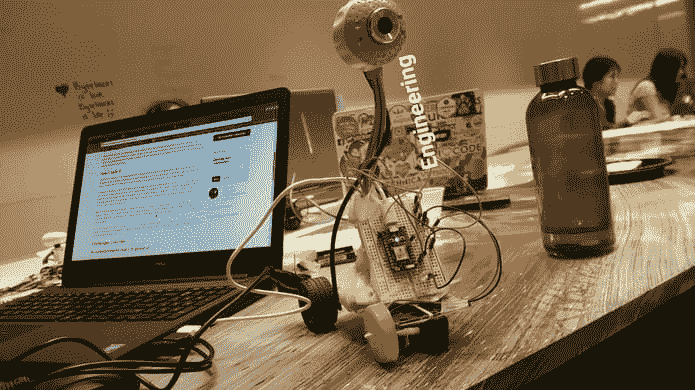

# Clarifai 精选 Hack: Recyclodroid 是一个由回收材料制成的回收机器人

> 原文:[https://dev . to/clari fai/clari fai-featured-hack-recyclodroid-is-a-recycling-robot-made-of-recycled-materials-1mk](https://dev.to/clarifai/clarifai-featured-hack-recyclodroid-is-a-recycling-robot-made-of-recycled-materials-1mk)

Recyclodroid 是一种先进的机器人设备，它在移动时使用图像识别来确定其路径上的物体是否可回收。这个机器人不仅有环保的使命，它还是由回收材料制成的。基本上，你看到的是现实生活中的瓦力！

气候变化是真实的，尽管非科学家会让我们相信。这就是为什么 Recyclodroid 的使命是帮助环境，一次一个可回收。Recyclodroid 是一种机器人，当它在世界上导航时，可以识别其路径上的可回收物体。它由安装在机器人汽车上的 USB 网络摄像头组成，机器人汽车由牙签、佳得乐瓶盖和破损的计算器外壳等家用材料制成。网络摄像头捕捉周围的视频，并使用 Clarifai API 来“查看其路径上的物体是否可回收”。

[T2】](https://res.cloudinary.com/practicaldev/image/fetch/s--9rq7zCaE--/c_limit%2Cf_auto%2Cfl_progressive%2Cq_auto%2Cw_880/http://blog.clarifai.com/wp-content/uploads/2017/10/recyclodroid.png)

##### **为什么是我们呢**

我们对热心公益的人情有独钟，所以 Recylodroid 的环保任务正合我们的胃口。我们也喜欢开发人员将 Clarifai 的软件与他们自己的硬件结合使用，而且 Recyclodroid 是由常见的家居用品制成的，这是一个加分点！试试吧——这是 Recyclodroid 的 [GitHub repo](https://github.com/allai5/byteRecyclodroid) ！

##### **你是怎么做到的**

我们采访了爱丽丝·赖(Alice Lai)，她是高科技高中的一名高三学生，热爱机器人技术、硬件黑客和利用技术造福社会，我们来谈谈她创作 Recyclodroid 的灵感。

Clarifai:是什么激发了你对 Recyclodroid 的想法？

爱丽丝:我正试图为我的 ByteHacks 黑客马拉松项目想出一个主意，我带了一辆自己动手的机器人车，是我用家用材料做的。我开始发挥创意，认为通过计算机视觉让它成为自动驾驶汽车会很酷。另一名黑客评论说，我重复使用家用材料来创建我的项目真是太酷了，这让我有了制作一辆专注于回收和环境可持续发展的机器人汽车的想法。

**你是如何打造这款应用的？**

Recyclodroid 是一款由家用材料(如牙签、佳得乐瓶盖、计算器的破塑料盒)制成的机器人汽车，专注于回收利用。这个机器人上安装了一个 USB 网络摄像头，然后它使用 Clarifai API“根据一长串可回收的东西来判断它面前的物体是否可回收。

我使用 Clarifai API 的 Javascript 客户端对我的项目的计算机视觉方面进行编程。我还使用 Photon 硬件开发工具包来控制机器人汽车的移动(根据对象是否可回收来前进)，并编写了一个 shell 脚本来自动化这个过程。

使用 Clarifai API 最棒的部分是什么？

Clarifai API 非常容易使用，图像识别输出的所有标签/概念都在一个大的 JSON 文件中，这真是太好了。

感谢你的分享，爱丽丝！

要了解更多，查看我们的[文档](https://clarifai.com/developer/docs/)和[注册一个免费的 Clarifai 账户](https://www.clarifai.com/developer/signup/)开始使用我们的 API——只需要三行代码就可以启动并运行了！我们非常乐意分享我们的开发者社区开发的所有很酷的东西，所以别忘了发推特 [@Clarifai](http://www.twitter.com/Clarifai) 给我们展示你的应用。

并在下面的评论中给[爱丽丝](https://twitter.com/allai4396)一些道具。下次见！