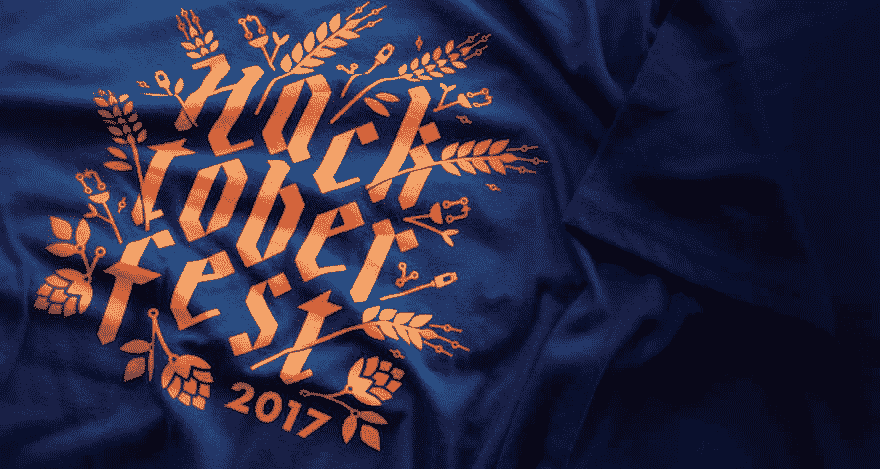

# 远程黑客啤酒节黑客马拉松

> 原文：<https://dev.to/matt24ray/remote-hacktoberfest-hackathon-bi4>

你准备好开始你的 [Hacktoberfest](https://hacktoberfest.digitalocean.com/) 了吗？我们想帮助你。DailyDrip 将举办远程黑客马拉松，帮助人们为开源项目做出贡献，以获得他们的黑客啤酒节 PRs。DailyDrip 的远程 Hacktoberfest Hackathon 将于 10 月 13 日至 15 日举行，但 Hacktoberfest 将持续一个月。

注册参加周末黑客马拉松，我们将一起编写一些很棒的代码。

我们将自己开发 Elixir 和 Elm 项目，但我们将帮助人们用任何语言开发任何项目。*

## 等待。什么是 Hacktoberfest？

Hacktoberfest 是为期一个月的开源软件庆典。前提很简单:在 GitHub 上提交四篇开源投稿，免费获得一件限量版 t 恤(来自 Digital Ocean & GitHub)。去年，贡献者[在 Hacktoberfest](https://github.com/blog/2433-celebrate-open-source-this-october-with-hacktoberfest) 期间提交了超过 90，000 个拉请求。你可以在数字海洋的网站上了解更多关于[2017 Hacktoberfest 的信息。](https://hacktoberfest.digitalocean.com/)

[T2】](https://res.cloudinary.com/practicaldev/image/fetch/s--we3YJrDx--/c_limit%2Cf_auto%2Cfl_progressive%2Cq_auto%2Cw_880/https://dailydrip-assets.s3.amazonaws.com/DailyDrip/blog_posts/hacktober-hackathon/image_0.jpg)

看看这件[漂亮的限量版 t 恤](https://github.com/blog/2433-celebrate-open-source-this-october-with-hacktoberfest)，它可能是你的。[现在就注册，](https://dailydrip.typeform.com/to/bKcYuX)让我们一起庆祝开源软件！

这篇文章最初发布在[DailyDrip.com](https://www.dailydrip.com/blog/remote-hacktoberfest-hackathon)