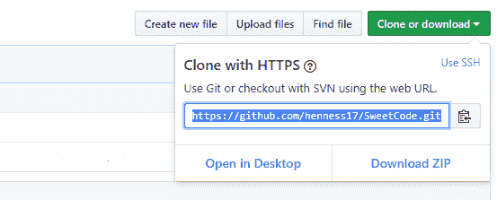
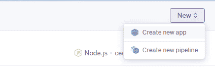
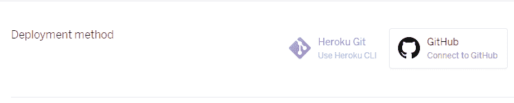
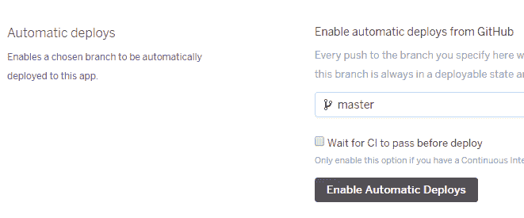
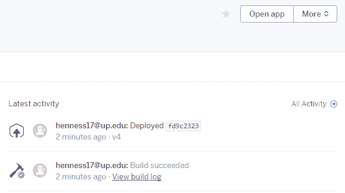
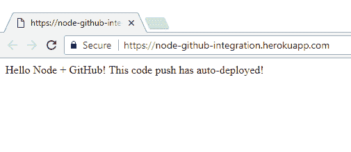

# 自动部署 Node.js 服务器:Heroku + GitHub

> 原文：<https://dev.to/ryhenness/auto-deploy-a-nodejs-server-heroku--github-em>

哟哟哟，我很高兴你在这里！我们将讨论如何通过 GitHub 集成在 Heroku 上自动部署 Node.js 服务器。这意味着每当你对你的 GitHub repo 进行修改时，它会自动地用这些修改在 Heroku 上部署你的服务器！这使得保持你的实时应用和回购同步变得容易，你不再需要单独跟踪它们！如果您之前没有在本地设置 Node.js 服务器，请先查看 [Node.js + Express 服务器设置](https://dev.to/ryhenness/nodejs--express-server-setup-6ch)。

你可以在 [GitHub](https://github.com/henness17/SweetCode/tree/master/003-Auto-Deploy-A-Node-Server) 上找到本文使用的代码。

* * *

# 目录

本文有三个主要部分。遵循它们将带您完成设置 GitHub repo/Heroku 服务器、连接两者以及自动部署的整个过程:

*   GitHub Repo 设置
*   Heroku 应用程序设置
*   自动部署服务器

* * *

# GitHub 回购设置

### 创建回购

首先，您需要确保安装了 [Git CLI](https://git-scm.com/book/id/v2/Getting-Started-The-Command-Line) ，这将允许您使用本地命令行执行 Git 命令，以便与 GitHub repo 进行交互。
现在你需要创建你的 GitHub 回购。有很多方法可以通过命令行来实现，但是我是通过 GitHub 站点来实现的，方法是点击页面右上角的“+”下拉菜单下的“New repository”选项。

[T2】](https://res.cloudinary.com/practicaldev/image/fetch/s--jubxJstk--/c_limit%2Cf_auto%2Cfl_progressive%2Cq_auto%2Cw_880/http://i68.tinypic.com/j8mzk3.png)

继续给你的回购命名，它可以是你喜欢的任何东西。另外，选中“使用自述文件初始化此存储库”复选框。单击“创建存储库”结束。

### 克隆回购

在 GitHub 上找到并打开你的 repo，找到绿色的“克隆或下载”下拉菜单，复制里面的链接。
[T3】](https://res.cloudinary.com/practicaldev/image/fetch/s--yDgSQQwR--/c_limit%2Cf_auto%2Cfl_progressive%2Cq_auto%2Cw_880/http://i63.tinypic.com/2096bcy.png)

现在您已经创建了 repo 及其克隆链接，您可以将其克隆到您的计算机上。在您的计算机上的某个地方，创建一个您希望代码放在其中的文件夹。打开命令行，导航到您创建的文件夹内部。命令行导航指令可以在[这里](https://www.digitalcitizen.life/command-prompt-how-use-basic-commands)找到。运行命令:

```
git clone [your repo's clone link] 
```

Enter fullscreen mode Exit fullscreen mode

那么，这个命令到底做了什么？如果您看一眼您克隆的文件夹，与您的 repo 一起创建的 *README.md* 文件现在就在里面。也不是这个。[允许你隐藏的文件夹显示](https://support.microsoft.com/en-us/help/14201/windows-show-hidden-files)，你会看到一个*。git* 文件夹。你可以看一下这个文件夹，但是不要编辑任何东西。它是隐藏的，因为它的信息是敏感的。它的基本功能是将您的 GitHub repo 与您电脑上的 repo 连接并同步。酷，现在你可以继续设置你的 Heroku 服务器了。

### 服务器准备

在本地运行服务器和在 Heroku 上运行有点不同。如果您还没有，请将文件从[这个 repo](https://github.com/henness17/SweetCode/tree/master/003-Auto-Deploy-A-Node-Server) 复制到您为服务器创建的文件夹中。您会注意到它有一个基本的 Node.js 服务器结构。有一个索引文件，一个包文件，但是还有这个 *Procfile* 。那么，什么是 *Procfile* ？它告诉 Heroku 在启动应用程序时运行哪个命令。如果你看看它的内容，你会看到:

```
web: node index.js 
```

Enter fullscreen mode Exit fullscreen mode

这个命令`node index.js`与您可以从命令行运行来本地启动服务器的命令相同——但是 Heroku 需要它在 *Procfile* 中，以便它知道运行哪个命令来启动服务器本身。

### 推送至 GitHub

现在您已经将文件复制到了您的文件夹中，您可以继续将它们推送到您的 GitHub repo。为此，您需要在命令行上，在您的文件夹中，按以下顺序使用这些命令:

1.  `git add index.js package.json Procfile`
2.  `git commit -m "Server prep"`
3.  `git push origin master`

> <sub><sup>如果你在推送自己创建的回购协议时遇到了问题，确保你没有包含*。git* 文件夹，从该文件夹中复制服务器文件；你应该只有一个*。顶层文件夹中的 git* 文件夹——这个文件夹是用最初的 GitHub repo 复制的。</sup></sub>

* * *

# Heroku App 设置

### 创建 Heroku App

跳转到 [Heroku](https://dashboard.heroku.com/apps) ，从页面右上角的“新建”下拉菜单中点击“创建新应用”。

[T2】](https://res.cloudinary.com/practicaldev/image/fetch/s--B08dfBaZ--/c_limit%2Cf_auto%2Cfl_progressive%2Cq_auto%2Cw_880/http://i68.tinypic.com/t99itl.png)

这将提示您输入名称，使用[烤肉串外壳](https://en.wikipedia.org/wiki/Letter_case#Special_case_styles)。输入满意的名称后，点按“创建应用程序”按钮。

### 连接 GitHub

导航到您新创建的 Heroku 应用程序，并点击“部署”选项卡:

[T2】](https://res.cloudinary.com/practicaldev/image/fetch/s--GifxRt1l--/c_limit%2Cf_auto%2Cfl_progressive%2Cq_auto%2Cw_880/http://i65.tinypic.com/34hfny9.png)

在这个 deploy 选项卡下，您会看到一个名为“部署方法”的部分。在这一部分你会看到一个选项“连接到 GitHub”，点击它。

[T2】](https://res.cloudinary.com/practicaldev/image/fetch/s--I55IpcWw--/c_limit%2Cf_auto%2Cfl_progressive%2Cq_auto%2Cw_880/http://i63.tinypic.com/142v40k.png)

它会要求您连接您的 GitHub 帐户，然后要求您选择哪个 GitHub repo 连接到 Heroku 应用程序。连接您之前创建的 Node.js GitHub repo。

* * *

# 自动部署服务器

您已经连接了 Heroku 应用程序和 GitHub repo，但是还没有自动部署。查看“部署”选项卡下的“自动部署”部分。

[T2】](https://res.cloudinary.com/practicaldev/image/fetch/s--GrrFc3RB--/c_limit%2Cf_auto%2Cfl_progressive%2Cq_auto%2Cw_880/http://i65.tinypic.com/mc50ub.png)

单击“启用自动部署”按钮。这将使得无论何时您将更改推送到 GitHub repo 的主分支，Heroku 都会检测到这些更改，并自动部署服务器。

### 触发自动部署

为了触发自动部署，您必须对代码进行更改，并将其推送到您的 GitHub repo。让我们在 *index.js* 中更改您的第一条路线的响应字符串。把它改成你想要的任何东西，当你打开你的应用程序时，它应该会显示在你的浏览器上。我正在更改我的路线的响应，看起来像这样:

```
// Our first route
app.get('/', function (req, res) {
  res.send('Hello Node + GitHub! This code push has auto-deployed!');
}); 
```

Enter fullscreen mode Exit fullscreen mode

现在，按照我们之前讨论的相同步骤，将这些更改推送到 GitHub repo: `git add index.js`、`git commit -m "Changed route response"`，最后是`git push origin master`。

如果你看一下你的 Heroku 应用的仪表板，你会看到在“概述”标签下有一个构建日志:

[T2】](https://res.cloudinary.com/practicaldev/image/fetch/s--fVLi2q19--/c_limit%2Cf_auto%2Cfl_progressive%2Cq_auto%2Cw_880/http://i68.tinypic.com/16jh6yb.png)

如果您单击“打开应用程序”，您将看到来自自动部署代码的响应:

[T2】](https://res.cloudinary.com/practicaldev/image/fetch/s--KkWWP9e5--/c_limit%2Cf_auto%2Cfl_progressive%2Cq_auto%2Cw_880/http://i65.tinypic.com/2qlbwj6.png)

* * *

# 回顾

恭喜你！您刚刚在 Heroku 上设置了一个 Node.js 服务器，通过 GitHub 集成提供了自动部署功能。通过创建 Node.js GitHub repo，定义服务器及其 *Procfile* ，创建 Heroku 应用程序，并配置自动部署选项以部署到 GitHub repo 主分支的新代码。您再也不用担心手动同步 Heroku 应用程序和 GitHub repo，代码都在一个地方！如果你想了解更多关于组织路线的信息，请使用 Node.js 查看[外部路线。](https://dev.to/ryhenness/external-routes-with-nodejs-1ni)