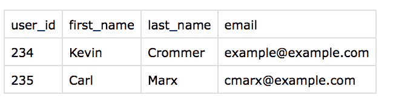

# 用 Python 读取 CSV 数据

> 原文:[https://dev . to/scripting withpy/reading-CSV-data-with-python-3o 7](https://dev.to/scriptingwithpy/reading-csv-data-with-python-3o7)

CSV 文件非常常见。我在工作中传输数据时经常会碰到它们。在家里，从银行或 Google Sheets 导出文件时，CSV 文件几乎总是一个选项。

# 什么是 CSV？

**CSV**=**C**omma**S**单独的 **V** 值

我们总是看到它们，但是对于 CSV 文件到底是什么，似乎有些混淆。当我和人们谈论 CSV 文件时，我意识到我们大多数人都把它们等同于 Microsoft Excel 文档。这可能是因为 Excel 通常是打开 CSV 文件的默认程序。

事情是这样的。CSV 文件只是一个文本文件。就这样，没别的了。文件扩展名通常是`.csv`,但这不是必须的。任何文件扩展名只是对文件中包含的内容的暗示，并不实际决定或控制内容类型。关于 CSV 文件的[维基百科文章](https://en.wikipedia.org/wiki/Comma-separated_values)指出:

> “CSV”不是一种单一的、定义明确的格式
> 
> 因此，在实践中,“CSV”一词可能指任何符合以下条件的文件:
> 
> *   是使用字符集(如 ASCII、各种 Unicode 字符集)的纯文本
> *   由记录组成(通常每行一条记录)，记录被划分为由分隔符分隔的字段
> *   其中每个记录都有相同的字段序列

这里有一个例子。我的桌面上有一个名为`users.csv`的文件。在电子表格程序(Excel、Google Sheets、LibreOffice、Numbers 等)中，该文件看起来像这样。

[T2】](https://res.cloudinary.com/practicaldev/image/fetch/s--XIAdfv73--/c_limit%2Cf_auto%2Cfl_progressive%2Cq_auto%2Cw_880/http://scriptingwithpython.com/conteimg/2017/10/csv_file_1.1.png)

那些漂亮的列和行很漂亮，很别致。我们认为会有一些神奇的事情发生。然而，这个文件的内容实际上只是:

```
user_id,first_name,last_name,email
234,Kevin,Crommer,example@example.com
235,Carl,Marx,cmarx@example.com 
```

您可以用纯文本编辑器打开 CSV 文件来查看真实内容。这非常类似于查看网页的源代码并查看底层的 HTML。

一个电子表格程序读取 CSV 文件，并向用户(你和我)显示一个漂亮的版本，使其易于查看列和行。

正如您在我的示例中看到的，CSV 文件通常每条记录占一行。在这种情况下，有 4 列。栏目标题为`user_id`、`first_name`、`last_name`和`email`。记录将有一列或多列，通常(但不总是)用逗号分隔。

## CSV 文件读取规则

*   CSV 文件中的每一行都由换行符分隔。
*   各列由一个已知字符分隔。它们几乎总是用逗号分隔，但我见过逗号、制表符、竖线(`|`)和其他奇怪的东西。
*   如果字段包含逗号，应该用引号括起来
    *   示例:

```
user_id,nicknames
987,"joebob,joey,jos" 
```

*   如果一个字段包含单引号，那么它应该用双引号括起来
    *   示例:

```
user_id,last_name
987,"O'Neil" 
```

*   如果一个字段包含双引号，那么它应该用单引号括起来

```
user_id,citation
987,'The Man said,"Who goes there?"' 
```

这个故事的寓意是:

> 不要试图通过手动读取文件的一行来解析 CSV 文件，用逗号将文件分割成一个列表。

有太多的方法会出错。相反，使用现有的库来完成这一部分。在 Python 中，`csv`模块是必不可少的。它负责阅读所有这些可能的东西。

## 使用内置的 Python `csv`模块

下面是用内置的`csv` Python 模块读取 CSV 文件的基本步骤。

1.  打开 CSV 文件进行阅读
2.  将文件处理程序传递给 CSV 阅读器
3.  遍历文件的行

我将按顺序浏览每一个文件，展示我将如何阅读前面的示例文件。

### 第一步:打开 csv 文件进行读取

在本例中，我们将使用以下 CSV 数据。我们假设它保存在我们脚本旁边的一个名为`quotes.csv`的文件中。

```
quote,speaker
"Don’t you call me a mindless philosopher, you overweight glob of grease!",C-3PO
"We’re doomed.",C-3PO
"But I was going into Tosche Station to pick up some power converters!",Luke Skywalker
"Help me, Obi-Wan Kenobi. You’re my only hope.",Leia Organa
"An elegant weapon for a more civilized age.",Obi-Wan Kenobi
"I find your lack of faith disturbing.",Darth Vader
"Mos Eisley spaceport. You will never find a more wretched hive of scum and villainy.",Obi-Wan Kenobi
"You don’t need to see his identification…These aren’t the droids you’re looking for.",Obi-Wan Kenobi
"It’s the ship that made the Kessel Run in less than 12 parsecs.",Han Solo
"Sorry about the mess.",Han Solo
"She may not look like much, but she’s got it where it counts, kid.",Han Solo
"Governor Tarkin, I should’ve expected to find you holding Vader’s leash. I recognized your foul stench when I was brought on board.",Leia Organa
"I felt a great disturbance in the Force. As if millions of voices suddenly cried out in terror and were suddenly silenced.",Obi-Wan Kenobi
"I suggest a new strategy, Artoo: Let the Wookiee win.",C-3PO
"Hokey religions and ancient weapons are no match for a good blaster at your side, kid.",Han Solo
"That’s no moon. It’s a space station.",Obi-Wan Kenobi
"Who’s the more foolish? The fool or the fool who follows him?",Obi-Wan Kenobi
"Aren’t you a little short for a stormtrooper?",Leia Organa
"Somebody has to save our skins. Into the garbage chute, flyboy!",Leia Organa
"I got a bad feeling about this.",Han Solo
"When I left you I was but the learner. Now I am the master.",Darth Vader
"If you strike me down I shall become more powerful than you can possibly imagine.",Obi-Wan Kenobi
"It’s not impossible. I used to bullseye womp rats in my T-16 back home, they’re not much bigger than 2 meters.",Luke Skywalker
"Cover me, Porkins!",Biggs Darklighter
"Use the Force, Luke.",Obi-Wan Kenobi
"What an incredible smell you've discovered", Han Solo 
```

打开文件进行读取非常简单，但是我总是使用`with`命令来完成。这样做会自动关闭文件。没有它，你必须自己调用`_file.close()`,否则你就有丢失数据或损坏文件的风险。Python 是宽容的，但我就是不喜欢冒险。这是第一部分。

```
import csv

with open('./quotes.csv', 'r') as _filehandler: 
```

## 第二步:将 CSV 文件处理程序传递给阅读器

打开 filehandler，将其传递给 csv 阅读器。此时，您有两种读取行的方法。您可以使用`csv.reader`来读取简单列表中的行。这种方法:

*   将每一行作为唯一对象读取
*   没有列标题的概念。文件的第一行只是另一行数据
*   为您提供对每行的索引访问
    *   即`row[0]`或`row[1]`

第二个选项，也是我个人使用最多的一个，是`csv.DictReader`。这位读者:

*   从第一行读取标题
*   将每一行作为字典返回，其中键来自第一行

如果你用`csv.reader`来读，那么这个例子就变成了:

```
import csv

with open('./quotes.csv', 'r') as _filehandler:
    csv_file_reader = csv.reader(_filehandler) 
```

如果你用`csv.DictReader`读它，那么我们得到:

```
import csv

with open('./quotes.csv', 'r') as _filehandler:
    csv_file_reader = csv.DictReader(_filehandler) 
```

这并没有很大的区别，但是你可以决定。我个人更喜欢使用字典，而不是记住我正在寻找的列的正确索引。

### 第三步:迭代每一行

最后一步是迭代每一行，对其进行处理。图案`for row in csv_file_reader:`很常见。这就创建了一个迭代器

我们的例子变成了:

```
import csv

with open('./example.csv', 'r') as _filehandler:
    csv_file_reader = csv.DictReader(_filehandler)
    for row in csv_file_reader:
        # Do something here
        print(row['quote'])
        print(row['speaker']) 
```

在这个脚本中是一个字典。我们可以通过`row['quote']`和与`row['speaker']`交谈的人来访问报价。

瞧啊。这就对了。我怀疑这种模式将来会成为许多脚本项目的基础。

我录了一个快速视频。在这篇文章中，我展示了如何在 PyCharm 中创建文件，然后运行它。

* * *

1.  当你理解正在发生的事情时，迭代器是非常棒的。对于大型文件、远程数据以及您不知道将处理多少信息的情况，它们允许非常有效的内存使用。在这里给出的例子中，它导致一次只读取文件的一行。任何时候都不会将整个 CSV 文件加载到内存中。 [↩︎](http://scriptingwithpython.com/processing-csv-data-with-python/#fnref1)