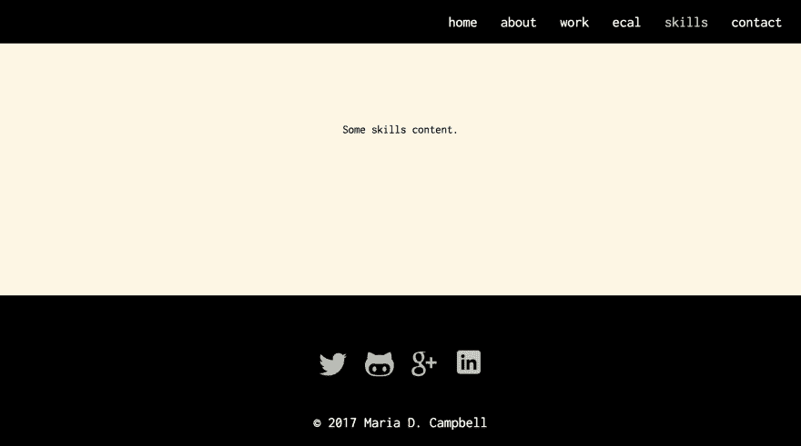

# Flexbox 粘滞页脚和反应

> 原文：<https://dev.to/letsbsocial1/flexbox-sticky-footer-and-react-e1h>

目前我正在做我的**投资组合网站**的 **React** 版本。我喜欢我的**化身**版本，但想比较**反应**和**化身**之间的 **UX** 。我还想添加我的 Jekyll 网站中没有的动画和交互性。

在这个项目中，我很快遇到了一个设计挑战。**【凸起页脚】**的问题。内容很少或没有内容的页面意味着页脚无法固定在页面底部。是时候添加由 **Philip Walton** 开发的 **Flexbox“粘滞页脚”**解决方案了。关于 **Github** 的建议

```
html, body {
    height: 100%;
} 
```

就够了根本不是真的。只要看看 Kindle Fire HD 这样高度不规则的设备或 Nexus 10 这样不规则的设备，看看你的页脚会发生什么！更好的是，检查你自己的空的或几乎空的页面！

我还发现 **React 开发者**似乎很难将 **Flexbox** 的传统实现转化为 **React DOM** 配置。我一开始也有这个问题。但是后来我开始从 React 的角度检查我的 **React** 应用程序的 ***结构*** ，事情很快就变得清楚了。

对于常规的 **HTML5** 、 **CSS3** 和 **JavaScript** 应用程序，我会将`Site`类添加到`<body></body>`标签中:

```
<body class="Site"></body> 
```

然后我会将`Site-content`类添加到一个`<div></div>`类中，我纯粹是为了 flexbox 粘性页脚而创建的:

```
<body class="Site">
    <div class="Site-content"></div>
</body> 
```

然而， **React** 应用程序的结构一开始可能会使事情有些混乱。这是我的**对投资组合**的`index.html`现在的反应:

```
<!DOCTYPE html>
<html lang="en">
    <head>
        <meta charset="utf-8">
        <meta http-equiv="X-UA-Compatible" content="IE=edge">
        <meta name="viewport" content="width=device-width, initial-scale=1">
        <meta name="description" content="">
        <meta name="author" content="Maria D. Campbell">
        Portfolio Site Built With React
        <!-- CSS -->
        <!-- Fonts -->
  <link href="https://fonts.googleapis.com/css?family=Inconsolata" rel="stylesheet">
    </head>
    <body>
        <div id="root"></div>
    </body>
</html> 
```

这是我的`App.js`的样子:

```
import React, { Component } from 'react';
import {Header} from './components/Header';
import {Main} from './components/Main';
import {Footer} from './components/Footer';

class App extends Component {
    render() {
        return (
            <div className="App Site">
                <div className="Site-content">
                    <div className="App-header">
                        <Header />
                    </div>
                    <div className="main">
                        <Main />
                    </div>
                </div>
                <Footer />
            </div>
        );
    }
}

export default App; 
```

如果我将`Site`类添加到`index.html`中的`<body></body>`中，然后在它下面为`Site-content`类创建一个新的`div`，它将无法工作。为什么？因为这将意味着`<Footer />`组件最终会被包含在内，但这并没有实现。

所以我必须确定在 React 中什么将作为`<body></body`标签和进行中的`<div></div>`标签的 ***等效物*** 。

忘掉`<body></body>`标签吧！它的`<div className="App"></div>`是 React 的`<body></body>`标签。然后，我在那下面加了一个新的`<div className="Site-content"></div>`。注意到`<Footer />`组件是如何从**应用的** ***结构*** 中**分离**的吗？

最后，我在我的`_sticky-footer.css` `POSTCSS module`中添加了必要的`CSS`:

```
:root {
    --space: 1.5em 0;
    --space: 2em 0;
}

.Site {
    display: flex;
    flex-direction: column;
    min-height: 100vh;
}

.Site-content {
    flex: 1 0 auto;
    padding: var(--space) var(--space) 0;
    width: 100%;
}

.Site-content:after {
    content: '\00a0';
    display: block;
    margin-top: var(--space);
    height: 0;
    visibility: hidden;
} 
```

这是根据菲利普·沃顿的《T2》改编的。自己尝试一下，让我知道你的想法。

[T2】](https://res.cloudinary.com/practicaldev/image/fetch/s--4mid7ZUD--/c_limit%2Cf_auto%2Cfl_progressive%2Cq_auto%2Cw_880/https://thepracticaldev.s3.amazonaws.com/i/hmy68zgxffxxiomsk12f.jpg)

编码快乐！

**相关资源:**

[由 FlexBox 粘性页脚解决](https://philipwalton.github.io/solved-by-flexbox/demos/sticky-footer/)