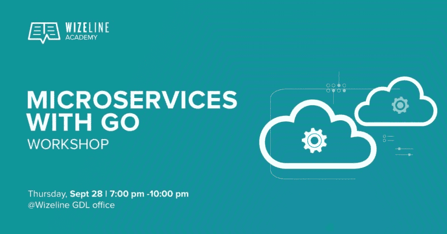

# 支持 Go 的微服务

> 原文：<https://dev.to/plutov/microservices-with-go-e89>

[T2】](https://res.cloudinary.com/practicaldev/image/fetch/s--l81b4mPB--/c_limit%2Cf_auto%2Cfl_progressive%2Cq_auto%2Cw_880/http://pliutau.com/workshop1.jpg)

我喜欢 Wizeline 的一点是，我们有一个令人惊叹的学院，既有内部的，也有公共的。昨天我在墨西哥，Wizeline 的瓜达拉哈拉办事处，我正在做一个关于 Go 微服务的研讨会。

这个想法是告诉人们 SOA 方法、gRPC、协议缓冲区，并基于 Go 中的这些原则编写一个虚构的应用程序。

我对结果感到高兴，尤其是当我看到人们是多么有才华，即使他们掌握了新的语言。

我们将我们的工作提交到这个[仓库](https://github.com/wizelineacademy/GoWorkshop)中，并制作了一个[直播](https://www.facebook.com/WizelineAcademy/videos/1726299830998775/)。看看吧！

现在我要回越南，我们将在那里开始学习，敬请期待！