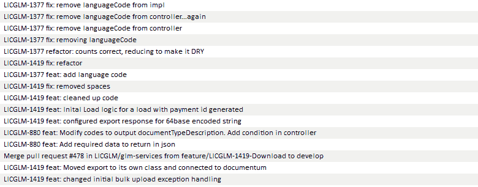

# 在你下次提交之前，看看这 5 个 Git 技巧

> 原文：<https://dev.to/sublimegeek/check-out-these-5-git-tips-before-your-next-commit-3ih1>

如今，地球上几乎所有的开发商店都使用 Git 的某种变体来管理其源代码，Git 是由 Linux 内核的创造者 Linus Torvalds 编写的分散式版本控制系统。沃尔玛技术也不例外，它利用 Git 使开发人员能够独立工作，同时维护共享的历史。

在讨论 Git 时需要注意的是，我指的是应用程序本身，而不是 GitHub，GitHub 经常被混淆。尽管许多支持应用程序和图形用户界面都围绕 Git，但是理解底层核心命令的工作方式有着不可思议的价值。在你了解它们各自的功能之前，我强烈反对使用包装器或支持应用程序。就我个人而言，我在命令行中执行我所有的 GitOps，只是偶尔使用支持应用程序作为参考，主要是因为我喜欢看丰富多彩的分支并惊叹于进度。Git 也有自己的内置 GUI，可以通过 **gitk 命令**访问。

像许多其他公司一样，沃尔玛最初以 Apache Subversion (SVN)作为其源代码控制管理(SCM)解决方案。因此，当谈到使用 Git 时，许多团队仍然有一种“SVN”心态。我大约一年前加入沃尔玛；在我到达之前的 6 个月，我的团队已经从 SVN 过渡到 Git，所以我有了一个全新的视角。

Git 是一个非常强大的变更管理工具。Git 在它所能做的事情上也非常灵活。当您将如此强大的功能与如此大的灵活性相匹配时，您将获得一个几乎可以让您做任何事情的工具。这纯粹是故意的。Git 将适应任何种类的工作流、分支策略、分支命名约定甚至挂钩。但是权力越大，责任越大。虽然有保护措施来防止你损失工作时间，但是 **Git 会让你养成坏习惯而从不抱怨。**

使用 Git 没有正确的方法，但是低效使用 Git 的方法有很多。这里有五个核心实践，不管你的开发经验如何，都可以提高你的 Git 使用率。

**1。尽早提交，经常提交**

一切都始于频率。如果您刚开始使用 Git，那么您应该尽早并且经常提交您的更改。这样做，直到它成为第二天性。添加方法时，提交。当你改变什么的时候，一定要承诺。你重命名了一些文件吗？提交。你知道我们称之为保存按钮的软盘吗？当你像保存 Word 文档一样频繁地提交代码时，只有这样你才能开始回到更舒适的节奏。

**2。使用语义风格使您的提交消息有意义**

想象一个盒子。你可以把东西放进盒子里。你可以从盒子里拿出东西。这个盒子是 Git 的集结地。您可以在这里手工提交。*提交*提交就像把那个盒子封上，贴上标签。盒子里的东西是你的改变。那么，为什么*这个标签没有意义呢？*你不会把一个搬家用的箱子贴上厨房用品的标签

提交消息组合与命名变量和方法一样重要。如果您遵循上面的第一个技巧，很容易将提交标记为简单的“更改”或“保存点”不要掉进那个洞里。

我遵循一种严格的提交消息格式，这是我在 Jeremy Mack 的一篇名为[语义提交消息](https://seesparkbox.com/foundry/semantic_commit_messages)的文章中发现的。前提是将您的提交消息限制在一个简短的提交类型列表中。通过这样做，如果您发现您的提交属于多个类别，那么您的提交应该被分成多个提交。

在沃尔玛，我们使用 JIRA 来跟踪我们的用户故事，并使用 GitHub Enterprise 作为内部远程存储库，因此我的团队还将我们的 JIRA 故事包含在我们的提交消息中。在我们项目的最初几个月，我提到提交消息变化很大。在我们切换到 GitHub 之前，我们使用了 [Bitbucket 的](https://bitbucket.org/)“又一个提交检查器”Git hook 来对每个传入的提交消息应用正则表达式，以确保它符合我的标准。

```
(LICGLM)(-)(\d{2,})( )
(chore|feat|docs|fix|refactor|style|test|sonar|hack|release)(:)( )(.{0,80}) 
```

Enter fullscreen mode Exit fullscreen mode

这是我用过的表达方式。它不漂亮也不优雅，但很管用。我们的项目 ID 是 LICGLM，后跟一个连字符、提交类型、一个冒号和一个空格，最后是一条消息。总提交长度限制为 80 个字符。正如我前面提到的，这个想法是，如果您有一个非常长的提交消息，您可能试图在一个提交中塞进太多内容。分开它。

[T2】](https://res.cloudinary.com/practicaldev/image/fetch/s--GrEbvh8N--/c_limit%2Cf_auto%2Cfl_progressive%2Cq_auto%2Cw_880/https://cdn-images-1.medium.com/max/780/0%2AmjORfDQr7Ow_F2IX.png)

**3。在每个提交原子中进行更改**

你们中的一些人已经知道我要说什么，但是对于那些认为原子意味着氢或碳的人，让我来解释一下。我们希望我们的提交在某种程度上是事务性的。当您向存储库提交变更时，它们应该尽可能的少，但是有一个警告。变化也应该是*相关的。*因此，如果您正在更改影响另一部分的代码，请确保在一次提交中包含所有内容。尽管如此，我还是要提醒不要把*囊括在内。让您的提交尽可能的少，但是让您在每次提交中的更改保持相关。例如，您将常数与代码的其余部分分开，只在必要时才包含它们。如果除了在您编写的新服务中包含常量之外，您还添加或更新了一些常量，那么您可能应该将这些更改包含在一起。这背后的想法是，如果您需要回滚到以前的提交，您是在增量回滚，而不是在大量的更改和工作时间。见规则№1。*

**4。将您的代码推送到遥控器(如果您有)**

在我们项目的早期，我们有一些团队成员会在提交代码之前工作一整天。一个小时工作的承诺。这是一个可怕的想法。这样看。你的改变只有在你提交后才会发生。如果您与其他人一起工作，那么您的代码直到您将您的更改推送到远程存储库时才存在。不要让自己处于损失工作时间的境地。提交您的代码，并将其推送到一个远程设备(如果您有远程设备的话)。这很重要。

**5。从不重写共享历史**

你有没有希望你可以回到过去，马蒂小飞侠一些你犯下的错误？嗯，有了 Git，你就可以了。你应该吗？如果你和其他人一起工作并且你的提交已经被提交了，那就不是了。否则，小心就好。如果你看过*回到未来*，你就已经知道为什么改变过去是个坏主意。

在 Git 中，您可以回到过去，将不同的分支基于其他分支。您还可以删除提交，重命名它们，将它们压缩成单个提交，等等。如果您是唯一的开发人员，并且它是您的本地机器，那么与在团队中工作相比，您会有更多的自由。如果你在一个有着相同历史的团队中工作，重写历史只会让他们不安。Git 让您可以自由地创建分支，并在以后将它们合并到一起，因此在许多情况下，重写历史是没有必要的。因为 Git 已经让您能够检查任何以前的提交，所以不改变任何过去的提交是有意义的，这样您就可以在将来使用它们作为参考点。

**结论**

这个列表绝不是详尽的，尽管有许多其他的最佳实践，遵循这五条规则将为你打下一个坚实的基础，无论你的技能水平如何。我鼓励你走出去，发现自己的诀窍，并与他人分享。这真的是一半的乐趣。

你喜欢这个吗？请随时在 Twitter 上联系我

* * *