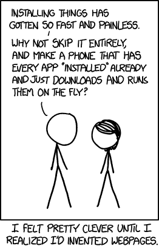

# 嘿，韦伯，我们怎么会在这里？

> 原文：<https://dev.to/awfulaxolotl/hey-web-how-did-we-get-here-47kb>

多么奇怪的地方。

今天的网站可以是电子邮件客户端、3D 游戏、图形设计应用程序、文字处理器、加密货币矿工等等——不胜枚举。

发短信怎么了？

我经常在网上使用应用程序。我在网上看新闻。我在网上与其他人交流。见鬼，我在网上谋生。然而我甚至不确定我是否喜欢它。只是，嗯，有时候看起来是个错误。

事实证明，我并不孤单。最近关于这个话题的讨论是迈克·赫恩的[“是时候消灭网络了”](https://blog.plan99.net/its-time-to-kill-the-web-974a9fe80c89)。我们有几十个…几十个！

虽然我同意迈克的观点，但我不想扼杀网络。至少现在是这样。想想猫的 GIFs！

也许我们可以挽救它。为了做到这一点，让我们来思考一下网络从何而来，是什么让它如此特别。

# 坐上德罗宁

最近才知道，万维网居然是 2 版！它最初的设计是为了修复其前身的一个缺陷。

ENQUIRE 是欧洲粒子物理研究所的 T2·蒂姆·伯纳斯·李爵士对超文本系统的第一次尝试。作为一名优秀的计算机科学家，他对任何旧的信息系统都不满意。除了传统的散文，他还想记录事物之间的联系。“东西”是人、计划、软件、硬件，以及在世界级物理实验室中“记性不好”的人可能想要的任何东西。

太美了。但是它有一个问题:ENQUIRE 强制页面之间的双向链接。例如，如果一个人与一个程序相关联，那么反过来也会自动变为真。这听起来可能很棒，但有时你不想看到所有的链接都指向某个东西。太多的信息可能比没有信息更糟糕。

更糟糕的是，双向链接使得它无法与其他系统集成。如果没有链接回来，你如何双向链接到某个东西？

这些问题让蒂姆爵士最终重新审视了这个问题。因此，万维网诞生时只有一种连接方式，剩下的就是历史了。

好吧，以前的事也是历史了。好吧——我想这都是历史了，好吗？继续读吧！

# 特性，特性，特征

## 那是 1991 年的夏天

*   有视频。
*   没有 gif。
*   没有 Javascript。
*   没有 CSS。

一切都是文本。只有一个浏览器和 HTML。嗯，[不到 30 个标签的 HTML](https://www.w3.org/History/19921103-hypertext/hypertext/WWW/MarkUp/Tags.html) 。

## 成为了 2017 年的秋天

*   139 个 HTML 标签。
*   5 广泛使用的网络浏览器。
*   CSS。一种全新的标记语言[，有超过 100 种规范](https://www.w3.org/Style/CSS/specs.en.html)。[哦，碰巧是图灵完成](http://eli.fox-epste.in/rule110/)。
*   Javascript。10 天内创建的新脚本语言。从某些指标来看，它是最受欢迎的语言——到目前为止。

我们还没开始呢。网络浏览器已经从能够:

*   查看带有基本标记的链接文本文档

也能够:

*   嵌入插件，如 Flash、Java 和 ActiveX
*   查看矢量图形
*   播放音频
*   渲染 2D 图形
*   使用自定义字体和排版
*   地理定位设备
*   在线/离线检测
*   播放视频
*   离线 web 存储
*   下载和解析文件
*   离线缓存网站
*   低级类型数据
*   在浏览器外推送通知
*   Web 套接字

…等等，还有更多…

*   通过 web workers 线程化
*   通过设备录制音频、视频和图片
*   构造二进制格式
*   检测页面是否可见
*   从头开始分析和生成音频
*   使用自定义着色器语言渲染 3D 图形
*   检查电池状态
*   高分辨率时间
*   为视频游戏锁定指针
*   触发设备振动
*   检测屏幕方向
*   低级密码术
*   推送数据
*   语音到文本和文本到语音
*   通过 MIDI 生成音频
*   许可
*   虚拟现实
*   利用自定义汇编语言

嗯，是的。那太多了。

如果这听起来开始像一台成熟的计算机，那是因为它确实有点像。网络浏览器已经发展成为完整的虚拟机。

事实上，他们现在已经加入了有史以来最大的软件项目的行列。例如，[这是一个代码行的排名。](https://www.phonearena.com/news/Lines-of-code-How-our-favorite-apps-stack-up-against-the-rest-of-tech_id49281)

# 所以……为什么？

好问题，标题文字！

据我所知，网络的成功不是来自一个连贯的计划。它更像是新颖设计与历史上伟大时机相结合的产物。

## 原因# 1——URI 的力量

URL，以及它们更普通的父亲 [URI](https://en.wikipedia.org/wiki/Uniform_Resource_Identifier) ，不仅仅是浏览器顶部的文本字符串。它们是:

*   **不含糊。一个链接应该只指向一个地方。**
*   **可读。URL 不一定要可读，但通常是可读的。我们不要认为这是理所当然的！*我在看着你，谷歌。***
*   **直接。**链接可以指向特定的页面位置，直接进入相关内容。

这些品质对于超文本的目标是至关重要的。URL 是许多其他现代软件生态系统根本没有的概念。这包括所有流行的操作系统。想象一下，如果你的电脑或手机上的任何应用程序可以引导你到任何其他应用程序的任何部分！

这是一个如此强大的想法，以至于其他软件系统也采用了它。例如， [Hypercard](https://blog.archive.org/2017/08/11/hypercard-on-the-archive-celebrating-30-years-of-hypercard/) 因其独特的、可链接的、互动的页面应用而闻名。听起来有趣吗？Archive.org 最近发布了仿真 Hypercard 应用程序，供你在浏览器中使用。[试试看！](https://archive.org/details/hypercardstacks)

甚至桌面操作系统——传统平台——也在接入 URL。操作系统必须管理各种不同的资源，并将它们暴露给程序。Unix 通过把所有东西都做成一个文件来做到这一点。氧化还原通过[使一切成为 URI](https://doc.redox-os.org/book/design/url_scheme_resource/everything_is_a_url.html) 来做到这一点。

## 原因# 2-Insta-因素

你想在维基百科上看口袋妖怪吗？那个视频？Figma 中的原型应用？在 Tumblr 上发布 dank memes？阅读 Reddit 上令人愤怒的评论？和朋友一起玩雷神之锤？三维渲染整个地球？

> 当然，去这个网址。

你想用那个程序？

> 好的，嗯…嗯…你在苹果电脑上，对吗？也许可以试试 App Store，但是他们的选择很烂。你应该在谷歌上搜索一下。是的，那个链接看起来是合法的，试试那个。好的，这看起来不错，下载链接在哪里？就这样？好吧。嗯，这需要一点时间，也许我会看看弗朗西斯是否在脸书上发布了那些太浩湖的照片。嗯，那天湖水很清澈，不是吗？他真的带来了——啊，搞定了！好了，点击下载的**。dmg** 文件。点击**下一个**几次并保持片刻。正在安装！好了好了，搞定了。

现在*对*的影响不能被夸大。网络起源于纯粹的链接文件，这设定了我们的期望。

去那个网址，拿那个东西。

[T2】](https://res.cloudinary.com/practicaldev/image/fetch/s--TAL94YxP--/c_limit%2Cf_auto%2Cfl_progressive%2Cq_auto%2Cw_880/https://imgs.xkcd.com/comics/installing.png)

即使在内容快速发展的情况下，为了保持这种期望，工程上做了多少工作，这绝对是疯狂的。现在，整个桌面层应用程序可以在几秒钟内加载到浏览器中，无需用户进行任何交互。

在某种程度上，网络将机器抽象化，并将我们带回大型机时代的哑计算机终端。“已安装”的概念不再适用。如果所有的东西都可以通过一个 URL 即时访问，这有什么关系吗？

谷歌甚至在 Chrome 操作系统上充分体现了这一理念，模糊了网络和机器之间的界限。[事实证明，它做得非常非常好。](https://techcrunch.com/2017/04/27/as-chromebook-sales-soar-in-schools-apple-and-microsoft-fight-back/)

## 理由 3——人人都爱沙盒

如果网络只是 URL 上的即时应用程序，我们会有很多麻烦。

这将是恶意软件、不稳定、膨胀和完全混乱的混乱组合。作为容器的网络浏览器是绝对必要的。

但它不止于此。伴随着安全需求的是标准化需求。顾名思义，万维网是无处不在的——它需要为每个用户在每个设备上工作。

当然，在实践中这并不完全正确。审查制度、兼容性问题、传统浏览器和其他问题阻止了它的绝对性。但重要的部分是解决这些问题的文化，并让它有效地无处不在。

标准化还确保开发人员拥有一致的 API。这是巨大的。当你可以把内容放到网上，让它成为一个链接的时候，为什么还要为完全不同的设备开发内容呢？如果 web 可以做到这一点，那么跨平台开发就没有意义了。

## 原因#4 - Dat HTML

网络作为超文本的根源赋予了它难以置信的品质。当一切都是文档时，你可以像对待文档一样对待一切。

好吧，好吧，这很明显。我的意思是，网站可以很容易地被消费、解析、使用和以无数种方式扩展。HTML 和 DOM——它是 Javascript 的反映——为灵活性提供了前所未有的平台。

相比之下，原生应用是不透明的黑匣子。它们将栅格数据直接输出到帧缓冲区有助于提高速度，但也极大地限制了人们操作它们的方式。

想象一下，使用桌面程序或移动应用程序可以做以下事情:

1.  通用广告拦截
2.  随意更换每个 app 的 ui。重新排序部分，隐藏元素，并嵌入全新的部分
3.  将任意状态的应用程序保存为独立于分辨率的文档
4.  所有应用的内置世界级调试和内省
5.  用于网页抓取和自动化的机器人

网络实现了这一切。开发者能绕过这一点吗？确定-画布渲染让创建者默认回到不透明的光栅渲染。实际上这不是问题——只有最前沿的 web 应用程序才需要逃离 DOM，进入纯像素世界。

## 原因之五——理工大的非军事区

最后一个原因实际上并不是因为技术。关键是在正确的时间出现在正确的地点。

让我们回到 21 世纪初，互联网泡沫开始真正壮大的时候。如果你正在开发一个图形应用程序，它可能是为 Windows 开发的。当时，苹果刚刚通过最近发布的 iMac 从灰烬中重生。

然后是网络:新的，不为任何人所有。

它似乎是一个中立的沙盒，让科技巨头们在平等的基础上参与其中。公司可以放心，苹果或微软无法控制他们的业务。而这个*包括*苹果和微软。

谷歌和脸书等新的科技巨头可以白手起家，而不用担心现有的巨头。我要大胆地说，这就是为什么尽管有令人难以置信的技术限制，谷歌在为该平台开发应用程序时如此自如。

# 请谨慎行事

好吧。因此，一个在物理实验室使用了 26 年的超文本系统迅速增加了功能，最终成为本地应用程序的可行替代平台。

我们继续前进吗？我和其他人一样，强烈反对这样做。网络平台是一个巨大的成功，但也在为了成长而慢慢成长。后果是有的。复杂性的重量阻碍了浏览器的实现，惹恼了开发者，并限制了内容的潜力。

网络不会消亡，但肯定会变慢。

一些人最初的反应是把它全部烧掉，然后再试一次。但是我们不能。网络实在是太大太重要了。建议我们应该说服大多数开发者、公司和用户放火烧掉整个东西是疯狂的。

所以让我们制定一个新的路线，但保持我们的船。让我们反思是什么让网络变得伟大，把我们的错误抛在身后，规划我们通往希望之乡的道路。

新课程是什么样的？

看起来又是一篇博文要写了！😀