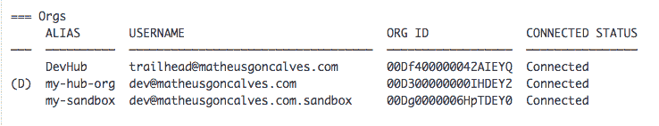

# Salesforce DX:有用的 CLI 命令

> 原文:[https://dev . to/toad geek/sales force-dx-useful-CLI-commands-52k](https://dev.to/toadgeek/salesforce-dx-useful-cli-commands-52k)

Salesforce DX 终于上市了，太棒了！现在，专业开发人员可以使用 [Salesforce DX](https://developer.salesforce.com/platform/dx) 与持续交付协作构建，这种开放和集成的体验使 Salesforce 平台上的开发变得容易。

我强烈建议您观看由 [Wade Wegner](https://twitter.com/wadewegner) 制作的此演示，其中介绍了 Salesforce DX，讨论了现代软件交付的原则、DX 将如何改善开发人员体验、一些模式和反模式以及如何采用 Salesforce DX:

[https://www.youtube.com/embed/exZ3TICOzd8](https://www.youtube.com/embed/exZ3TICOzd8)

一旦您决定切换，您会注意到您可以使用 [Salesforce 命令行界面(CLI)](https://developer.salesforce.com/tools/sfdxcli) 执行大多数 Salesforce DX 任务。这些任务包括授权开发中心组织，创建临时组织，在临时组织和 VCS 之间同步源代码，以及运行测试。
安装后你就可以开始使用命令行界面了。

CLI 命令分为顶级主题。例如，force 顶级主题分为按功能对命令进行分组的主题，如用于管理您的组织的 force:org 命令。

运行每个级别的帮助以获得更多信息。

`sfdx --help // lists all top-level topics`
`sfdx force --help // lists all the topics under force`
`sfdx force:org --help // lists all the commands in the topic force:org`

假设您想要登录到您的中心组织:

`sfdx force:auth:web:login --setalias my-hub-org --instanceurl [https://login.salesforce.com](https://login.salesforce.com)`

现在假设您想要登录到您的沙箱:

`sfdx force:auth:web:login --setalias my-sandbox --instanceurl [https://test.salesforce.com](https://test.salesforce.com)`

也许你想得到一个你所联系的所有组织的列表:

`sfdx force:org:list`

[T2】](https://res.cloudinary.com/practicaldev/image/fetch/s--zNB4ARV8--/c_limit%2Cf_auto%2Cfl_progressive%2Cq_auto%2Cw_880/http://matheusgoncalves.com/wp-content/uploads/2017/08/Screen-Shot-2017-08-30-at-12.30.40-PM.png)

要打开这些组织之一:

`sfdx force:org:open -u my-sandbox`

要将暂存组织标记为删除，请执行以下操作:

`sfdx force:org:delete -u my-sandbox`

* * *

要**从 Salesforce DX 组织列表中删除旧的中心组织**或非临时组织，您需要手动清除本地安装中的 DX 配置。如果在实际的 CLI 命令中有这样的东西就好了:清除不再需要的旧组织的能力。目前，请使用以下步骤:

在 **Mac OS 和 Linux** 上，你可以找到你的 DX 配置文件夹，名为。sfdx，在您的用户主目录中。

`cd ~/.sfdx`

在**窗口**上，您可以使用

`%USERPROFILE%.sfdx`

在那个文件夹里有很多。json 文件，以您为该组织注册的管理员用户的用户名命名。在我的例子中，在这种情况下它被称为 [mgoncalves@dx.pilot](mailto:mgoncalves@dx.pilot) ，果然，它就在那里:

`[mgoncalves@dx.pilot.json](mailto:mgoncalves@dx.pilot.json)`

在文件内部，或者当前访问令牌的散列，刷新令牌，以及允许 DX 访问您的组织的所有其他 OAuth 优点。所以我删除了那个文件:

`> rm [mgoncalves@dx.pilot.json](mailto:mgoncalves@dx.pilot.json)`

这似乎让**把一切都清理干净了**。

* * *

要检索 package.xml 文件中定义的未打包源代码(例如:由 [MavensMate](http://mavensmate.com/) 创建的文件):

`sfdx force:mdapi:retrieve -r ./mdapipkg -u [your_username] -k ./package.xml`

要检索您想要转换为 Salesforce DX 的[非托管软件包:](https://developer.salesforce.com/docs/atlas.en-us.sfdx_dev.meta/sfdx_dev/sfdx_dev_ws_retrieve_unman_pack.htm)

`sfdx force:mdapi:retrieve -s -r ./mdapipkg -u [your_username] -p`

要转换 package.xml 文件中定义的检索源代码:第一步是使用 zip 文件管理实用程序或从命令行解压缩 **unpackaged.zip** 。例如，在 Mac 上，双击 Finder 中的 unpackaged.zip 或在命令行中键入以下命令:

`unzip ./mdapipkg/unpackaged.zip -d ./mdapipkg/`

然后将源代码转换为 Salesforce DX 项目结构:

`sfdx force:mdapi:convert -r ./mdapipkg`

要创建一个临时组织，首先[用 or 配置创建一个 JSON 文件](https://developer.salesforce.com/docs/atlas.en-us.sfdx_dev.meta/sfdx_dev/sfdx_dev_scratch_orgs_def_file.htm)。然后:

`sfdx force:org:create -f project-scratch-def.json -a MyScratchOrg`

要推动变更，使用**强制推动**:

[T2】](https://res.cloudinary.com/practicaldev/image/fetch/s--CoM1W68i--/c_limit%2Cf_auto%2Cfl_progressive%2Cq_66%2Cw_880/http://matheusgoncalves.com/wp-content/uploads/2017/08/force-push-yoda.gif)

我是说，用这个:

`sfdx force:source:push -u MyScratchOrg`

无视错误，推动变革。小心):

`sfdx force:source:push -u MyScratchOrg --ignorewarnings --forceoverwrite`

Salesforce DX CLI 是一个强大的命令行界面，是一个在与您的 Salesforce 组织合作时简化开发和构建自动化的工具。

有关更多信息，请运行此命令查看 force 主题中的所有可用命令。

`sfdx force:doc:commands:list`