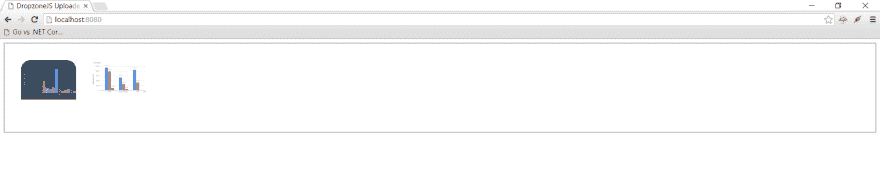

# 如何使用 DropzoneJS 和 Go 显示服务器上的现有文件

> 原文:[https://dev.to/kataras/dropzonejs-go-系列-第二部分-4n1](https://dev.to/kataras/dropzonejs--go-series---part-2-4n1)

这是 DropzoneJS + Go 系列的第 2 部分。

*   [第 1 部分:如何构建文件上传表单](https://dev.to/kataras/dropzonejs--go-series---part-1-474)
*   [第 2 部分:如何显示服务器上的现有文件](https://dev.to/kataras/dropzonejs--go-series---part-2-4n1)

# DropzoneJS + Go:如何显示服务器上已有的文件

在本教程中，我们将向您展示如何在使用 DropzoneJS 和 Go 时显示服务器上的现有文件。本教程基于[如何使用 DropzoneJS 和 Go](https://dev.to/kataras/dropzonejs--go-series---part-1-474) 构建文件上传表单。在继续学习本教程的内容之前，请确保您已经阅读了它。

## 目录

*   [准备](#preparation)
*   [修改服务器端](#modify-the-server-side)
*   [修改客户端](#modify-the-client-side)
*   [参考文献](#references)
*   [结尾](#the-end)

## 准备

用`go get github.com/nfnt/resize`安装 go 包“github.com/nfnt/resize”，我们需要它来创建缩略图。

在之前的[教程](//README.md)中。我们已经设置了一个适当的工作 DropzoneJs 上传表单。本教程不需要额外的文件。我们需要做的是对下面的文件做一些修改:

1.  main.go
2.  view/upload . html

让我们开始吧！

## 修改服务器端

在之前的教程中。所有“/upload”所做的就是将上传的文件存储到服务器目录中。/public/uploads”。因此，我们需要添加一段代码来检索存储文件的信息(名称和大小)，并以 JSON 格式返回。

将下面的内容复制到“main.go”。详情请看评论。

```
// main.go

package main

import (
    "image/jpeg"
    "image/png"
    "io"
    "os"
    "path"
    "path/filepath"
    "strings"
    "sync"

    "github.com/kataras/iris/v12"
     // $ go get -u github.com/nfnt/resize
    "github.com/nfnt/resize" 
)

const uploadsDir = "./public/uploads/"

type uploadedFile struct {
    // {name: "", size: } are the dropzone's only requirements.
    Name string `json:"name"`
    Size int64  `json:"size"`
}

type uploadedFiles struct {
    dir   string
    items []uploadedFile
    mu    sync.RWMutex // slices are safe but RWMutex is a good practise for you.
}

// scan the ./public/uploads folder for any files
// add them to a new  uploadedFiles list.
func scanUploads(dir string) *uploadedFiles {
    f := new(uploadedFiles)

    lindex := dir[len(dir)-1]
    if lindex != os.PathSeparator && lindex != '/' {
        dir += string(os.PathSeparator)
    }

    // create directories if necessary
    // and if, then return empty uploaded files; skipping the scan.
    if err := os.MkdirAll(dir, os.FileMode(0666)); err != nil {
        return f
    }

    // otherwise scan the given "dir" for files.
    f.scan(dir)
    return f
}

func (f *uploadedFiles) scan(dir string) {
    f.dir = dir
    filepath.Walk(dir, func(path string, info os.FileInfo, err error) error {

        // if it's directory or a thumbnail we saved earlier, skip it.
        if info.IsDir() || strings.HasPrefix(info.Name(), "thumbnail_") {
            return nil
        }

        f.add(info.Name(), info.Size())
        return nil
    })
}

// add the file's Name and Size to the uploadedFiles memory list
func (f *uploadedFiles) add(name string, size int64) uploadedFile {
    f.mu.Lock()
    uf := uploadedFile{
        Name: name,
        Size: size,
    }
    f.items = append(f.items, uf)
    f.mu.Unlock()

    return uf
}

// create thumbnail 100x100
// and save that to the ./public/uploads/thumbnail_$FILENAME
func (f *uploadedFiles) createThumbnail(uf uploadedFile) {
    file, err := os.Open(path.Join(f.dir, uf.Name))
    if err != nil {
        return
    }
    defer file.Close()

    name := strings.ToLower(uf.Name)

    out, err := os.OpenFile(f.dir+"thumbnail_"+uf.Name,
        os.O_WRONLY|os.O_CREATE, 0666)
    if err != nil {
        return
    }
    defer out.Close()

    if strings.HasSuffix(name, ".jpg") {
        // decode jpeg into image.Image
        img, err := jpeg.Decode(file)
        if err != nil {
            return
        }

        // write new image to file
        resized := resize.Thumbnail(180, 180, img, resize.Lanczos3)
        jpeg.Encode(out, resized,
            &jpeg.Options{Quality: jpeg.DefaultQuality})

    } else if strings.HasSuffix(name, ".png") {
        img, err := png.Decode(file)
        if err != nil {
            return
        }

        // write new image to file
        resized := resize.Thumbnail(180, 180, img, resize.Lanczos3) // slower but better res
        png.Encode(out, resized)
    }
    // and so on... you got the point, this code can be simplify, as a practise.
}

func main() {
    app := iris.New()
    app.RegisterView(iris.HTML("./views", ".html"))

    app.HandleDir("/public", "./public")

    app.Get("/", func(ctx iris.Context) {
        ctx.View("upload.html")
    })

    files := scanUploads(uploadsDir)

    app.Get("/uploads", func(ctx iris.Context) {
        ctx.JSON(files.items)
    })

    app.Post("/upload", iris.LimitRequestBodySize(10<<20), func(ctx iris.Context) {
        // Get the file from the dropzone request
        file, info, err := ctx.FormFile("file")
        if err != nil {
            ctx.StatusCode(iris.StatusInternalServerError)
            ctx.Application().Logger().Warnf("Error while uploading: %v", err.Error())
            return
        }

        defer file.Close()
        fname := info.Filename

        // Create a file with the same name
        // assuming that you have a folder named 'uploads'
        out, err := os.OpenFile(uploadsDir+fname,
            os.O_WRONLY|os.O_CREATE, 0666)

        if err != nil {
            ctx.StatusCode(iris.StatusInternalServerError)
            ctx.Application().Logger().Warnf("Error while preparing the new file: %v", err.Error())
            return
        }
        defer out.Close()

        io.Copy(out, file)

        // optionally, add that file to the list in order to be visible when refresh.
        uploadedFile := files.add(fname, info.Size)
        go files.createThumbnail(uploadedFile)
    })

    // start the server at http://localhost:8080
    app.Run(iris.Addr(":8080"))
} 
```

<svg width="20px" height="20px" viewBox="0 0 24 24" class="highlight-action crayons-icon highlight-action--fullscreen-on"><title>Enter fullscreen mode</title></svg> <svg width="20px" height="20px" viewBox="0 0 24 24" class="highlight-action crayons-icon highlight-action--fullscreen-off"><title>Exit fullscreen mode</title></svg>

## 修改客户端

将下面的内容复制到”。/views/upload.html "。我们将逐个进行修改。

```
<!-- /views/upload.html -->
<html>

<head>
    <title>DropzoneJS Uploader</title>

    <!-- 1 -->
    <link href="/public/css/dropzone.css" type="text/css" rel="stylesheet" />

    <!-- 2 -->
    <script src="/public/js/dropzone.js"></script>
    <!-- 4 -->
    <script src="//ajax.googleapis.com/ajax/libs/jquery/1.10.2/jquery.min.js"></script>
    <!-- 5 -->
    <script>
        Dropzone.options.myDropzone = {
            paramName: "file", // The name that will be used to transfer the file
            init: function () {
                thisDropzone = this;
                // 6
                $.get('/uploads', function (data) {

                    if (data == null) {
                        return;
                    }
                    // 7
                    $.each(data, function (key, value) {
                        var mockFile = { name: value.name, size: value.size };

                        thisDropzone.emit("addedfile", mockFile);
                        thisDropzone.options.thumbnail.call(thisDropzone, mockFile, '/public/uploads/thumbnail_' + value.name);

                        // Make sure that there is no progress bar, etc...
                        thisDropzone.emit("complete", mockFile);
                    });

                });
            }
        };
    </script>
</head>

<body>

    <!-- 3 -->
    <form action="/upload" method="POST" class="dropzone" id="my-dropzone">
        <div class="fallback">
            <input name="file" type="file" multiple />
            <input type="submit" value="Upload" />
        </div>
    </form>
</body>

</html> 
```

<svg width="20px" height="20px" viewBox="0 0 24 24" class="highlight-action crayons-icon highlight-action--fullscreen-on"><title>Enter fullscreen mode</title></svg> <svg width="20px" height="20px" viewBox="0 0 24 24" class="highlight-action crayons-icon highlight-action--fullscreen-off"><title>Exit fullscreen mode</title></svg>

1.  我们在页面中添加了 Jquery 库。这其实不是直接针对 DropzoneJs 的。我们使用的是 Jquery 的 ajax 函数 **$。仅获取**。您将在下面看到
2.  我们在表单中添加了一个 ID 元素(my-dropzone)。这是必需的，因为我们需要将配置值传递给 Dropzone。要做到这一点，我们必须有它的 ID 引用。这样我们就可以通过给 Dropzone.options.myDropzone 赋值来配置它了，很多人在配置 Dropzone 的时候都会面临困惑。简单地说。不要把 Dropzone 当成 Jquery 插件，它有自己的语法，你需要遵循它。
3.  这开始了修改的主要部分。我们在这里做的是传递一个函数来监听 Dropzone 的 init 事件。初始化 Dropzone 时调用此事件。
4.  通过 ajax 从新的“/uploads”中检索文件细节。
5.  使用服务器中的值创建模拟文件。mockFile 只是具有名称和大小属性的 JavaScript 对象。然后我们显式调用 Dropzone 的 **addedfile** 和 **thumbnail** 函数，将现有文件放入 Dropzone 上传区并生成其缩略图。

### 运行服务器

打开当前项目文件夹下的终端，执行:

```
$ go run main.go
Now listening on: http://localhost:8080
Application started. Press CTRL+C to shut down. 
```

<svg width="20px" height="20px" viewBox="0 0 24 24" class="highlight-action crayons-icon highlight-action--fullscreen-on"><title>Enter fullscreen mode</title></svg> <svg width="20px" height="20px" viewBox="0 0 24 24" class="highlight-action crayons-icon highlight-action--fullscreen-off"><title>Exit fullscreen mode</title></svg>

如果你成功地做到了。现在去上传一些图片，并重新加载上传页面。已经上传的文件应该自动显示在拖放区。

[T2】](https://res.cloudinary.com/practicaldev/image/fetch/s--cn2_bp7r--/c_limit%2Cf_auto%2Cfl_progressive%2Cq_auto%2Cw_880/https://github.com/kataras/iris/raw/master/_examples/tutorial/dropzonejs/with_files.png)

## 参考文献

*   [http://www.dropzonejs.com/#server-side-implementation](http://www.dropzonejs.com/#server-side-implementation)
*   [https://www . startutorial . com/articles/view/how-to-build-a-file-upload-form-using-dropzonejs-and-PHP](https://www.startutorial.com/articles/view/how-to-build-a-file-upload-form-using-dropzonejs-and-php)
*   [https://docs.iris-go.com](https://docs.iris-go.com)
*   [https://github . com/kataras/iris/tree/master/_ examples/tutorial/drop zone js](https://github.com/kataras/iris/tree/master/_examples/tutorial/dropzonejs)

## 结束

希望这个简单的教程对你的开发有所帮助。如果你喜欢我的帖子，请在 [Twitter](https://twitter.com/makismaropoulos) 上关注我，帮助传播消息。我需要你的支持才能继续。