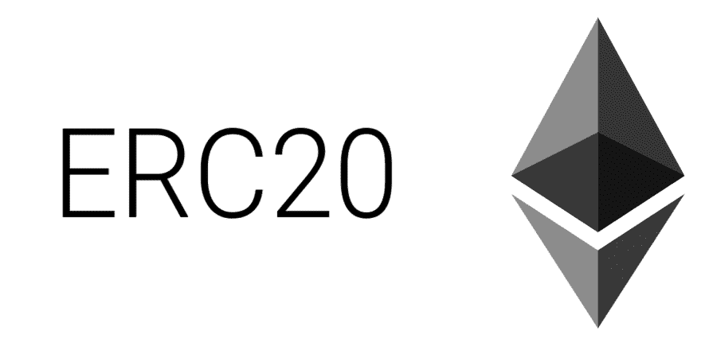

# ERC20 的剖析

> 原文:[https://dev.to/aunyks/the-anatomy-of-erc20-bfg](https://dev.to/aunyks/the-anatomy-of-erc20-bfg)

*[本文首发至 21.co 的博客。](https://news.21.co/the-anatomy-of-erc20-6ab09d4206a5)T3
T5T7】*

鉴于今天的 ICO 发布，数字代币销售，在此期间，公司和组织[在分发数字资产的同时立即筹集数百万美元](https://storj.io/tokensale.html)，认识到几乎所有这些代币都拥有的底层技术:ERC20 是很重要的。

以太坊[征求意见](https://en.wikipedia.org/wiki/Request_for_Comments) 20，简称 ERC20，是 Fabian Vogelsteller 在 2015 年末推出的[以太坊改进提案](https://github.com/ethereum/EIPs)。这是许多流行的以太坊智能合约遵守的标准。它有效地允许智能合约的行为与比特币或以太坊等传统加密货币非常相似。在这种情况下，以太坊区块链上托管的令牌可以被发送、接收、检查其总供应量，并检查单个地址上可用的数量。这就好比从钱包里收发以太或比特币，知道流通中的硬币总量，知道某个特定钱包的硬币余额。遵循此标准的智能合约称为 ERC20 令牌。

[最初的 ERC20 提案](https://github.com/ethereum/EIPs/issues/20)

通过定义一组允许智能合约模拟数字令牌的函数，所有先前描述的功能能够存在。但是这是怎么做到的呢？

ERC20 定义了 balanceOf、totalSupply、transfer、transferFrom、approve 和 allowance 功能。它还有几个可选字段，如令牌名称、符号和测量时使用的小数位数。注:这是一份 ERC20 合同示例的简明声明。

ERC20 定义了功能`balanceOf`、`totalSupply`、`transfer`、`transferFrom`、`approve`和`allowance`。它还有几个可选字段，如令牌名称、符号和测量时使用的小数位数。

注:这是一份 ERC20 合同示例的简明声明。

```
// Grabbed from: https://github.com/ethereum/EIPs/issues/20
contract ERC20 {
   function totalSupply() constant returns (uint theTotalSupply);
   function balanceOf(address _owner) constant returns (uint balance);
   function transfer(address _to, uint _value) returns (bool success);
   function transferFrom(address _from, address _to, uint _value) returns (bool success);
   function approve(address _spender, uint _value) returns (bool success);
   function allowance(address _owner, address _spender) constant returns (uint remaining);
   event Transfer(address indexed _from, address indexed _to, uint _value);
   event Approval(address indexed _owner, address indexed _spender, uint _value);
} 
```

<svg width="20px" height="20px" viewBox="0 0 24 24" class="highlight-action crayons-icon highlight-action--fullscreen-on"><title>Enter fullscreen mode</title></svg> <svg width="20px" height="20px" viewBox="0 0 24 24" class="highlight-action crayons-icon highlight-action--fullscreen-off"><title>Exit fullscreen mode</title></svg>

合同中每个字段的概述和示例如下。

## 总供给()

虽然供应很容易固定，就像比特币一样，但该函数允许合约实例计算并返回流通中的令牌总量。

```
contract MyERCToken {
  // In this case, the total supply
  // of MyERCToken is fixed, but
  // it can very much be changed
  uint256 _totalSupply = 1000000;

  function totalSupply() constant returns (uint256 theTotalSupply) {
    // Because our function signature
    // states that the returning variable
    // is "theTotalSupply", we'll just set that variable
    // to the value of the instance variable "_totalSupply"
    // and return it
    theTotalSupply = _totalSupply;
    return theTotalSupply;
  }
} 
```

<svg width="20px" height="20px" viewBox="0 0 24 24" class="highlight-action crayons-icon highlight-action--fullscreen-on"><title>Enter fullscreen mode</title></svg> <svg width="20px" height="20px" viewBox="0 0 24 24" class="highlight-action crayons-icon highlight-action--fullscreen-off"><title>Exit fullscreen mode</title></svg>

## balanceOf()

该函数允许智能合约存储并返回所提供地址的余额。该函数接受一个地址作为参数，因此应该知道任何地址的余额都是公共的。

```
contract MyERCToken {
  // Create a table so that we can map addresses
  // to the balances associated with them
  mapping(address => uint256) balances;
  // Owner of this contract
  address public owner;

  function balanceOf(address _owner) constant returns (uint256 balance) {
    // Return the balance for the specific address
    return balances[_owner];
  }
} 
```

<svg width="20px" height="20px" viewBox="0 0 24 24" class="highlight-action crayons-icon highlight-action--fullscreen-on"><title>Enter fullscreen mode</title></svg> <svg width="20px" height="20px" viewBox="0 0 24 24" class="highlight-action crayons-icon highlight-action--fullscreen-off"><title>Exit fullscreen mode</title></svg>

## 批准()

当调用这个函数时，契约的所有者授权或批准给定的地址从所有者的地址中提取令牌的实例。

在这里，以及后面的片段中，您可能会看到一个变量`msg`。这是由外部应用程序(如钱包)提供的隐式字段，以便它们可以更好地与合同进行交互。以太坊虚拟机(EVM)让我们使用这个字段来存储和处理外部应用程序给出的数据。

在本例中，`msg.sender`是合同所有者的地址。

```
contract MyERCToken {
  // Create a table so that we can map
  // the addresses of contract owners to
  // those who are allowed to utilize the owner's contract
  mapping(address => mapping (address => uint256)) allowed;

  function approve(address _spender, uint256 _amount) returns (bool success) {
    allowed[msg.sender][_spender] = _amount;
    // Fire the event "Approval" to execute any logic
    // that was listening to it
    Approval(msg.sender, _spender, _amount);
    return true;
  }
} 
```

<svg width="20px" height="20px" viewBox="0 0 24 24" class="highlight-action crayons-icon highlight-action--fullscreen-on"><title>Enter fullscreen mode</title></svg> <svg width="20px" height="20px" viewBox="0 0 24 24" class="highlight-action crayons-icon highlight-action--fullscreen-off"><title>Exit fullscreen mode</title></svg>

## 转移()

该功能允许合同的所有者向另一个地址发送给定数量的令牌，就像传统的加密货币交易一样。

```
contract MyERCToken {
  mapping(address => uint256) balances;

  // Note: This function returns a boolean value
  //       indicating whether the transfer was successful
  function transfer(address _to, uint256 _amount) returns (bool success) {
    // If the sender has sufficient funds to send
    // and the amount is not zero, then send to
    // the given address
    if (balances[msg.sender] >= _amount 
      && _amount > 0
      && balances[_to] + _amount > balances[_to]) {
      balances[msg.sender] -= _amount;
      balances[_to] += _amount;
      // Fire a transfer event for any
      // logic that's listening
      Transfer(msg.sender, _to, _amount);
        return true;
      } else {
        return false;
      }
   }
} 
```

<svg width="20px" height="20px" viewBox="0 0 24 24" class="highlight-action crayons-icon highlight-action--fullscreen-on"><title>Enter fullscreen mode</title></svg> <svg width="20px" height="20px" viewBox="0 0 24 24" class="highlight-action crayons-icon highlight-action--fullscreen-off"><title>Exit fullscreen mode</title></svg>

## 转移自()

此功能允许智能合约自动执行转移过程，并代表所有者发送给定数量的令牌。

看到这个可能会引起一些人的惊讶。有人可能会问，为什么我们既需要`transfer()`又需要`transferFrom()`函数。

考虑转账支付账单。通过花时间写一张支票并邮寄它来支付账单，手动汇款是非常常见的。这就像使用`transfer()`:你自己在做资金转移过程，没有另一方的帮助。

在另一种情况下，你可以在银行设置自动账单支付。这就像使用`transferFrom()`一样:你银行的机器自动为你汇款来支付账单。有了这个功能，合同可以代表你将一定数量的令牌发送到另一个地址，而无需你的干预。

```
contract MyERCToken {
  mapping(address => uint256) balances;

  function transferFrom(address _from, address _to, uint256 _amount) returns (bool success) {
    if (balances[_from] >= _amount
      && allowed[_from][msg.sender] >= _amount
      && _amount > 0
      && balances[_to] + _amount > balances[_to]) {
    balances[_from] -= _amount;
    balances[_to] += _amount;
    Transfer(_from, _to, _amount);
      return true;
    } else {
      return false;
    }
  }
} 
```

<svg width="20px" height="20px" viewBox="0 0 24 24" class="highlight-action crayons-icon highlight-action--fullscreen-on"><title>Enter fullscreen mode</title></svg> <svg width="20px" height="20px" viewBox="0 0 24 24" class="highlight-action crayons-icon highlight-action--fullscreen-off"><title>Exit fullscreen mode</title></svg>

## 令牌名称

这是一个可选字段，但许多流行的令牌都包含它，以便 Mist 和 MyEtherWallet 等流行的钱包能够识别它们。

```
contract MyERCToken {
  string public constant name = "My Custom ERC20 Token";
} 
```

<svg width="20px" height="20px" viewBox="0 0 24 24" class="highlight-action crayons-icon highlight-action--fullscreen-on"><title>Enter fullscreen mode</title></svg> <svg width="20px" height="20px" viewBox="0 0 24 24" class="highlight-action crayons-icon highlight-action--fullscreen-off"><title>Exit fullscreen mode</title></svg>

## 令牌符号

另一个用于标识令牌的可选字段，这是令牌的三个或四个字母缩写，就像 BTC、ETH、AUG 或 SJCX 一样。

```
contract MyERCToken {
  string public constant symbol = "MET";
} 
```

<svg width="20px" height="20px" viewBox="0 0 24 24" class="highlight-action crayons-icon highlight-action--fullscreen-on"><title>Enter fullscreen mode</title></svg> <svg width="20px" height="20px" viewBox="0 0 24 24" class="highlight-action crayons-icon highlight-action--fullscreen-off"><title>Exit fullscreen mode</title></svg>

## 小数位数

一个可选字段，用于确定计算代币金额的小数位数。最常见的小数位数是 18。

```
contract MyERCToken {
  uint8 public constant decimals = 18;
} 
```

<svg width="20px" height="20px" viewBox="0 0 24 24" class="highlight-action crayons-icon highlight-action--fullscreen-on"><title>Enter fullscreen mode</title></svg> <svg width="20px" height="20px" viewBox="0 0 24 24" class="highlight-action crayons-icon highlight-action--fullscreen-off"><title>Exit fullscreen mode</title></svg>

我们刚刚创建的 ERC20 令牌的全部源代码可以在[这里](https://gist.github.com/aunyks/aa97affc1dc47ba6ca881f9bf7897637)找到。

最后，[原 ERC20 提案](https://github.com/ethereum/EIPs/issues/20)有些不受重视。它为一系列新的智能合约开辟了道路，这些合约可以像比特币或以太坊一样被创建和分配。这被证明对年轻公司非常有吸引力，因为整个 ERC20 生态系统都托管在以太坊区块链上，这是一个大型的预先存在的计算机网络。这意味着开发商和年轻公司不必为了维持代币而吸引矿工，这可以节省很多钱。而且，这些代币可以在交易所托管，像其他资产一样进行交易，因此投资者可以像更受欢迎的货币一样轻松地买卖这些代币。