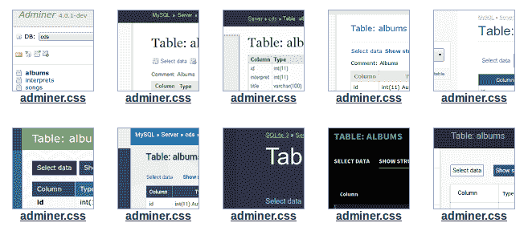

# Adminer！PhpMyAdmin 的一个有用且非常简单的替代品

> 原文:[https://dev . to/abrandao/adminer-a-used-and-very-simple-alternative-to-phpmyadmin-chg](https://dev.to/abrandao/adminer-a-useful-and-very-simple-alternative-to-phpmyadmin-chg)

我喝了一些...phpmyadmin 的问题。这是一个寻找替代品的好机会。在尝试了一些选项后，幸运的是我找到了管理员。

Adminer 是一个高效的数据库管理工具，与 PhpMyAdmin 相比，它承诺了更好的用户体验、对 Mysql 特性的支持、性能和安全性。

事实上，网站上有一个部分解释了为什么你应该现在就换掉它！[https://www.adminer.org/en/phpmyadmin/](https://www.adminer.org/en/phpmyadmin/)

## 工作原理！？

这个尽量简单。只需下载一个 php 文件，放入你的文件根文件夹，然后访问！认证后，您可以管理您的数据库。

就是这样！没有烦人的配置。

[T2】](https://res.cloudinary.com/practicaldev/image/fetch/s--GxXQSN8x--/c_limit%2Cf_auto%2Cfl_progressive%2Cq_auto%2Cw_880/https://thepracticaldev.s3.amazonaws.com/i/1ehsdvjeu7amcv7wcqbp.png)

提示:

默认设计并不完美。所以，你可以从网站上下载一个 adminer.css 文件——在选择你喜欢的选项之后——然后把它放在你的 adminer.css 文件旁边，看看它的魔力吧！

尽情享受吧！无红利(ex-dividend)