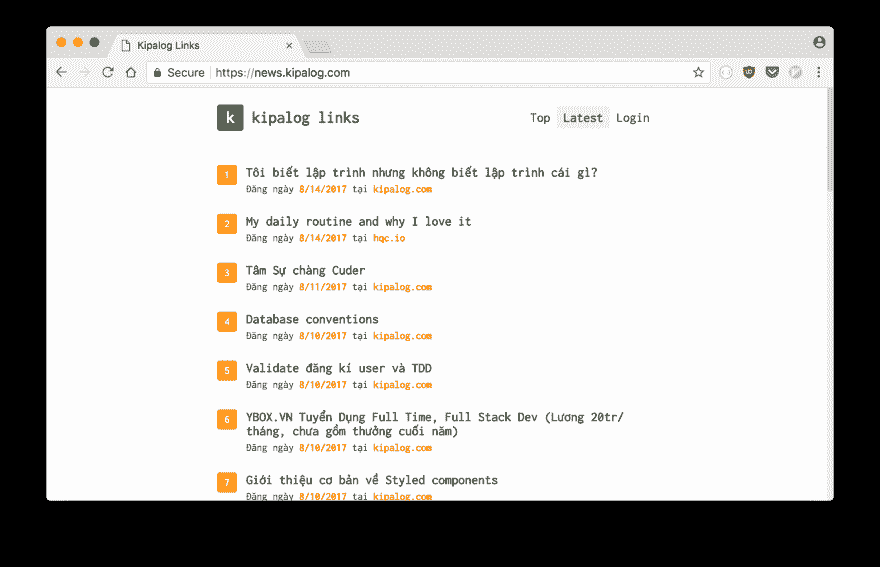

# 网络生锈

> 原文:[https://dev.to/huytd/rust-for-the-web-55](https://dev.to/huytd/rust-for-the-web-55)

*原文发布在[我的博客](https://thefullsnack.com/en/rust-for-the-web.html)上*

* * *

“我们能在 Rust 中创建网络应用吗？”——很多人问。我也是。

当我开始学习 Rust 时，我的主要目标是从我的 ducky JavaScript 技术栈(Node.js Express)开始，也就是说，在 Rust 中开发 web 应用程序。

一年后，我学到了一些东西。所以我写这篇文章告诉你我对 Rust Web 编程的看法。

有许多方法可以在 Rust 中创建 web 应用程序，例如，将 Rust 代码编译成客户端 JavaScript，编写 RESTful API，或者像 2012 年一样构建同构 web 应用程序。我一个一个去。

## 客户端 JavaScript 在 Rust

我首先想到的是像 React 一样拥有基于组件的架构。这意味着，你需要找到一种方法在网络浏览器上运行 Rust 代码。

多亏了 ASM.js 和 WebAssembly，这才成为可能，通过[快速设置](https://users.rust-lang.org/t/compiling-to-the-web-with-rust-and-emscripten/7627)，你可以在几分钟内将你的 Rust 代码编译到 ASM.js/WebAssembly。

现在，对于基于组件的架构，我只是创建了一些宏来包装 [stdweb](https://crates.io/crates/stdweb) 箱，并通过浏览器的 DOM API 呈现 HTML 元素。

[https://github . com/huytd/rust-web app-template/blob/master/src/main . RS # L13-L58](https://github.com/huytd/rust-webapp-template/blob/master/src/main.rs#L13-L58)

如果你觉得我只是贴了外星语言，不要害怕。`component!`宏用于定义自定义元素。`mount_component!`宏用于向文档追加元素，而`html!`宏用于从 HTML 字符串创建元素。

下面是我的使用方法:

```
component!(AppComponent => {
    init: {
        let e: Element = html!("
        <div>
            <p>
                <span>Hello</span>
                <span>World</span>
            </p>
            <GreenButton />
        </div>
        ");

        let mut button = GreenButton::new();
        mount_component!(e, "GreenButton", button);

        e
    },
    render: |this: &Element| {
    }
});

component!(GreenButton => {
    init: {
        let button = document().create_element("button");
        button.add_event_listener(move |_: ClickEvent| {
            js! {
                alert("Yo! This is the Green Button!");
            }
        });
        button
    },
    render: |this: &Element| {
        this.set_text_content("This is a button");
    }
});

fn main() {
    stdweb::initialize();

    let mut app = AppComponent::new();
    mount_component!(document(), "#root", app);

    stdweb::event_loop();
} 
```

<svg width="20px" height="20px" viewBox="0 0 24 24" class="highlight-action crayons-icon highlight-action--fullscreen-on"><title>Enter fullscreen mode</title></svg> <svg width="20px" height="20px" viewBox="0 0 24 24" class="highlight-action crayons-icon highlight-action--fullscreen-off"><title>Exit fullscreen mode</title></svg>

当你甚至可以在你的 Rust 代码:D 中写一个`onClick`事件时，谁还需要反应呢(开玩笑)。

你可能想要[看一下整个项目](https://github.com/huytd/rust-webapp-template)来详细了解如何使用这些宏`stdweb`。

## Rust 中的 RESTful API

如果您不想放弃您的 JavaScript 前端，这是更好的方法:只需在 Rust 中编写一个 API 服务器，让它与您现有的前端一起工作。

有一些框架可供您选择。让我们来看看 [AreWeWebYet](http://www.arewewebyet.org/) 。

对于喜欢框架更苗条的人来说， [tiny_http](https://crates.io/crates/tiny_http) 是最好的选择。

对于 simplicty，你可以使用 [nickel.rs](https://github.com/nickel-org/nickel.rs) ，它是 Rust 中最轻量级的框架之一，灵感来自 Node 的 Express。

对于 HTTP/2 支持， [solicit](https://github.com/mlalic/solicit) 是您目前唯一的选择。

就个人而言，我更喜欢使用 [Rocket](https://rocket.rs) ,因为它是一个非常好的框架，有很多特性，但仍然保持代码简单，语法非常优雅。它最近还添加了内置的 TLS 支持。这个框架唯一的缺点是它需要使用夜间 Rust 版本。

这是`Rocket`中`GET`方法的简单路由处理程序。

```
#[get("/posts", format = "application/json")]
fn get_posts(page: i64) -> Json<Value> {
    Json(json!({
        "result": []
    }))
} 
```

<svg width="20px" height="20px" viewBox="0 0 24 24" class="highlight-action crayons-icon highlight-action--fullscreen-on"><title>Enter fullscreen mode</title></svg> <svg width="20px" height="20px" viewBox="0 0 24 24" class="highlight-action crayons-icon highlight-action--fullscreen-off"><title>Exit fullscreen mode</title></svg>

我通常让`Rocket`为我提供静态文件，就像我在 Express 中做的一样:

```
#[get("/")]
fn index() -> io::Result<NamedFile> {
    NamedFile::open("www/index.html")
}

#[get("/<file..>", rank = 5)]
fn files(file: PathBuf) -> Option<NamedFile> {
    NamedFile::open(Path::new("www/").join(file)).ok()
} 
```

<svg width="20px" height="20px" viewBox="0 0 24 24" class="highlight-action crayons-icon highlight-action--fullscreen-on"><title>Enter fullscreen mode</title></svg> <svg width="20px" height="20px" viewBox="0 0 24 24" class="highlight-action crayons-icon highlight-action--fullscreen-off"><title>Exit fullscreen mode</title></svg>

所以我可以把我所有的前端代码放在`www`文件夹中，并通过我的 RESTful API 访问它。例如，典型的项目结构是:

```
├── Cargo.toml
├── README.md
├── src
│   ├── main.rs
│   └── ...Rust code here...
└── www
    ├── index.html
    ├── main.js
    ├── package.json
    ├── webpack.config.js
    └── ...JavaScript code here... 
```

<svg width="20px" height="20px" viewBox="0 0 24 24" class="highlight-action crayons-icon highlight-action--fullscreen-on"><title>Enter fullscreen mode</title></svg> <svg width="20px" height="20px" viewBox="0 0 24 24" class="highlight-action crayons-icon highlight-action--fullscreen-off"><title>Exit fullscreen mode</title></svg>

要处理数据库，使用 [Diesel](https://diesel.rs) 是个好主意。

如果你想看一个`Rocket` + `Diesel` + `React`的项目在运行，我会恬不知耻地在这里插一个[我这边的项目](https://news.kipalog.com)，在 Github 上插[它的源代码](https://github.com/huytd/codedaily-v3)。

[T2】](https://res.cloudinary.com/practicaldev/image/fetch/s--G0BP5zSz--/c_limit%2Cf_auto%2Cfl_progressive%2Cq_auto%2Cw_880/https://thefullsnack.com/en/img/rust-kipalog.png)

如果它对你来说足够好，请随意看看或使用它。

## 同构 web app 中的 Rust

最后一个，我最喜欢的一个，好像是 2012 年，我从第一份 PHP 工作开始了我的编程生涯。

不再有单页应用程序，不再有客户端呈现的 UI。当人们在他们的浏览器上禁用 JavaScript 时，不会再有破碎的网页。

许多其他框架在将一些数据绑定到 HTML 模板后，能够呈现这些模板。

```
#[get("/")]
fn index() -> Template {
    let news = fetch_from(RSS_URL).ok().expect("Could not read RSS");
    Template::render("index", &news)
} 
```

<svg width="20px" height="20px" viewBox="0 0 24 24" class="highlight-action crayons-icon highlight-action--fullscreen-on"><title>Enter fullscreen mode</title></svg> <svg width="20px" height="20px" viewBox="0 0 24 24" class="highlight-action crayons-icon highlight-action--fullscreen-off"><title>Exit fullscreen mode</title></svg>

我最近用`Rocket` + `Handlebars`模板做了一个[黑客新闻阅读器](https://codedaily.xyz)，你可以在这里看一下[它的源代码](https://github.com/huytd/hackernews-rss-reader)(哎，我知道了，又是不要脸的 PR)。

[T2】](https://res.cloudinary.com/practicaldev/image/fetch/s--II-utXh---/c_limit%2Cf_auto%2Cfl_progressive%2Cq_auto%2Cw_880/https://thefullsnack.com/en/img/rust-hackernews.png)

* * *

我希望我在这里列出的三种方法会对你有所帮助，如果你想问:*“铁锈会结网吗？”*。每一个都有优点和缺点，取决于你的项目，你可以选择其中一个或者将它们混合在一起。

欢迎在[黑客新闻](https://news.ycombinator.com/item?id=15014557)或 [Reddit](https://www.reddit.com/r/rust/comments/6tqzka/rust_for_the_web/) 发表评论，分享你的想法。