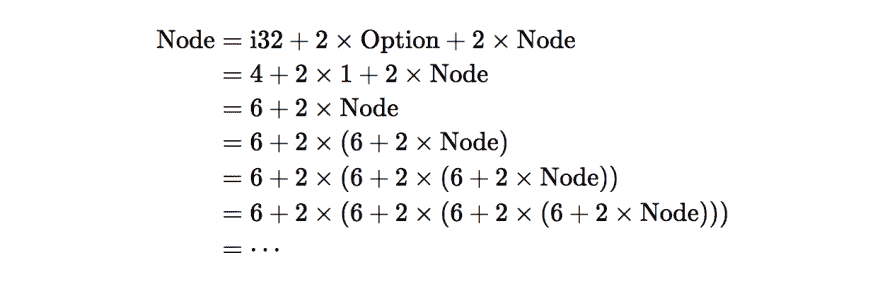

# Rust 中的递归类型问题

> 原文：<https://dev.to/huytd/recursive-type-problem-in-rust-bcf>

*原文发布在[我的博客](https://thefullsnack.com/en/recursive-rust.html)上*

* * *

在花了很多时间阅读关于 Rust 的文章后，我决定[尝试一下](https://github.com/huytd/thingsinrust/blob/master/binary_tree/binary_tree.rs) 。

[T2】](https://res.cloudinary.com/practicaldev/image/fetch/s--8bhXxJ36--/c_limit%2Cf_auto%2Cfl_progressive%2Cq_auto%2Cw_880/https://cdn-images-1.medium.com/max/2000/1%2AUNsRZHTPh1rO1eF_VH71gw.png)

这是一个非常简单的**二叉树遍历**算法的实现。
令人惊讶的是，通过这样做，我学到了很多 Rust 的基本概念！

## Rust 告诉我们代码中的错误

smartass Rust 编译器扔给我的第一件东西是可爱的错误消息:

```
$ rustc binary_tree.rs -o binary_tree
error[E0072]: recursive type `Node` has infinite size
 --> binary_tree.rs:1:1
  |
  |
  = help: insert indirection (e.g., a `Box`, `Rc`, or `&`) at some point to make `Node` representable
error: aborting due to previous error 
```

Enter fullscreen mode Exit fullscreen mode

是的，这是代码:

```
struct Node {
    value: i32,
    left: Option<Node>,
    right: Option<Node>
} 
```

Enter fullscreen mode Exit fullscreen mode

这段代码是在 C/C++或 Java 等其他编程语言中实现二叉树节点的一种非常明显的方式。然而，Rust 编译器就是不认同我们。还有，这是有趣的部分。

仔细看看。错误消息说我们的**节点**结构是一个
**递归类型**，并且它有无限的大小。这是什么意思？

在 Rust 中，默认情况下，所有值都在堆栈中分配。所以编译器需要
知道每个的大小。结构的大小是其所有字段大小的总和。

例如，使用此结构:

```
struct Point {
    x: i32,
    y: u8
} 
```

Enter fullscreen mode Exit fullscreen mode

所以点结构的大小是:

```
size_of::<Point>() == size_of::<i32>() + size_of::<u8>() 
```

Enter fullscreen mode Exit fullscreen mode

回到我们的实现，我们如何计算节点的大小？

```
size_of::<i32>() + 2 * size_of::<Option>() + 2 * size_of::<Node>() 
```

Enter fullscreen mode Exit fullscreen mode

让我们扩展这个等式:

[T2】](https://res.cloudinary.com/practicaldev/image/fetch/s--MM23-kus--/c_limit%2Cf_auto%2Cfl_progressive%2Cq_auto%2Cw_880/https://cdn-images-1.medium.com/max/1600/1%2ArV3hH3Yq-KkS7d5sVYYCog.png)

嘿嘿！嘿！停下来！你可以这样做一整天。没有办法阻止膨胀的过程。

因此，**节点**的大小将是无限的，并且 Rust
编译器无法计算。

## 而铁锈也告诉我们如何修复它

让我们再看一下错误消息。当铁锈试图教我们如何修复破损的东西时，你可以看到它的善良:

```
$ rustc binary_tree.rs -o binary_tree

error[E0072]: recursive type `Node` has infinite size
 --> binary_tree.rs:1:1
  |
1 | struct Node {
  | ^ recursive type has infinite size
  |

error: aborting due to previous error 
```

Enter fullscreen mode Exit fullscreen mode

如果我们按照提示，将**框**添加到我们的实现中，问题将会得到解决:

```
struct Node {
    value: i32,
    left: Option<Box<Node>>,
    right: Option<Box<Node>>
} 
```

Enter fullscreen mode Exit fullscreen mode

但是，**框**是什么？它是如何解决我们的递归引用问题的？

**框**是一个* *指针* *，指向一个堆分配的内存空间。

因此，当我们使用**框**、*声明对**节点**的引用时，该引用的大小是指针*的大小，而不是**节点**类型的大小，并且它已被定义，因此 Rust 编译器现在知道需要为一个**节点**分配多少内存。递归类型问题现在解决了！

* * *

我希望你喜欢这篇文章，现在明白了递归类型的问题，以及如何修复它。

如果你想讨论或订阅我的博客来更新我在 Rust 的下一篇文章(当然还有其他技术内容)，请随时发表评论。