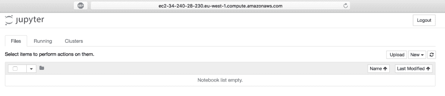

# 如何在 AWS 上为数据科学项目自动创建高端虚拟机

> 原文:[https://dev . to/ktsaprailis/how-to-automated-creating-high-end-virtual-machines-on-AWS-for-data-science-projects-di1](https://dev.to/ktsaprailis/how-to-automate-creating-high-end-virtual-machines-on-aws-for-data-science-projects-di1)

这篇文章最初出现在我的博客上。

这是我尝试在 Amazon Web Services 上自动创建虚拟机时发现的日志。

去年，我开始攻读数据科学硕士学位。任何在类似岗位上的人都知道，运行机器学习算法是非常耗费资源的。你可以花几个小时等待一个算法在普通的 PC/笔记本电脑上完成，花大约 1000 美元购买一台高端 PC，或者在云提供商那里获得一台虚拟机。

后两种选择各有利弊，可能适合个人需求。这里我将只关注最后一个选项，即在 AWS 上部署高端虚拟机。

创建虚拟机的简单方法是使用提供商网站。AWS 有一个用于创建资源的 web 控制台界面，但是将该界面用于一次性机器会很耗时且重复。此外，每次安装所需的软件包(称为配置的过程)、获取机器细节(公共 DNS 名称、公共 IP 等)都很麻烦

我将使用 [Terraform](https://www.terraform.io/) 协调工具，以尽可能快的速度快速设置和配置所需的虚拟机服务器，以最大限度地减少琐碎活动所浪费的时间，并最大限度地提高购买服务器的价值。最后，一旦我完成了这个项目，我就可以销毁虚拟机，这样就不会被收费了。

### 技术堆栈

将需要什么:

*   [地形](https://www.terraform.io/)工具。如上所述，这是将用于调配虚拟机的基本工具。
*   一个 [Unix shell](https://en.wikipedia.org/wiki/Unix_shell) 。这个指南也许可以和 [Windows bash](https://msdn.microsoft.com/en-us/commandline/wsl/about) 一起使用，但是我还没有测试过。
*   一个亚马逊网络服务的账户。

### 什么是基础设施即代码，什么是 Terraform？

基础设施即代码是一种新的 DevOps 理念，其中应用程序基础设施不再是手工创建的，而是以编程方式创建的。好处很多，包括但不限于:

*   部署速度
*   基础设施的版本控制
*   与工程师无关的基础设施(没有单点故障/没有一个人需要调试)
*   更好的生命周期管理(自动扩展/缩减、修复)
*   跨提供商部署，改动最小

Terraform 是一个有助于这一方向的工具。它是由 [Hashicorp](https://www.hashicorp.com/) 开发的开源工具。

该工具允许您编写您希望基础设施拥有的最终状态，terraform 会为您应用这些更改。

您可以调配虚拟机、创建子网、分配安全组，以及执行任何云提供商允许的任何操作。

Terraform 支持广泛的供应商，包括三大巨头 AWS、GCP、微软 Azure。

### 安装地形

Terraform 是用 Go 编写的，作为主要操作系统的二进制文件提供，但也可以从[源代码](https://github.com/hashicorp/terraform)编译而来。

二进制文件可以从 Terraform [站点](https://www.terraform.io/downloads.html)下载，不需要任何安装。我们只需要将它设置为 path 变量(对于 Linux/macOS 指令可以在这里找到[，对于 Windows](https://stackoverflow.com/questions/14637979/how-to-permanently-set-path-on-linux) [在这里](https://stackoverflow.com/questions/1618280/where-can-i-set-path-to-make-exe-on-windows))，这样就可以从我们的系统中的任何路径访问它。

完成后，我们可以通过运行 terraform 命令来确认它已准备好使用，我们应该会得到如下所示的内容:

```
$ terraform
Usage: terraform [--version] [--help] <command> [args]

The available commands for execution are listed below.
The most common, useful commands are shown first, followed by
less common or more advanced commands. If you're just getting
started with Terraform, stick with the common commands. For the
other commands, please read the help and docs before usage.

Common commands:
    apply              Builds or changes infrastructure
    console            Interactive console for Terraform interpolations
    destroy            Destroy Terraform-managed infrastructure
    env                Environment management
    fmt                Rewrites config files to canonical format
    get                Download and install modules for the configuration
    graph              Create a visual graph of Terraform resources
    import             Import existing infrastructure into Terraform
    init               Initialize a new or existing Terraform configuration
    output             Read an output from a state file
    plan               Generate and show an execution plan
    push               Upload this Terraform module to Atlas to run
    refresh            Update local state file against real resources
    show               Inspect Terraform state or plan
    taint              Manually mark a resource for recreation
    untaint            Manually unmark a resource as tainted
    validate           Validates the Terraform files
    version            Prints the Terraform version

All other commands:
    debug              Debug output management (experimental)
    force-unlock       Manually unlock the terraform state
    state              Advanced state management 
```

现在我们可以继续使用工具了。

### 设置 AWS 账户

这并不是这个项目特有的步骤，而是每当建立一个新的 AWS 帐户时都需要配置的东西。当我们在 Amazon 上创建一个新帐户时，我们得到的默认帐户拥有任何操作的 root 访问权限。同样，对于 linux root 用户，我们不希望在日常操作中使用这个帐户，所以我们需要创建一个新用户。

我们导航到[身份和访问管理(IAM)](https://console.aws.amazon.com/iam/home#) 页面，点击`Users`，然后点击`Add user`按钮。我们提供用户名，并单击编程访问复选框，以便生成访问密钥 ID 和秘密访问密钥。

单击“下一步”,系统会要求我们提供该用户所属的安全组。安全组是提供权限和限制对所需特定操作的访问的主要方式。出于这个项目的目的，我们将给予这个用户`AdministratorAccess`权限，但是当在专业设置中使用时，建议只允许用户需要的权限(如 AmazonEC2FullAccess，如果用户将只创建 EC2 实例)。

完成审查步骤后，Amazon 将提供访问密钥 ID 和秘密访问密钥。我们将把这些提供给 terraform，授权它为我们创造资源。我们需要保留这些，因为它们只提供一次，不能被检索(但是我们总是可以创建一个新的对)。

亚马逊推荐的存储这些凭证的安全方法是将它们保存在一个名为`credentials`的文件下的隐藏文件夹中。terraform 可以访问这个文件来检索它们。

```
$ cd
$ mkdir .aws
$ cd .aws
~/.aws$ vim credentials 
```

在替换`ACCESS_KEY`和`SECRET_KEY`之后，我们将以下内容添加到凭证文件中，然后保存它:

```
[default]
aws_access_key_id = ACCESS_KEY
aws_secret_access_key = SECRET_KEY 
```

我们还将此文件的访问权限仅限于当前用户:

```
~/.aws$ chmod 600 credentials 
```

#### 设置密钥对

下一步是创建一个密钥对，以便 terraform 可以访问新创建的虚拟机。请注意，这与上面的凭证不同。Amazon 凭证用于访问并允许 AWS 服务创建所需的资源，而这个密钥对将用于访问新创建的虚拟机。

登录 [AWS 控制台](https://eu-west-1.console.aws.amazon.com/ec2/v2/home?region=eu-west-1#KeyPairs:sort=keyName)，选择`Create Key Pair`。添加一个名字(我命名为我的 mac-ssh)点击`Create`。AWS 将创建一个. pem 文件并将其下载到本地。

将该文件移动到`.aws`目录。请注意，根据创建文件时提供的名称，要移动的文件的名称会有所不同。

```
~/Downloads$ cd ~/Downloads && mv mac-ssh.pem ../.aws/ 
```

然后限制权限:

```
$ cd ../.aws && chmod 400 mac-ssh.pem 
```

现在我们已经准备好使用这个密钥对，或者通过直接 ssh 连接到我们的实例，或者让 terraform 使用它连接到实例并运行一些脚本。

### 配置虚拟机&配置它们

现在一切都设置好了，我们可以开始实际创建虚拟机了。

让我们创建一个名为`terraform`的新文件夹。

```
$ mkdir terraform
$ cd terraform 
```

在该文件夹中，我们将创建两个文件，一个名为`main.tf`，另一个名为`configure.sh`。第一个文件是处理虚拟机创建的 terraform 特定代码。第二个文件是一个 [bash 脚本](https://en.wikipedia.org/wiki/Shell_script)，它将在创建的机器上运行，用所需的软件对其进行配置。

这是`main.tf`文件:

```
provider "aws" {
    region = "eu-west-1"
    version = "~> 0.1"
}

resource "aws_security_group" "jupyter_notebook_sg" {
    name = "jupyter_notebook_sg"
    # Open up incoming ssh port
    ingress {
        from_port = 22
        to_port = 22
        protocol = "tcp"
        cidr_blocks = ["0.0.0.0/0"]
    }

    # Open up incoming traffic to port 8888 used by Jupyter Notebook
    ingress {
        from_port   = 8888
        to_port     = 8888
        protocol    = "tcp"
        cidr_blocks = ["0.0.0.0/0"]
    }

    # Open up outbound internet access
    egress {
        from_port   = 0
        to_port     = 0
        protocol    = "-1"
        cidr_blocks = ["0.0.0.0/0"]
    }
}

resource "aws_instance" "Node" {
    count = 1
    ami = "ami-a8d2d7ce"
    instance_type = "m4.xlarge"
    key_name = "mac-ssh"
    tags {
        Name = "Jupyter Notebook Meganode"
    }
    vpc_security_group_ids = ["${aws_security_group.jupyter_notebook_sg.id}"]

    provisioner "file" {
        source      = "configure.sh"
        destination = "/tmp/configure.sh"

        connection {
            type     = "ssh"
            user     = "ubuntu"
            private_key = "${file("~/.aws/mac-ssh.pem")}"
        }
    }

    provisioner "remote-exec" {
        inline = [
            "chmod +x /tmp/configure.sh",
            "/tmp/configure.sh",
        ]
        connection {
            type     = "ssh"
            user     = "ubuntu"
            private_key = "${file("~/.aws/mac-ssh.pem")}"
        }

    }

}

output "node_dns_name" {
    value = "${aws_instance.Node.public_dns}"
} 
```

这是:

```
!#/bin/bash

sudo apt-get update
sudo apt-get -y install git
sudo apt-get -y install vim
sudo apt-get -y install python3 python3-pip python3-dev
sudo -H pip3 install jupyter

mkdir ~/.jupyter
echo "c.NotebookApp.allow_origin = '*'
c.NotebookApp.ip = '0.0.0.0'" | sudo tee /home/ubuntu/.jupyter/jupyter_notebook_config.py 
```

* * *

让我们分解地形蓝图。我们从定义提供者开始:

```
provider "aws" {
    region = "eu-west-1"
    version = "~> 0.1"
} 
```

Terraform 定义了包含在花括号中的这些块。第一个词通常是一个保留词，它定义了一些东西，在这个例子中是将在这个蓝图中使用的提供者。下一个字也是保留字，但它是特定于提供者的。块可以有第三个字，它通常是一个标识符，就像引用另一个块中的特定资源的变量。
关于第一个模块，核心 Terraform 软件与提供商无关，因此每个蓝图都需要定义创建资源的提供商。您可以在这里找到所有支持的提供商[。你可以在这里](https://www.terraform.io/docs/providers)找到所有 AWS 的具体细节[。
region 值基本上是将在其上创建 Virtaul 机器的 AWS 数据中心。您可以在这里找到所有可用的区域](https://www.terraform.io/docs/providers/aws/index.html)。通常建议选择离您最近的一个，以最大限度地缩短您的 PC 和虚拟机之间的响应时间。
最后，版本值是指将要使用的 AWS 插件的版本。

下一个块定义了将要创建的第一个资源。

```
resource "aws_security_group" "jupyter_notebook_sg" {
    name = "jupyter_notebook_sg"
    # Open up incoming ssh port
    ingress {
        from_port = 22
        to_port = 22
        protocol = "tcp"
        cidr_blocks = ["0.0.0.0/0"]
    }

    # Open up incoming traffic to port 8888 used by Jupyter Notebook
    ingress {
        from_port   = 8888
        to_port     = 8888
        protocol    = "tcp"
        cidr_blocks = ["0.0.0.0/0"]
    }

    # Open up outbound internet access
    egress {
        from_port   = 0
        to_port     = 0
        protocol    = "-1"
        cidr_blocks = ["0.0.0.0/0"]
    }
} 
```

可以将其视为虚拟防火墙，允许或限制虚拟机的传入和传出流量。您可以在一个虚拟机中分配多个安全组。在这个罐子里，我们创造了三个规则。我们已经允许来自任何 IP 地址的传入流量(入口)进入端口 22 和 8888，这两个端口分别用于 ssh 访问和 jupyter notebook。最后一个规则允许使用任何协议从所有 IP 到所有端口的输出(出口)流量。
最后注意，如前一段所述，块声明以`resource`字开始，后面是块定义的资源类型(这里是`aws_security_group`)，我们给这个资源命名为`jupyter_notebook_sg`。我们将在下一个模块中看到如何使用它。你可以在这里阅读更多关于安全组织[的信息。](https://docs.aws.amazon.com/AWSEC2/latest/UserGuide/using-network-security.html)

第三个块是定义虚拟机资源的块。

```
resource "aws_instance" "Node" {
    count = 1
    ami = "ami-a8d2d7ce"
    instance_type = "m4.xlarge"
    key_name = "mac-ssh"
    tags {
        Name = "Jupyter Notebook Meganode"
    }
    vpc_security_group_ids = ["${aws_security_group.jupyter_notebook_sg.id}"]

    provisioner "file" {
        source      = "configure.sh"
        destination = "/tmp/configure.sh"

        connection {
            type     = "ssh"
            user     = "ubuntu"
            private_key = "${file("~/.aws/mac-ssh.pem")}"
        }
    }

    provisioner "remote-exec" {
        inline = [
            "chmod +x /tmp/configure.sh",
            "/tmp/configure.sh",
        ]
        connection {
            type     = "ssh"
            user     = "ubuntu"
            private_key = "${file("~/.aws/mac-ssh.pem")}"
        }

    }

} 
```

如上所述，我们定义了想要创建的资源类型(`aws_instance`)，并给这个资源命名为`Node`。请注意，该名称仅由 Terraform 使用，它不是 AWS 中定义的内容。

第一个需要定义的值是`ami` ( `count`非常简单，所以我跳过它)。这代表[亚马逊机器图像](https://docs.aws.amazon.com/AWSEC2/latest/UserGuide/AMIs.html)。基本上，它是将安装在创建的虚拟机上的操作系统的映像。亚马逊[在这里](https://docs.aws.amazon.com/AWSEC2/latest/UserGuide/finding-an-ami.html#finding-an-ami-console)描述了求这个 ami 值的方法。有无数的图像可供选择，并预装了许多软件包供选择。然而，这可能会有点混乱，因为你只是在寻找一个简单的通用操作系统映像。我已经为 ubuntu 16.04 服务器映像选择了 AMI。
我更喜欢从 AWS 提供的[启动 EC2 实例向导](https://eu-west-1.console.aws.amazon.com/ec2/v2/home?region=eu-west-1#LaunchInstanceWizard:)中找到 ami，它对于基本操作系统映像更清晰。

接下来我们定义`instance_type`。这是将要创建的虚拟机类型。你可以在这里找到所有不同的实例类型以及[定价](https://aws.amazon.com/ec2/pricing/on-demand/)。我在这里选择的是 m4.xlarge 实例，它有 4 个虚拟 CPU，16 GB 的 RAM，在编写本文时每小时的成本约为 0.2 美元，但是这个价格通常因地区而异。
`Tags`是 AWS 的具体细节，这里我们为 VM 提供一个`Name`。

接下来，我们提供一个 AWS ids 安全组的列表`vpc_security_group_ids`,在本例中我们只提供了一个，即我们创建的那个。
最后，最后两个区块使用另一种地形区块类型，即 provisioner。[provisions](https://www.terraform.io/docs/provisioners/index.html)用于在本地或远程机器上执行脚本，作为资源创建或销毁的一部分。置备程序可用于引导资源、销毁前清理、运行配置管理等。

第一个置备程序是一个文件置备程序，它将文件复制到资源中(我们用它来复制我们创建的`configure.sh`脚本)，而第二个`remote-exec`在创建后在 VM 上运行一个 shell 命令(我们使脚本可执行，然后运行它)。两个供应器都使用另一个名为`connection`的块，它定义了连接类型和到达虚拟机所需的凭证。

最后，Terraform 定义了一种使用`output`块从创建的资源中提取细节的方法。

```
output "node_dns_name" {
    value = "${aws_instance.Node.public_dns}"
} 
```

我们将使用它来输出 VM 公共 DNS 名称，以便我们可以轻松地访问机器。

这是对所使用的 Terraform 基础知识的一个非常粗略的介绍，但是我强烈建议你阅读官方的[文档](https://www.terraform.io/docs/index.html)来了解更多。

配置脚本非常简单:

```
!#/bin/bash

sudo apt-get update
sudo apt-get -y install git
sudo apt-get -y install vim
sudo apt-get -y install python3 python3-pip python3-dev
sudo -H pip3 install jupyter

mkdir ~/.jupyter
echo "c.NotebookApp.allow_origin = '*'
c.NotebookApp.ip = '0.0.0.0'" | sudo tee /home/ubuntu/.jupyter/jupyter_notebook_config.py 
```

我们运行系统更新，然后安装 git、vim、python3 和 python3 pip，以及 jupyter 笔记本。最后 3 行很有趣，因为它们创建了 jupyter 笔记本特定的配置文件，并为允许从任何服务器访问笔记本的`allow_origin`和`ip`赋值。
当然，你可以在这个脚本中添加你的虚拟机需要的任何其他包。

* * *

既然蓝图已经解释完毕，我们就可以开始运行了。我们第一次用任何蓝图运行 terraform 时，我们都要初始化它。我们通过运行以下命令来实现:

```
$ terraform init 
```

通过这种方式，Terraform 将尝试找到这个蓝图所需的相关提供者插件并下载它。

现在我们已经准备好创建虚拟机了。让我们从运行`terraform plan`开始:

```
$ terraform plan
Refreshing Terraform state in-memory prior to plan...
The refreshed state will be used to calculate this plan, but will not be
persisted to local or remote state storage.

The Terraform execution plan has been generated and is shown below.
Resources are shown in alphabetical order for quick scanning. Green resources
will be created (or destroyed and then created if an existing resource
exists), yellow resources are being changed in-place, and red resources
will be destroyed. Cyan entries are data sources to be read.

Note: You didn't specify an "-out" parameter to save this plan, so when
"apply" is called, Terraform can't guarantee this is what will execute.

  + aws_instance.Node
      ami:                          "ami-785db401"
      associate_public_ip_address:  "<computed>"
      availability_zone:            "<computed>"
      ebs_block_device.#:           "<computed>"
      ephemeral_block_device.#:     "<computed>"
      instance_state:               "<computed>"
      instance_type:                "t2.micro"
      ipv6_address_count:           "<computed>"
      ipv6_addresses.#:             "<computed>"
      key_name:                     "mac-ssh"
      network_interface.#:          "<computed>"
      network_interface_id:         "<computed>"
      placement_group:              "<computed>"
      primary_network_interface_id: "<computed>"
      private_dns:                  "<computed>"
      private_ip:                   "<computed>"
      public_dns:                   "<computed>"
      public_ip:                    "<computed>"
      root_block_device.#:          "<computed>"
      security_groups.#:            "<computed>"
      source_dest_check:            "true"
      subnet_id:                    "<computed>"
      tags.%:                       "1"
      tags.Name:                    "Jupyter Notebook Meganode"
      tenancy:                      "<computed>"
      volume_tags.%:                "<computed>"
      vpc_security_group_ids.#:     "<computed>"

  + aws_security_group.jupyter_notebook_sg
      description:                           "Managed by Terraform"
      egress.#:                              "1"
      egress.482069346.cidr_blocks.#:        "1"
      egress.482069346.cidr_blocks.0:        "0.0.0.0/0"
      egress.482069346.from_port:            "0"
      egress.482069346.ipv6_cidr_blocks.#:   "0"
      egress.482069346.prefix_list_ids.#:    "0"
      egress.482069346.protocol:             "-1"
      egress.482069346.security_groups.#:    "0"
      egress.482069346.self:                 "false"
      egress.482069346.to_port:              "0"
      ingress.#:                             "2"
      ingress.2541437006.cidr_blocks.#:      "1"
      ingress.2541437006.cidr_blocks.0:      "0.0.0.0/0"
      ingress.2541437006.from_port:          "22"
      ingress.2541437006.ipv6_cidr_blocks.#: "0"
      ingress.2541437006.protocol:           "tcp"
      ingress.2541437006.security_groups.#:  "0"
      ingress.2541437006.self:               "false"
      ingress.2541437006.to_port:            "22"
      ingress.433339597.cidr_blocks.#:       "1"
      ingress.433339597.cidr_blocks.0:       "0.0.0.0/0"
      ingress.433339597.from_port:           "8888"
      ingress.433339597.ipv6_cidr_blocks.#:  "0"
      ingress.433339597.protocol:            "tcp"
      ingress.433339597.security_groups.#:   "0"
      ingress.433339597.self:                "false"
      ingress.433339597.to_port:             "8888"
      name:                                  "jupyter_notebook_sg"
      owner_id:                              "<computed>"
      vpc_id:                                "<computed>"

Plan: 2 to add, 0 to change, 0 to destroy. 
```

Terraform 将输出将要创建的资源，以便您可以仔细检查所有内容是否符合要求。然后我们实际运行`terraform apply`，资源创建开始:

```
kostis@kostismbp terraform $ terraform apply
aws_security_group.jupyter_notebook_sg: Creating...
  description:                           "" => "Managed by Terraform"
  egress.#:                              "" => "1"
  egress.482069346.cidr_blocks.#:        "" => "1"
  egress.482069346.cidr_blocks.0:        "" => "0.0.0.0/0"
  egress.482069346.from_port:            "" => "0"
  egress.482069346.ipv6_cidr_blocks.#:   "" => "0"
  egress.482069346.prefix_list_ids.#:    "" => "0"
  egress.482069346.protocol:             "" => "-1"
  egress.482069346.security_groups.#:    "" => "0"
  egress.482069346.self:                 "" => "false"
  egress.482069346.to_port:              "" => "0"
  ingress.#:                             "" => "2"
  ingress.2541437006.cidr_blocks.#:      "" => "1"
  ingress.2541437006.cidr_blocks.0:      "" => "0.0.0.0/0"
...
...
...
aws_instance.Node: Creation complete after 1m13s (ID: i-05a88fcd8cafae195)

Apply complete! Resources: 2 added, 0 changed, 0 destroyed.

Outputs:

node_dns_name = ec2-34-240-28-230.eu-west-1.compute.amazonaws.com 
```

过了一会儿，资源已经创建，我们可以看到 Terraform 已经提供了公共 DNS 名称，我们可以对机器进行 ssh:

```
kostis@kostismbp terraform $ ssh -i ~/.aws/mac-ssh.pem ubuntu@ec2-34-240-28-230.eu-west-1.compute.amazonaws.com
Welcome to Ubuntu 16.04.2 LTS (GNU/Linux 4.4.0-1022-aws x86_64)

 * Documentation:  https://help.ubuntu.com
 * Management:     https://landscape.canonical.com
 * Support:        https://ubuntu.com/advantage

  Get cloud support with Ubuntu Advantage Cloud Guest:
    http://www.ubuntu.com/business/services/cloud

36 packages can be updated.
9 updates are security updates.

Last login: Mon Sep 11 21:08:07 2017 from 141.237.148.33
ubuntu@ip-172-31-45-252:~$ 
```

我们准备开始 Jupyter 笔记本:

```
ubuntu@ip-172-31-45-252:~$ jupyter notebook
[I 21:11:32.984 NotebookApp] Writing notebook server cookie secret to /run/user/1000/jupyter/notebook_cookie_secret
[I 21:11:33.006 NotebookApp] Serving notebooks from local directory: /home/ubuntu
[I 21:11:33.006 NotebookApp] 0 active kernels
[I 21:11:33.007 NotebookApp] The Jupyter Notebook is running at: http://0.0.0.0:8888/?token=5cefea05e76d542e73d440f4f2085b536687ecd92adf5552
[I 21:11:33.007 NotebookApp] Use Control-C to stop this server and shut down all kernels (twice to skip confirmation).
[W 21:11:33.007 NotebookApp] No web browser found: could not locate runnable browser.
[C 21:11:33.007 NotebookApp]

    Copy/paste this URL into your browser when you connect for the first time,
    to login with a token:
        http://0.0.0.0:8888/?token=5cefea05e76d542e73d440f4f2085b536687ecd92adf5552 
```

一旦启动，Jupyter 会提供一个 URL 来访问它，但是我们需要用机器的 DNS 名称替换通配符 0.0.0.0 IP，所以在这种情况下，访问笔记本的 URL 将是`http://ec2-34-240-28-230.eu-west-1.compute.amazonaws.com:8888/?token=5cefea05e76d542e73d440f4f2085b536687ecd92adf5552`。

转到此 URL 确认一切都已启动并运行！

[T2】](https://res.cloudinary.com/practicaldev/image/fetch/s--y-h7zH99--/c_limit%2Cf_auto%2Cfl_progressive%2Cq_auto%2Cw_880/https://tsaprailis.com/img/AWS_jupyter.png)

* * *

完成工作后，我们可以直接销毁虚拟机。Terraform 将要求确认虚拟机的销毁，然后继续销毁。

```
kostis@kostismbp terraform $ terraform destroy
aws_security_group.jupyter_notebook_sg: Refreshing state... (ID: sg-a19bc7d9)
aws_instance.Node: Refreshing state... (ID: i-05a88fcd8cafae195)

The Terraform destroy plan has been generated and is shown below.
Resources are shown in alphabetical order for quick scanning.
Resources shown in red will be destroyed.

  - aws_instance.Node

  - aws_security_group.jupyter_notebook_sg

Do you really want to destroy?
  Terraform will delete all your managed infrastructure, as shown above.
  There is no undo. Only 'yes' will be accepted to confirm.

  Enter a value: yes

aws_instance.Node: Destroying... (ID: i-05a88fcd8cafae195)
aws_instance.Node: Still destroying... (ID: i-05a88fcd8cafae195, 10s elapsed)
aws_instance.Node: Still destroying... (ID: i-05a88fcd8cafae195, 20s elapsed)
aws_instance.Node: Still destroying... (ID: i-05a88fcd8cafae195, 30s elapsed)
aws_instance.Node: Still destroying... (ID: i-05a88fcd8cafae195, 40s elapsed)
aws_instance.Node: Still destroying... (ID: i-05a88fcd8cafae195, 50s elapsed)
aws_instance.Node: Still destroying... (ID: i-05a88fcd8cafae195, 1m0s elapsed)
aws_instance.Node: Destruction complete after 1m3s
aws_security_group.jupyter_notebook_sg: Destroying... (ID: sg-a19bc7d9)
aws_security_group.jupyter_notebook_sg: Destruction complete after 1s

Destroy complete! Resources: 2 destroyed. 
```

### 结论

希望你喜欢这个教程。我试图总结我一路走来学到的一切。Terraform 是一个非常有用的工具，被许多科技公司采用。在这篇介绍之后，我会鼓励你去阅读更多关于它的内容。创建单个机器只是一个非常简单的例子，但是如果你掌握了窍门，你可以使用 Hadoop、Spark 等大数据系统创建多节点架构。