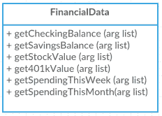
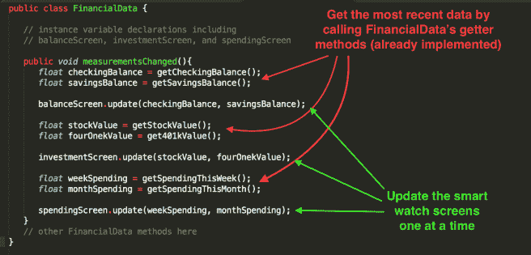
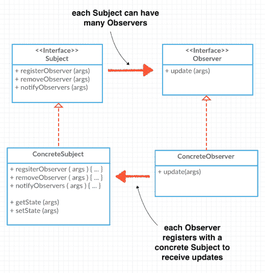

# 设计模式:观察者模式

> 原文：<https://dev.to/henriavo/design-patterns-observer-pattern-clb>

*最初发布于我的博客[henricodesjava . blog](https://henricodesjava.blog/)T3】*

大家好！第二章头先设计模式:一个大脑友好的指南是关于观察者模式的。他们记下了这种模式的基本原理和使用频率。并且暗示这本书中的未来模式是基于这种和其他模式组合的。所以让我们来谈谈观察者模式。

这种模式试图解决的问题是关于沟通和管理的。文中给出的一个简单抽象的例子是关于一家报纸出版公司及其订户的。从技术上讲，这种关系可以分为一对多关系、一个发布者和多个订阅者。本文使用术语“T0”Subject 指代发布者，使用术语“T2”Observer 指代订阅者。

接下来我举一个更具体的例子。我将使用一个与正文略有不同的例子来帮助说明这个想法。假设我们是一家金融初创公司，我们有一个智能手表应用程序的想法，它可以与您的所有金融机构通信，让您鸟瞰您的财务状况。例如，它可以显示你的支票账户余额，或者显示你的股票价格。我们可以访问的是一个可以为我们返回这些值的类，我们称这个类为 **FinancialData** 。出于这个例子的目的，我们不关心它如何检索这个信息。

[T2】](https://res.cloudinary.com/practicaldev/image/fetch/s--1mHf31mg--/c_limit%2Cf_auto%2Cfl_progressive%2Cq_auto%2Cw_880/https://henricodesjava.files.wordpress.com/2017/09/screen-shot-2017-09-30-at-12-28-17-am.png%3Fw%3D232%26h%3D166)

下面是我们智能手表应用的一个简单实现，并附有解释。当然，所有这些都只是伪代码，并不是真正的智能手表代码。

[T2】](https://res.cloudinary.com/practicaldev/image/fetch/s--pjlRTEUE--/c_limit%2Cf_auto%2Cfl_progressive%2Cq_auto%2Cw_880/https://henricodesjava.files.wordpress.com/2017/09/screen-shot-2017-09-30-at-1-24-50-am1.png%3Fw%3D656)

这个实现有一些问题。首先，我们违反了第一章的设计原则。_ 确定应用程序中变化的方面，并将它们与保持不变的方面区分开来。_ 带绿色箭头的线条代表手表上的不同屏幕，将来我们可能会添加更多屏幕。当那个时刻到来时，对这个阶层的改变是不可避免的。带有红色箭头的行正在检索财务数据，虽然这也可能发生变化，但这种变化是由 API 变化引起的，而不是我们客户端代码的变化。我们也违反了另一个设计原则:_ 编程到一个接口，而不是一个实现。_ 如果有一种方法可以将改变的代码和没有改变的代码，以及没有编程的代码与实现分开，那该多好？介绍，观察者模式！

观察者模式(Observer Pattern):定义了对象之间一对多的依赖关系，这样当一个对象改变状态时，它的所有依赖对象都会得到通知并自动更新。

我们将实现这一点，并通过使用接口引入松散耦合。让我们用一个类图来说明这个定义。

[T2】](https://res.cloudinary.com/practicaldev/image/fetch/s--YAA39fbT--/c_limit%2Cf_auto%2Cfl_progressive%2Cq_auto%2Cw_880/https://henricodesjava.files.wordpress.com/2017/09/screen-shot-2017-09-30-at-10-56-06-am.png%3Fw%3D520%26h%3D536)

现在，以这些类图为指导，让我们来看看智能手表应用程序的实现。首先下面是两个接口。

```
public interface Subject {
    public void registerObserver(Observer o);
    public void removeObserver(Observer o);
    public void notifyObservers();
}

public interface Observer {
    public void upate(Object obj);
} 
```

Enter fullscreen mode Exit fullscreen mode

接下来让我们看看实现 Subject 接口的新 FinancialData 类。

```
public class FinancialData implements Subject {
   private ArrayList observers;

   private float checkingBalance;
   private float savingsBalance;

   private float stockValue;
   private float fourOnekValue;

   private float weekSpending;
   private float monthSpending;

   public FinancialData(){
      observers = new ArrayList();
   }

   public void registerObserver(Observer o){
      observers.add(o);
   }

   public void removeObserver(o){
      int i = observers.indexOf(o);
      if(i > 0){
         observers.remove(i);
      }
   }

   public void notifyObservers(){
      for(int i = 0; i<observers.size(); i++){
         Observer observer = (Observer)observers.get(i);
         observer.update(this);
      }
   }

   public void measurementsChanged(){
      notifyObservers();
   }

   public void setNewBalanceData(float val1, float val2){
      this.checkingBalance = val1;
      this.savingsBalance = val2;
      measurementsChanged();
   }

   public void setNewInvestmentData(float val1, float val2){
      this.stockValue = val1;
      this.fourOnekValue = val2;
      measurementsChanged();
   }

   public void setNewSpendingData(float val1, float val2){
      this.weekSpending = val1;
      this.monthSpending = val2;
      measurementsChanged();
   }
   // other FinancialData methods here
   // including getter methods for balance, investment, and spending values
} 
```

Enter fullscreen mode Exit fullscreen mode

现在让我们来看看我们的观察者之一，天平智能手表屏幕。

```
public class BalanceScreen implements Observer {
   private float checkingBal;
   private float savingsBal;
   private Subject financialData;

   public BalanceScreen(Subject financialData){
      this.financialData = financialData;
      financialData.registerObserver(this);
   }

   public void update(Object obj){
      if( obj instanceof FinancialData){
         FinancialData fd = (FinancialData) obj;
         this.checkingBal = fd.getCheckingBalance();
         this.savingsBal = fd.getSavingsBalance();
      }
      display();
   }
   // other BalanceScreen methods here
} 
```

Enter fullscreen mode Exit fullscreen mode

最后，让我们来看一个将所有这些粘合在一起的程序。

```
public class SmartWatch {
    public static void main(String[] args){
        FinancialData financialData = new FinancialData();

        BalanceScreen balanceScreen = new BalanceScreen(financialData);
        InvestmentScreen investmentScreen = new InvestmentScreen(financialData);
        SpendingScreen spendingScreen = new SpendingScreen(financialData);

        // not using an actualy finance api, so we set values manually
        financialData.setNewBalanceData(348.12, 3600.87);
        financialData.setNewInvestmentData(899.12, 45000.65);
        financialData.setNewSpendingData(210.34, 677.45);

        // at this point we should see print statements for all 3 screens
    }
} 
```

Enter fullscreen mode Exit fullscreen mode

你有它！我们实现了接口并创建了一些代码来测试它。现在请注意，我实际上还没有运行这段代码，所以这几行中可能有一两个 bug。在以后的文章中，我将不得不创建一个项目，并把这个工作代码放到 github 上。感谢阅读！ðŸ'‹ðŸ

(原发于我的个人博客:[https://henricodesjava . blog](https://henricodesjava.blog))

[ ](http://feeds.wordpress.com/1.0/gocomments/henricodesjava.wordpress.com/186/) [ ](https://res.cloudinary.com/practicaldev/image/fetch/s--6A7lpCwv--/c_limit%2Cf_auto%2Cfl_progressive%2Cq_66%2Cw_880/https://pixel.wp.com/b.gif%3Fhost%3Dhenricodesjava.blog%26blog%3D133476896%26post%3D186%26subd%3Dhenricodesjava%26ref%3D%26feed%3D1)