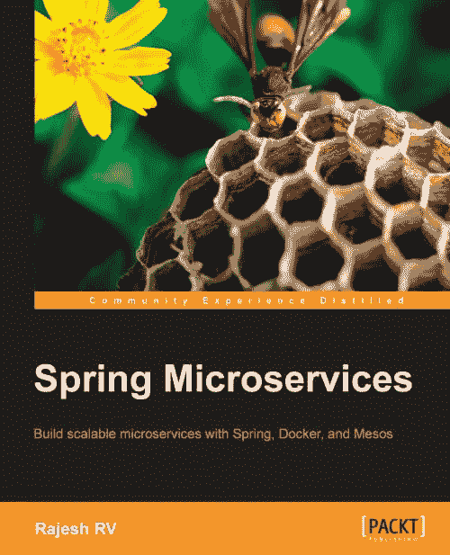

# Rajesh RV 的《春天的微服务》一书综述

> 原文:[https://dev . to/gimlet 2/summary-on-spring-micro services-book-by-rajesh-RV-14o 6](https://dev.to/gimlet2/summarize-on-spring-microservices-book-by-rajesh-rv-14o6)

最近看了**拉杰什 RV** 的**《弹簧微服务》**一书，在这里想试着总结一下。该书于 2016 年 6 月出版。但是，看起来，它仍然是相关的。

[T2】](https://res.cloudinary.com/practicaldev/image/fetch/s--rJtHz7Da--/c_limit%2Cf_auto%2Cfl_progressive%2Cq_auto%2Cw_880/https://cdn-images-1.medium.com/max/500/1%2AsxES4bQ1vbo2PoXbTjJdVA.jpeg)

#### 微服务不仅是开发者的乐趣，也是商业需求。

是的，当然，计划和实现可扩展的分布式系统是非常有趣和有趣的，但是开发人员应该始终记住我们为什么要这样做——更快地评估业务流程，降低实验成本。

#### 有意义的健康检查很重要

自愈对于微服务架构来说意义重大。为了提供它，您的服务必须准确地报告其健康状态。例如，您的服务部署在 **Kubernetes** 集群中，并公开 **/health** 端点。那么在失败的情况下将有可能重新启动它，并将流量重新路由到健康节点。此外，它还能帮助你更好地理解你的应用，了解所有重要的依赖和需求。

#### 春云是微服务不错的选择

…如果你不怕这样的供应商锁。如果您的平台 100%基于 Spring stack，那么尝试在 **Spring Cloud** 的帮助下解决微服务挑战似乎是非常合理的。从 **Spring Cloud Config** 到 **Spring Cloud Streams** 的一系列酷项目帮助您构建可靠且可管理的系统。但是如果你在 Kubernetes 上运行你的服务，你将会免费得到这些问题的替代解决方案(比如服务发现、负载平衡等等)。).

#### 分布式跟踪给系统带来了透明性

在这个领域，Spring 为我们提供了 **Spring Cloud Sleuth** 解决方案。它基于 **Zipkin** ，Cloudera 或者 Dapper。作为集成的结果，您将能够在日志消息中添加所谓的 **Trace-Id** 和 Span-Id，这样您就可以在整个系统中跟踪请求链，例如在 **Kibana** 中。对调试、依赖分析等非常有用。

#### 自动缩放

…不是微不足道的过程。除了来自你的平台的自动缩放的技术支持(例如，Kubernetes 有它，但有限，但有一些第三方扩展来改进它)，你真的需要考虑缩放策略，注意什么限制了你的应用性能。

当然，这本书里有更多有用的提示。这是我唯一关注的一点。总之——花些时间阅读是值得的。