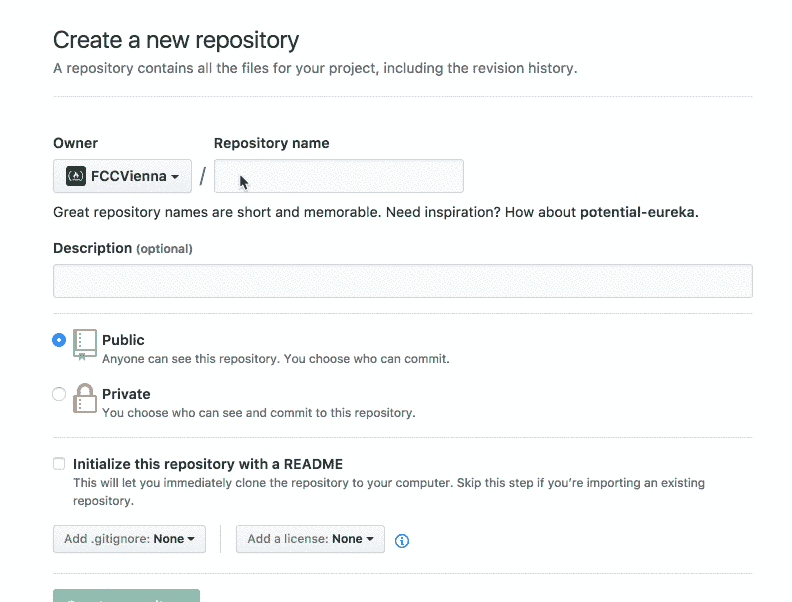
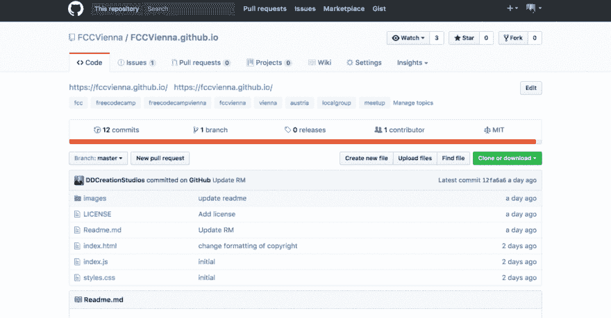
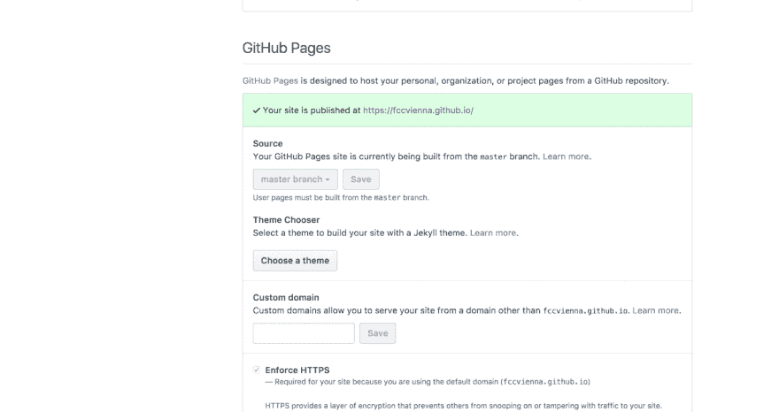

# 在 Github 页面上发布组织主页

> 原文:[https://dev . to/createdd/publishing-an-organization-home page-on-github-pages-523](https://dev.to/createdd/publishing-an-organization-homepage-on-github-pages-523)

# 在 Github 页面上发布组织主页

[T2】](https://fccvienna.github.io/)

[Github 回购可在此处获得…](https://github.com/DDCreationStudios/fccvienna.github.io)

我正在组织一个叫做[自由代码营](https://www.meetup.com/Free-Code-Camp-Vienna/)的自由代码营的当地团体聚会。几个月前，我们决定创建一个简单的主页来代表这个小组及其在线进展，但我们似乎从来没有找到时间这样做。遵循“快速主页比没有主页好”的想法，我决定创建一个主页并发布在 Github 页面上。它不仅允许我们托管我们的静态页面，而且也是一个完美的例子，说明在线发布东西是多么容易。

## ðÿ"„目录

*   [命名您的存储库](#name-your-repository)
*   [建立你的主页](#build-your-homepage)
*   [把你的代码放到 Github 上](#put-your-code-on-github)
*   [设置 Github 页面的来源](#set-the-source-for-your-github-pages)
*   [点击提供的链接](#see-your-amazing-homepage-at-the-provided-link)查看您令人惊叹的主页
*   [查看维也纳自由代码营的结果](#see-the-result-for-freecodecamp-vienna)
*   [在 Youtube 上看建造过程](#see-the-building-process-on-youtube)

* * *

> ## "Opportunity never knocks. When you knock on the door, they appear! " Greg Plitt

## 命名您的存储库

发布到 Github 页面时，选择正确的存储库名称至关重要。

[Github 的这一页](https://help.github.com/articles/user-organization-and-project-pages/)完美地解释了这一点:

[T2】](https://res.cloudinary.com/practicaldev/image/fetch/s--5aKw4B5_--/c_limit%2Cf_auto%2Cfl_progressive%2Cq_auto%2Cw_880/v1/../assets/FCCVGIT/overviewGithub.png)

因此，您需要像组织一样以“. github.io”结尾来命名存储库。

[T2】](https://res.cloudinary.com/practicaldev/image/fetch/s--pT-SacHE--/c_limit%2Cf_auto%2Cfl_progressive%2Cq_66%2Cw_880/http://g.recordit.co/NnMOakU8MX.gif)

## 建立你的主页

创建存储库后，用 HTML、CSS 和 Javascript 创建你的主页。

> 提示:我在开发过程中使用了 [codepen](https://codepen.io/ddcreationstudios/pen/yogdXX) 。它是 REPL，允许你从正在编写的代码中获得即时反馈。

为了加快布局过程和添加酷的功能，我使用了[materialiecss](http://materializecss.com/getting-started.html)。我过去用过它，对结果一直很满意。

## 把你的代码放到 Github 上

接下来，按照说明把你的文件放到 Github 上。

> 请确保您的“主”分支上有这些文件

[T2】](https://res.cloudinary.com/practicaldev/image/fetch/s--atWCzrQG--/c_limit%2Cf_auto%2Cfl_progressive%2Cq_auto%2Cw_880/v1/../assets/FCCVGIT/GithubRepo.png)

并为主分支选择 Github 页面的来源。

> 根据 Github，组织页面需要主分支中的源文件。

## 为你的 Github 页面设置来源

[T2】](https://res.cloudinary.com/practicaldev/image/fetch/s--GCsYr9Uc--/c_limit%2Cf_auto%2Cfl_progressive%2Cq_66%2Cw_880/http://g.recordit.co/i2Zke7MvkH.gif)

您的设置应该如下所示:

[T2】](https://res.cloudinary.com/practicaldev/image/fetch/s--6ANXwkTe--/c_limit%2Cf_auto%2Cfl_progressive%2Cq_auto%2Cw_880/v1/../assets/FCCVGIT/GithubSettings.png)

## 点击提供的链接，查看您的精彩主页

遵循提供的链接，或者在地址栏中键入您的组织名称和“. github.io”。

[T2】](https://res.cloudinary.com/practicaldev/image/fetch/s--n_3Dp1aX--/c_limit%2Cf_auto%2Cfl_progressive%2Cq_66%2Cw_880/http://g.recordit.co/ClGV6ETsgD.gif)

## 查看维也纳自由代码营的结果

[https://fccvienna.github.io/](https://fccvienna.github.io/)

## 查看 Youtube 上的搭建过程

[T2】](https://www.youtube.com/watch?v=XN7JPZiKJ1U)

感谢阅读我的文章！欢迎留下任何反馈！