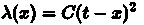

# 基本 JavaScript 人工智能算法

> 原文:[https://dev.to/createdd/basic-javascript-ai-algorithm-6hd](https://dev.to/createdd/basic-javascript-ai-algorithm-6hd)

[Github 回购可在此处获得…](https://github.com/DDCreationStudios/MLJavascriptString)

当我开始编码时，人工智能和机器学习是我清单上的第一位。现在我面临的问题是，有这么多的资源可以深入主题。我的目标很明确:我想用 JavaScript 实现机器学习的基础——我做到了。

* * *

> “人类，作为行为系统，是非常简单的。随着时间的推移，我们行为的表面复杂性在很大程度上反映了我们所处环境的复杂性。”
> 
> ## 司马贺，人工科学

## 资源

在这篇文章中，我将简单地构建一个类似于 Burak Kanber 的文章“机器学习:遗传算法简介”的东西

在他的文章中，他不仅很好地解释了基础知识，还在一个 JavaScript 例子中使用了他的知识。我很受启发，也很惊讶。
访问[的主页](https://www.burakkanber.com/)了解更多精彩内容。:)

## 我们在建造什么

我们正在用 JavaScript 编写一个算法，再现单词“Javascript”。

这是一个理解基本概念的例子。这是非常基本的，甚至是人为的，因为算法本身包含了想要的结果(键入的单词)。

## 减少可能的结果

构建所需的字符串有许多可能的结果。假设解决方案有一定的长度，比如 10 个字符，将减少候选人的数量。

例如:

```
- JavsScrip!
- Javahztrew
- WerdScript
- JavaScript 
```

<svg width="20px" height="20px" viewBox="0 0 24 24" class="highlight-action crayons-icon highlight-action--fullscreen-on"><title>Enter fullscreen mode</title></svg> <svg width="20px" height="20px" viewBox="0 0 24 24" class="highlight-action crayons-icon highlight-action--fullscreen-off"><title>Exit fullscreen mode</title></svg>

就长度而言，这些都是可能的解决方案，但显然只有最后一个是正确的。

## 成本函数

一个[成本函数](https://en.wikipedia.org/wiki/Loss_function)帮助我们最小化成本(与期望结果的差异)。

[T2】](https://res.cloudinary.com/practicaldev/image/fetch/s--lHGdQEe8--/c_limit%2Cf_auto%2Cfl_progressive%2Cq_auto%2Cw_880/https://wikimedia.org/api/rest_v1/media/math/render/svg/cf4beff1dc104f16784ac54e594efbdaa72480b6)

引用文章:

> 对于字符串中的每个字符，找出候选字符和目标字符在 ASCII 表示中的差异，然后对其求平方，以使“成本”始终为正。
> 
> 例如，如果我们有一个大写字母“a”(ascii 65)，但它应该是一个大写字母“c”(ascii 67)，那么这个字符的成本是 4 (67 - 65 = 2，2^2 = 4)。

为了达到我们想要的复制字符串的目标，我们的目标是成本为 0。

在这个基本示例中，可以安全地假设算法在达到成本 0 后可以停止。请注意，其他更复杂的问题可能需要运行一段时间，并评估它们自己的最小化结果。

## 比较结果

接下来我们需要合并和比较结果。

例如:

```
- SavaScript
- JavaScripd 
```

<svg width="20px" height="20px" viewBox="0 0 24 24" class="highlight-action crayons-icon highlight-action--fullscreen-on"><title>Enter fullscreen mode</title></svg> <svg width="20px" height="20px" viewBox="0 0 24 24" class="highlight-action crayons-icon highlight-action--fullscreen-off"><title>Exit fullscreen mode</title></svg>

可以切成两半，然后将一串与另一串组合在一起，如:

```
- SavaScripd
- JavaScript 
```

<svg width="20px" height="20px" viewBox="0 0 24 24" class="highlight-action crayons-icon highlight-action--fullscreen-on"><title>Enter fullscreen mode</title></svg> <svg width="20px" height="20px" viewBox="0 0 24 24" class="highlight-action crayons-icon highlight-action--fullscreen-off"><title>Exit fullscreen mode</title></svg>

结果现在显示了一个正确的字符串和一个不正确的字符串。

## 改变候选人

为了避免近亲繁殖，我们需要在结合后改变候选者。

例如:

```
- JadaScript
- JadaScript 
```

<svg width="20px" height="20px" viewBox="0 0 24 24" class="highlight-action crayons-icon highlight-action--fullscreen-on"><title>Enter fullscreen mode</title></svg> <svg width="20px" height="20px" viewBox="0 0 24 24" class="highlight-action crayons-icon highlight-action--fullscreen-off"><title>Exit fullscreen mode</title></svg>

这种情况永远不会产生改进的结果，因为它们是完全相同的候选。

我们至少需要改变其中一个来进化。例如,“JaeaScript”很适合继续成功的进化。

## 汇总候选人

按照面向对象编程的思路，我们可以设计出以下内容:

我们有一个候选班级

*   刺痛
*   成本分数

作为财产和

*   结合
*   变更
*   计算成本分数

作为方法。

## 建群

我们将选择一个小组规模，并在内部发展候选人。这个团队必须经历不同的阶段。在这些阶段，我们需要

*   计算每个候选人的成本分数
*   根据分数对候选人进行排序
*   剔除不合适的候选人
*   改变最佳候选人
*   随机改变候选人
*   完整性测试，检查是否找到了正确的字符串

## 代码

首先，我们用一个字符串作为构造函数来设置一个类，并设置一个构建随机字符串的方法:

```
var Candidates = function(code) {
    if (code) this.code = code;
    this.cost = 9999;
};
Candidates.prototype.code = '';
Candidates.prototype.random = function(length) {
    while (length--) {
        this.code += String.fromCharCode(Math.floor(Math.random() * 255));
    }
}; 
```

<svg width="20px" height="20px" viewBox="0 0 24 24" class="highlight-action crayons-icon highlight-action--fullscreen-on"><title>Enter fullscreen mode</title></svg> <svg width="20px" height="20px" viewBox="0 0 24 24" class="highlight-action crayons-icon highlight-action--fullscreen-off"><title>Exit fullscreen mode</title></svg>

接下来，我们需要添加成本函数，该函数查找 ASCII 代码之间的差异并对它们求平方。

```
Candidates.prototype.calcCost = function(compareTo) {
    var total = 0;
    for (i = 0; i < this.code.length; i++) {
        total +=
            (this.code.charCodeAt(i) - compareTo.charCodeAt(i)) *
            (this.code.charCodeAt(i) - compareTo.charCodeAt(i));
    }
    this.cost = total;
}; 
```

<svg width="20px" height="20px" viewBox="0 0 24 24" class="highlight-action crayons-icon highlight-action--fullscreen-on"><title>Enter fullscreen mode</title></svg> <svg width="20px" height="20px" viewBox="0 0 24 24" class="highlight-action crayons-icon highlight-action--fullscreen-off"><title>Exit fullscreen mode</title></svg>

之后，我们构建 combine 函数，它将一个候选项作为参数，找到中间值并返回两个新的子元素的数组。

```
Candidates.prototype.combine = function(cand) {
    var pivot = Math.round(this.code.length / 2) - 1;

    var child1 = this.code.substr(0, pivot) + cand.code.substr(pivot);
    var child2 = cand.code.substr(0, pivot) + this.code.substr(pivot);

    return [new Candidates(child1), new Candidates(child2)];
}; 
```

<svg width="20px" height="20px" viewBox="0 0 24 24" class="highlight-action crayons-icon highlight-action--fullscreen-on"><title>Enter fullscreen mode</title></svg> <svg width="20px" height="20px" viewBox="0 0 24 24" class="highlight-action crayons-icon highlight-action--fullscreen-off"><title>Exit fullscreen mode</title></svg>

接下来我们需要改变字符串中的一个字符。因此，我们在字符串中随机选取一个位置，并随机将字符增加 1 或-1。之后，我们用新的字符串替换旧的字符串。

```
Candidates.prototype.mutate = function(chance) {
    if (Math.random() > chance) return;

    var index = Math.floor(Math.random() * this.code.length);
    var upOrDown = Math.random() <= 0.5 ? -1 : 1;
    var newChar = String.fromCharCode(this.code.charCodeAt(index) + upOrDown);
    var newString = '';
    for (i = 0; i < this.code.length; i++) {
        if (i == index) newString += newChar;
        else newString += this.code[i];
    }

    this.code = newString;
}; 
```

<svg width="20px" height="20px" viewBox="0 0 24 24" class="highlight-action crayons-icon highlight-action--fullscreen-on"><title>Enter fullscreen mode</title></svg> <svg width="20px" height="20px" viewBox="0 0 24 24" class="highlight-action crayons-icon highlight-action--fullscreen-off"><title>Exit fullscreen mode</title></svg>

接下来，我们需要建立一组候选人。类构造器将目标字符串和组的大小作为参数，并用随机候选项填充它。

```
var Group = function(goal, size) {
    this.members = [];
    this.goal = goal;
    this.stageNumber = 0;
    while (size--) {
        var gene = new Candidates();
        gene.random(this.goal.length);
        this.members.push(gene);
    }
}; 
```

<svg width="20px" height="20px" viewBox="0 0 24 24" class="highlight-action crayons-icon highlight-action--fullscreen-on"><title>Enter fullscreen mode</title></svg> <svg width="20px" height="20px" viewBox="0 0 24 24" class="highlight-action crayons-icon highlight-action--fullscreen-off"><title>Exit fullscreen mode</title></svg>

之后，我们需要根据候选人的成本得分对其进行排序。

```
Group.prototype.sort = function() {
    this.members.sort(function(a, b) {
        return a.cost - b.cost;
    });
}; 
```

<svg width="20px" height="20px" viewBox="0 0 24 24" class="highlight-action crayons-icon highlight-action--fullscreen-on"><title>Enter fullscreen mode</title></svg> <svg width="20px" height="20px" viewBox="0 0 24 24" class="highlight-action crayons-icon highlight-action--fullscreen-off"><title>Exit fullscreen mode</title></svg>

然后，我们需要编写一个简单的显示函数，在页面上实际构建一些 HTML。基本上，我们希望显示我们所处的阶段以及该组的所有当前候选人。

```
Group.prototype.display = function() {
    document.body.innerHTML = '';
    document.body.innerHTML += '<h2>Stage: ' + this.stageNumber + '</h2>';
    document.body.innerHTML += '<ul>';
    for (var i = 0; i < this.members.length; i++) {
        document.body.innerHTML +=
            '<li>' + this.members[i].code + ' (' + this.members[i].cost + ')';
    }
    document.body.innerHTML += '</ul>';
}; 
```

<svg width="20px" height="20px" viewBox="0 0 24 24" class="highlight-action crayons-icon highlight-action--fullscreen-on"><title>Enter fullscreen mode</title></svg> <svg width="20px" height="20px" viewBox="0 0 24 24" class="highlight-action crayons-icon highlight-action--fullscreen-off"><title>Exit fullscreen mode</title></svg>

下一步是真正创造一个舞台。因此，我们计算成本，排序候选，显示结果，结合最佳结果和变异结果。然后重复循环。当成员字符串等于我们的目标时，我们用 if 语句设置断点。

```
Group.prototype.stage = function() {
    for (var i = 0; i < this.members.length; i++) {
        this.members[i].calcCost(this.goal);
    }

    this.sort();
    this.display();
    var children = this.members[0].combine(this.members[1]);
    this.members.splice(this.members.length - 2, 2, children[0], children[1]);

    for (var i = 0; i < this.members.length; i++) {
        this.members[i].mutate(0.5);
        this.members[i].calcCost(this.goal);
        if (this.members[i].code == this.goal) {
            this.sort();
            this.display();
            return true;
        }
    }
    this.stageNumber++;
    var scope = this;
    setTimeout(function() {
        scope.stage();
    }, 20);
}; 
```

<svg width="20px" height="20px" viewBox="0 0 24 24" class="highlight-action crayons-icon highlight-action--fullscreen-on"><title>Enter fullscreen mode</title></svg> <svg width="20px" height="20px" viewBox="0 0 24 24" class="highlight-action crayons-icon highlight-action--fullscreen-off"><title>Exit fullscreen mode</title></svg>

我们要做的最后一件事是用字符串的期望目标和组的大小作为参数来组成一个新的组。然后调用 stage 函数并启动计算。

```
var population = new Group('JavaScript', 25);
population.stage(); 
```

<svg width="20px" height="20px" viewBox="0 0 24 24" class="highlight-action crayons-icon highlight-action--fullscreen-on"><title>Enter fullscreen mode</title></svg> <svg width="20px" height="20px" viewBox="0 0 24 24" class="highlight-action crayons-icon highlight-action--fullscreen-off"><title>Exit fullscreen mode</title></svg>

## 重述

如你所见，我并没有对代码做太多改动。仅仅是因为我认为这是直截了当和可以理解的。整个算法让他的概念得到了理解，并为机器学习的一些基础知识提供了一个很好的切入点。

如有任何问题，请随时提问！

## 在[笔上查看结果](https://codepen.io/ddcreationstudios/pen/QMMryj)

## 有用链接&学分

*   [ðÿ"„《机器学习:遗传算法导论》](http://burakkanber.com/blog/machine-learning-genetic-algorithms-part-1-javascript/)

感谢阅读我的文章！欢迎留下任何反馈！