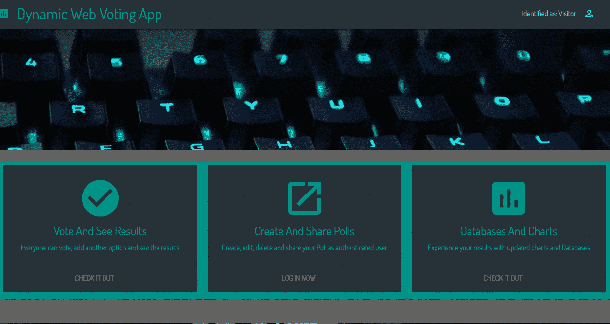

# 从我的第一个 JavaScript 全栈应用中得到的启示

> 原文:[https://dev . to/createdd/learnings-from-my-first-full-stack-app-in-JavaScript-38f](https://dev.to/createdd/learnings-from-my-first-full-stack-app-in-javascript-38f)

# 从我的第一个 JavaScript 全栈应用中得到的启示

 
雨果·索萨在 Unsplash 上的照片

FreeCodeCamp 课程将投票应用视为一项高级后端挑战。然而，我并不真正理解这个限定，因为所有的用户故事都指向一个全栈应用。以下是我在开发这个应用时的一些发现。这些对于走在同一条道路上的编码初学者来说尤其具有启发性。

[Github 回购可在此处获得…](https://github.com/DDCreationStudios/votingApp)

## ðÿ"„目录

*   [一点背景](#a-little-background)
*   [一些数据](#some-data)
    *   [数字](#numbers)
    *   [透视问题](#putting-it-into-perspective)
*   [一般和激励性的要点](#general-and-motivational-takeaways)
*   [代码初学者指南](#code-beginner-takeaways)
*   [链接](#links)

* * *

> ## "Tell me and I will forget. Teach me and I will remember. Let me participate and I will learn." -Ben Franklin

## 有点背景

在 FreeCodeCamp about 页面看到已实现的证书，我明白后端证书一定很难实现。

[T2】](https://res.cloudinary.com/practicaldev/image/fetch/s--SzMAqhVl--/c_limit%2Cf_auto%2Cfl_progressive%2Cq_auto%2Cw_880/v1/../assets/LEARNFIRST/cert.png)

简而言之，该课程(不久将更新)要求第一个高级后端挑战实际上是一个完整的应用程序。

我完全从零开始，所以这是一个真正的挑战。这就是为什么我也决定追踪和描述一些事情给其他学生，他们在这次挑战中遇到了和我一样的挫折。

## 一些数据

在描述我的主要学习之前，我想提供一些数据。

我用 [WakaTime](https://wakatime.com/i/cfaa854f-8e87-484b-9023-b8ba1d660e85) 收集数据，它可以很容易地集成到你的编辑器中，并跟踪你在回购上花费的时间。

不幸的是，我很晚才发现这一点，实际上是在 5 月份，这导致了一个非常落后的结果。

在 2016 年 12 月，我已经开始着手这个项目了。

[T2】](https://res.cloudinary.com/practicaldev/image/fetch/s--F5DtGN29--/c_limit%2Cf_auto%2Cfl_progressive%2Cq_auto%2Cw_880/v1/../assets/LEARNFIRST/gitContributors.png)

* * *

所以请记住，即使是我展示的数据也没有接近我真正的努力！

* * *

### 数字

[T2】](https://res.cloudinary.com/practicaldev/image/fetch/s--fDHo-FE6--/c_limit%2Cf_auto%2Cfl_progressive%2Cq_auto%2Cw_880/v1/../assets/LEARNFIRST/wakaVoting.png)

*   我在这个应用上花了大约 120 个小时。
*   大部分时间(13 个小时)都花在了创建 routes 文件上。基本上实现了 REST API。
*   第二名花了 12 个小时，是前端的 NewPoll.js 文件。这是因为在 React & Redux 生态系统中整合了一项新的民意调查，这使我排名第三。
*   花了 12 个小时在鸭子身上。ducks 文件包含了与 Redux 相关的大部分代码，即。行动创造者，行动者，减少者。不可变状态和异步动作花费了太多的时间来理解和正确实现。

[亲自查看 WakaTime 结果。](https://wakatime.com/@cfaa854f-8e87-484b-9023-b8ba1d660e85/projects/uleadaknfi?start=2016-11-01&end=2017-08-16)

同样，特别是对于感兴趣的初学者，我从 5 月到现在(8 月中旬)花在编码上的总时间是:

[T2】](https://res.cloudinary.com/practicaldev/image/fetch/s--XT7N3dBm--/c_limit%2Cf_auto%2Cfl_progressive%2Cq_auto%2Cw_880/v1/../assets/LEARNFIRST/wakaOverall.png)

*   在这段时间里，我花了大约 240 个小时编写代码
*   大部分是用 JavaScript 编写的
*   大部分使用 Visual Studio 代码
*   平均每天 2 小时

### 透视事物

记住这只是我努力的很小范围。

*   这是在 Github 上。
*   WakaTime 追踪得太晚了。
*   只是在编辑器中跟踪时间实际上编码。

仅从 Github Repo 就可以看出，我在这个应用程序上轻松花了 200 多个小时。在这里，你也必须考虑到，我在途中学到了很多，所以我实际上提高了很多，并且随着时间变得更快。

我也在做其他的教程和项目，边看视频边写文章，以便更好地理解概念。

## 一般和励志外卖

也许这对你来说听起来很多，也许对你来说听起来不多。没关系。这里的关键是看事情如何在发展领域量化。

在 4 个月内花费超过 250 小时的编码时间(外加兼职项目和工作中的代码),每月大约 60 小时，每周 15 小时。

所以，当你想开始这段旅程，看到人们在项目上花了几个月的时间，请记住这些数字。

看看在你不知道或不了解的领域取得进展需要什么。这些被低估的 15 小时相当于一份兼职工作。因此，如果你认为进步缓慢且不佳，要意识到这需要付出什么。

我不是天才，但也不笨。(至少根据:D 的一些测试)

看到一致性就是一切。你不能在一个周末做这样的项目。让自己意识到旅程有多长。意识到这很难，提醒自己要去哪里。不断！

## 初学代码外卖

稍微深入分析一下[应用](https://github.com/DDCreationStudios/votingApp)，你会发现它还没有完成。我自己也提出了问题，看到了许多需要改进的地方。

[T2】](https://camo.githubusercontent.com/2c9cfb5ddf6b658bc9502facbba7b5b083d9b0e7/687474703a2f2f672e7265636f726469742e636f2f31687a643849537a6e742e676966)

这是为什么呢？

对我来说，每个项目都有自己的重要收获。在这个项目中，它是前端和后端的连接，并在 React 中使用 Redux。为了保持对学习道路的关注，我强迫自己着手下一个应用程序。重复使用我所学的东西，并能从不同的角度看待新问题。

继续使用这个应用程序，并为它添加更多的特性、功能和测试将会花费很多时间，但会降低我的学习效果。它是开源的，随时可用。如果我想继续我的工作，我可以很容易做到。

## 链接

*   Github 上的存储库可从[这里](https://github.com/DDCreationStudios/votingApp)获得。
*   结果的现场版本可在[这里](https://ddcs-votingapp.herokuapp.com/)获得。
*   建造过程的文档[在这里](https://github.com/DDCreationStudios/Writing/blob/master/articles/VotingApp.md)。

感谢阅读我的文章！欢迎留下任何反馈！

* * *

### 非常非常感谢[江户里瓦](https://twitter.com/EdoRivai)，一路上他给了这个应用非常有价值的提示。:)

* * *