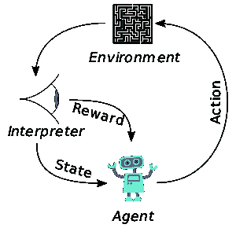
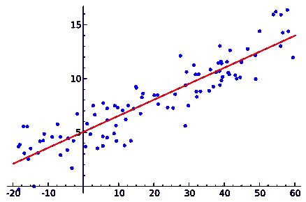
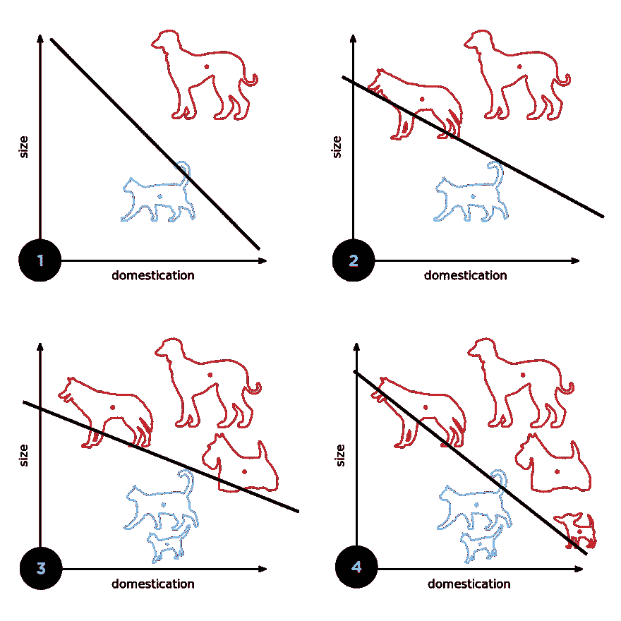
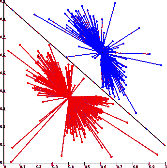
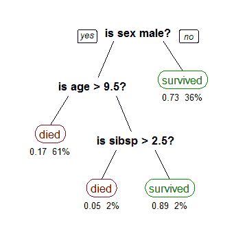
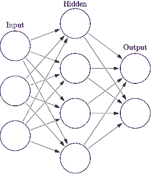
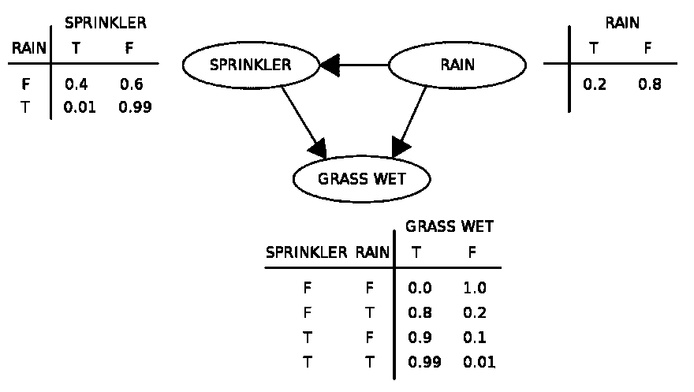
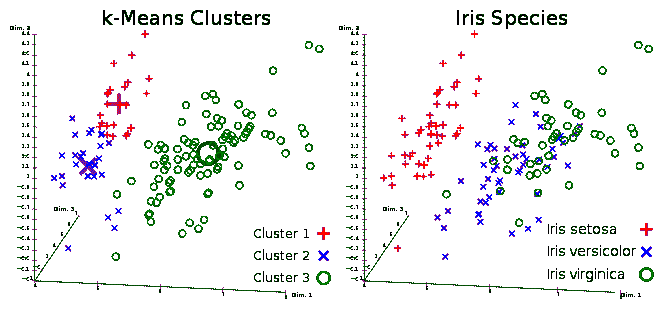
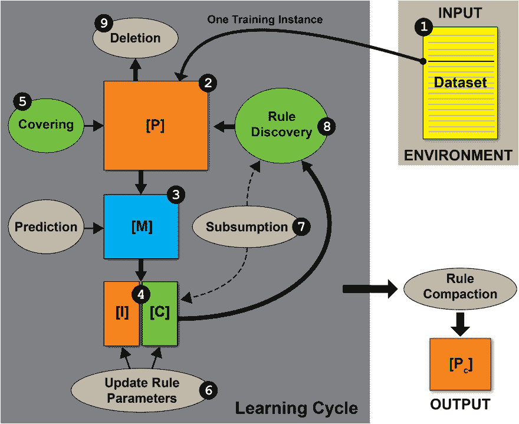

# 理解机器学习

> 原文:[https://dev.to/createdd/understanding-machine-learning-4j1](https://dev.to/createdd/understanding-machine-learning-4j1)

*Denys Nevozhai 摄于 [Unsplash](https://unsplash.com/photos/2vmT5_FeMck)*

这是机器学习的简要概述。它是什么，学习是什么，它最常见的概念是什么。这是进入主题的第一步。

* * *

> ## "A wise man can learn more from a stupid question than a fool can learn from a wise answer." -Bruce Lee

## 什么是机器学习(ML)

ML 发现数据中的模式，并用它们来预测未来。

学习需要:

*   识别模式
*   认识到这些模式

现在很容易找到模式。但是找到正确的模式并不容易。增加数据的大小允许预测越来越正确的结果。

| 数据 | 算法 | 模型 | 应用 |
| --- | --- | --- | --- |
| 包含模式 | 查找模式 | 识别模式 | 用于识别其他数据 |

[T2】](https://en.wikipedia.org/wiki/Reinforcement_learning#/media/File:Reinforcement_learning_diagram.svg)

由 [Megajuice](//commons.wikimedia.org/w/index.php?title=User:Megajuice&action=edit&redlink=1 "User:Megajuice (page does not exist)") - 自有作品， [CC0](http://creativecommons.org/publicdomain/zero/1.0/deed.en "Creative Commons Zero, Public Domain Dedication") ，[环节](https://commons.wikimedia.org/w/index.php?curid=57895741)

用于 ML 的常见编程语言有:

*   稀有
*   计算机编程语言

## 学习过程

#### 1。问问题

*   问什么问题
*   哪些数据有助于你回答这个问题
*   你如何衡量成功

#### 2。重复

*   反复选择和准备您的数据，使其可用于算法
*   对数据应用算法，一遍又一遍地创建模型，以增加你的成功率
*   向不同的数据展示和测试成功的模型

## ML 概念

*   监督学习(您想要预测的值已经在数据中)
*   无监督学习(您想要预测的值不在数据中)

#### 用监督学习进行数据预处理

原始数据必须通过删除不必要的项目(如重复、错误/虚假信息、无用信息)转换为训练数据。

训练数据包含代表重要分类的特征和代表模型所需信息的目标值。

#### 问题

|  | 回归 | 分类 | 使聚集 |
| --- | --- | --- | --- |
| *目标* | 试图找到符合数据的直线或曲线 | 尝试将数据分组到类中 | 试图识别数据片段 |
| *例子* | [T2】](https://en.wikipedia.org/wiki/Regression_analysis#/media/File:Linear_regression.svg) | [T2】](https://en.wikipedia.org/wiki/Perceptron#/media/File:Perceptron_example.svg) | [T2】](https://en.wikipedia.org/wiki/Cluster_analysis#/media/File:KMeans-density-data.svg) |
| *图像信用* | 由 [Sewaqu](//commons.wikimedia.org/w/index.php?title=User:Sewaqu&action=edit&redlink=1 "User:Sewaqu (page does not exist)") - 自有作品，公共领域，[链接](https://commons.wikimedia.org/w/index.php?curid=11967659) | 由[伊丽莎白古斯比](//commons.wikimedia.org/w/index.php?title=User:Elizabeth_goodspeed&action=edit&redlink=1 "User:Elizabeth goodspeed (page does not exist)") - 自有作品， [CC BY-SA 4.0](http://creativecommons.org/licenses/by-sa/4.0 "Creative Commons Attribution-Share Alike 4.0") ，[链接](https://commons.wikimedia.org/w/index.php?curid=40188333) | 由 [Chire](//commons.wikimedia.org/wiki/User:Chire "User:Chire") - 自有作品， [CC BY-SA 3.0](http://creativecommons.org/licenses/by-sa/3.0 "Creative Commons Attribution-Share Alike 3.0") ，[链接](https://commons.wikimedia.org/w/index.php?curid=17085333) |

#### 算法

常见的样式有:

*   决策树(基于数据中属性的实际值构建模型)

[T2】](https://commons.wikimedia.org/w/index.php?curid=14143467)

由[斯蒂芬·米尔博罗](//commons.wikimedia.org/w/index.php?title=User:Stephen_Milborrow&action=edit&redlink=1 "User:Stephen Milborrow (page does not exist)") - 自己的作品， [CC BY-SA 3.0](http://creativecommons.org/licenses/by-sa/3.0 "Creative Commons Attribution-Share Alike 3.0") ，[链接](https://commons.wikimedia.org/w/index.php?curid=14143467)

*   神经网络(基于训练数据内结果的重组和重新评估构建模型) 

由 [Glosser.ca](//commons.wikimedia.org/wiki/User_talk:Glosser.ca "User talk:Glosser.ca") - 自己的作品，[的衍生文件:人工神经网络. svg](//commons.wikimedia.org/wiki/File:Artificial_neural_network.svg "File:Artificial neural network.svg") ， [CC BY-SA 3.0](http://creativecommons.org/licenses/by-sa/3.0 "Creative Commons Attribution-Share Alike 3.0") ，[链接](https://commons.wikimedia.org/w/index.php?curid=24913461)

*   贝叶斯(根据概率分类器的过滤器)

[T2】](https://en.wikipedia.org/wiki/Bayesian_network#/media/File:SimpleBayesNet.svg)

由 [AnAj](https://en.wikipedia.org/wiki/User:AnAj "en:User:AnAj") - 自有作品 ( 原文:自制)、公共领域、[链接](https://commons.wikimedia.org/w/index.php?curid=19734596)

*   K-means(基于对第 *k* 个最接近的训练样本的矢量量化来构建模型)

[T2】](https://en.wikipedia.org/wiki/K-means_clustering#/media/File:Iris_Flowers_Clustering_kMeans.svg)

由 [Chire](//commons.wikimedia.org/wiki/User:Chire "User:Chire") - 自有作品，公共领域，[链接](https://commons.wikimedia.org/w/index.php?curid=11711077)

(鸢尾花数据集，使用 k 均值(左)和数据集中的真实物种(右)进行聚类。请注意，k-means 是非确定性的，因此结果会有所不同。使用较大的半透明标记来可视化聚类均值。可视化是使用 ELKI 生成的。)

#### 训练模型

1.  寻找与识别目标值相关的特征
2.  将大部分特征数据放入算法中
3.  生成模型
4.  通过将目标值与实际数据中的值进行比较，使用特征数据的剩余百分比来测试模型
5.  如果模型不准确，请更改特征、更改算法或更改数据

By[Docurbs](//commons.wikimedia.org/w/index.php?title=User:Docurbs&action=edit&redlink=1 "User:Docurbs (page does not exist)")-自有作品， [CC BY-SA 4.0](http://creativecommons.org/licenses/by-sa/4.0 "Creative Commons Attribution-Share Alike 4.0") ，[链接](https://commons.wikimedia.org/w/index.php?curid=52379695)

* * *

感谢阅读我的文章！欢迎留下任何反馈！