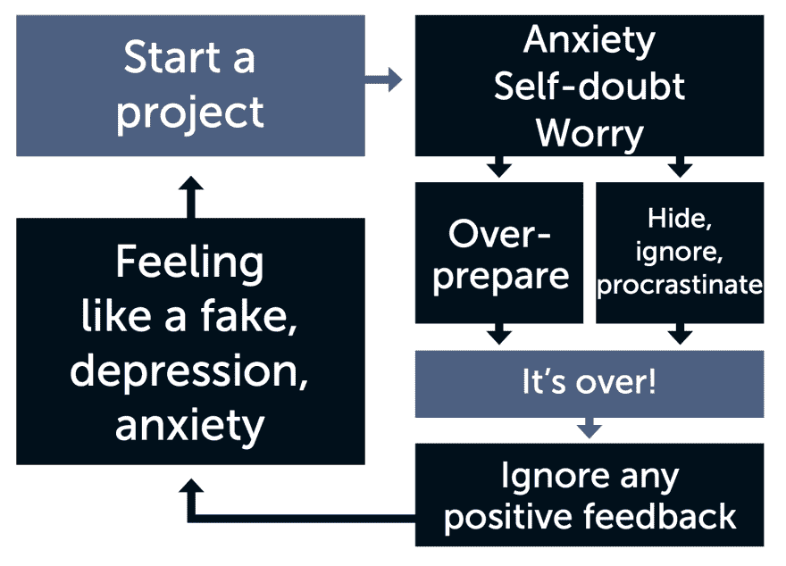
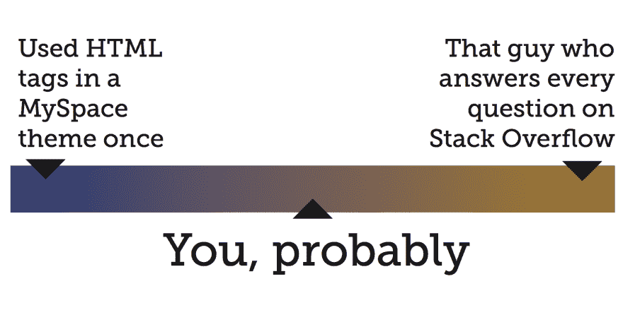

# 克服冒名顶替综合症

> 原文:[https://dev . to/kathryngrayson/overriding-impostor-syndrome-APG](https://dev.to/kathryngrayson/overcoming-impostor-syndrome-apg)

***简要说明:**本文改编自我在 2017 年 LitmusLive 波士顿、伦敦和三藩市会议上的主题演讲。改变这样的媒介可能有点笨拙(老实说，它最终更像是一篇长篇文章，而不是一篇博客文章)，但我想找到一种方法来保存我认为/希望有价值的内容。如果你有兴趣观看现场视频，以及所有三场 LitmusLive 会议的其他精彩演讲者，他们可以在[这里](https://gumroad.com/litmus)T5】购买*

2016 年，我有机会在 [LitmusLive Boston](https://litmus.com/conference) 上做演讲，在那里我谈到了在受监管的行业中编写电子邮件的挑战。但是，尽管我在会议上度过了绝对*美妙的*时光，总的来说...我不能说我对自己的演讲有如此积极的感受。这是我第一次在一大群人面前发言，我非常确定每个人都会因为我的年龄而立即解雇我——谁是这个千禧一代，站在舞台上，试图告诉我们如何做我们的工作？我能知道什么对这些人有价值？我没有计算机科学学位，那么我为什么要谈论甚至*模糊地*与开发有关的事情呢？我想知道我是否应该包括一个现场演示或什么的，以证明我知道我在做什么。当我走上舞台时，所有这些想法在我脑海中快速闪过，我也快速完成了我的演讲——整整少了 10 分钟。

几周后，当会议团队发布演示视频时，我一遍又一遍地看着自己的视频——从我说话和走路的方式，到我做了多少手势，以及那天我是如何梳头发的，这些都让我自责不已。感觉都不够好。我希望我能回到过去，再试一次，修正我所有愚蠢的错误。即使我的朋友和同事明确问我他们是否可以看我的视频，我也不能让自己给任何人看。我觉得，如果他们看了，会破坏在会议上真正发言的成就——就像他们会看到，可怕的事实会被揭露:“啊，她确实做了演讲，但她做得太差了，所以不算数。

这就是冒名顶替综合症的本质。这是你脑中不断唠叨的声音，告诉你你没有资格做你正在做的事情。它是绝对确信，即使在你做了之后，你的成功仅仅是由于运气、巧合或外界的帮助。

Pauline Clance 和 Suzanne Imes 博士在他们 1978 年关于*心理治疗理论、研究和实践的论文中首次给它起了一个名字——最初是“冒名顶替现象”。*它最初被定义为“表现出色但内心焦虑的女性，尽管这个定义后来被扩大了，我们知道任何人都可能为此而挣扎。他们还定义了视点替用特效循环中的这些阶段，这些阶段(如果你和我一样的话)可能看起来很熟悉。

[T2】](https://res.cloudinary.com/practicaldev/image/fetch/s--2Mtvhvro--/c_limit%2Cf_auto%2Cfl_progressive%2Cq_auto%2Cw_880/https://thepracticaldev.s3.amazonaws.com/i/enia7bvowovuwosn805w.png)

当我们开始一个新项目时，这个循环就开始了，随之而来的是焦虑、自我怀疑和担忧:“我为什么要开始这个？我做不到。我不知道该怎么做！我们倾向于以两种主要方式来应对这种情况:我们要么全力以赴，做好充分准备(加班加点，为自己制定严格/雄心勃勃的时间表)，要么**完全否认存在问题(拖延和忽视问题，希望它神奇地消失)。不管怎样，这个项目不可避免地会结束。当这种情况发生时，我们会忽略任何可能收到的积极反馈，而是选择只关注消极的一面*，真正地沉湎于此。这膨胀成无能、沮丧的普遍感觉，感觉自己像个骗子...直到下一个项目开始。因此，它又开始了，随着每一个周期而扩大，成为一个越来越难摆脱的习惯。我们经历的循环越多，这些步骤就越深植于我们的脑海中。没过多久，“我做不到这一点”就成了新项目分配时的自动反应。***

 *我在开发社区中参与得越多，就越觉得这是一个与我们所有人都密切相关的话题。老实说，我认为不难看出为什么我们的行业特别容易患上冒名顶替综合症:我们工作的领域一直在进化和变化。五年前的标准现在已经过时了。五年后，我们今天认为是“行业未来”的东西将被证明只是一种时尚。在我们的职业生涯中，框架、库、操作系统、设备和整个编码语言都会来来去去。更不用说，我们工作的领域似乎几乎不可能向这个领域之外的人解释。所有这些都影响着我们每天的士气，影响着我们几年来的疲惫感，而且绝对是我们产生“冒名顶替综合症”的因素。

我认为，很多时候，我们也因为低估了自己而加剧了这个问题——因为我们头脑中有一个完美的开发人员应该是什么样子的愿景。他们会立即成为每门语言的专家，总是站在最前沿，使用所有最新、最酷的框架，并回答每个关于堆栈溢出的未解决问题。不知何故，他们能够做到这一切，而不必谷歌一点代码或向任何人寻求帮助。所以，当我们与那个*不可能的*基准进行比较时，我们当然会失败——我们想象的那个人完全不现实。想知道真相吗？**我们都只是凭着自己的感觉飞行一点点，边走边编东西。我保证，我们都会用谷歌搜索。**

[T2】](https://res.cloudinary.com/practicaldev/image/fetch/s--MRofJxBJ--/c_limit%2Cf_auto%2Cfl_progressive%2Cq_auto%2Cw_880/https://thepracticaldev.s3.amazonaws.com/i/l7gueie3jd99ka0xgbry.png)

在尼尔·盖曼艺术大学著名的 [Make Good Art](https://www.uarts.edu/neil-gaiman-keynote-address-2012) 毕业典礼演讲中，他非常公开和坦率地讲述了他处理冒名顶替综合症的经历——当你想到尼尔·盖曼是一位多么有成就和才华的作家时，我一直认为这是一件令人惊讶的事情。整件事很值得一听，但我最喜欢的一句话是这样的:

“我走进了这个世界，我编码，我编码的越多，我就成为了一个更好的编码者，我编码的越多，似乎没有人会介意我是边走边编的，他们只是看到我编码的东西就付钱，或者他们不付钱，他们经常委托我为他们编码其他东西。”

...好吧，我可能对这句话做了一些改动:著名作家尼尔·盖曼说过“写代码，而不是”代码。但是，它不是完全适用的吗？我不知道你怎么想，但我非常熟悉这种感觉，我只是坐在我的键盘前，“假装”直到我成功。这让我不禁要问:**你什么时候能“成功”？什么算是“成功了？”你在高中建立的第一个网站算吗？那些没有响应的网站呢——这些算吗？或者你上周写的技术上可行的 JavaScript 怎么样...但是你还是不确定怎么做或者为什么？**

好了，我的朋友们:好消息是:一切都很重要。

每一件事。**你编写的第一个东西是让你成为开发人员的东西，**从那以后，每一个东西都让你成为更好、更快、更有知识的开发人员。我们中的很多人都是从其他领域转行到这里的:设计，UX，或者任何背景。即使我们这些有正式学位的人还在适应，还在试错学校学习。我们都在一起——向旁边的 dev 伸出手，拉起它们。分享知识和经验；提示和技巧；抱怨和成功。

所有这些，因为我们仍然处于创造和塑造互联网的过程中，正如我们所知。1991 年 8 月 6 日，万维网首次对公众开放——今年已经 26 岁了*(和我同龄！)*。老实说，在一个 26 年前根本不存在*并且从那以后一刻也没有停止变化的领域里，一个人能有多专业？去年，在一次单独的活动中，有人指出[我们仍然处于网络的第一个 10000 天](https://twitter.com/zeldman/status/757716050976931845)...真的，这是这份工作最酷的部分。我们来到了这里，在网络形成的日子里。**我们要创造这个！我们每天都在塑造这个行业的未来，对于一个网站开发者来说，这是一个惊人的特权，也是一个不可思议的时刻。***

[T2】](https://res.cloudinary.com/practicaldev/image/fetch/s--hLdjDPJ5--/c_limit%2Cf_auto%2Cfl_progressive%2Cq_auto%2Cw_880/https://thepracticaldev.s3.amazonaws.com/i/85umi5km9obygv12f6l8.png)

事实是，我们中的大多数人都将处于从完全新手到完全专家的中间位置...**没关系。事实上，就应该是这样。无论如何，在一个你已经无所不知的领域工作不会很无聊吗？挑战的乐趣不就在于解决问题和发现新的解决方案吗？我们都在不同的年龄进入这个光谱，不同的背景和不同的生活经历塑造了我们，也塑造了我们的工作。这让我们的工作变得更好——更有趣、更多样化。对我们来说，尊重我们在职业生涯中所处的位置，并把这些事情当作优势，而不是(就像我们经常做的那样)把它们当作弱点来阻碍自己，这是非常重要的。**

因为，这真的是冒名顶替综合症最糟糕的部分——不仅仅是它让我们感觉如何，也是它如何阻碍我们。是你脑中的声音阻止了你写那篇你一直在思考的博客文章。它把你从当地开发小组的志愿者指导机会中拉了回来，因为你有什么知识可以分享？它阻止了你申请在即将到来的会议上发言，因为你有什么贡献，无论如何，对不对？

**错了。它在骗你。你是合格的。**你有值得分享的独特经历，你应该向前一步，占据空间，让这里知道你的存在。你是这个社区的一部分，你在这里就是在为未来的发展做贡献；只要每天出现做好你的工作。

所以，这就是关于冒名顶替综合症的事情——它的力量来自于你的孤立。因为，如果你不和其他人谈论你的经历和挣扎，你怎么会认为其他人可能和你有同样的感受呢？需要一点点脆弱——一点点勇气——去承认有时我们感觉不到拥有一切。这感觉像是一场赌博，就像信任度的下降。如果我们真的鼓起勇气，走近我们的同事，说“嘿，我真的有点麻烦。但是我们从他们那里得到的是类似“什么？我不知道你在说什么。我从来没有像*那样*的感觉。真的*任何时候*我们都必须变得脆弱，恐惧存在于他人不理解或无法识别的风险中。所以我们不谈论它，因为我们不能冒险让那些最糟糕的恐惧被证实，并被暴露为冒名顶替者——与众不同的人。我们低下头，闭上嘴，这就是为什么这个循环会继续，不会中断。

然而，我可以绝对地，100% *保证*你不是那个与众不同的人。你并不孤单。在过去的几个月里，在准备这篇文章所基于的演示文稿并进行多次演示的过程中，我有了一个绝佳的机会与来自世界各地的技术界人士谈论冒名顶替综合症。我之前在 dev.to 网站的[上发表了一篇帖子，在帖子中，我请人们分享他们患有冒名顶替综合症的经历——反响绝对热烈。评论中充满了这些故事，这些真实的自我感觉不足的坦白:不够年轻，或者不够老。不够快，不够流行，不够聪明。**不够好。我真的鼓励你通读所有这些评论，因为每一条都绝对值得一读。当你阅读它们的时候，我真心希望它们能引起你的共鸣，并让你相信绝对不只是你有这种感觉。**](https://dev.to/kathryngrayson/share-your-experiences-with-impostor-syndrome)

打破冒名顶替综合症循环的关键是进行越来越多这样的对话——直呼冒名顶替综合症的名字并谈论它。因为能够在我们自己的生活中看到冒名顶替综合症，识别它，并*命名*这是克服它的最重要的部分。这给了我们谈论它所需的工具。这个问题很大程度上是基于这样一种假设，即你是唯一一个经历这种情况的人，但知道它如此普遍以至于我们给它命名真的有助于正确看待事情——如果每个人都是骗子，那么没有人是骗子！

但是，即使知道它是什么，仍然很难打破我们多年来在经历这种循环时建立的思维模式。这里有一些日常的小窍门，你可以试着帮你重新构建思维模式，改变你的心态:

*   记下你的成就和人们说过的积极的事情。你不必把它钉在你的小隔间或其他什么地方，但也许可以把它记在你的手机上或笔记本的第一页，这样你就可以时不时地偷看它，并随时提醒自己工作出色

*   远离社交媒体。我们都知道社交媒体是其他人生活的亮点，但即使知道这一点，还是很难不去比较。请记住，你看到的只是他们生活中希望你看到的部分——每个人都会犯错、失败，不得不重新振作起来再试一次，但他们不会经常在脸书上发布这些时刻。当你发现自己在玩比较游戏时，这可能是一个信号，表明是时候后退一点了。

*   拥有自己的成就。当有人说“干得好”时，拥抱它！不要用“哦，这没什么”或“没有帮助我不可能做到”来贬低它。练习亲切地接受——说“谢谢你，我为此非常努力，我对结果非常满意。我也很高兴你喜欢它。然后可能将其添加到上述列表中。

*   **找个导师，或者自己成为导师。如果你愿意，你可以同时做这两件事，这两件事都有助于克服冒名顶替综合症。有一个可以诚实客观地评估你的技能组合，并帮助你填补任何知识空白的导师，会让你在工作中更加自信。而成为一名导师会强化你已经知道的东西。如果你的学员问你一个你还不知道答案的问题——嗯，人们常说最好的学习方法是教。**

*   **参加[这个测验](http://amiarealdeveloper.com/)。我不想让你扫兴，但是...你是一个真正的开发者。**

*   最后，也是迄今为止最重要的一点:**把自己推向新的环境，即使你并不觉得自己 100%合格。接受具有挑战性的项目，即使你并不完全确定自己能做到。不要害怕接受新事物，挑战自己的极限——这是变得更好的唯一途径！第一次可能不完美，但没关系。你可能会做得比你想象的更好，如果你最终陷入困境，问问题或寻求帮助也没什么不好意思的。**

当我们摆脱那种不舒服的感觉，强迫自己进入新的未知领域时，美好的事情就会发生。通过不断地告诉自己我们不应该或不能，我们没有给任何人带来任何好处——不是我们自己，当然也不是整个行业。参与进来。建立联系。分享经验，让自己沉浸在这个社区中，因为它为你而存在！让自己克服冒名顶替综合症并不容易，但我可以保证，在另一边，有一个绝对令人惊叹的支持系统...就等你了。*