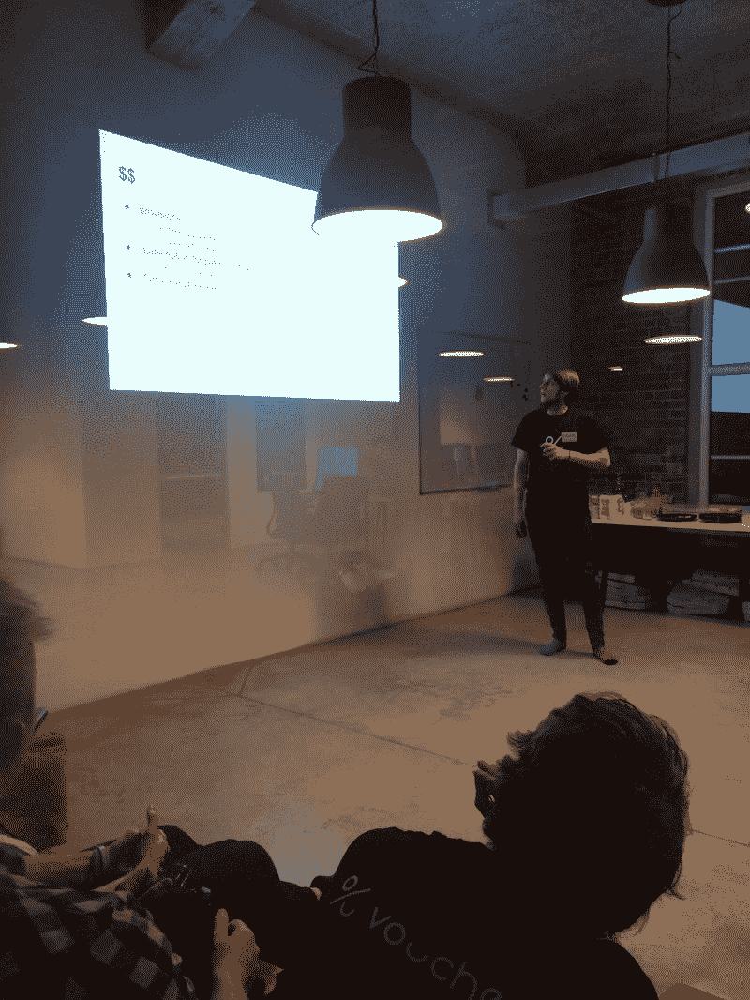
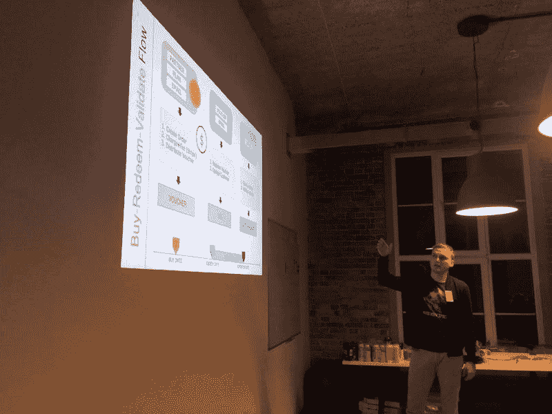
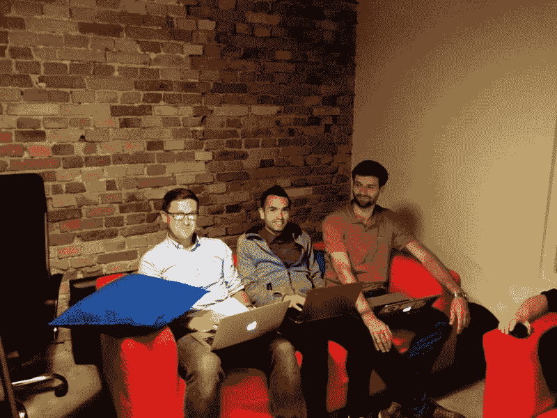

# 我们第一次黑客马拉松的收获

> 原文:[https://dev . to/msedzielewski/take ways-from the first-hackathon-361](https://dev.to/msedzielewski/takeaways-from-our-first-hackathon-361)

自从庆祝黑客之夜已经过去 4 周了。是时候回顾比赛并分享我们的感受了。在这份备忘录中，我们想总结一下最让我们惊讶的是什么，以及为什么为您的产品举办这样的活动是有意义的。

### 期望

这是我们的第一次黑客马拉松，一开始，我们真的不知道会发生什么。最初，我们只是想看看新开发人员如何使用我们的 API。构建一个 API 优先的产品需要最大限度地关注优秀的开发人员体验和流畅的入职流程，因此我们计划只观察开发人员如何与我们的:

*   [文档](https://docs.voucherify.io/?utm_campaign=tech&utm_medium=Link&utm_source=devto)
*   [例题](https://docs.voucherify.io/docs/examples?utm_campaign=tech&utm_medium=Link&utm_source=devto)
*   [帮助中心](http://support.voucherify.io/?utm_campaign=tech&utm_medium=Link&utm_source=devto)
*   [当然还有产品本身](https://voucherify.io/?utm_campaign=tech&utm_medium=Link&utm_source=devto)

但黑客之夜还有第二个面向商业的角度。作为一个独立的应用程序，Voucherify 不会像作为更大的营销自动化景观的一部分那样给你带来更多的价值。当你[将【Voucherify 与其他工具集成在一起时，它就会显示出它的威力。我们创造的事物，例如:](https://www.voucherify.io/integrations)

*   [十几个 SDK](https://docs.voucherify.io/docs/sdks?utm_campaign=tech&utm_medium=Link&utm_source=devto)
*   [扎皮尔整合](https://zapier.com/developer/invite/62387/cdcdf9275d825dff01c4da836b4c445f/)
*   [邮递员集合](https://app.getpostman.com/run-collection/9b17c94efccb5776be35#?env%5Btest%5D=W3siZW5hYmxlZCI6dHJ1ZSwia2V5IjoidXJsIiwidmFsdWUiOiJodHRwczovL2FwaS52b3VjaGVyaWZ5LmlvL3YxIiwidHlwZSI6InRleHQifSx7ImVuYWJsZWQiOnRydWUsImtleSI6IlgtQXBwLUlkIiwidmFsdWUiOiJjNzBhNmYwMC1jZjkxLTQ3NTYtOWRmNS00NzYyODg1MDAwMmIiLCJ0eXBlIjoidGV4dCJ9LHsiZW5hYmxlZCI6dHJ1ZSwia2V5IjoiWC1BcHAtVG9rZW4iLCJ2YWx1ZSI6IjMyNjZiOWY4LWUyNDYtNGY3OS1iZGYwLTgzMzkyOWIxMzgwYyIsInR5cGUiOiJ0ZXh0In0seyJlbmFibGVkIjp0cnVlLCJrZXkiOiJDbGllbnQtQXBwLUlkIiwidmFsdWUiOiIwMTEyNDBiZi1kNWZjLTRlZjEtOWU4Mi0xMWViNjhjNDNiZjUiLCJ0eXBlIjoidGV4dCJ9LHsiZW5hYmxlZCI6dHJ1ZSwia2V5IjoiQ2xpZW50LUFwcC1Ub2tlbiIsInZhbHVlIjoiOWUyMjMwYzUtNzFmYi00NjBhLTkxYzYtZmJlZTY0NzA3YTIwIiwidHlwZSI6InRleHQifV0=)
*   [和 REST API 本身](https://docs.voucherify.io/reference)

只有一个目标——让与其他电子商务/SaaS 工具的集成像 1–2–3 一样简单。支持 Voucherify 的插件/连接器/应用越多，我们的平台就越有价值。因此，我们非常好奇，想知道在他们结束之前，会有哪些值得关注的整合出现在桌面上。

我们得到了这些问题的答案，但我们还得到更多！但是让我们从前两个开始。

*工作进行中*

### 开发人员 API 入职

对于一个产品团队来说，有超过 30 个来自不同领域的用户在你的办公室里与你的产品互动是一个无价的机会。尤其是如果产品是一个 API 平台，用户是开发者。我们想抓住这个机会，并且一直在监视他们。我们特别感兴趣的是:

*   他们使用了什么 SDK(什么语言最流行)
*   调用第一个请求需要多长时间
*   他们觉得哪些教程和例子有用/没用
*   API 参考是最新的吗
*   等等

总体接待情况很好或很好。一般来说，开发人员很快就知道如何使用我们的 API。值得强调的是，他们发现我们的[邮差合集](https://app.getpostman.com/run-collection/9b17c94efccb5776be35#?env%5Btest%5D=W3siZW5hYmxlZCI6dHJ1ZSwia2V5IjoidXJsIiwidmFsdWUiOiJodHRwczovL2FwaS52b3VjaGVyaWZ5LmlvL3YxIiwidHlwZSI6InRleHQifSx7ImVuYWJsZWQiOnRydWUsImtleSI6IlgtQXBwLUlkIiwidmFsdWUiOiJjNzBhNmYwMC1jZjkxLTQ3NTYtOWRmNS00NzYyODg1MDAwMmIiLCJ0eXBlIjoidGV4dCJ9LHsiZW5hYmxlZCI6dHJ1ZSwia2V5IjoiWC1BcHAtVG9rZW4iLCJ2YWx1ZSI6IjMyNjZiOWY4LWUyNDYtNGY3OS1iZGYwLTgzMzkyOWIxMzgwYyIsInR5cGUiOiJ0ZXh0In0seyJlbmFibGVkIjp0cnVlLCJrZXkiOiJDbGllbnQtQXBwLUlkIiwidmFsdWUiOiIwMTEyNDBiZi1kNWZjLTRlZjEtOWU4Mi0xMWViNjhjNDNiZjUiLCJ0eXBlIjoidGV4dCJ9LHsiZW5hYmxlZCI6dHJ1ZSwia2V5IjoiQ2xpZW50LUFwcC1Ub2tlbiIsInZhbHVlIjoiOWUyMjMwYzUtNzFmYi00NjBhLTkxYzYtZmJlZTY0NzA3YTIwIiwidHlwZSI6InRleHQifV0=)特别有用。在[故障](https://glitch.com/edit/#!/voucherify-cart)中的互动例子也很有帮助。

但是我们也注意到了一些改进。规范中的一些地方已经过时，SDK 没有覆盖 API 的所有相关端点。幸运的是，我们的 SDK 是[开源的](https://docs.voucherify.io/docs/sdks),所以开发人员能够很快为我们指出正确的方向，我们也实时修复了盲点。

*黑夜的标准*

推介环节非常激动人心。这些想法虽然功能有限，但非常鼓舞人心，非常有思想。获胜的团队设法让陪审团相信他们运送了一些有形的东西，并且有可能会带来金钱。我们得到了一些关于与 Voucherify 快速集成的积极反馈，但是我们从来没有想到您可以在 12 小时内构建一个工作应用程序！以下是陪审团最喜欢的一些项目。

### 集成

**1。Face2 —通过脸书营销 API 分发优惠券**

*[@tarnas14](https://twitter.com/tarnas14) 名正言顺的解决*

第一个团队能够通过脸书的广告发起基于优惠券的促销活动。这使得营销人员可以将专门的、预先生成的促销登录页面链接到特定的横幅广告。这些页面将显示并分配给每个 FB 用户一个唯一的优惠券代码。

**2。基于情感的团购**

*幸福检测*

这款手机应用通过摄像头识别用户的情绪，然后根据检测到的情绪调整优惠券交易。简单却危险地吸引人。

**3。独家——通过带条纹支付网关的密码出售服务访问权**

*详细推介—商业模式*

黑客之夜最实际但最实用的解决方案。这段代码自动化了小型零售商的大量工作。有了 Exclusiv，付款注册后，访问码会通过短信或电子邮件自动发送。完全不需要手工操作。

### 附加值

但是这个事件带给我们的超出了我们的预期:

*   **平台反馈** —除了对 docs 和 SDK 的小改进和修复，我们对如何改进我们的 UI 或公开哪些新端点有了更深入的了解。因为我们就在他们旁边，我们可以立刻深入这些新概念。
*   雇佣——花 12 个小时观看开发人员编写代码是一个机会，可以发现一个人才，并亲眼看看他或她能做些什么
*   团队凝聚力——整个团队在聚会之前、之中和之后都玩得很开心(当我们在隔壁俱乐部跳舞的时候)。组织和执行黑客马拉松是一个很好的机会，可以摆脱常规工作，结识新的、鼓舞人心的人。
*   **支持合作伙伴** —事实证明，许多开发工具公司很乐意免费支持此类活动。我们从像 [Salesforce](http://developer.salesforce.com/) 、 [Contentful](https://www.contentful.com/) 、 [SendGrid](https://sendgrid.com/) 、 [Brand24](http://brand24.com/) 、 [AWS](http://aws.amazon.com/) 、 [Intercom](http://intercom.com/) 、 [twilio](http://twilio.com/) 这样的伟大产品那里收到了精美的赠品包，甚至是他们服务的年度订阅。

*聚光灯下的赢家*

### 吸取教训

我们也得出了一些关于改进的结论。例如，我们设计挑战的方式过于复杂，这使得参与者对报名犹豫不决。

首先，我们只号召高级开发者，结果他们对黑客马拉松不再那么高兴了。其次，我们严格围绕我们的领域——电子商务工具进行竞争。有很多开发者不每天玩电子商务 SaaS 和 API，所以这是另一个减少出席人数的因素。第三，我们要求参与者在注册过程中提交一份表格。我们想预先筛选他们，只选择最好的。最后，我们注意到这些表格的质量和内容并没有转化为最终解决方案的质量和内容。因此，下一次黑客马拉松的教训是彻底抛弃它们。

总的来说，我们得出的结论是，下一次黑客马拉松应该从一开始就更加有趣。

*无情的法官*

那么我们是不是要宣布另一个招募黑客的号召呢？肯定的，但这次我们也会确保它没有任何人为的阻挡，很容易掌握规则，最后都是为了好玩放在首位！

[T2】](https://res.cloudinary.com/practicaldev/image/fetch/s--NpZ8HEGw--/c_limit%2Cf_auto%2Cfl_progressive%2Cq_auto%2Cw_880/https://cdn-images-1.medium.com/max/800/0%2ARpnUYSMUUuES8b7B.jpeg)

* * *

*最初发表于
[www . voucherify . io](https://www.voucherify.io/blog/2017/9/29/takeaways-from-our-first-hackathon?utm_campaign=tech&utm_medium=Link&utm_source=devto)*