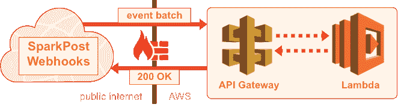
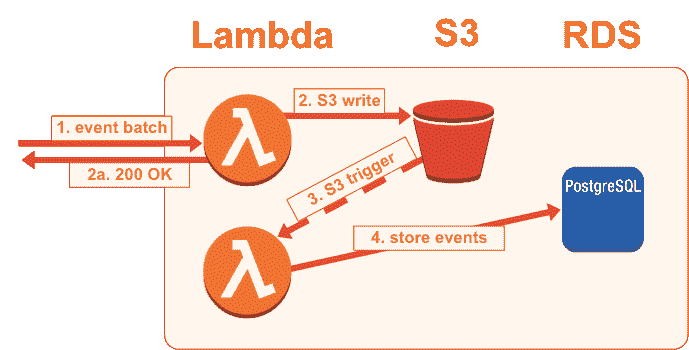

# 根据您的条件发送电子邮件事件:Webhooks、数据库、AWS 等等！

> 原文:[https://dev . to/sparkpost/email-events-on-your-terms-web hooks-databases-AWS-and-more-29l](https://dev.to/sparkpost/email-events-on-your-terms-webhooks-databases-aws-and-more-29l)

Webhooks 如何变得更容易，并且搜索事件数据(也就是消息事件)可能更好？我们将在本帖中尝试回答这个问题，并在此过程中开源一些代码。

[T2】](https://res.cloudinary.com/practicaldev/image/fetch/s--fsuzC8dE--/c_limit%2Cf_auto%2Cfl_progressive%2Cq_auto%2Cw_880/https://media.sparkpost.com/uploads/2017/09/event-data-captioned-web.png)

喊着“给我看数据！会让你在大多数人眼里变得有趣，但在我们 SparkPost 这里不会。我们都是关于数据的，对内[我们决定构建什么](https://www.sparkpost.com/blog/better-onboarding-experience/)，对外我们通过 [Webhooks](https://www.sparkpost.com/blog/webhooks-beyond-the-basics/) 或[消息事件](https://www.sparkpost.com/blog/sparkpost-message-events-api/)向你传递事件数据。

[T2】](https://res.cloudinary.com/practicaldev/image/fetch/s--af_MRPm9--/c_limit%2Cf_auto%2Cfl_progressive%2Cq_auto%2Cw_880/https://media.sparkpost.com/uploads/2017/09/show-me-the-data-captioned-web.png)

汤姆·克鲁斯可能真的想看到钱，但对我们的客户来说，数据才是王道。他们中的许多人大量使用我们的 Webhooks (push model)通过 HTTP POST 接收批量事件数据。其他人更喜欢使用我们的[消息事件](https://developers.sparkpost.com/api/message-events.html)端点，这是一个拉模型——在撰写本文时，您正在查询相同的事件，尽管数据保留期限为 10 天。

我不知道你是怎么想的，但是每当我听到某件事受到限制时，我想做的第一件事就是找到绕过这种限制的方法。第二件事是向其他人展示我是如何做到的。在这篇文章中，我将向您展示如何通过滚动您自己的低成本可查询事件数据库来绕过我们的消息事件数据保留限制。

### 构建服务的模块

这里的愿景是接收 SparkPost 的 Webhooks 提供的批量事件数据，然后能够查询这些数据，最好是免费的。至少便宜。幸运的是，有[发布的最佳实践](https://www.sparkpost.com/docs/tech-resources/webhook-data-streams/)来做第一部分。降低成本的一个方法(至少在最初)是使用 [AWS 免费层，](https://aws.amazon.com/free/)，这是我们在这篇文章中要走的路。

[T2】](https://res.cloudinary.com/practicaldev/image/fetch/s--CvU7aHNz--/c_limit%2Cf_auto%2Cfl_progressive%2Cq_auto%2Cw_880/https://media.sparkpost.com/uploads/2017/09/i-cant-believe-you-like-free-stuff-too-web.png)

首先，我将介绍一下我最终使用的服务，然后简单讨论一下我还尝试了哪些服务，以及为什么没有成功。这个系统中的几乎所有东西都是使用 CloudFormation 定义和部署的[，以及来自](https://github.com/SparkPost/event-data/blob/master/event-data.yaml) [AWS 无服务器应用模型](https://aws.amazon.com/blogs/compute/introducing-simplified-serverless-application-deplyoment-and-management/) (SAM)的部分。实际上，它使用 API Gateway 作为 HTTP 侦听器，Node.js Lambda 函数“在收到请求或响应其他有趣事件时做一些事情”。稍后会详细介绍。

[T2】](https://res.cloudinary.com/practicaldev/image/fetch/s--ubXIaNaT--/c_limit%2Cf_auto%2Cfl_progressive%2Cq_auto%2Cw_880/https://media.sparkpost.com/uploads/2017/09/webhooks-apig-lambda.png)

根据上面链接的最佳实践，我们需要尽快返回 200 OK，然后再对请求体(事件数据所在的位置)进行任何处理。所以我们将运行λ从 HTTP 请求中提取事件数据和批处理 id，并保存到 S3。在这一点上，我们正在捕捉数据，但还不能做很多事情。

### 数据库和事件数据

说到数据库，有各种各样的选择。我选择 RDS PostgreSQL，因为它是一个(某种程度上)托管服务，符合 AWS 免费层的条件。另外，我已经很熟悉它了，并且有一些[自动分区](https://github.com/SparkPost/event-data/blob/master/sql/auto-partitioner.sql)代码，作为开源会更好。

现在似乎是一个谈论什么没有入选的好时机，尤其是因为有这么多有趣的选项可供选择。我考虑的第一个 database-y 是 [Athena](https://aws.amazon.com/athena/) ，它可以让我们直接查询 S3。不幸的是，从一开始就有一个障碍:Athena 不符合免费层的条件，它是根据每个查询扫描的数据量来定价的。我们从 Webhook 获得一个原始的 JSON 提要，因此优化数据的存储以使查询更具成本效益将是它自己的项目。

另一个我没有使用的数据库是 [Dynamo](https://aws.amazon.com/dynamodb/) ，由于 AWS SAM bakes 对它的支持，它会非常方便。事件数据与系统需要支持的查询类型的结合并不太适合 Dynamo，因为它不允许我们需要的二级索引的数量，以便有效地支持 Message Events 提供的各种查询。迪纳摩肯定是低压力的选择。使用 RDS 意味着我不得不在 AWS 网络领域比我计划的多探索一些。

### 连接数据点

我们的活动数据存储在 S3，我们选择了一个数据库。幸运的是，触发器不仅仅用于数据库，S3 允许你配置 Lambda 函数来运行各种类型的事件。当我们的 Webhook 侦听器写入的桶中创建了一个文件时，我们将触发下一个 Lambda。它将读取一批事件数据，并将其加载到我们的数据库中，从而结束循环。我们现在将通过 Webhook 发送的事件数据异步加载到数据库中。

[T2】](https://res.cloudinary.com/practicaldev/image/fetch/s--ChdPEy-Z--/c_limit%2Cf_auto%2Cfl_progressive%2Cq_auto%2Cw_880/https://media.sparkpost.com/uploads/2017/09/lambda-s3-pg.png)

现在唯一缺少的是搜索特定类型事件的方法。我们也可以使用 AWS SAM 来实现这一点，这为我们提供了一些很好的快捷方式。[最后一个 Lambda](https://github.com/SparkPost/event-data/blob/431c843854ef4220ad0bf9f25e800f3f1b1ccd0b/index.js#L184) 本质上是查询参数和 SQL 之间的转换器。Node 中的查询构建器有很多选项，我选择了 [Squel.js](https://hiddentao.com/squel/) ，这是简单性、依赖性和特性之间的一个很好的平衡。

该系统现在实现了它设定的目标——我们按照最佳实践存储通过 Webhook 提供的事件数据，并可以使用熟悉的界面查询数据。如果您需要，可以通过更新 query_events Lambda 来添加新的方法来提取您需要的数据，并且可以将索引添加到数据库中，以使这些自定义查询更快。

### 为什么 Tho，下一步是什么？

SparkPost 会随我们的活动一起发送大量数据。例如，传输元数据允许我们的客户在每封电子邮件中包含他们自己的内部用户 id。诸如打开和点击这样的事件数据现在将包括用户 id，这使得将事情联系在一起变得更加容易。

[T2】](https://res.cloudinary.com/practicaldev/image/fetch/s--j22dXfBS--/c_limit%2Cf_auto%2Cfl_progressive%2Cq_auto%2Cw_880/https://media.sparkpost.com/uploads/2017/09/that-metadata-really-tied-the-systems-together-web.png)

因为每个客户使用元数据等功能的方式不同，所以我们几乎不可能给每个人他们想要的搜索选项。运行您自己的事件数据库意味着您可以自由地实现自定义搜索参数。我们的许多大客户已经有了这样的系统，无论是第三方工具还是他们自己构建的。这个项目旨在降低进入门槛，因此任何对 AWS 和命令行有一定熟悉程度的人都可以更容易地操作他们自己的事件数据库。

接下来我想做几件事，例如，在各种端点上设置身份验证，因为就目前情况来看，它们是对公众开放的。我在回购中讨论了这个问题的解决方案，因为向公众公开客户的电子邮件地址是不允许的。

我还想对这个系统进行一些容量测试。在这个设置中，空闲层 RDS 数据库有 20GB 的存储空间，我很好奇它会多快填满。完成云结构转换也很好。目前，数据库与 CF 堆栈分开管理，创建所需的表和存储过程需要穿过防火墙，呃，安全组。最好也能标准化和自动化这个步骤，而不是需要在 AWS 控制台中点击鼠标。

感谢阅读！如果你喜欢这个帖子，在 [Twitter](https://twitter.com/sparkpost) 上给我们喊一声，在 [Github](https://github.com/SparkPost/event-data) 上发表、发表或提交一份公关。我们很想听听你的作品！

post [根据您的条件发送电子邮件事件:Webhooks、数据库、AWS 等等！](https://www.sparkpost.com/blog/webhooks-databases-aws/)最先出现在[的火炬塔](https://www.sparkpost.com)上。