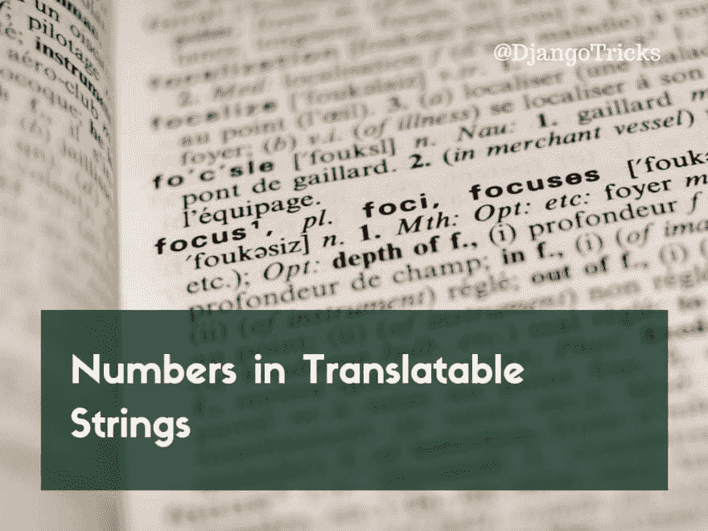

# 可翻译字符串中的数字

> 原文：<https://dev.to/djangotricks/numbers-in-translatable-strings-37f>

[T2】](https://res.cloudinary.com/practicaldev/image/fetch/s--RiL6TBx5--/c_limit%2Cf_auto%2Cfl_progressive%2Cq_auto%2Cw_880/https://4.bp.blogspot.com/-v9o-i8aVKoA/WctUiUCqPiI/AAAAAAAABz0/q3p3LjLsXj4Tavd9Fdl9aEstLbu6ceF4wCLcBGAs/s1600/numbers-in-translatable-strings.png)

网站中的句子，如“您有 1 条消息”或者“你收到的信息:5”听起来不自然，也不人性化。但是用于 Django 翻译的 GNU gettext 工具有一个选项，可以根据与被计数名词一起出现的数字定义不同的复数形式。对于某些语言来说，事情变得更加有趣，这些语言不仅有单数和复数形式，如英语、德语、法语或西班牙语，还有更多的复数形式或只有一种形式。

## 告诉我背景

我们来谈谈语法。大多数语言对于计数元素有两种复数形式:一种是单数，比如“1 个东西”，一种是复数，比如“n 个东西”。然而，某些语言要么只有一种单数和复数形式，要么有多种复数形式，这取决于它们所包含的元素数量。

例如，我的母语立陶宛语是来自印欧语系的波罗的海语，保留了古梵语的古老特征。立陶宛语有三种复数形式。当一个人在立陶宛数苹果时，他们会说“1 obuol **ys** 、“2-9 obuol **iai** 、“10-20 obuol **ių** 、“21 obuol **ys** 、“22-29 obuol **iai** 、“30 obuol **ių** 、“31 obuol **ys** 、“32-39 obuol”

网络上仅次于英语的第二大语言是俄语。俄语是印欧语系的一种东部斯拉夫语，在俄罗斯、白俄罗斯、哈萨克斯坦、吉尔吉斯斯坦和一些较小的国家被官方用作主要语言。俄语使用一种特殊的西里尔字母，它也有三种复数形式。当一个人用俄语数苹果时，他们会说“1 个яблок **о** ”、“2-4 个яблок **а** 、“5-20 个яблок”、“21 个яблок **о** 、“22-24 个яблок **а** 、“25-30 个яблок”等等。

阿拉伯语是世界上第五大通用语言。它是从右向左书写的，阿拉伯语是一个有趣的例子，甚至有 6 个复数形式。数苹果时，他们会说:

苹果，苹果，苹果，苹果，苹果，苹果，3-10，苹果，11-99，苹果，100-102

好吧，好吧，从 3 开始的苹果都是一样的，但理论上它与其他单词或在不同的上下文中是不同的。

相反，拥有 1.25 亿使用者的东亚语言日语只有一种复数形式。不管是 1 个苹果还是 100 个苹果，都会用同样的词来计数:“りんご1 個”或“りんご100 個".

顺便说一下，如果我的例子中有任何翻译错误，请纠正我。

## 给我看看一些代码

如果你想本地化你的 Django 网站，你需要做很多事情:

1.  在您的设置中添加`LANGUAGES`设置:

    ```
    LANGUAGES = [
        ('ar', _('Arabic')),
        ('en', _('English')),
        ('ja', _('Japanese')),
        ('lt', _('Lithuanian')),
        ('ru', _('Russian')),
    ] 
    ```

2.  将`'django.middleware.locale.LocaleMiddleware'`添加到设置中的`MIDDLEWARE`列表中。

3.  在您的项目目录中创建一个目录`locale`，子目录以您需要翻译的每种语言代码命名，例如`ar`、`ja`、`lt`、`ru`。

4.  在设置中添加`LOCALE_PATHS`,定义翻译的位置:

    ```
    LOCALE_PATHS = [
        os.path.join(BASE_DIR, 'locale'),
    ] 
    ```

5.  对于可翻译的 URL，使用`i18n_patterns()`将语言代码作为所有路径的前缀:

    ```
    from django.conf.urls import url
    from django.conf.urls.i18n import i18n_patterns

    from notifications.views import notification_list

    urlpatterns = i18n_patterns(
        url(r'^$', notification_list),
    ) 
    ```

6.  在 Python 代码中使用`gettext()`及其风格，在 Django 模板中使用``和``模板标签来定义可翻译的字符串。

7.  在 Python 代码中使用`ungettext()`创建包含计数元素的可翻译字符串:

    ```
    # using the new-style Python string format:
    notification = ungettext(
        "You've got {n} message.",
        "You've got {n} messages.",
        message_count,
    ).format(n=message_count)

    # using the old-style Python string format
    notification = ungettext(
        "You've got %(n)d message.",
        "You've got %(n)d messages.",
        message_count,
    ) % {'n': message_count} 
    ```

8.  使用``和`count`在 Django 模板中创建包含计数元素的可翻译字符串:

    ```
    

    {# will create the old-style Python string #}
    
        You've got {{ n }} message.
    
        You've got {{ n }} messages.
     
    ```

9.  运行`makemessages`管理命令来收集可翻译的字符串:

    ```
    (myenv)$ python manage.py makemessages --all 
    ```

10.  将`locale/*/LC_MESSAGES/django.po`文件中的英文术语翻译成其他语言。

11.  使用`compilemessages`管理命令将翻译编译成`django.mo`文件:

    ```
    (myenv)$ python manage.py compilemessages 
    ```

12.  重启网络服务器以重新加载翻译。

## 那么复数形式呢？

您可能知道，`*.po`文件中最常见的翻译如下:

```
#: templates/base.html
#, fuzzy
msgid "My Original String"
msgstr "My Translated String" 
```

Enter fullscreen mode Exit fullscreen mode

很长的字符串被分解成多行，使用 Pythonic 连接，没有任何连接符号:

```
msgstr ""
"Very very very very very very ve"
"ry very very very very very very"
" very very very very long string." 
```

Enter fullscreen mode Exit fullscreen mode

就在`msgid`之前，你会看到一些注释，字符串在哪里被使用，在什么上下文中，它是否是“模糊的”，即还没有激活，或者它对变量使用什么样的格式:旧式的“python-format”如`%(variable)s`或新式的“python-brace-format”如`{variable}`。

第一个`msgid`是一个空字符串，它包含翻译文件的一些元信息:语言、翻译时间戳、作者信息、联系人、版本等。一条元信息是该语言的复数形式。比如立陶宛语部分是这样的:

```
"Plural-Forms: nplurals=3; plural=(n%10==1 && n%100!=11 ? 0 : n%10>=2 && (n%100<10 || n%100>=20) ? 1 : 2);\n" 
```

Enter fullscreen mode Exit fullscreen mode

如:

```
#, fuzzy
msgid ""
msgstr ""
"Project-Id-Version: 1.0.0\n"
"Report-Msgid-Bugs-To: admin@example.com\n"
"POT-Creation-Date: 2017-09-18 01:12+0000\n"
"PO-Revision-Date: 2017-12-12 17:20+0000\n"
"Last-Translator: Vardenis Pavardenis <vardenis@example.com>\n"
"Language-Team: Lithuanian <lt@example.com>\n"
"Language: Lithuanian\n"
"MIME-Version: 1.0\n"
"Content-Type: text/plain; charset=UTF-8\n"
"Content-Transfer-Encoding: 8bit\n"
"Plural-Forms: nplurals=3; plural=(n%10==1 && n%100!=11 ? 0 : n%10>=2 && (n"
"%100<10 || n%100>=20) ? 1 : 2);\n" 
```

Enter fullscreen mode Exit fullscreen mode

它使用类似 JavaScript 的语法来定义语言有多少种复数形式，以及什么条件定义每次计数得到的复数形式的类型。

那么复数是这样定义的:

```
#: notifications/templates/notifications/notification_list.html:2
#, python-format
msgid "You've got %(n)s message."
msgid_plural "You've got %(n)s messages."
msgstr[0] "Jūs gavote %(n)s žinutę."
msgstr[1] "Jūs gavote %(n)s žinutes."
msgstr[2] "Jūs gavote %(n)s žinučių."

#: notifications/views.py:11
#, python-brace-format
msgid "You've got {n} message."
msgid_plural "You've got {n} messages."
msgstr[0] "Jūs gavote {n} žinutę."
msgstr[1] "Jūs gavote {n} žinutes."
msgstr[2] "Jūs gavote {n} žinučių." 
```

Enter fullscreen mode Exit fullscreen mode

再来看看之前提到的其他语言。俄语的复数形式是这样定义的:

```
"Plural-Forms: nplurals=3; plural=(n%10==1 && n%100!=11 ? 0 : n%10>=2 && n%10<=4 && (n%100<10 || n%100>=20) ? 1 : 2);\n" 
```

Enter fullscreen mode Exit fullscreen mode

那么这三种形式的翻译应该是这样的:

```
#: notifications/views.py:11
#, python-brace-format
msgid "You've got {n} message."
msgid_plural "You've got {n} messages."
msgstr[0] "У вас есть {n} сообщение."
msgstr[1] "У вас есть {n} сообщения."
msgstr[2] "У вас есть {n} сообщений." 
```

Enter fullscreen mode Exit fullscreen mode

您将为阿拉伯语定义 6 种复数形式:

```
"Plural-Forms: nplurals=6; plural=(n==0 ? 0 : n==1 ? 1 : n==2 ? 2 : n%100>=3 && n%100<=10 ? 3 : n%100>=11 ? 4 : 5);\n" 
```

Enter fullscreen mode Exit fullscreen mode

阿拉伯语的翻译如下:

```
#: notifications/views.py:11
#, python-brace-format
msgid "You've got {n} message."
msgid_plural "You've got {n} messages."
msgstr[0] "لديك {n} رسائل."
msgstr[1] "لديك رسالة واحدة."
msgstr[2] "لديك رسالتان."
msgstr[3] "لديك {n} رسائل."
msgstr[4] "لديك {n} رسالة."
msgstr[5] "لديك {n} رسالة." 
```

Enter fullscreen mode Exit fullscreen mode

日语只定义了一种复数形式:

```
"Plural-Forms: nplurals=1; plural=0;\n" 
```

Enter fullscreen mode Exit fullscreen mode

它只有一个翻译:

```
#: notifications/views.py:11
#, python-brace-format
msgid "You've got {n} message."
msgid_plural "You've got {n} messages."
msgstr[0] "あなたはメッセージが{n}つを持っています。" 
```

Enter fullscreen mode Exit fullscreen mode

## 提示带走

*   尽可能对变量使用新型 Python 格式，因为对于不太懂技术的翻译人员来说，它更容易理解，更不容易出错，而且在 Python 代码中看起来更整洁。
*   注意`` template 标签为变量生成旧式的 Python 格式，而在 Python 代码中，您可以自己决定使用哪种格式。
*   对于通常代表单数形式的第一个词条`msgstr[0]`，不要在翻译中用`1`代替第一个`{n}`，因为在很多语言中它也有`21`、`31`、`41`、`101`等意思。让变量被传递。
*   你可以在[translatehouse.org](http://docs.translatehouse.org/projects/localization-guide/en/latest/l10n/pluralforms.html)查找某种语言的复数形式。但是 Django 的最新版本也包含了某种复数形式，尽管它们并不总是符合上述列表中的条件。
*   如果你想编辑比文本编辑器更人性化的复数形式，你可以使用带有图形用户界面的 [Poedit](https://poedit.net/) 翻译编辑器。它显示了列出的编号案例，因此您不需要对条件进行逆向工程，也不需要猜测`else`案例中的剩余部分。
*   不幸的是，使用 **gettext** 不可能在同一个句子中有多个可翻译的计数对象。例如，“桌子上有 5 个苹果、3 个梨和 1 个橘子”，如果你想让计算的元素对人友好的话，数字可变就不是一个有效的可翻译句子。要解决这个问题，你需要写出三个不同的可翻译的句子。

*该帖子最初发表于[djangotricks.blogspot.com](http://djangotricks.blogspot.com/2017/09/numbers-in-translatable-strings.html)*