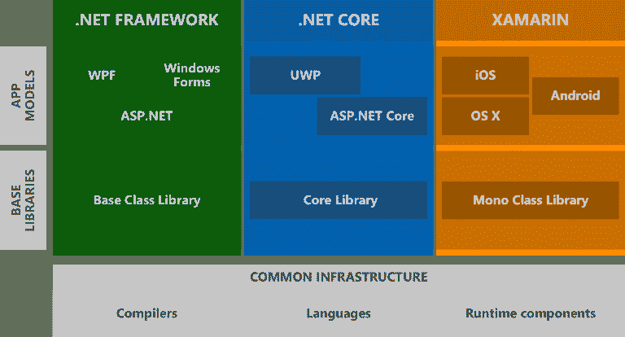
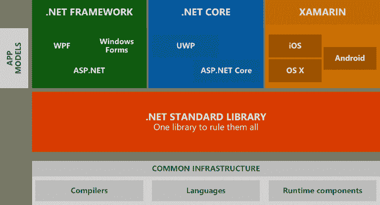

# 。Net 标准以及您需要了解的内容

> 原文：<https://dev.to/rickab10/net-standard-what-do-you-need-to-know-about-it-3g2>

。Net 标准并不是一个新的框架。这很简单，但对任何需要共享代码的微软框架来说都很有价值。

对于那些已经使用过一些微软框架的人来说，知道开发一个可被其他框架重用的代码是一件复杂的事情。比如 Windows Phone 8.1 和。Net 完整框架。

这是因为微软的每个平台或风格都有自己的类基础集。很多时候，一个类被复制到另一个平台，如下所示。

[T2】](https://res.cloudinary.com/practicaldev/image/fetch/s--Xm90VE6X--/c_limit%2Cf_auto%2Cfl_progressive%2Cq_auto%2Cw_880/http://stephanybatista.com/wp-content/uploads/2017/08/net-without-standard-768x414.png)

有人可以告诉我，有一种东西叫做 PCL，可移植类库。通过创建 portable 类型的项目“核心”,可以选择运行哪些框架。例如，我创建了一个运行在。Net 全框架，Windows Phone 和 Xamarin。这是可行的，但有问题。PCL 将为每个选中的框架实现一个版本。我想这很奇怪。

你明白这个问题吗？微软没有通用图书馆。每个框架都有一些转换。如果今天弹出一个新的框架，你将不会使用这个框架。

更正一下，微软没有通用库。现在它有了。净标准。

什么时候。Net Core 的到来，微软想得更好，创造了。净标准。它不是一个新的框架，而是框架必须实现的接口集。也就是说，如果框架 X 和 Y 实现了该接口，意味着该代码在框架 X 和 Y 中被接受。此外，如果出现一个新的平台，如 Xamarin，它就必须实现该接口。

但是现在好处来了。Net 标准，我们可以拥有以提供多种平台实现为目标的类库。Net Core，Xamarin，。Net 框架和其他。我没有使用 PCL。我正在使用接口。

PCL 的问题是它将代码实现到每个平台。为您选择的所有平台构建了相同的代码。另一个问题，它没有很多类，这可能会给你的项目带来问题。我在创建一个 windows phone 应用程序时遇到过这个问题。

通过下图，你可以看到没有为一个框架设置类，但是上面有框架。净标准。

[T2】](https://res.cloudinary.com/practicaldev/image/fetch/s--PyClmP-q--/c_limit%2Cf_auto%2Cfl_progressive%2Cq_auto%2Cw_880/http://stephanybatista.com/wp-content/uploads/2017/08/net-with-standard-768x414.png)

目前。Net 标准是在 2.0 版本中通过[链接](https://blogs.msdn.microsoft.com/dotnet/2016/09/26/introducing-net-standard/) 展示框架版本及其实现。净标准。每个。Net 标准版指定了更多的接口。这意味着我们将使用更多上一版本中没有的框架类。

微软团队使用的一个类比，我也想解释一下。Net 标准版与 HTML 版比较，框架是 Chrome、IE、Firefox 等浏览器”。由于 HTML 版本越高，您可以使用的功能就越多。但是浏览器必须接受这个版本

**结论**

微软花了很长时间，但现在创建了一个通用接口，用于许多框架。现在，我们不选择要使用哪些框架，而是创建一个将在许多框架中使用的代码。回头见。

你喜欢这篇文章吗？你会更了解。网芯？我在 Udemy 创建了一个价格便宜的课程。访问[https://www . udemy . com/aspnet-core-20-learn-concepts-and-creating-a-web-app](https://www.udemy.com/aspnet-core-20-learn-concepts-and-creating-an-web-app)