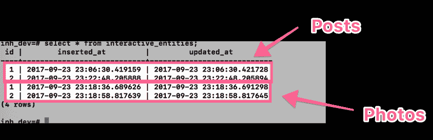

# 在 Ecto 中试验继承表

> 原文：<https://dev.to/swanros/experimenting-with-inherited-tables-in-ecto-5oa>

*最初发布于我的博客，[swanros.com](https://swanros.com)T3】*

在过去的几个月里，我一直在和一些朋友一起做一个个人项目，我主要负责用 Phoenix 构建我们的后端。

到了我们需要为应用程序实现某种“评论和喜欢”功能的时候了，所以我开始思考如何去做。

注意:这只是我的实验，并不是说这是正确的做法。我还在学习这些东西，所以如果你认为我错过了什么，无论如何，请在[oscar@swanros.com](mailto:oscar@swanros.com?subject=table%20inheritance%20in%20Ecto)T3 告诉我

*注 2:这个帖子的示例代码是 GitHub 上的[。](https://github.com/OscarSwanros/ecto-table-inheritance)*

当我开始研究时，我发现的关于如何实现这种功能的大多数答案都指向使用表继承，这样我就可以拥有一个`ActionableEntities`表，以及`EntityComments`和`EntityLikes`表。然后，`Posts`、`Photos`、`Events`会继承`ActionableEntities`获得被评论或‘喜欢’的能力。

“很简单，”我对自己说。然后我开始挖。这是我发现的。

### 用 Ecto 实现表格继承

我找不到具体的例子来说明如何做到这一点，但是我阅读了[官方的 Ecto 文档](https://hexdocs.pm/ecto/Ecto.Migration.html#table/2)，发现你可以传递一个`:options`参数来指定你希望你的表拥有的额外属性，比如`WITH`、`INHERITS`或`ON COMMIT`。因此，迁移看起来像这样:

```
def change do
    create table(:actionable_entities) do
        timestamps()
    end

    create table(:entity_comments) do
        add :content, :string
        add :entity_id, references(:actionable_entities)

        timestamps()
    end

    create table(:posts, options: "INHERITS (actionable_entities)") do
        add :content, :string
    end

    # photos and all other tables follow the same structure as the posts one.
end 
```

现在，将要使用这些表的模块定义如下:

```
defmodule Inh.ActionableEntity do
  use Ecto.Schema

  schema "interactive_entities" do
    has_many :comments, Inh.EntityComments.Comment

    timestamps()
  end
end

defmodule Inh.EntityComments.Comment do
  use Ecto.Schema

  schema "entity_comments" do
    field :content, :string
    belongs_to :entity, Inh.ActionableEntity

    timestamps()
  end
end

defmodule Inh.Posts.Post do
  use Ecto.Schema

  schema "posts" do
    field :content, :string

    timestamps()
  end
end 
```

“这应该在这里工作，”我心想。它在很大程度上确实如此:我可以创建一个帖子，并获得一个帖子列表。我甚至可以查询一个`Post`的评论，即使数据库里没有。

但是，当尝试为给定的帖子创建评论时，会出现以下数据库错误:

```
ERROR: insert or update on table "entity_comments" violates foreign key constraint "entity_comments_actionable_entity_id_fkey" DETAIL: Key (entity_id)=(1) is not present in table "actionable_entities". 
```

用于尝试插入新注释的代码类似于

```
def create_for_post(id, c_params) when is_integer(id) do
    Repo.get(ActionableEntity, id)
    |> Ecto.build_assoc(:comments, c_params)
    |> Repo.insert()
end 
```

首先获取我要评论的帖子，建立相应的关联然后插入数据库。不过，问题是:

> 索引(包括唯一约束)和外键约束仅适用于单个表，而不适用于其继承子表。

因此，如果我将一条记录添加到`posts`或`photos`中，来自继承表的信息会弹出到父表中。但是，从技术上讲，这些信息是一个`post`，而不是一个`actionable_entity`。ðŸ "

Postgres 告诉我给定的`id`没有`ActionableEntity`是对的。

通过创建一个继承自`actionable_entity`的新的`photos`表，并向其中添加一些记录，我可以感觉到这里确实有问题:

[T2】](https://cl.ly/2U373E2h2W02)

此时，没有数据一致性，因为数据库无法区分`Photos`和`Posts`。

解决这个问题的一个方法是在数据库上创建一个触发器，在每次我们试图为一个`Post`插入一个新的`EntityComment`时检查这个`Post`是否确实存在于数据库中。为此，需要从数据库中删除外键约束。首先，更新`entity_comments`迁移:

```
create table(:entity_comments) do
  add :content, :string
  add :entity_id, :integer

  timestamps()
end 
```

`entity_id`现在只是一个简单的`:integer`，没有对`actionable_entities`表的显式引用。

然后，创建触发器:

```
execute """
  CREATE OR REPLACE FUNCTION internal_post_check() RETURNS TRIGGER AS $$
  BEGIN
    IF NOT EXISTS(SELECT 1 FROM posts WHERE id = new.entity_id) THEN
      RAISE EXCEPTION 'Post does not exist:  %', new.entity_id;
    END IF;
    RETURN new;
  END;
  $$ language plpgsql;
"""

execute """
  CREATE TRIGGER CheckEntityExists BEFORE INSERT OR UPDATE ON entity_comments
  FOR EACH ROW EXECUTE PROCEDURE internal_post_check();
""" 
```

每当有新记录要插入到`entity_comments`表上时，这个触发器就会运行，并且会手动检查是否存在一个在`entity_id`上的值为`id`的帖子。

看起来这个问题现在已经解决了，但是当我有一个`Post`并想检索它的评论时，会发生什么呢？如果我的数据库中有`Posts`和`Photos`以及潜在的 N 个“交互实体”,我该如何查询这些实体呢？

我通过在`actionable_entity`表上添加一个新的`type:String`列解决了这个问题。对于我最终添加到数据库中的每一种可操作实体，帖子在该列中的值为`post`，照片的值为`photo`，以此类推。

这样，现在我可以用给定的`id`查询特定照片的评论:

```
def comments_for_post(id) when is_integer(id) do
    q = from entity in ActionableEntity,
        where: entity.id == ^id and entity.type == ^"post",
        left_join: comments in assoc(entity, :comments),
        preload: [comments: comments]

    post = Repo.one(q)
    post.comments
end 
```

## 期末笔记

虽然这个*可以工作*,但是它需要绕过数据库的完整性检查来自己处理。这很容易出错，需要我不断地运行测试来验证我没有遗漏为照片、事件或任何其他我想添加到系统中的“可操作实体”添加新的触发器。

此外，如果我决定向这些实体添加另一种操作，比如“赞”或“鼓掌”，我也需要为它们添加另一组检查。

这很快就会成为可维护性的噩梦。

我问了一个真正有后端开发经验的朋友，他给了我[这个链接](https://rhnh.net/2010/07/02/3-reasons-why-you-should-not-use-single-table-inheritance/)到一个叫做[的帖子，这是你不应该使用单表继承的三个原因](https://rhnh.net/2010/07/02/3-reasons-why-you-should-not-use-single-table-inheritance/)。读一下。

最后，这只是我试图实现一个我认为会是一个好的解决方案，但似乎这里需要做出的妥协是不值得的。

我采用的是最简单的方法:将我希望启用注释的实体的列添加到`entity_comments`表中:

```
id | content | post_id | photo_id | event_id | inserted_at | updated_at
-----------------------------------------------------------------------
1    Hey!      1                               -----         -----
2    nice!               1                     -----         -----
3    Good!     4                               -----         ----- 
```

如 [schema.ex#L806](https://github.com/elixir-ecto/ecto/blob/master/lib/ecto/schema.ex#L806) 所述:

> 除非有几十列，否则这对开发人员来说更简单，
> 对数据库更友好，在各方面都更高效。

原来如此！感谢阅读。