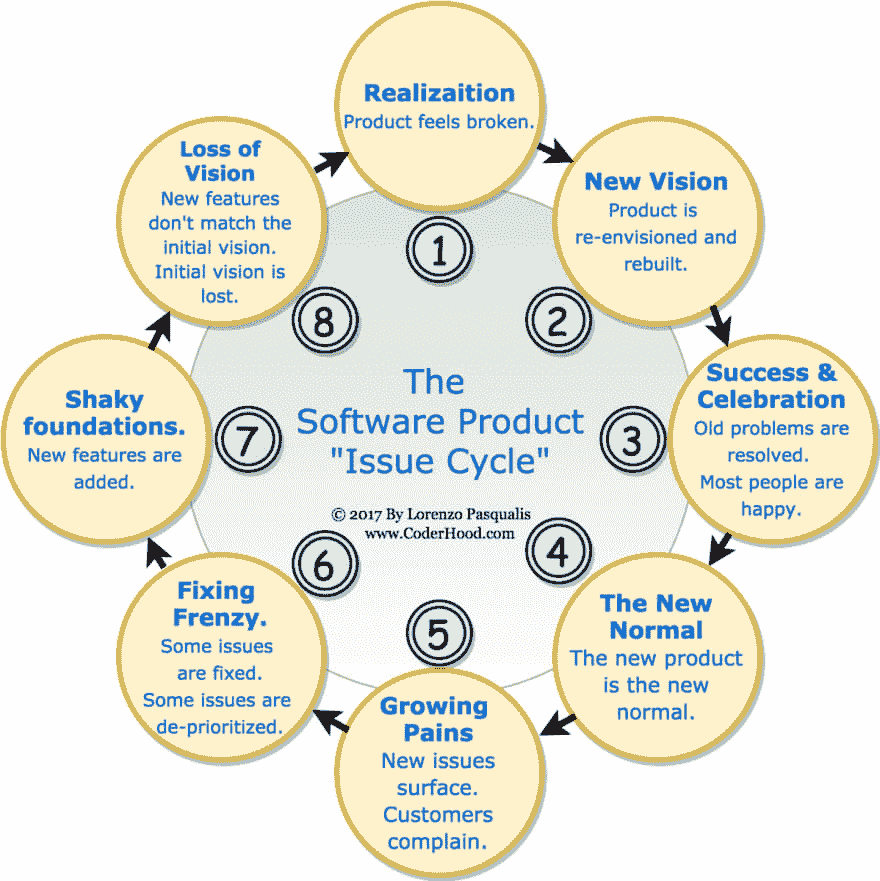

# 软件产品“发行周期现象”

> 原文:[https://dev . to/lpas qualis/the-software-product-issue-cycle-phenomenon-DNP](https://dev.to/lpasqualis/the-software-product-issue-cycle-phenomenon-dnp)

这篇文章最初发表在 [CoderHood](https://coderhood.com) 上，名为[软件产品“发行周期现象](https://www.coderhood.com/the-software-product-issue-cycle-phenomenon/)。CoderHood 是一个致力于软件工程人类层面的博客。

* * *

在软件行业，普通的工程师、设计师、项目经理或产品经理会在同一家公司[工作大约三年](http://www.gethppy.com/employee-turnover/can-tech-industry-solve-employee-tenure-problem)。

如果你在同一份工作上至少呆上四五年，你可以观察到这种短暂的寿命周期。我倾向于对我工作的公司忠诚，我在一个组织中的平均时间比平均时间长得多。也就是说，我见过很多人来来往往，很多循环都是一个完整的循环。

任何超过三年前编写的软件都被认为是“遗留物”，是由已经不在的人开发的。当一件作品是由没人记得的个人创作时，有趣的事情发生了。这项工作自动被认为在某些方面有缺陷。在这一点上，人们不再记得或理解最初的愿景，产品逐渐远离它，没有人感觉到对它的所有权或依恋，并且扔掉它并重建它的强烈愿望缓慢但持续地增长。

## “发行周期”

我把这种现象称为“问题周期”。这个周期可以分为八个阶段，在 3 到 4 年的时间里循环往复。这是一个总结整个循环的可视化图。

[T2】](https://www.coderhood.com/the-software-product-issue-cycle-phenomenon/)

我将使用一个与任何特定项目或产品无关的理论示例来描述这些阶段。如果说与任何真实情况有什么相似之处，那是因为这是一种常见的模式。如果您已经在软件行业工作了一段时间，那么在您职业生涯的某个时刻，您会看到这一点或者它的一部分。

在这个例子中，一家公司出售一个软件的 2.73 版本的许可证，这个产品是几年前生产的，由许多不同的人维护。版本 2 最初的工程师和设计师不再受雇于该公司。让我们开始吧。

### 阶段 1——实现。

这是官方的！产品 2.73 版本感觉坏了。好像什么都不好用。一些已知的问题已经存在多年了，客户抱怨的声音越来越大，越来越频繁。处理它变得越来越困难。

问题是 2.73 版本的问题是设计缺陷，而不是简单的实现错误。目前的设计令人困惑，似乎没有人记得为什么要这样做。当版本 2 的设计第一次被创建时，只有几个当前的员工在附近，但是他们忘记了细节。从那时起，做了许多改变，很难记得最初的愿景是什么，以及为什么要做出这样的决定。

所有这些信息都记录在积压文件、维基页面、路线图、错误报告和一堆松散组织的高级规范中。总之是无处不在，无处不在。重构历史几乎是不可能的，重构原意更是绝对不可能的。

警铃响起。有人认为需要做些什么来解决这个问题。让我们重建它！每个人都同意。

### 第二阶段——新视野。

一组人负责这个项目。他们称之为第三版。会很棒的。每个人都很兴奋。该团队为该产品的改进版本开发了一个全新的愿景。对确保解决所有现存缺陷给予了相当大的关注。

该小组在高级别战略会议上讨论这一愿景。工程师和 UI/UX 专家会一直开会，直到所有高级设计问题都被解决。产品管理组织焦点小组，并将他们的意见纳入设计中。利益相关者写文档来记住为什么要做决定。

工程团队使用敏捷方法构建新产品。他们构建功能块，在此过程中做出决策，并小批量发布。

几名工程师离开了公司，但管理层很快接替了他们。没什么大不了的。

### 三期——成功&庆典。

终有一天，3.0 版本终于准备好了。该团队构建并测试了大多数计划中的功能，一小部分用户一直在提供反馈。发布日来了又去，大家欢呼。

新版本似乎比原版好得多。它解决了所有现存的问题，并且举起了一个大的砝码。项目团队是今天的英雄。

一个 UI 设计师找到了一份新工作，但是她在消失之前记录了她所有的想法和主意。一切照旧。

### 第四阶段——新常态。

人们忘记了版本 2，版本 3 是新的“标准”最初的兴奋慢慢消失。一个专门的团队维护产品，事情似乎都在控制之中。

3.1 版本发布。

你经常会听到人们说，“我想知道我们为什么要这样做，”但这些担心都是次要的，很容易回答。

3.11 版本发布。

第三版的主要设计师，大多数设计相关问题的“关键人物”，被解雇了，原因不明。人们猜测，但没人知道发生了什么。他没有留下任何文件、笔记和一大堆未解的问题。

### 第五阶段——成长的烦恼。

版本 3 的问题开始像拇指疼痛一样突出。客户抱怨，解决方案很快就做好了，并发布以止血。

3.15 版本发布。

在这一点上，维护产品的工程团队对 it 来说是陌生的，他们使用他们所拥有的信息。文献难找，内部知识也在慢慢流失。

3.2 版本发布。

首席工程经理被另一家公司聘为首席技术官。公司替换了她，但这需要几个月的时间，而且要保持事情顺利进行需要一些重大的努力。工程领域的更多变动是不可避免的。

### 第六阶段——定盘狂潮。

新经理开始工作，确保一个非常高效的工程师团队解决最尖锐的问题。不太严重的问题被降低优先级，不予处理。新的设计师修改用户体验以回应客户投诉，事情进展很快。

一系列版本系统地解决问题。3.2.1、3.2.2、3.2.3 和 3.2.4 版本在两个月后被推出门外。这支队伍势如破竹。英雄诞生了。拥抱所有人。

### 第七阶段——根基不稳。

随着新人学习如何有效地使用遗留代码，新的特性被添加到已有问题之上。此时，创造产品的人不在身边。他们几个月前就离开了。对最初的愿景几乎没有记忆，在不了解最初的思维和不成文的设计准则的情况下做出决策。

3.5 版本推出了大量的新功能和巨大的营销活动。市场对此反应冷淡。

### 第 8 期——丧失视力。

3.x 版本的问题开始感觉越来越大。新功能在原始愿景的范围内不能很好地工作。它们看起来和感觉上都像是糟糕的改造，以意想不到的方式打破了 3.0 的设计。

没有人来捍卫或解释版本 3 的愿景，产品开始感觉破碎和笨拙。顾客不高兴。

### 冲洗并重复

该循环从阶段 1 再次开始。

## 问题的根源。

[T2】](https://res.cloudinary.com/practicaldev/image/fetch/s--nBEoe5bN--/c_limit%2Cf_auto%2Cfl_progressive%2Cq_auto%2Cw_880/https://thepracticaldev.s3.amazonaws.com/i/fmfpg8fw7k0k596vsknl.jpg)

问题周期是由于当员工离开公司，不再保持设计的一致性时，会出现愿景的丧失。新鲜的想法是一件好事，但如果允许基于特定和被遗忘的原则扭曲一个自洽的模型，失去远见可能是危险和昂贵的。

新人希望在产品上留下自己的印记，并(下意识地)利用现有的漏洞在他们注入变化的地方制造裂缝；如果做得好，这并不一定是一件坏事。这是创新的一部分。然而，太多时候并不顺利。

## 你能做些什么来避免问题循环？

问题周期是自然的，几乎是不可避免的，除非得到理解和认真解决。这里有几件事可以避免它。

### 写设计原理之书。

您可以通过确保未来的开发人员和产品经理理解最初的设计和愿景来停止问题周期。传承这些知识并不容易。这不应该通过编写数百页的文档来完成。没人会看的。相反，应该通过编写简单、明确和简明的原则和准则，并以将来容易找到和参考的方式分享这些原则和准则来实现。该文档是“设计原则之书”，必须容易找到，并且经常从所有其他文档中引用。我称之为“书”，但它不应该超过 3 或 4 页。

### 给你的关键人物留下的理由。

对一家公司来说，让一些员工流失，引入新的想法，摒弃陈旧的教条是件好事。然而，3 年 90%以上的员工流失率是问题周期的核心，这是不健康的。

创造产品的远见者带着远见和火炬。如果可以，如果他们继续做好工作，善待他们，鼓励他们中的一些人留下来。避免陷入“平均任期 3 年”的困境，努力确保几代员工之间的连续性和创新性。

### 专注设计。

速赢是加入公司的新员工的标志，他们希望建立自己的声誉。这是一种自然的趋势，只要他们理解产品的愿景和建立产品的原则，这并不是不健康的。

当软件产品的演化成为一长串快速增加的功能时，软件产品就转移了。让产品**以设计为中心**，而不是以功能为中心。使用《设计原则之书》来保持设计的一致性，永远不要让急功近利的泛滥污染了精心制作的设计和产品愿景。

### 接受不可避免的刷新。

技术在发展，最终，所有产品都需要重大更新。这是必然的，也是健康的，只要过程可控。不要让一系列错误或设计的转移来决定何时需要更新。相反，在为时已晚之前，用一套新的设计原则开始更新。

作为一个经验法则，**——当你开始构思新版本的设计原则时，你应该还能回忆起以前版本的设计原则。**

### 不要让实现来定义设计。

让实现来定义设计是非常诱人的，尤其是在工程驱动的组织中，或者在速赢是唯一重要的事情的组织中。当你接受了这样的妥协，设计就移交了。这也是为什么基于特征的快速进化会导致糟糕的用户体验的原因。有时速赢是好的，但它不应该是你进行产品创新的唯一方式。

这也是为什么基于特征的快速进化会导致糟糕的用户体验的原因。有时速赢是好的，但它不应该是你进行产品创新的唯一方式。

### 不要让不了解产品设计特点的人。

如果雇佣了新员工，而他们不熟悉设计原则书或产品，他们将无法开始创造新功能。如果他们这样做，结果很可能是次优的。对于新员工来说，在做出好的选择之前，了解产品的设计原则是很重要的。

一个需要警惕的典型危险信号是新员工，尤其是产品经理或产品设计师，他们在没有询问现有产品及其愿景的情况下构思和推广新功能。

### 刻意进化愿景，而不仅仅是产品。

当你的产品超出了最初的概念，你需要重新定义它。没有愿景，产品往往会走一条不稳定的道路。

确保你始终保持一个清晰的愿景，并相应地重温《设计原则》这本书。不要放弃一贯的偶然创新；创新应该是深思熟虑和有计划的。

* * *

### 如果你喜欢这篇文章，请保持联系！

*   在 CoderHood 上找到我所有的帖子。
*   在 LinkedIn 上加入我的职业网络。
*   在推特上关注我。
*   加入我的脸书主页。
*   最后，在 dev.to 上跟我来！