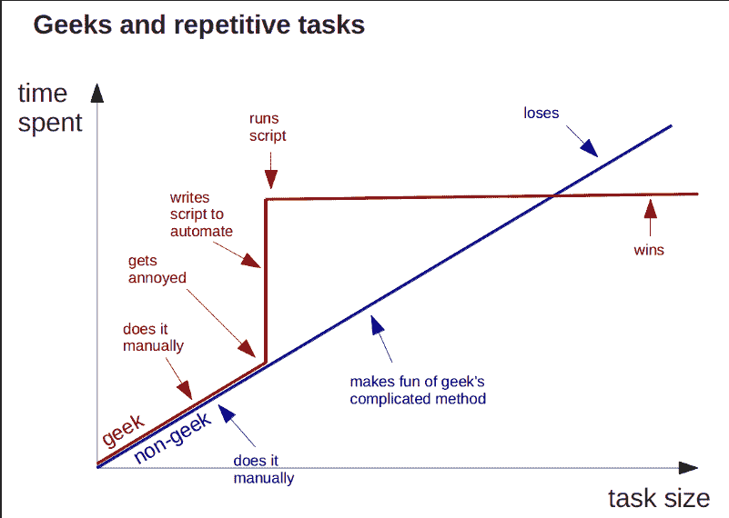
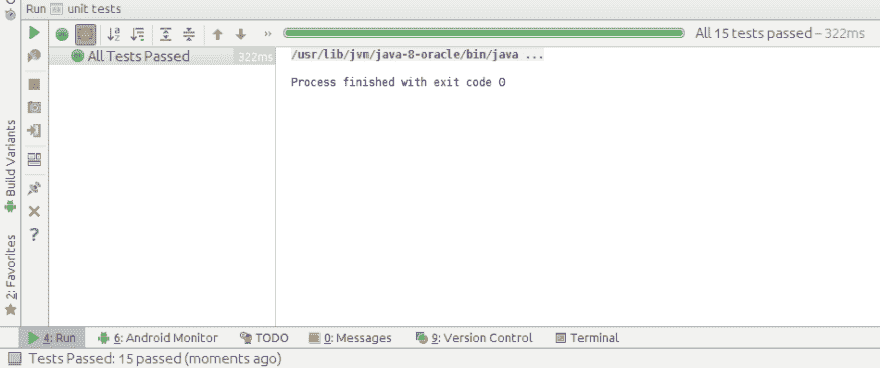

# 我的第一个单元测试

> 原文：<https://dev.to/s_anastasov/my-first-unit-test-c44>

开发人员编写测试有不同的原因。其中一些是:

*   验证系统
*   反馈
*   为了防止回归错误
*   代码覆盖率
*   启用重构
*   记录系统
*   经理的命令
*   以及许多其他原因

开发人员不编写测试还有其他原因，比如:

*   不知道如何编写测试
*   编写测试太难了
*   没有足够的时间编写测试
*   代码对于测试来说太简单了。

这是关于我第一次为了节省时间而编写的单元测试的故事。

# app

我在开发一个简单的安卓应用。该应用程序由两个屏幕组成，一个项目列表和一个用于创建/更新/删除项目的详细信息屏幕。还有一个与本文无关的注册/登录屏幕。该应用程序使用 REST API 与远程数据库(位于 parse.com)协同工作。你可以在应用程序中创建一个帐户，你可以通过 API CRUD 一些项目。该应用程序需要离线工作，并在连接到互联网时与服务器同步更改。

为了支持离线工作，我创建了一个本地数据库来镜像远程数据库。为了同步本地和远程数据库，我使用了一个 [IntentService](https://developer.android.com/reference/android/app/IntentService.html) 。IntentService 负责比较两个数据库中的项目，并确定应该在本地和/或远程数据库中更新什么。这是应用程序中最复杂的部分。

# 测试

完成数据库同步代码后，我在模拟器上运行应用程序，测试它是否工作。

测试场景:

*   本地数据库中的新项目->更新远程数据库
*   远程数据库中的新项目->更新本地数据库
*   本地数据库中的更新项目->更新远程数据库
*   远程数据库中的更新项目->更新本地数据库
*   两个数据库中的更新(不同)项目->更新两个数据库

我在做手工测试。首先，我会清除应用程序数据(以获得一个空的数据库)和清除远程数据库(使用解析网站)。然后，我在本地数据库中创建了一个项目，运行同步服务并检查它是否出现在远程数据库中。我在远程数据库中创建了一个项目，运行服务并检查它是否出现在本地数据库中。然后我创建了两个新项目，一个在本地数据库，一个在远程，运行服务，检查它是否正常。现在对更新项目、删除项目重复此操作…测试整个同步逻辑可能需要 10-15 分钟。

当然，我的代码第一次没有成功，它有一些错误，我不得不更新我的代码。经过几个周期的修改两行代码，然后测试 15 分钟，我累了。我花了太长时间才看到更改几行代码的效果。一定有更好的办法。这种枯燥、重复的过程是计算机可以做得更好的。

[T2】](https://res.cloudinary.com/practicaldev/image/fetch/s--ZEVlnpHo--/c_limit%2Cf_auto%2Cfl_progressive%2Cq_auto%2Cw_880/http://i.imgur.com/Q8kV8.png)

# 检测完成正确

幸运的是，Android Studio 版本(以及相应的 android gradle 插件)增加了对单元测试的支持。我将 IntentService 中的同步逻辑提取到一个 Java 类中，该类负责比较两个列表并确定应该更新什么。然后我为我的同步逻辑写了一些单元测试。我在同步代码中唯一的 Android 依赖项是 [TextUtils.isEmpty()](https://developer.android.com/reference/android/text/TextUtils.html#isEmpty(java.lang.CharSequence)) 。作为一个快速的解决方法，我决定将实现复制/粘贴到我的同步类中。单元测试用 JVM 运行，所以没有仿真器。我运行了测试，并得到了即时反馈，手动花费我 10 到 15 分钟的事情现在自动化了，只需要几秒钟。在修复了代码和测试中的一些错误后(是的，我也在测试中写了一些错误)，我的应用程序像预期的那样工作了。

[T2】](https://res.cloudinary.com/practicaldev/image/fetch/s--KwaPmSnx--/c_limit%2Cf_auto%2Cfl_progressive%2Cq_auto%2Cw_880/http://i.imgur.com/iEbZtl3.png)

为我的同步逻辑编写单元测试很简单，因为这个类没有合作者，不接触 UI，也没有 Android 依赖性[1]。通常编写单元测试更难，你需要将你的代码设计成可测试的，这需要时间来看到好处。这种低努力高回报的测试让我开始做更多的测试。

你写测试吗？有什么有趣的测试故事吗？可以在评论里分享一下。

[1] *除了 TextUtils.isEmpty()*