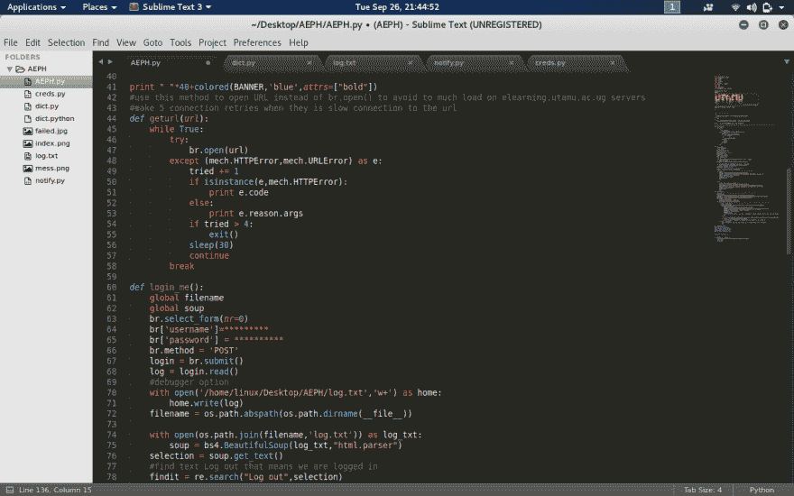
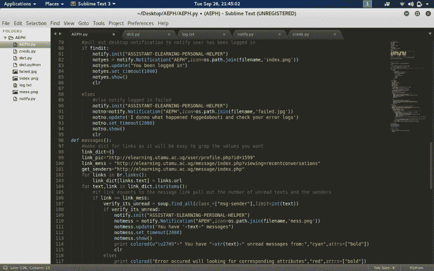
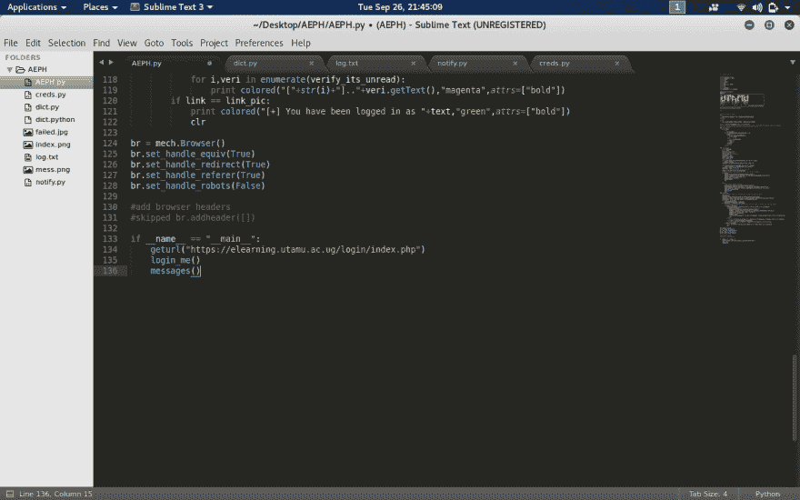

# 自动化您的代码生活

> 原文:[https://dev . to/elemanhillial/automating-your-life-in-code-667](https://dev.to/elemanhillary/automating-your-life-in-code-667)

我称它为 AEPH(自动电子学习个人助手),是我在学校的业余时间开发的，当然它仍处于开发阶段。当我在大学加入大学时，我很懒地检查电子学习平台上的内容，例如每学期注册新课程，阅读消息总数和发送者，下载发布的课程，查看论坛上当前的内容，参与主题并自动进行发布的测验。我开始写了下面的“想让你看看”:

我们将使用 mechanize 与浏览器进行交互，现在我们开始，因为我不想写 match plus，我的程序给你一个如何使用 BeautifulSoup 和 Mechanize 的例子，我写的更多功能将会出现

[T2】](https://res.cloudinary.com/practicaldev/image/fetch/s--fzWOQNwJ--/c_limit%2Cf_auto%2Cfl_progressive%2Cq_auto%2Cw_880/https://thepracticaldev.s3.amazonaws.com/i/3tztnjs78hua357huevh.png)

[T2】](https://res.cloudinary.com/practicaldev/image/fetch/s--XWt0mmU8--/c_limit%2Cf_auto%2Cfl_progressive%2Cq_auto%2Cw_880/https://thepracticaldev.s3.amazonaws.com/i/ytq7xbu68g3vid7chc67.png)

[T2】](https://res.cloudinary.com/practicaldev/image/fetch/s--rL8QwEnD--/c_limit%2Cf_auto%2Cfl_progressive%2Cq_auto%2Cw_880/https://thepracticaldev.s3.amazonaws.com/i/hut1lpnn6veuikwhvb5b.png)

[T2】](https://res.cloudinary.com/practicaldev/image/fetch/s--jMmtOzPa--/c_limit%2Cf_auto%2Cfl_progressive%2Cq_auto%2Cw_880/https://thepracticaldev.s3.amazonaws.com/i/tdhip3c7qrdjqvhdqabv.png)