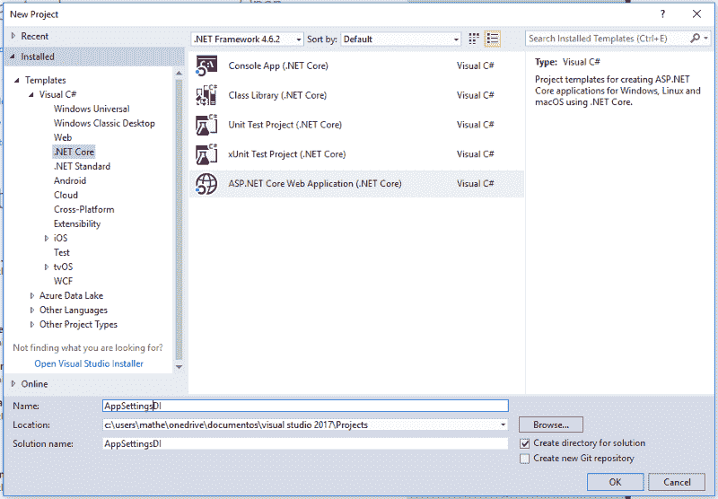

# 如何在 Asp.Net 核心 MVC 中获取 appsettings.json 数据

> 原文：<https://dev.to/matheusrodrigues/how-to-get-appsettingsjson-data-in-aspnet-core-mvc-5337>

> 您可以从这个 git 资源库下载这个示例。

在本教程中，我将向您展示如何使用 Asp.Net 核心 MVC 中内置的依赖注入从 *appsettings.json* 获取数据。

我们马上开始吧\o/

首先，您需要在 visual studio 中创建一个项目。我正在使用 visual studio 2017 社区。net core 版。

<figure> 

<figcaption>新 ASP.NET 核心 Web App 项目</figcaption>

</figure>

我正在创建一个 ASP.NET 核心 Web 应用程序，这是 mvc 框架的新版本。

[继续阅读...](https://www.matheus.ro/2017/09/25/get-appsettings-json-data-asp-net-core-mvc/)