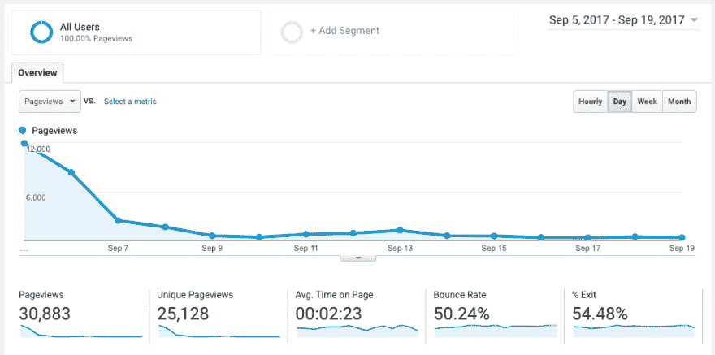
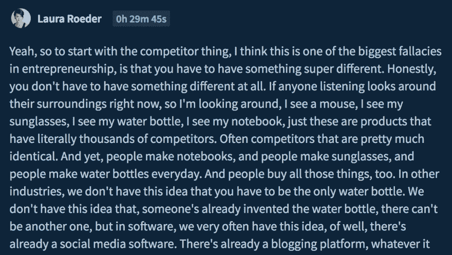
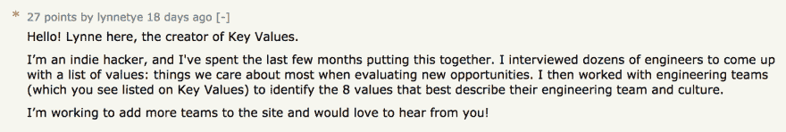
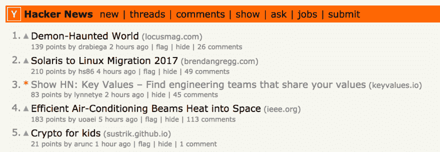
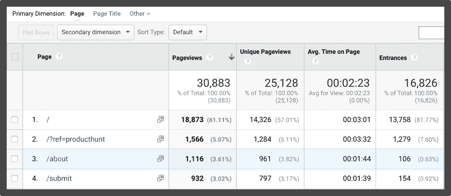

# 我如何停止拖延，学会编码，并推出我的第一个产品

> 原文：<https://dev.to/lynnetye/how-i-stopped-procrastinating-learned-to-code-and-launched-my-first-product-2i1>

[T2】](https://res.cloudinary.com/practicaldev/image/fetch/s--NTlX4Ilj--/c_limit%2Cf_auto%2Cfl_progressive%2Cq_auto%2Cw_880/https://storage.googleapis.com/indie-hackers.appspot.com/articles/t1EK5yv5EbOdEkzkYn77pgB39a62/%40lynnetye%257Cd1042ffa5f/IH-article--sprinklers.jpg)

多年来，我一直在阅读鼓舞人心的创始人故事，想知道人们是如何做到的。我会阅读黑客新闻、独立黑客和 DEV 等论坛上的帖子，但从不分享或发布我自己。事实上，我甚至不会留下评论。我猜你们很多人都是:一个潜伏者。

但几周前，情况发生了变化。我发布了我的产品 [Key Values](https://www.keyvalues.com) ，这是我自己开发的东西，并在黑客新闻和产品搜索中名列前茅，几天内就获得了近 3 万次浏览量。

[T2】](https://res.cloudinary.com/practicaldev/image/fetch/s--PAR6Al4Y--/c_limit%2Cf_auto%2Cfl_progressive%2Cq_auto%2Cw_880/https://storage.googleapis.com/indie-hackers.appspot.com/articles/t1EK5yv5EbOdEkzkYn77pgB39a62/%40lynnetye%257Cd1042ffa5f/Screen%2520Shot%25202017-09-21%2520at%25204.33.23%2520PM.png)

关于最初的流量高峰(他们称之为发布后的悲伤低谷)之后会发生什么，有很多话要说，但今天我将谈谈在它之前会发生什么。

下面，我讨论一下为了从潜伏到发射，我不得不突破的六大障碍。

## 相信缓慢的进步总比没有进步好。

我搬到三藩市去 UCSF 大学读研究生，直到两年后退学，我才知道什么是创业。人们是如何随随便便地创办公司、融资、转型、倒闭，然后创办新公司的，这让我感到惊讶。似乎企业家精神存在于每个人的 DNA 中，除了我。

即使在我的第一家科技创业公司工作后，我仍然看不到自己的创始人潜质。我想知道，如果我出生在一个企业家家庭，而不是学者家庭，我会成为什么样的人。我当时 26 岁，一生都在努力追求一个我不再感兴趣的职业。这是一个夹杂着狂热的遗憾派对，与其他人相比，我觉得自己落后了很多，我想我永远也赶不上了。

然后我决定拥抱它。

我相信缓慢的进展总比没有进展好。

我决定我应该学习编码。我为几个月的困惑和精益烹饪做了心理准备，报名参加了一个编码训练营(实际上我并没有完成)，并开始学习如何无中生有。这很难，我可能哭了好几次，但我知道这是要赶上的。

<figure>

[T2】](https://res.cloudinary.com/practicaldev/image/fetch/s--Yc1ASLGK--/c_limit%2Cf_auto%2Cfl_progressive%2Cq_auto%2Cw_880/https://storage.googleapis.com/indie-hackers.appspot.com/articles/t1EK5yv5EbOdEkzkYn77pgB39a62/%40lynnetye%257Cd1042ffa5f/IH-article--lean-cuisines.jpg)

<figcaption>I don't even want to know how many Lean Cuisines I ate in 2015...😳</figcaption>

</figure>

即使在我能够得到合同工作后，我仍然没有信心开创自己的事业。我不知道什么时候我觉得自己准备好了，也不知道我会开始做什么样的生意，但我知道无论是什么，我都需要一个营销网站。

我开始寻找那些需要网络开发人员从头开始建立新网站的客户，但他们已经有了设计师和营销团队供我学习。我在寻找机会获得更多的曝光率和广度，并从本质上引导我的教育如何成为一名创始人。

具有讽刺意味的是，我需要[关键价值观](https://www.keyvalues.com)来帮助我找到符合我个人目标和价值观的工作，但它还不存在。

用老派的方法等待和希望合适的机会降临到我的身上花了更长的时间，但我最终找到了一份工作，这份工作让我完善了自己的技能，并获得了更多的信心。

我们都想从终点开始，但是我们做不到。所以，从起跑线开始，专注于向正确的方向前进。你花多长时间都没关系。

## 现在做出牺牲，做未来的创始人。

尝试创业时，我需要的不仅仅是信心。我需要钱。我需要时间。有很多人可以在下班后或周末从事激情项目，但我不是其中之一。我从来不能分散注意力，集中精力同时做很多事情。

作为一名自由职业者，我知道我可以随时开始和停止，但我需要足够的缓冲来专注地工作，不受干扰。人们建议我找一个天使投资者或者筹集资金，但是...我甚至还没想好。我需要一个能给我时间去犯错误和慢慢学习的经济环境。

所以我决定努力工作，加倍做客户工作，自己省钱。

我在假期和周末工作，回到贫穷的研究生生活(我记得在旧金山如何靠每年 32k 美元生活)。我不再在外面吃饭，不再喝酒，不再买我不绝对需要的东西。我甚至停止服用优步和 Lyfts，开始到处骑自行车。

我很早就做出了牺牲，这样以后就可以全力以赴去创业。我花了超过 18 个月的时间，但最终我攒够了足够给我 12 个月的跑道的钱。

为了到达他们想去的地方，每个人都要支付许多通行费。这有助于我专注于支付每一个人，一次一个。

## 停止尝试想出天才的点子。

我迫不及待地开始了我作为第一次创业者的旅程。我知道如何编码，我存了钱，并相信自己能够坚持度过艰难时期。然而，我错过了一些非常重要的东西。

我没有主意！

即使作为一名 web 开发人员，我也不认为这个世界是一个可以用技术解决的问题的海洋。我经常抱怨一些事情(为什么分享书签这么难，我希望 Spotify 让我把歌曲一起剪切到一个播放列表中，当我忘记密码时，这太烦人了！)，但从未想过自己是否能设计解决方案。创意是我以前从未锻炼过的肌肉。

所以我每天给自己留作业写下想法，不管有多糟糕。除了写下想法，我还养成了验证想法的习惯，看看它们是否好。不幸的是，我排除了他们中的每一个，因为我发现其他人已经想到了。

然后我有了一个非常重要的发现时刻。

不要排除已经有解决方案的想法。我正在开车，听着[劳拉·罗德尔](https://www.indiehackers.com/podcast/010-laura-roeder-of-meetedgar)的播客谈论这个话题，我几乎不得不靠边停车，这对我来说是一个非常开心的时刻。

[T2】](https://res.cloudinary.com/practicaldev/image/fetch/s--ldJI6IVk--/c_limit%2Cf_auto%2Cfl_progressive%2Cq_auto%2Cw_880/https://storage.googleapis.com/indie-hackers.appspot.com/articles/t1EK5yv5EbOdEkzkYn77pgB39a62/%40lynnetye%257Cd1042ffa5f/Screen%2520Shot%25202017-09-24%2520at%25205.09.49%2520PM.png)

这是关于独立黑客的最常见的课程之一，但我还是花了很长时间才理解它。如果你浏览每一集播客并搜索“competit”(竞争对手、竞争对手、竞争对手)，你会听到[韦斯·博斯](https://www.indiehackers.com/podcast/028-wes-bos)、[内森·巴里](https://www.indiehackers.com/podcast/008-nathan-barry-of-convertkit)、[托德·加兰](https://www.indiehackers.com/podcast/019-todd-garland-of-buysellads)和其他人谈论处理一个已经有解决方案的问题的优势。

我不需要天才的，前所未有的想法。事实上，我根本不想要。

当我告诉人们关于帮助工程师找到工作的产品[关键价值](https://www.keyvalues.com)时，每个人都会说出竞争对手的名字。有像 Monster.com、LinkedIn 这样的巨头，事实上，在这个领域至少还有 100 多家。以前，我会立即放弃这个想法，但这次我没有排除它。即使在拥挤的市场中，我仍然找不到一个与我有共同价值观的工程团队。

我进一步验证了我的想法，确定这是我真正想做的事情。

我个人对我正在解决的问题熟悉吗？非常。实际上，我花了几年时间做工程师，亲身经历找工作的痛苦。

我知道顾客是否会付款吗？是的！这是不排除已经有解决方案的想法的一部分。许多竞争对手已经从那些想要招募、雇佣和留住工程师的公司身上赚到了钱。

我知道有什么有效的渠道可以接触到我的目标受众吗？吨。作为一名工程师，我知道工程师们会在 Twitter、bootcamp alum 邮件列表、黑客新闻和 DEV 上闲逛。

在接下来的两年里，我会喜欢每天做这件事吗？我喜欢结识新朋友，谈论公司文化，帮助人们找到快乐和成就感，学习组织心理学。我能把这叫做工作吗？！

这是一个赢家通吃的市场吗？没门，荷西。这是一个大馅饼，我只需要一小块。为了让我赢，没有人会输。

如果一切顺利，我可以轻松扩展吗？是的，我可以通过让团队编写自己的个人资料，将团队入职流程自动化到我的网站。对我来说，这不需要太多额外的钱或人力。

即使我的想法失败了，我还能赢吗？绝对的。我将从与不同的工程团队交谈和从零开始开发产品中学到很多东西。更重要的是，我可以通过[的关键价值观](https://www.keyvalues.com)来[建立一个受众](https://medium.com/@rrhoover/building-a-startup-build-an-audience-first-9fbba4f1fa15)，即使这个想法本身失败了，我也能把它带走。最坏的情况是，我已经在研究如果不成功，我会申请哪支球队。

对于任何没有想法的人(ðÿ™‹)来说，想出一个想法是一个巨大的障碍。我承认我仍然很糟糕。但是一旦你停止排除你的非天才想法，你会立刻变得更好。

## 以向人们展示丑陋的幕后为荣。

在我开始为[关键价值观](https://www.keyvalues.com)做任何事情之前，我花了几周时间采访工程师，会见工程经理，与技术招聘人员喝咖啡，研究性格测试、交友网站和配对算法。与此同时，我保持着独立潜伏者的身份。

我看到其他人在[独立黑客](https://www.indiehackers.com)上询问关于他们产品的反馈，我会想，“哇。给任何人看，我都觉得很尴尬！”我确信我的早期版本会更漂亮，更好地组合在一起，考虑得更周全。

我承诺自己在每周末寻求反馈，每周，我都会找个借口推掉。我一直在拖延。

我花了将近 3 个月的时间在真空环境中工作，痴迷于酷炫的悬停效果，却没有向任何人展示我的网站。我甚至不知道是否有人想要我做的东西！我一个人干了这么久，都有点疯了。不要重蹈我的覆辙。

<figure>

[T2】](https://res.cloudinary.com/practicaldev/image/fetch/s--lO4Vi9iq--/c_limit%2Cf_auto%2Cfl_progressive%2Cq_auto%2Cw_880/https://storage.googleapis.com/indie-hackers.appspot.com/articles/t1EK5yv5EbOdEkzkYn77pgB39a62/%40lynnetye%257Cd1042ffa5f/IH-article--all-alone.jpg)

<figcaption>Don't isolate yourself like this guy.</figcaption>

</figure>

经过几个月的潜伏，我终于鼓起勇气在独立黑客论坛上发表了我的第一篇文章。我收到了 15 个回复(好吧，6 个是我的)，但是反馈非常有帮助，它把我从我一直工作的黑暗和孤独的洞里吸了出来。

我希望我能早点要求反馈。我浪费了时间和精力去开发一些没人想要的功能，花了很多周的时间感到迷茫，原地打转。

你的设计烂又怎样？求设计帮助！不确定你的商业模式是什么？然后求反馈不同的定价模式！不要害怕把自己放在那里。

如果你是一个人在做，那你就做错了。

如果你陷入困境，向人们展示丑陋的幕后，告诉他们你具体需要什么帮助。创客和创始人可以帮助你摆脱困境。你可能觉得自己还没有准备好，但是我向你保证，如果你不去做，你的产品永远不会好。

## 不要依赖一次大的发射。

我以前从未推出过一个产品，非常担心我会把它搞砸。想到我什么时候发布，在发布之前我需要做什么，如果每个看到我的产品的人都讨厌它，我该如何恢复，这是一件很有压力的事情。

为了克服我自己的焦虑，我决定先做一系列的迷你发布。
我在[独立黑客论坛](https://www.indiehackers.com/forum)的第一篇帖子？我绝对认为这是一个迷你发射。我采纳了每个人的反馈，将我的 key-values.herokuapp.com 域名升级到 keyvalues.io，一个月后，我在 IH 论坛发布了我的第二篇帖子..

接下来的一周，我在脸书的一个 Dev Bootcamp 校友群中发帖，再接下来的一周，我在一个秘密模式的女性论坛中发帖。

发布，获得反馈，改进你的产品，然后重复。

事实是，你不想一夜之间从零流量到 10k 浏览量。这样想会给你带来不必要的压力皱纹，也让你很难做好准备。

通过去除令人生畏、令人焦虑、自我强加的发布[关键价值观](https://www.keyvalues.com)的最后期限，我让自己收获了总是发布的生活方式的好处。每次迷你发布都让我练习回答棘手的问题，修复人们报告的错误，改进我网站的设计、UX 和营销。

你不必从一个大的发布开始，所以不要这样想。

## 准备你的第一次大发布。

我听过无数关于失败发布的恐怖故事:错误配置的网站，服务器崩溃，只得到负面反馈，当然还有最糟糕的，产品发布完全失败。作为第一次，我确信还有其他我不知道要担心的事情！

很难抵御未知，所以我决定专注于我所知道的。我设置了 Google Analytics 和 Amplitude，以确保跟踪基本的用户行为。我不想给我的网站带来太多的流量，错过了解人们如何与之互动的机会。

我还读了彼得·里维斯的发布建议，并把它记在了心里。[关键价值](https://www.keyvalues.com)是一个托管在 Heroku 上的静态网站，我使用亚马逊 CloudFront 设置了服务器端缓存，以确保我的服务器不会崩溃。几个月前(在我的验证阶段),我就发现黑客新闻是一个很好的频道，于是我决定在“展示 HN”上发帖，我认为在那里我更有可能获得关注。

我直接跳到了评论里。我做了自我介绍，并根据我之前发布会上收到的问题提供了一些背景信息。

[T2】](https://res.cloudinary.com/practicaldev/image/fetch/s--cuSvMz2M--/c_limit%2Cf_auto%2Cfl_progressive%2Cq_auto%2Cw_880/https://storage.googleapis.com/indie-hackers.appspot.com/articles/t1EK5yv5EbOdEkzkYn77pgB39a62/%40lynnetye%257Cd1042ffa5f/Screen%2520Shot%25202017-09-24%2520at%252011.24.08%2520AM.png)

我最终在 HN 的首页获得了[个关键值，并在](https://news.ycombinator.com/item?id=15178283)[首页停留了大约 14 个小时](http://hnrankings.info/15178283/)！

[T2】](https://res.cloudinary.com/practicaldev/image/fetch/s--Y4VdzNkI--/c_limit%2Cf_auto%2Cfl_progressive%2Cq_auto%2Cw_880/https://storage.googleapis.com/indie-hackers.appspot.com/articles/t1EK5yv5EbOdEkzkYn77pgB39a62/%40lynnetye%257Cd1042ffa5f/hacker-news-top-3_09-05-2017.png)

我为 HN 发布会做的另一件事是重写了我的“关于”页面。我知道这将是一个好主意，但大大低估了它的重要性。

我做了一些关于什么是佩奇的优点的研究，并确保达到主要目标。以你想让每个人都读的一句话开始。附上你自己的照片。针对个人。提供行动号召，以便联系和/或订阅。

[我的“关于”页面](https://www.keyvalues.com/about)最终成为键值访问量第二大的页面。

[T2】](https://res.cloudinary.com/practicaldev/image/fetch/s--75Doxd-j--/c_limit%2Cf_auto%2Cfl_progressive%2Cq_auto%2Cw_880/https://storage.googleapis.com/indie-hackers.appspot.com/articles/t1EK5yv5EbOdEkzkYn77pgB39a62/%40lynnetye%257Cd1042ffa5f/IH-article--about-page.jpg)

当你第一次大规模发布时，有很多事情需要担心。我的建议？尽你所能识别、分析和准备。你无法为所有事情做好准备，这没关系。

发生了两件我完全没有准备的事情。

首先，有人代表我向 Product Hunt 发布了[关键价值观，我不知道该怎么做(我不熟悉它的社区，也不知道有什么规则)。虽然它整天都在头版，但我希望我能协调我自己的产品搜索发布。(你会看到我没有回复任何人，因为我甚至没有机会评论我自己的产品。😂)](https://www.producthunt.com/posts/key-values)

第二，我还没有准备好如何向媒体展示[关键价值](https://www.keyvalues.com)，因为我甚至没有想过。科技记者马修·休斯(Matthew Hughes)通过 Twitter 联系了我，由于我没有计划，我最终忘记了一些我想交流的重要事情。不过结果还不错，他发表了一篇[关于下一个网络的关键价值的文章](https://thenextweb.com/dd/2017/09/06/job-site-wants-match-developers-employers-based-culture-values/#.tnw_oH8nQY7f)！

我尽我所能为我的发布做准备，回顾过去，我能想到如果有机会我会做一些不同的事情。不过，要点是，上市是准备和运气的结合。专注于你能控制的事情，为你不能控制的事情祈祷。

## 关于推出我的第一款产品的最终想法。

我做到了！我推出了[键值](https://www.keyvalues.com)。我做了一些我喜欢的东西，并把它放在那里给其他人看和使用。这感觉就像一个我不确定是否会经历的成年礼，我感到无比自豪和快乐。

当人们问我是如何创立 Key Values 的，我告诉他们，这是一个兼职项目，很快在 5 月份的某个时候变成了我的全职激情。虽然这不是不真实的，但这也让它听起来像是一夜之间发生的事情。相信我，没有。

在某些方面，关键价值观始于 2012 年，当时我离开学术研究，去寻找一个节奏更快、风险更大的职业。

它始于 Homejoy(我在初创公司的第一份工作)，在那里我意识到一行代码可以像数百次一对一会议一样有影响力。

它始于我又一次转行成为一名网站开发人员，因为我希望能够在不依赖他人的情况下开始和完成项目。

它开始于我在互联网上潜伏了几个月之后，得到了创造和创新自己的东西的灵感。

当我学会如何适应不同客户的不同工作风格、目标和价值观时，这一切就开始了。

当我开始习惯于寻求反馈，并与我的新社区(由创始人、企业家和独立黑客组成)接触时，这一切就开始了。

没有人是从终点线开始的。

很多人现在都在问我下一步要做什么。我已经进入了发布后的悲伤低谷，事实是我仍在思考我的下一步。我正在尝试不同的营销策略，探索将[关键价值](https://www.keyvalues.com)转化为创收业务的方法(我还没有开始对我的服务收费)。虽然我现在没有所有的答案，但我很乐观，相信缓慢的进展总比没有进展好。

我会让你知道进展如何。😉

如果你想联系，可以发邮件给我([lynne@keyvalues.com](mailto:lynne@keyvalues.com))，在推特上找我( [@lynnetye](https://twitter.com/lynnetye?lang=en) ， [@keyvaluesio](https://twitter.com/keyvaluesio?lang=en) )，或者更好，在下面评论！