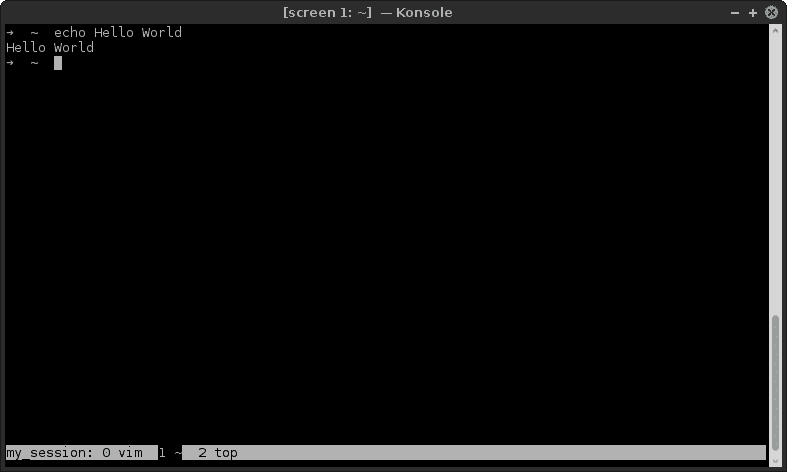

# 学习使用屏幕，一个终端多路复用器

> 原文：<https://dev.to/thiht/learn-to-use-screen-a-terminal-multiplexer-gl>

[屏幕](https://www.gnu.org/software/screen/)或 GNU 屏幕，是一个终端多路复用器。它允许在同一个控制台中管理多个终端会话。在某种程度上，它与现代终端模拟器如[终结者](https://gnometerminator.blogspot.fr/p/introduction.html)或[术语](https://www.enlightenment.org/about-terminology)一样，都有内置的标签系统和布局管理。主要的好处是 screen 也可以通过 SSH 连接工作:您将能够在世界上任何支持 screen 的机器上使用您的屏幕知识和配置！

screen 已经存在了将近 30 年，所以它现在相当稳定。它是在 GPL 许可下发布的。

我在开始使用 screen 时遇到的主要问题是，与简单的终端模拟器相比，它的难度相对较大。所以**我将为实际应用做一次最有用的键盘快捷键之旅**，并与你分享我的屏幕配置。如果你愿意，你也可以直接跳到[备忘单](#cheatsheet-of-the-main-commands)。

## 基本用法

默认情况下不会安装 screen，所以您需要首先使用您的软件包管理器安装它。

为了**启动屏幕**，打开终端并运行命令`screen`。没那么难吧。

我们准备开始学习屏幕。别担心，那只是几个命令！

### 窗口管理

现在你已经打开了屏幕，你需要知道的第一件事是如何**创建一个新的【窗口】**(即一个新的虚拟终端)。为此，按下按键`Ctrl+a`，然后按下`c`。屏幕快捷键都是由`Ctrl+a`(称为“退出键”或“前缀”)后跟另一个键组成的。现在你打开了两个并行运行的窗口，例如，你可以在第一个窗口中运行 vim，在第二个窗口中运行 bash，这就是 screen 的作用。

用`Ctrl+a` `"`可以**可视化所有打开的窗口**。此视图允许您使用箭头键、0-9 数字和回车键在窗口中导航。这个命令很棒，因为它给了你当前会话的全局概览，我一开始经常使用它。

但是有更多的方式来浏览窗口！我个人几乎只使用命令`Ctrl+a` `p` ( **p** 上一个窗口)和`Ctrl + a` `n` ( **n** 下一个窗口)。这些快捷方式需要记住你的窗口，但是需要实践。别忘了`Ctrl+a` `"`会在你有疑问的时候来救你。；)

也可以使用命令`Ctrl+a` *`number`* 跳转到另一个窗口，其中*数字*是 0 到 9 之间的数字。这与`Ctrl+a`视图的“小水”列相匹配。

最后，当你不再需要一个窗口时，你可以**杀死它。为此，只需按下外壳中的`Ctrl+d`。也有一个屏幕命令具有“相同”的效果，但通常这样进行会更好。注意:如果您关闭了一个会话的所有窗口，该会话将终止。**

* * *

总结:

*   `Ctrl+a` `c`创建新窗口
*   `Ctrl+a` `"`可视化打开的窗口
*   `Ctrl+a` `p`和`Ctrl+a` `n`切换上一个/下一个窗口
*   `Ctrl+a` *`number`* 切换到*号*窗口
*   `Ctrl+d`杀死一扇窗户

### 会话管理

现在你可以管理你的窗口了，是时候学习如何管理你的屏幕会话了。

您刚刚了解到可以通过关闭所有窗口来终止一个会话，这是一个好的开始。我们现在来看看如何**退出一个会话而不终止它**。这意味着您将能够并行管理多个持久会话。这称为“分离”会话。明确地说，**分离会话**是在后台仍然活跃的会话，但是没有人连接到其上。**附属会话**是活动的并且当前正在使用的会话。

我要求你做的第一件事是，如果你还没有做的话，终止你当前的屏幕会话。然后通过运行命令`screen -ls`，你可以**列出你所有的屏幕会话**。如果您的所有会话都已关闭，它应该会显示如下内容:

```
No Sockets found in /var/run/screen/S-thiht. 
```

Enter fullscreen mode Exit fullscreen mode

现在，我们将开始一个**新会话**，但是**我们将为其命名**，以便我们稍后可以更容易地回到它。运行命令`screen -S my_session`。如果您运行命令`screen -ls`，您应该会得到类似如下的内容:

```
There is a screen on:
    10321.my_session        (Attached)
1 Socket in /var/run/screen/S-thiht. 
```

Enter fullscreen mode Exit fullscreen mode

因为您已经连接到会话，所以它显示为**附加的**。

现在你已经连接到一个名为“my_session”的会话，你可以用命令`Ctrl+a``d`**将它从当前终端**中分离出来。这将产生如下消息:

```
[detached from 10321.my_session] 
```

Enter fullscreen mode Exit fullscreen mode

像往常一样，您可以用`screen -ls`列出当前正在运行的会话。这次“我的 _ 会话”应该列为**脱离**:

```
There is a screen on:
    10321.my_session        (Detached)
1 Socket in /var/run/screen/S-thiht. 
```

Enter fullscreen mode Exit fullscreen mode

我建议您启动并分离几个屏幕会话，以了解它是如何工作的。**注意不要两次使用同一个会话名称**，屏幕允许这样做，但如果有名称冲突，恢复会话会更痛苦。

对于多个屏幕会话，`screen -ls`给出类似于:

```
There are screens on:
    10474.downloads (Detached)
    10427.work      (Detached)
    10321.my_session        (Detached)
3 Sockets in /var/run/screen/S-thiht. 
```

Enter fullscreen mode Exit fullscreen mode

如果没有任何冲突，您可以用命令`screen -x session_name`简单地**恢复一个会话**。因此，例如，如果您运行`screen -x my_session`，您的会话“my_session”将恢复到您之前打开的窗口！如果你运行`screen -ls`，它应该显示为**附件**:

```
There are screens on:
    10474.downloads (Detached)
    10427.work      (Detached)
    10321.my_session        (Attached)
3 Sockets in /var/run/screen/S-thiht. 
```

Enter fullscreen mode Exit fullscreen mode

你应该知道的最后一件有用的事情是如何**终止一个分离的会话而不连接到它**。为此，要运行的命令有点棘手:`screen -S session_name -X quit`。这意味着您将命令“quit”传递给名为“session_name”的会话。这有点难记，所以我通常简单地恢复我的会话，一个接一个地杀死它的所有窗口。

* * *

总结:

*   `screen -ls`列出会话及其状态
*   `screen -S session_name`以给定的名称开始会话。该名称应该是唯一的
*   `Ctrl+a` `d`分离一个会话
*   `screen -x session_name`在知道会话名称的情况下恢复(重新连接)会话
*   `screen -S session_name -X quit`终止分离的会话

## 高级用法

最难的部分已经过去了！你已经发现了屏幕，你知道如何使用它。你现在需要的就是练习。

在这一节中，我将介绍 screen 的一些有趣的特性，但它们肯定不是使用它所必需的，所以请稍后回来阅读这一部分。

### 布局管理

在引言中，我谈到了终结符和术语如何作为布局管理器工作。好消息是屏幕也允许这样做。所以对**水平分割**，可以使用命令`Ctrl+a` `S`，对**垂直分割**可以使用`Ctrl+a` `|`。

为了**切换到下一个区域**(分割窗格就是这样被调用的)，要使用的命令是`Ctrl+a` `<Tab>`。每个区域的行为都很正常:您可以运行到目前为止学到的任何命令。

要**关闭当前区域**，使用`Ctrl+a` `X`。如果你有很多窗格，你可以**关闭它们，除了当前的**和`Ctrl+a`T3。

* * *

总结:

*   `Ctrl+a` `S`水平分割
*   `Ctrl+a` `|`垂直分割
*   `Ctrl+a` `<Tab>`切换到下一个区域
*   `Ctrl+a` `X`关闭当前区域
*   `Ctrl+a` `Q`关闭除当前区域外的所有区域

### 用缓冲器工作

接下来，我将谈谈 screen 的一个重要特性:复制模式，或称滚动模式。

要**进入复制模式**，命令要么是`Ctrl+a` `<Esc>`要么是`Ctrl+a` `[`，选择你这边。复制模式允许您**在控制台缓冲区中导航，而无需使用鼠标**。由于默认情况下不能使用滚轮滚动，这是返回结果的正常方式。该模式允许您使用一些 vim 命令进行移动(箭头键、`0`、`$`、`g`、`G`等)。).

你可以**复制一些文字**(这就是模式的作用！)通过用空格键标记一节的开始和结束。然后**可以将**与`Ctrl+a` `]`粘贴在一起。欲了解更多信息，请查看`man screen`并寻找“副本”。

* * *

总结:

*   `Ctrl+a` `<Esc>`或`Ctrl+a` `[`进入复印模式
*   `<Space>`在复印模式下选择并复印一些文本
*   `Ctrl+a` `]`粘贴缓冲区的内容

### 会话共享

我将用我想让你们知道的最后一个屏幕特性来结束:它允许在多个用户之间共享一个会话。在远程服务器上工作时，这非常方便。

所以首先，你要像往常一样开始一个疗程。然后，我们将使用 screen 的命令模式来启用多用户模式，并将访问权限授予一些用户。要**进入命令模式**，键入`Ctrl+a` `:`。然后**可以通过命令**多用户开启**来启用多用户模式**。

然后到**添加一个特定的用户到会话**，用`Ctrl+a` `:`再次进入命令模式，输入命令**ACL add*username***(ACL 代表“访问控制列表”)，用你想要添加的用户名代替 *username* 。

用户*用户名*现在只需通过命令`screen -x your_username/session_name`就能**加入你的会话**。会话是完全共享的，这意味着你可以实时看到其他用户在做什么，他们也可以。

当一个会话被多个用户共享时，**知道当前谁在连接它会很好**。您可以通过命令`Ctrl+a` `*`获得这些信息和更多信息。该视图显示了一些有用的信息，即用户当前使用的窗口，或者他们的权限。

最后，您可以在命令模式下使用命令 **acldel *username*** 来**撤销用户**的访问权限。要管理共享会话，您还可以做更多的事情，但我不会详细介绍，手册页涵盖了所有内容。现在你对 screen 有了基本的了解，应该就比较容易理解了。

* * *

总结:

*   `Ctrl+a` `:`切换到命令模式

    *   “多用户开启”启用多用户模式
    *   “acladd *username* 将访问权限授予用户 *username*
    *   “acldel *username* 删除用户 *username* 的访问权限
*   `screen -x owner/session_name`加入由其他用户启动的会话

*   `Ctrl+a` `*`列出会话的其他连接

## 实用提示

### 自动列出屏幕会话

当我启动我的终端时，我喜欢它列出当前的屏幕会话。为此，我简单地将`screen -ls`命令添加到我的. bashrc 中。所以现在每当我打开一个终端时，我都欢迎我的屏幕状态:

```
There are screens on:
    2927.my_screen3 (Attached)
    2882.my_screen2 (Attached)
    2840.my_screen1 (Detached)
3 Sockets in /var/run/screen/S-thiht. 
```

Enter fullscreen mode Exit fullscreen mode

不求有这个状态不仅真的很有用，还能很好的想到一直用屏幕。

### 好别名

正如你现在所知道的，screen 使用了很多选项。我试着在这篇文章中只保留最有用的，但是记住它们还是很痛苦。记住它们的一个好方法是使用别名。我个人用以下:

```
alias sn='screen -S'  # sn for screen new
alias sl='screen -ls' # sl for screen list
alias sr='screen -x'  # sr for screen resume
function sk() {
  # sk for screen kill
  # function instead of alias because the order of the parameters matters
  screen -S "$1" -X quit
} 
```

Enter fullscreen mode Exit fullscreen mode

这些别名与任何标准都不冲突，而且它们更容易记忆和输入，所以我强烈建议您使用它们！

### 自定义配置

可以通过位于您的个人文件夹中的. screenrc 文件以各种方式自定屏幕。状态栏是最有用的技巧之一。

[T2】](https://res.cloudinary.com/practicaldev/image/fetch/s--mutqokeO--/c_limit%2Cf_auto%2Cfl_progressive%2Cq_auto%2Cw_880/https://i.imgur.com/ZYEdvln.png)

我就不细说 screen 的配置了(可以看`man screen`或者其他文章了解更多)，简单分享一下我的评论。screenrc with you:

```
# enable the altscreen
# for example in vim, it allows to scroll with the mouse without
# "overflowing" on the terminal
# also it doesn't "pollute" the terminal when you quit vim
altscreen on

# automatically detach the session if the terminal is closed
autodetach on

# larger command history
defscrollback 10000

# set the encoding of the windows to utf-8
defutf8 on

# disable the startup message
startup_message off

# allow to scroll
termcapinfo xterm* ti@:te@

# disable the annoying visual bell
vbell off

# status bar
# %{= wk}: set the color to white on black
# %S: screen session name
# %-w: previous windows
# %{= kw}: set the color to black on white
# %n: current window number
# %t: current window title
# %{= wk}: set the color to white on black
# %+w: next windows
caption always "%{= wk}%S: %-w%{= kw}%n %t%{= wk}%+w" 
```

Enter fullscreen mode Exit fullscreen mode

注意您可以直接从屏幕的命令模式中启用这些选项。

### 主命令清单

#### 基本用法

| 命令 | 描述 |
| --- | --- |
| `screen` | 开始会话 |
| `screen -ls` | **列出**会话及其状态 |
| `screen -S session_name` | 开始一个名为“会话名称”的会话 |
| `screen -x session_name` | 恢复名为“会话名称”的会话 |
| `screen -S session_name -X quit` | 终止名为“会话名称”的会话 |

| 命令 | 描述 |
| --- | --- |
| `Ctrl+a` `c` | 创建一个新窗口 |
| `Ctrl+a` `k` | **K** 生病当前窗口( [`Ctrl+d`](https://en.wikipedia.org/wiki/End-of-transmission_character) 也是如此) |
| `Ctrl+a` `"` | 列出打开的窗口 |
| `Ctrl+a` `p` / `n` | 转到 **p** 上一页/ **n** 下一页窗口 |
| `Ctrl+a` `0` - `9` | 转到窗口 *n* |
| `Ctrl+a` `d` | **D** 获取屏幕会话 |
| `Ctrl+a` `:` | 进入命令模式 |

#### 拆分模式

| 命令 | 行动 |
| --- | --- |
| `Ctrl+a` `S` | 水平分割 |
| `Ctrl+a` `❘` | 垂直拆分 |
| `Ctrl+a` `<Tab>` | 前往下一个区域 |
| `Ctrl+a` `X` | 关闭当前区域 |
| `Ctrl+a` `Q` | 关闭除当前区域之外的所有区域 |

#### 复制模式

| 命令 | 行动 |
| --- | --- |
| `Ctrl+a` `<Esc>` / `[` | 进入复印模式 |
| `<Space>` | 标记选择 |
| `Ctrl+a` `]` | 粘贴缓冲区的内容 |

#### 共享会话

| 命令 | 行动 |
| --- | --- |
| `Ctrl+a``:`T2】 | 启用多用户模式 |
| `Ctrl+a``:`T2】 | 授予用户名对*的访问权限* |
| `Ctrl+a``:`T2】 | 撤销对*用户名*的访问权限 |
| `Ctrl+a` `*` | 列出会话的其他连接 |
| `screen -x owner/session_name` | 加入由另一个用户启动的会话 |

## 结论

如果你经常使用终端，屏幕是一个强大的工具。然而，它也有一些缺点，这可能是相当恼人的。列举一些如果你真的尝试使用它，你会遇到的情况:

*   错误的 UTF-8 支持。有一些配置可以让屏幕很好地使用 unicode，但还是有点乱。我甚至不确定是否有合适的方法来处理状态栏中的 UTF 8 字符...
*   疯狂的状态栏配置。你可以在。我提供的 screenrc，制作一个整洁的状态栏真的很难。考虑到它们有多有用，这是一种耻辱！

好消息是，所有这些问题据称都通过另一个最新的终端多路复用器 [tmux](https://tmux.github.io/) 解决了。我只是用它来代替 screen 几天，所以我会等一会儿再评价它，但它的用法和 screen 非常相似，到目前为止我对它非常满意。