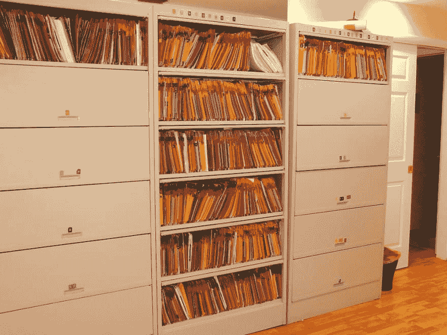

# 但是这个世界是可变的

> 原文：<https://dev.to/ericnormand/but-the-world-is-mutable>

不变性是一个很难突破的话题。作为一名习惯于建模世界的程序员，您可能会反对不可变的数据结构。你如何为一个变化的世界建模？世界上的一切都是可变的，为什么你会选择使用不可变的数据结构？

让我们做一个小小的思维实验。让我们来看看**一个漂亮的可变系统**:纸和铅笔。你可以写，擦除，再写。很方便。它让你改正错误。而当你不再需要某样东西的时候，你可以很容易地把它抹掉。

现在回答这个问题:**你会相信一家用铅笔记录交易的银行吗？这很简单:只要你取钱，他们就会删除旧的余额，写下新的余额。如果你把钱从一个账户转到另一个账户，他们会删除两个余额，并写入新的余额。这听起来可能很棒，但银行不使用铅笔是有原因的:他们想确保**一切都没有改变**。这听起来像是不变性。**

[T2】](https://res.cloudinary.com/practicaldev/image/fetch/s--ONRttb1y--/c_limit%2Cf_auto%2Cfl_progressive%2Cq_auto%2Cw_880/https://thepracticaldev.s3.amazonaws.com/i/bw4aqj5bmc34ryaz525f.jpg)

这是银行分类账。每个事务都有自己的行。总是用笔完成。这是只附加数据结构的一个例子。你可以回答关于过去的问题，比如“上周二收盘时账户里有多少钱？”逐行向上，直到找到星期二的最后一个条目。您可以这样做，因为您从不修改现有的条目。您只能在空行中添加新条目。

[T2】](https://res.cloudinary.com/practicaldev/image/fetch/s--AD99qRti--/c_limit%2Cf_auto%2Cfl_progressive%2Cq_auto%2Cw_880/https://thepracticaldev.s3.amazonaws.com/i/usm5advdya6ss4cz6g8h.jpg)

这是现实世界中只附加数据结构的另一个例子:病历。每个病人都有一个文件，所有的东西都被添加进去。你从不修改旧记录。这样，一切都被记录下来，甚至是医生的错误诊断。

原来，传统的信息系统需要高度的可靠性，用可变的纸张创建不可变的记录。尽管理论上你可以划掉一些数据重新写一遍，或者涂掉它，或者找到一些其他方法来改变文档，但职业精神的一个标志是**训练自己严格遵守只附加行为**。

如果机器能替我们遵守纪律，那不是很好吗？即使 RAM 和磁盘像纸和笔一样是可变的，我们也可以在程序内部强加一个规则。我们*可以*依靠程序员永远不会意外覆盖现有数据。但那只是转移负担。相反，我们可以在我们的数据结构中建立不变性，并制作一张不会被覆盖的纸。

这就是不可变数据结构的工作方式。所有新的信息都被写入内存中的新位置。只有当证明某个位置永远不会再被使用时，它才会被重用。

可靠的基于纸张的系统使用不可变的数据。曾经有一段时间，计算机内存很贵，我们必须重复使用存储，所以我们不能制造不可变的系统。但是 RAM 现在很便宜！我们应该使用不可变的数据，就像银行几百年来所做的那样。准备好加入 13 世纪了吗？ [1](#fn1)

如果你对一种拥有强大的不可变数据结构的语言感兴趣，可能是任何语言中最先进的不可变数据结构。在 [PurelyFunctional.tv](https://purelyfunctional.tv) 查看 [*LispCast 对 clo jure*T5 的介绍。这是一个视频课程，有动画、练习和截屏，教你 Clojure。](http://www.purelyfunctional.tv/intro-to-clojure)

图片来源:[台账](https://www.nottingham.ac.uk/manuscriptsandspecialcollections/researchguidance/accounting/business.aspx)和[病历](https://www.flickr.com/photos/digitaldrew/4930438982/)

* * *

1.  复式记账法的历史可以追溯到 13 世纪的佛罗伦萨。 [↩](#fnref1)