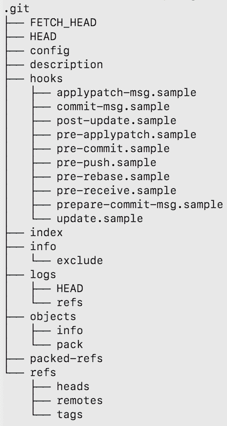
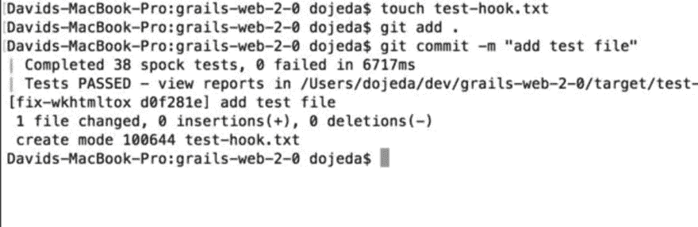
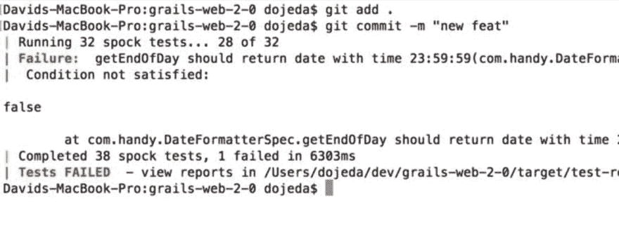

# 使用 Git 进行门控提交

> 原文：<https://dev.to/david_ojeda/gated-commits-with-git>

门控提交，也称为**预测试**提交，是一种集成模式，在这种模式下，只有对提交的代码运行一组测试后，提交才会被批准。换句话说，如果测试套件失败，提交就不会进行。

**为什么要这样？这使得你的应用程序对变化更有弹性，因为现在你甚至在代码对其他人可用之前就在运行一组或一个子集的测试。**

我将向您展示如何用 Git 实现门控提交模式。在这个例子中，我们的**单元测试套件**将是*门*，允许我们的提交进入代码库。

* * *

## 你需要什么？

*   饭桶
*   您的应用程序的 Git repo
*   测试套件

### 开始:Git 挂钩

我们希望我们的测试在提交通过之前运行。多亏了 Git 钩子，Git 允许我们在事件发生之前运行定制命令。我不打算详细介绍它们是如何工作的，但是对我们来说，有一个钩子叫做**预提交**。这个钩子在提交发生之前执行。这是我们测试套件运行的完美地点。

### 设置提交前挂钩

在您的 Git repo 中，有一个名为。存储钩子的 git。如果您从未修改过任何钩子，那么您的。git 目录结构将如下所示:

[T2】](https://res.cloudinary.com/practicaldev/image/fetch/s--OhtsWgiB--/c_limit%2Cf_auto%2Cfl_progressive%2Cq_auto%2Cw_880/https://thepracticaldev.s3.amazonaws.com/i/ldij14knuw0xko7a2dcq.png)

为了创建我们的钩子，我们需要在我们的**钩子**目录中有一个名为**预提交**(不需要扩展名)的文件。让我们创造它。该文件唯一需要的是您用来运行测试的命令。另外，不要忘记使文件可执行(chmod +x)。

如果你的应用程序是一个 Ruby 应用程序，你可能会使用 **rake** 来运行你的测试。如果是这样，您的**预提交**文件将如下所示:

`rake test:units`

或者，如果你对 JS 很感兴趣，你可以在你的文件中找到这个:

`npm tests`

不管你使用的是什么语言/框架，你的预提交钩子都需要有命令来运行你的单元测试套件。而且，只要钩子内部的代码返回一个**零退出代码**，钩子就会允许代码被提交。否则，提交将被拒绝。

### 测试

此时，您可以继续进行提交，并查看我们的测试是如何运行的(并有希望通过)，从而打开大门，让提交无竞争地通过。

在下面的例子中，我使用的是一个 Grails 应用程序，预提交挂钩包含以下代码:

`grails test-app -unit`

[T2】](https://res.cloudinary.com/practicaldev/image/fetch/s--tbgaIl-A--/c_limit%2Cf_auto%2Cfl_progressive%2Cq_auto%2Cw_880/https://thepracticaldev.s3.amazonaws.com/i/0oemd9h0kt5luq5ag79g.png)

#### **成功！** 🥳

如果测试套件失败:

[T2】](https://res.cloudinary.com/practicaldev/image/fetch/s--yaCCafcA--/c_limit%2Cf_auto%2Cfl_progressive%2Cq_auto%2Cw_880/https://thepracticaldev.s3.amazonaws.com/i/4g9jrtcxh85z1av658vq.png)

#### 悲伤的脸🙁

### 包扎

我们刚刚创建了一个 Git 预提交钩子，它包含了执行我们应用的单元测试套件的特定命令。**每当提交被发出**，我们的测试就会运行。如果测试通过，我们有一个成功的提交，如果没有，提交被拒绝。

您可以扩展预提交钩子的测试，并根据您的需要构建一些复杂的东西**。例如，您可以运行一个 linter 工具来确保遵循样式指南。或者更上一层楼，使用额外的钩子将其与您的持续集成流程集成。**

希望这能帮助你在你的代码库中建立更多的弹性，并最终以一种**安全和快速**的方式向你的客户交付更多的价值！