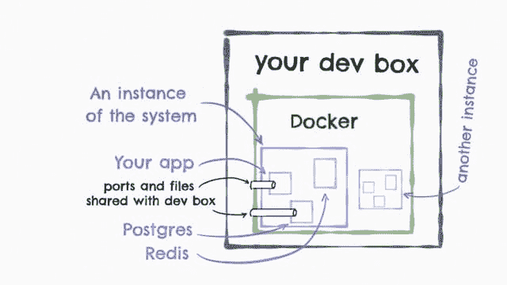

# 为什么要构建您的开发环境

> 原文:[https://dev . to/danlebrero/why-to-docker-compose-your-developer-environment](https://dev.to/danlebrero/why-to-docker-compose-your-developer-environment)

*本文原载于[我的博客](http://danlebrero.com/2017/09/01/a-docker-compose-environment/)T3】*

新工作的乐趣。

你在第一天到达那里，在介绍之后，你被给予你的第一个任务:在你的开发箱上启动并运行项目。

该任务附带一个指向 wiki 的链接，其中包含说明:

1.  下载
2.  安装
3.  跑”。/build - special-flag "
4.  将 Z 复制到 W
5.  确保 foo 而不是 bar
6.  ...

你知道它会如何结束。如果你有任何疑问，你的新老板会证实:

“它可能有点过时了，所以如果你发现任何问题，请更新它好吗？”

两天后，你得意洋洋地出现了，为你的成就感到骄傲，脸上带着微笑:你更新的指令是如此准确，下一个加入的人将永远感激你。

## 或者也许不是

鉴于团队的每个成员只需要通过一次考验，维基上的说明似乎是一个足够好的解决方案...除了当:

1.  你会得到一个崭新闪亮的开发箱。
2.  你的开发盒没电了。
3.  你转移到另一个项目。
4.  六个月后，你回到原来的项目。什么都不管用了。
5.  一个新特性需要 Zookeeper，并且每个人都要配置一个本地 Zookeeper 集群！
6.  你的操作系统升级了,“在这里插入你最喜欢的数据库”不想再启动了。欢迎来到 DLL 地狱。
7.  您的团队仍然维护的旧项目需要 Maven 2.1.1，但当前项目需要 3.3 以上的版本，并需要 Postgres 7.1，但新项目需要至少 9.5 的 PostPic 和 OpenFTS 扩展。
8.  Polyglot 微服务公司！安装 maven，gradle，npm，yarn，node，make，go，ruby，rake，lein，sbt，rebar，cassandra，mongodb，redis，postgresql，couchbase…

但是有时候，一些组件，因为一些未知的原因，莫名其妙地停止工作，并且永远不会再次启动。

## 输入复合码头

Docker Compose 是一个工具，允许使用一个文件定义一个多容器系统，并在 Docker 中运行它们，创建一个专用网络来隔离系统。

将启动 Postgres 和 Redis 的 Docker 编写文件非常简单:

```
version: "3"
services:
  postgres:
    image: postgres:9.5
    volumes: 
      - ./db-provision:/docker-entrypoint-initdb.d/
    ports: 
      - 5432:5432
  redis:
    image: redis:3.2.9 
```

<svg width="20px" height="20px" viewBox="0 0 24 24" class="highlight-action crayons-icon highlight-action--fullscreen-on"><title>Enter fullscreen mode</title></svg> <svg width="20px" height="20px" viewBox="0 0 24 24" class="highlight-action crayons-icon highlight-action--fullscreen-off"><title>Exit fullscreen mode</title></svg>

您可以为您的项目配置容器，Docker Compose 将能够创建一个新的环境，在内部容器和您的 dev box 之间映射一些端口和文件。

类似于:

[T2】](https://res.cloudinary.com/practicaldev/image/fetch/s--eDd9oKK9--/c_limit%2Cf_auto%2Cfl_progressive%2Cq_auto%2Cw_880/http://danlebrero.cimg/blog/dev-setup-diagram.jpg)

使用 Docker Compose 来设置和运行我们的本地开发环境为我们提供了:

| 什么 | 怎么 |
| --- | --- |
| 设置和启动系统的一个命令 | *坞站-合成* |
| 升级或添加新组件的一个命令 | *坞站-合成 up - build* |
| 一个停止系统的命令 | *坞站-化合物停止* |
| 一个清除系统痕迹的命令 | *docker-compose down-remove-orbonds-RMI all* |
| 精确且可重复的过程 | Docker 合成文件将由机器执行，因此没有不精确的空间。请确保您使用的是不可变版本的图像。 |
| 一个永不过时的过程 | 由于团队将每天使用 Docker Compose 进行开发，并且系统中的任何更改都必须在 Docker 文件中完成，因此指令不会过时。 |
| 可以进行版本控制的过程 | Docker 文件是纯文本的，它们将与项目源代码的其余部分放在一起，它们将被同行评审，... |
| 允许实验的过程 | 因为破坏和重建系统很容易，而且 Docker 文件可以回滚，所以尝试新版本的组件或修改配置没有任何风险。 |
| 一种运行同一项目的多个版本或同时运行多个项目的方式 | 不幸的是，这可能需要一些手工操作来重新映射 Docker 编写文件中暴露的一些端口，但至少所有端口都在一个文件中。
之后就是一个简单的:*docker-compose-p my-project-one up-d；docker-compose-p my-project-again up* |

## 一个类似生产的环境还是不是？

当谈到 Docker 时，通常提到的一个好处是它允许人们在任何地方运行类似生产的环境。

这确实是一个很大的好处。您的 CI 服务器应该针对类似生产的版本运行其测试，并且您应该能够在本地运行这样的版本，但是对于日常的开发体验，您想要一个允许快速反馈周期的设置。

例如，您不希望每次更改时都最小化 JavaScript 文件，您可能希望进行某种自动刷新。

快速反馈更重要。

这个开发环境应该包括您的项目需要的任何构建工具，因此您的设置指令不应该有任何“安装 maven/npm”步骤。这些工具应该包含在 Docker 容器中。这样，团队中的每个人都将在相同的操作系统版本中使用相同的工具版本。

## 结论

即使您不在生产中使用 Docker，仅仅是为了使设置或升级开发环境成为一个平淡无奇的过程，使用它也是非常值得的。

这个过程应该尽可能接近“docker-compose up”。仅此而已。

不要把你的 dev box 当作某个大的全局可变变量。使用 Docker Compose 将它视为一个很好的不可变组件。

这里有一个关于如何 Docker 构建本地开发者环境的详细例子。