# 深入研究一个图:DFS 遍历

> 原文：<https://dev.to/vaidehijoshi/deep-dive-through-a-graph-dfs-traversal>

<figure> 

<figcaption>深度优先搜索图遍历</figcaption>

</figure>

不管是好是坏，做一件事总有不止一种方法。幸运的是，在软件和计算机科学领域，这通常是一件非常好的事情。

为什么它是好的？嗯，首先，我非常喜欢各种选择，并且有很多选择。但实际上，这都归结于不同类型的问题——其中一些问题看起来与我们以前见过的问题相似——以及最适合解决这些问题的各种解决方案。对于看似最简单的问题来说，情况确实如此:以排序为例。正如我们在本系列前面所学的，有许多不同的方法来做一些基本的事情，如对一系列数字进行排序并按顺序排列。事实上，选项的多样性往往*正是*使得一个本应“基本”的任务看起来复杂得多。

然而，事情是这样的:如果我们能够设法爬过过度复杂的驼峰，并以某种方式到达另一边，那么我们可以开始看到所有这些不同的解决方案都来自于解决相似的，但*非常细微不同的*问题的需要。我们所知道的许多排序算法的起源就是如此(希望大家喜欢！)，图遍历算法也是如此。上周，我们学习了一种解决遍历图问题的方法:[广度优先搜索](https://dev.to/vaidehijoshi/going-broad-in-a-graph-bfs-traversal)。今天，我们将翻转这种方法，看看一个类似的解决方案，但也是 BFS 的逆。

所以，废话不多说:让我们直入深水区，好吗？

### 一本入门书，深入之前

了解任何算法如何工作以及它做什么的第一步是了解算法*不*做什么。换句话说，当我们在学习新的东西时，将我们正在学习的新东西与我们已经很熟悉并且感觉相当舒服的东西进行比较是很有用的。

当我们开始研究更复杂的算法，比如图遍历算法时，情况尤其如此。所以，让我们从一个定义开始，然后看看深度优先搜索与我们已经熟悉的另一个图遍历算法:广度优先搜索相比如何。

<figure>[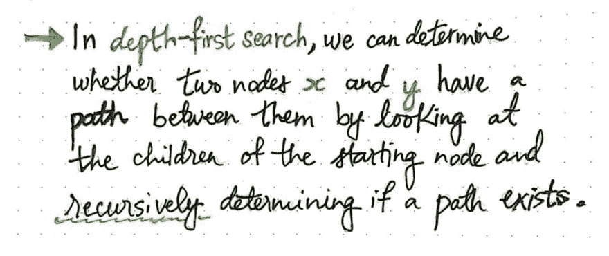](https://res.cloudinary.com/practicaldev/image/fetch/s--43TefFW2--/c_limit%2Cf_auto%2Cfl_progressive%2Cq_auto%2Cw_880/https://cdn-images-1.medium.com/max/1024/1%2Ar8Nv9NUGvqfdNEhQ3S9CTw.jpeg) 

<figcaption>深度优先搜索:定义</figcaption>

</figure>

***深度优先搜索*** 算法允许我们确定两个节点，节点 *x* 和节点 *y* 之间是否有路径。DFS 算法通过查看起始节点 node *x* 的所有子节点来做到这一点，直到它到达 node *y* 为止。它通过递归地一次又一次地采取相同的步骤来做到这一点，以便确定两个节点之间是否存在这样的路径。

现在，如果我们将 DFS 与我们所知的 BFS 或 T2 广度优先搜索[进行对比，我们会开始发现，虽然这两种算法*看起来*相似，但它们从根本上做着两种截然不同的事情。这两种算法的显著区别在于它们处理遍历图形问题的方式。正如我们上周所发现的，BFS 算法将遍历一个图*，一次一级*，访问任何给定顶点的所有子节点——与图中的“父节点”等距的相邻节点。](https://dev.to/vaidehijoshi/going-broad-in-a-graph-bfs-traversal)

<figure>[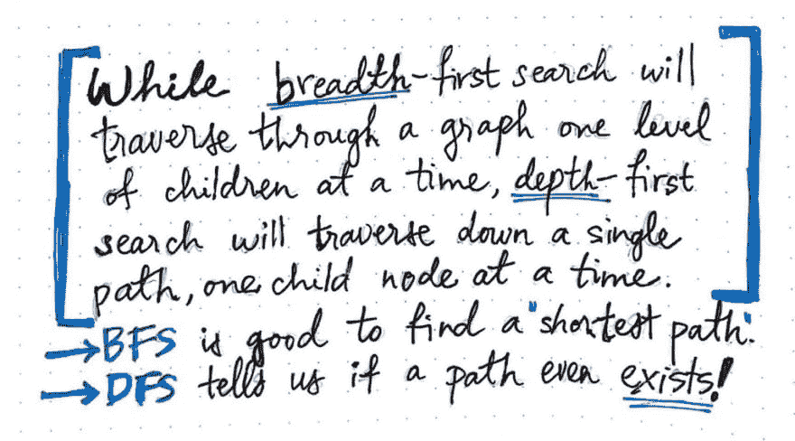](https://res.cloudinary.com/practicaldev/image/fetch/s--kJPRgJSx--/c_limit%2Cf_auto%2Cfl_progressive%2Cq_auto%2Cw_880/https://cdn-images-1.medium.com/max/1024/1%2Ari9EgM7xLmrZmywgwt96pQ.jpeg) 

<figcaption>比较 DFS 到 BFS 图遍历</figcaption>

</figure>

然而，深度优先搜索采用了一种不同方法:它沿着图中的一条路径向下遍历，直到它不能再继续遍历，一次检查一个子节点。

> 深度优先算法坚持一条路径，沿着这条路径沿着图结构向下，直到它结束。然而，广度优先搜索方法平等地评估来自给定节点的所有可能路径，一起检查来自一个节点的所有潜在顶点，并同时比较它们。

就像建筑和生物学一样，在这种情况下，古老的格言听起来是正确的:形式确实遵循功能。也就是说，这两种算法设计的*方式*有助于我们了解它们的优势所在！广度优先搜索旨在帮助我们确定图中两个节点之间的一条(有时是多条)最短路径。另一方面，深度优先搜索被优化不是为了告诉我们一条路径是否最短，而是告诉我们这条路径*是否存在！*

而且，正如我们可能想象的那样，不同的情况、问题和图表会引导我们选择这些算法中的一个而不是另一个。但是，我们稍后会回到这个话题。现在，让我们专注于更好地了解深度优先搜索。

深度优先搜索是一种特别有趣的算法，因为我们可能都在生活中的某个时候使用过它的一些变体，不管我们是否意识到了这一点。推理图中深度优先搜索的最简单方法是将其简化为一个更简单的问题。

<figure>[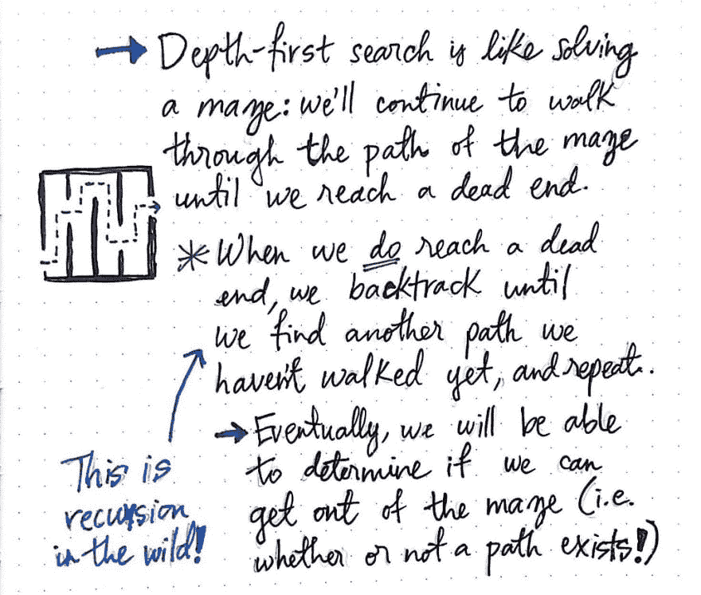](https://res.cloudinary.com/practicaldev/image/fetch/s--4VSEWFpb--/c_limit%2Cf_auto%2Cfl_progressive%2Cq_auto%2Cw_880/https://cdn-images-1.medium.com/max/1024/1%2AcskJKPVMALaDnD2WMyJENA.jpeg) 

<figcaption>深度优先搜索:解决迷宫</figcaption>

</figure>

DFS 算法很像解决一个迷宫。如果你曾经去过现实生活中的迷宫，或者发现自己在纸上解出了一个迷宫，那么你就知道解出迷宫的诀窍是沿着一条路走，直到你再也走不动为止，然后沿着原路返回，直到你找到另一条可以走的路。

在其核心，这就是深度优先搜索算法的全部:一种走出迷宫的方法！而且，如果我们把每个图都想象成一个迷宫，那么我们可以使用 DFS 来帮助我们“解决和遍历它”。

用这个比喻来说，当我们使用 DFS 时，我们真正做的只是继续沿着图的路径走，直到我们到达一个死胡同。如果当我们到达一个死胡同，我们就往回走，直到找到另一条我们还没有走过或走过的路，然后重复这个过程。最终，我们将能够确定我们是否能够走出迷宫——也就是说，在起始节点和结束节点之间是否存在一条路径。

在我们开始将所有这些 DFS 理论付诸实践之前，需要注意一件有趣的事情:在一个死胡同中回溯，然后*重复*沿着图的一条路径走下去的过程实际上只是 ***递归*** ！我们一次又一次地采取相同的动作，用编程的术语来说，这将最终成为一个*递归函数调用*，或者一个调用自身直到遇到某种基本情况的函数。我们马上会看到，递归在 DFS 的实际运行中起着很大的作用。

### 深度优先，在行动

就像我们上周在[探索 BFS](https://dev.to/vaidehijoshi/going-broad-in-a-graph-bfs-traversal) 中看到的一样，我们可以用类似的方式开始用 DFS 遍历一个图——在我们想要的任何地方！

当涉及广度优先搜索和深度优先搜索时，在启动图遍历时，只需要记住两个要点:首先，我们可以选择任意节点开始遍历，因为不存在像树结构中那样的“根节点”概念。第二，无论我们做什么，我们都要确保不重复任何节点；也就是说，一旦我们“访问了一个节点，就不想再访问了。与广度优先搜索算法类似，我们将访问的每个顶点标记为“已访问”,以确保我们不会在遍历中不必要地重复节点。

<figure>[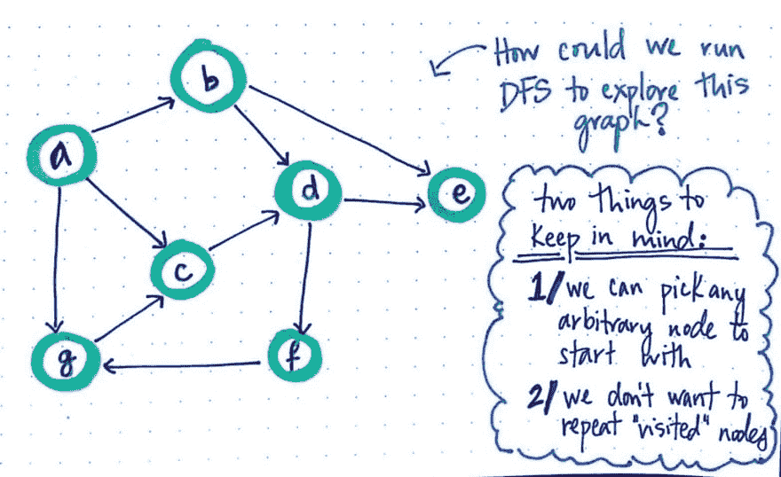](https://res.cloudinary.com/practicaldev/image/fetch/s--kpLXF25e--/c_limit%2Cf_auto%2Cfl_progressive%2Cq_auto%2Cw_880/https://cdn-images-1.medium.com/max/1024/1%2AC0rdUgzEHmkfugo8NqcDkw.jpeg) 

<figcaption>我们如何运行 DFS 来探索一个有向图呢？</figcaption>

</figure>

所以，让我们试着在上面的有向图上运行一个 DFS 算法，它有七个节点，我们最终需要检查，或者“在我们的图遍历过程中访问”。

我们可以任意选择任何节点开始，让我们选择节点 a 作为我们的开始“父节点”。因为我们知道深度优先搜索是为了找出两个节点之间是否存在路径，所以我们希望确保在遍历图表时能够跟踪我们从哪里来——换句话说，我们需要在遍历时保留某种“面包屑”痕迹。

<figure>[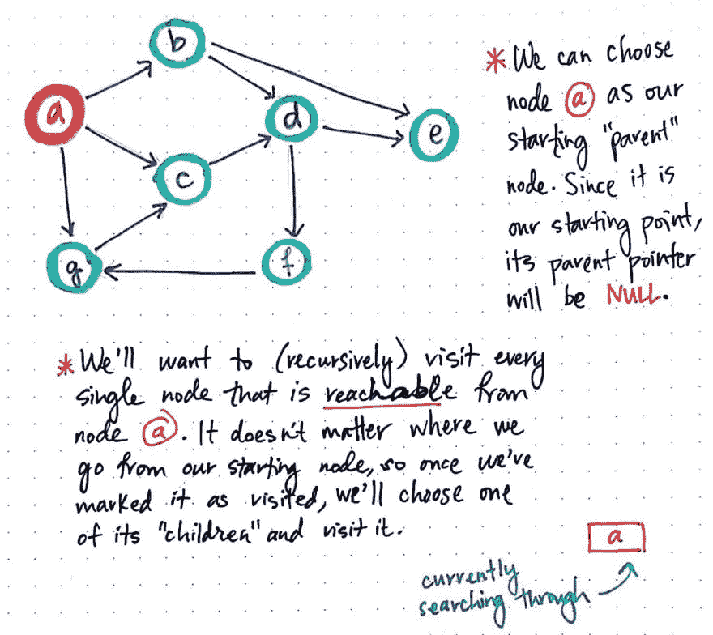](https://res.cloudinary.com/practicaldev/image/fetch/s--u8nyBETf--/c_limit%2Cf_auto%2Cfl_progressive%2Cq_auto%2Cw_880/https://cdn-images-1.medium.com/max/1024/1%2ArtE7sILnQD0kMkIgvO3I1g.jpeg) 

<figcaption>DFS，part 1</figcaption>

</figure>

对于我们访问的每个节点，我们将跟踪我们从哪里来，并在需要时使用它来*回溯*，并且作为一种简单的方法来跟踪我们在图中构建的路径。当我们选择节点 a 作为“父节点”时，我们将设置一个父指针引用，就像我们对 BFS 算法所做的那样。因为“父顶点”是我们在这个算法中访问的第一个顶点，所以它没有“父指针”，因为我们不是从任何地方来的！

因此，我们将节点 a 的父指针设置为空，并将节点 a 标记为“已访问”。跟踪我们当前正在搜索的节点的一个简单方法是使用堆栈数据结构。当我们检查节点 a 的时候，我们可以把它放到栈顶。因为我们的栈一开始是空的，节点 a 是栈中唯一真正的*元素。我们会将它标记为“已访问”。*

接下来，我们将想要(递归地)访问从节点 a*可达*的每一个节点。正如我们从哪个节点开始并不重要，*我们接下来访问哪个*相邻顶点也不重要——只要该顶点是可达的，并且是 a 的邻居之一。例如，我们可以任意选择接下来访问节点 c。

<figure>[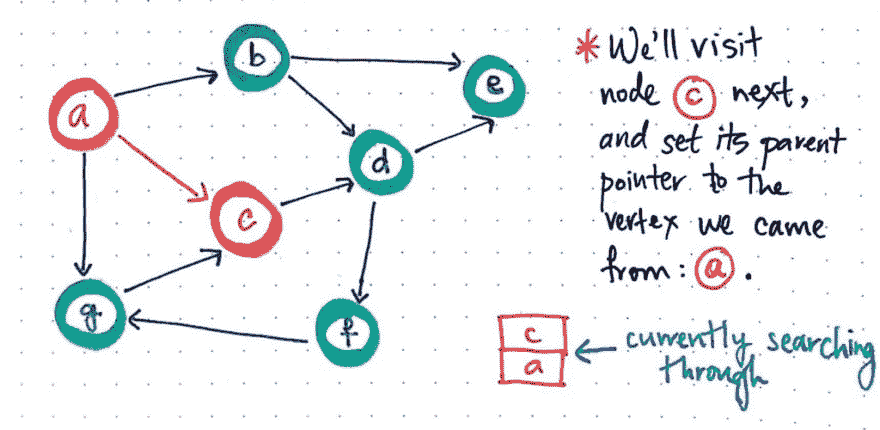](https://res.cloudinary.com/practicaldev/image/fetch/s---EAr6YnM--/c_limit%2Cf_auto%2Cfl_progressive%2Cq_auto%2Cw_880/https://cdn-images-1.medium.com/max/1024/1%2Aku4di0nVGwOpRMugZImJ3g.jpeg) 

<figcaption>DFS，part 2</figcaption>

</figure>

我们将它推到堆栈上，堆栈现在包含两个元素——对节点 a 的引用和对节点 c 的引用——我们将访问当前位于堆栈顶部的节点。在这个过程中，我们将把它的父指针设置为我们刚刚来自的顶点:节点 a。

<figure>[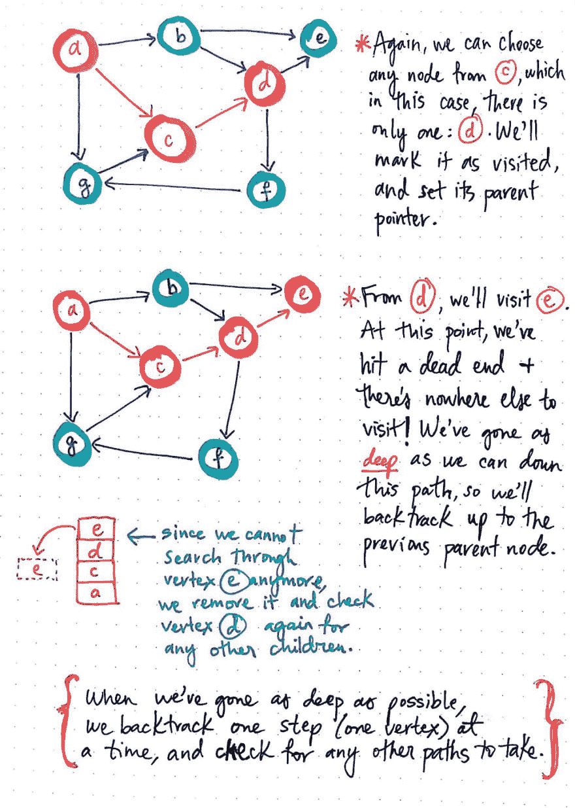](https://res.cloudinary.com/practicaldev/image/fetch/s--nx5E_xaG--/c_limit%2Cf_auto%2Cfl_progressive%2Cq_auto%2Cw_880/https://cdn-images-1.medium.com/max/1024/1%2AtDeTb8HZwxr6Ot_0ThGygw.jpeg) 

<figcaption>DFS，part 3</figcaption>

</figure>

现在我们已经访问了节点 c，只剩下一件事要做:涂肥皂，冲洗，然后重复！好吧，好吧——你可以跳过前两个。实际上，我们需要做的只是重复这个过程(显然，泡沫是可选的)。

例如，因为我们可以选择从节点 c 可到达的任何节点，所以我们可以选择节点 d 作为我们访问的下一个节点。我们将它添加到堆栈的顶部，标记为“已访问”，并设置其父指针。

从节点 d，我们将访问节点 e:将它添加到堆栈中，标记为“已访问”，最后，将它的父指针设置为指向我们刚刚来自的节点:节点 d。

但是现在我们有一个问题:我们不能重复这个过程，因为从节点 e 根本没有*无处* *可去*！

> 我们已经从我们开始的节点沿着这条特定的路径尽可能地深入下去，我们已经进入了一个死胡同；也就是说，我们已经到达了一个没有可达顶点的节点！

考虑到我们的难题，让我们暂停一会儿，看看我们的“已访问节点”堆栈，它包含以下节点:e、d、c 和 a，从堆栈的顶部到底部依次排列。由于从节点 e 无处可去*，我们实际上没有其他节点可访问，这意味着我们没有其他节点可添加到栈顶。至少，给定我们当前的位置，在节点 e。但是，节点 d，堆栈中的第二个元素*可能*有去处，对吗？*

这正是回溯和“面包屑”思想发挥作用的地方——更不用说递归了！当我们尽可能深入图表时，我们可以一次回溯一步(一个*顶点*),并检查是否有我们可能采用的任何其他路径。

因此，因为我们不能搜索从顶点 e 开始的任何路径(因为不存在路径)，所以一旦完成，我们就把顶点 e 从栈顶弹出。这使得节点 d 位于堆栈的顶部，因此我们将再次重复相同的过程——也就是说，我们将检查是否可以访问节点 d 的任何邻居，以及是否存在从该节点沿图向下的路径。

<figure>[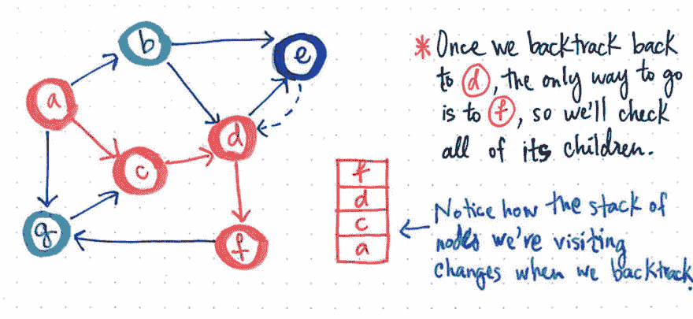](https://res.cloudinary.com/practicaldev/image/fetch/s--D_0Xx1z2--/c_limit%2Cf_auto%2Cfl_progressive%2Cq_auto%2Cw_880/https://cdn-images-1.medium.com/max/1024/1%2AVXU_4YSDmTqvUaz30Oi5BA.jpeg) 

<figcaption>DFS，part 4</figcaption>

</figure>

一旦我们从节点 e 回溯到 d，我们会注意到只有一个方向可供我们去；只有一个节点需要检查，即节点 f。我们将把它添加到堆栈的顶部，标记为已访问，并检查它是否有我们可以访问的子节点。

我们会注意到，在我们回溯并更改了我们正在检查、查看或“访问”的节点之后，栈顶发生了变化。我们去掉了一些节点，并添加了其他节点，但是主父节点保持不变。我们一次又一次地重复相同的步骤，将每个节点添加到堆栈的顶部———这些步骤与我们第一次开始时将父节点顶点 a 添加到堆栈时检查它的步骤相同！这是*递归*开始发挥作用。

<figure>[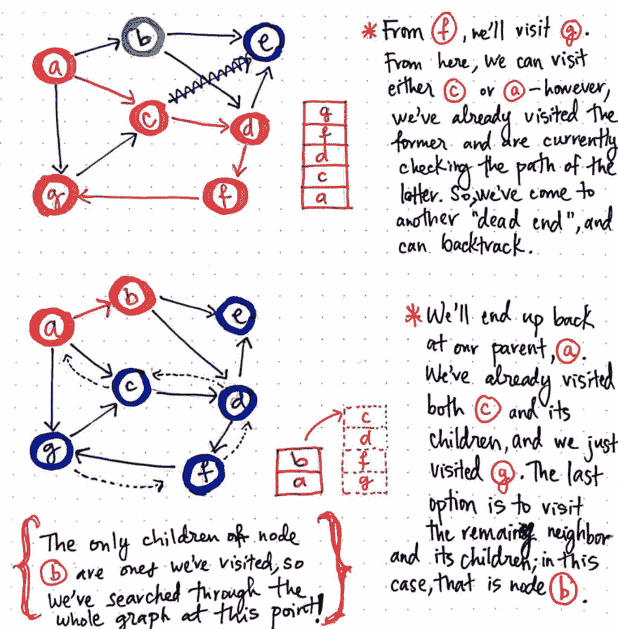](https://res.cloudinary.com/practicaldev/image/fetch/s--Ctnn4k_K--/c_limit%2Cf_auto%2Cfl_progressive%2Cq_auto%2Cw_880/https://cdn-images-1.medium.com/max/1024/1%2AhiPTDPgZntGR5E05V7z9lQ.jpeg) 

<figcaption>DFS，part 5</figcaption>

</figure>

从节点 f，我们别无选择，只能访问 g，这是唯一可访问的节点，也是唯一可供我们访问的节点。因此，我们将 g 添加到堆栈的顶部，访问它，并检查我们可以从那里去哪里。

事实证明，从节点 g 开始，我们只能去一个地方:节点 c。然而，由于我们足够聪明，能够跟踪我们访问过的节点，我们已经知道 c 已经被访问过，并且是这条路径的一部分；我们不想再去了！所以，我们来到了另一个死胡同，这意味着我们可以回溯。我们将从堆栈中弹出节点 g，检查下一个节点是否有我们可以遍历的其他子节点。事实证明，节点 f 没有任何我们没有访问过的子节点，节点 d 和 c 也没有；因此，我们将从栈顶弹出所有这些。

最终，我们会发现我们已经一路回溯到了我们最初的“父节点，节点 a”。因此，我们将再次重复这个过程:我们将检查它的哪些子节点我们可以访问，哪些我们之前*还没有访问过*。由于我们已经访问了节点 c 和 g，剩下的最后一个选项是访问 b。

同样，我们将像迄今为止对每个节点所做的那样:将节点 b 添加到堆栈的顶部，将其标记为“已访问”，并检查它是否有我们可以遍历但尚未访问的子节点。然而，节点 b 的子节点是 e 和 d，我们已经访问了这两个节点，这意味着我们实际上已经访问了图中的所有节点！换句话说，对于这种结构，我们的深度优先图遍历正式完成。

我们会注意到，对于我们推入并随后弹出堆栈的每个节点，我们在深度优先搜索算法中重复相同的步骤。事实上，我们真正做的是递归访问节点。实际上，每当我们到达一个新节点时，我们都采取以下步骤:

1.  我们将该节点添加到“已访问顶点”堆栈的顶部。
2.  我们把它标为“参观过”。
3.  我们检查它是否有孩子———如果有，我们确保他们还没有被访问过，然后访问它。如果没有，我们就把它从堆栈中弹出。

随着每个新节点添加到堆栈中，我们从堆栈上的前一个节点(或前一个函数调用)的上下文中重复这些步骤。换句话说，我们*递归地*访问路径上的每个节点，直到我们到达一个死胡同。

事实证明，这种访问顶点的递归重复是大多数深度优先搜索算法实现的主要特征！

### 现实生活中的递归和运行时

DFS 算法的递归源于这样一个事实，即我们实际上并没有检查完一个“父节点”,直到我们到达一个死胡同，并且不可避免地从栈顶弹出一个“父节点的子节点”。

<figure>[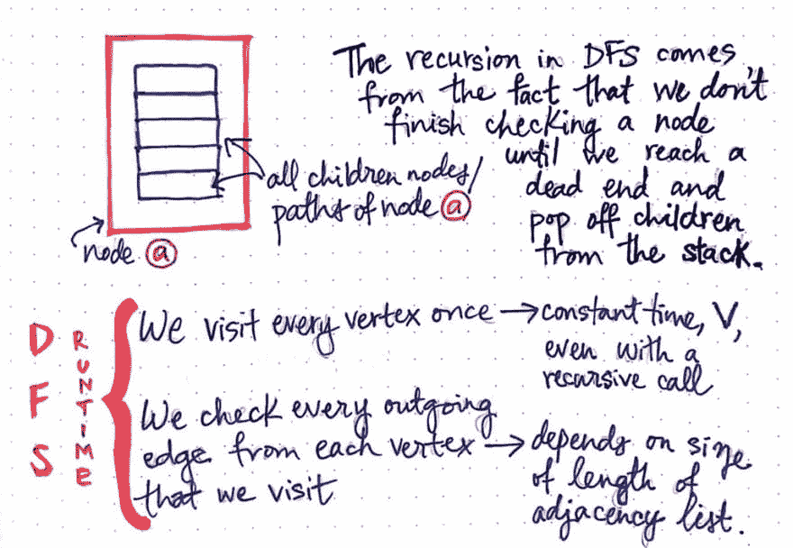](https://res.cloudinary.com/practicaldev/image/fetch/s--8ZY9SD8---/c_limit%2Cf_auto%2Cfl_progressive%2Cq_auto%2Cw_880/https://cdn-images-1.medium.com/max/1024/1%2AV5_q4oXZg-n_xJ2WZTvEVg.jpeg) 

<figcaption>递归应用于 DFS 运行时</figcaption>

</figure>

我们可以把 DFS 的递归方面想象成一个函数调用来“访问另一个已经运行的函数调用中的一个节点”来访问一个节点。例如，当我们开始访问节点 a 时，当我们开始访问节点 a 的一个子节点(如节点 c)时，我们仍然在访问节点 a 的过程中。

然而，尽管深度优先搜索内置了递归，但这种算法在现实生活中的运行时间实际上并没有受到这种图遍历技术的递归方面的太大影响。事实上，即使使用递归，访问图中每个顶点一次的过程也需要 ***常数时间*** 。那么，如果检查一次顶点不是这个算法的昂贵部分…那么什么是呢？

答案在于边——更具体地说，检查我们访问的每个顶点的出边的代价可能会非常昂贵且耗时。这是因为一些节点可能只有一个相邻顶点要检查，因此只有一条边，而其他节点可能有五条、十条或更多条边要检查！所以，实际上，检查从一个顶点到另一个顶点的每个输出边的运行时间完全取决于任何给定节点的*邻接链表*的大小/长度，其计算为 ***线性时间*** 。

<figure>[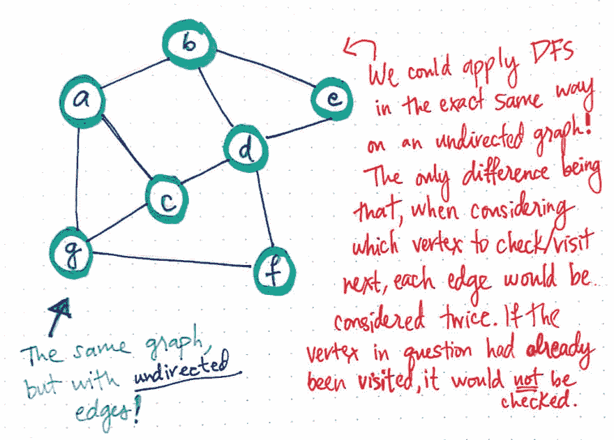](https://res.cloudinary.com/practicaldev/image/fetch/s--AcYwVknf--/c_limit%2Cf_auto%2Cfl_progressive%2Cq_auto%2Cw_880/https://cdn-images-1.medium.com/max/1024/1%2AZZw5vRjhbyk_rxkL3t-S3A.jpeg) 

<figcaption>我们可以在无向图上以同样的方式应用 DFS</figcaption>

</figure>

我们将从[中回忆起图论的基础知识](https://dev.to/vaidehijoshi/a-gentle-introduction-to-graph-theory),一个图可以有无向边或有向边。正如无向图和有向图根据边在[的邻接表表示中出现一次还是两次而具有略微不同的运行时间一样，这也是一个类似的故事。](https://dev.to/vaidehijoshi/going-broad-in-a-graph-bfs-traversal)

事实上，我们可以以完全相同的方式将 DFS 应用到我们正在处理的同一张图中，即使它是无向的。唯一的主要区别是，在运行 DFS 时，当考虑下一个要访问的顶点时，图中的每条边都会被考虑两次。

<figure>[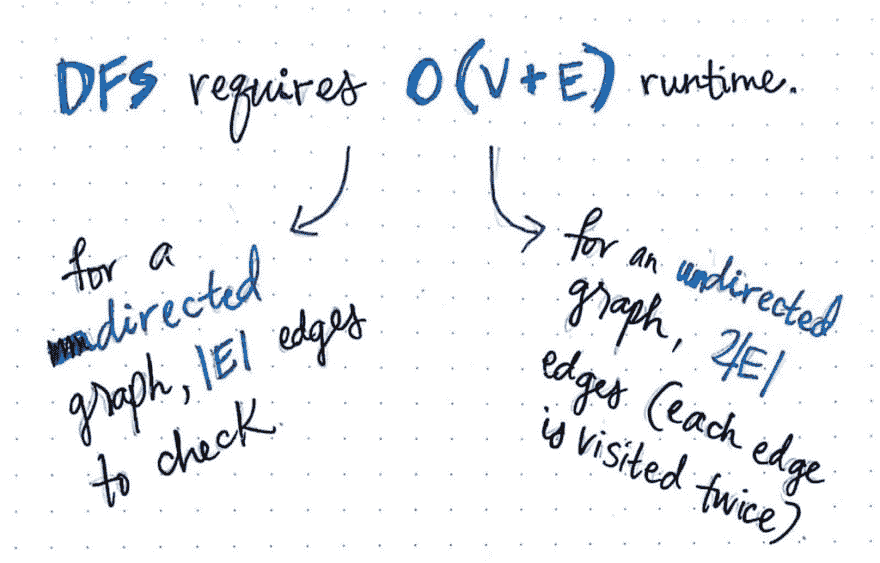](https://res.cloudinary.com/practicaldev/image/fetch/s--iDYdhg3C--/c_limit%2Cf_auto%2Cfl_progressive%2Cq_auto%2Cw_880/https://cdn-images-1.medium.com/max/1024/1%2AD-cseblYreOkyXg5-DnEFg.jpeg) 

<figcaption>深度优先搜索和线性运行时</figcaption>

</figure>

因此，DFS 的实际运行时间实际上与 BFS 没有什么不同:它们都需要线性时间，根据图是有向的还是无向的，略有不同的是图的边数(邻接链表的长度)。对于一个*有向*图，运行时间总计为 O* **(V + |E|)** *，而对于一个*无向*图，运行时间计算为** *O(V + 2|E|)* **，两者都导致** *线性时间*** 。

但是等等——所有这些理论上的递归是如何与这个算法的实际实现联系起来的？我们已经知道[图是如何使用邻接表来表示的](https://dev.to/vaidehijoshi/from-theory-to-practice-representing-graphs)。我们也知道如何使用这些表示来[理解其他算法](https://dev.to/vaidehijoshi/going-broad-in-a-graph-bfs-traversal)，比如广度优先搜索。那么，我们如何以类似的方式理解深度优先算法呢？

好吧，让我们想想当我们在这个图的邻接表表示上运行 DFS 时会发生什么。下图展示了邻接表的样子。

<figure>[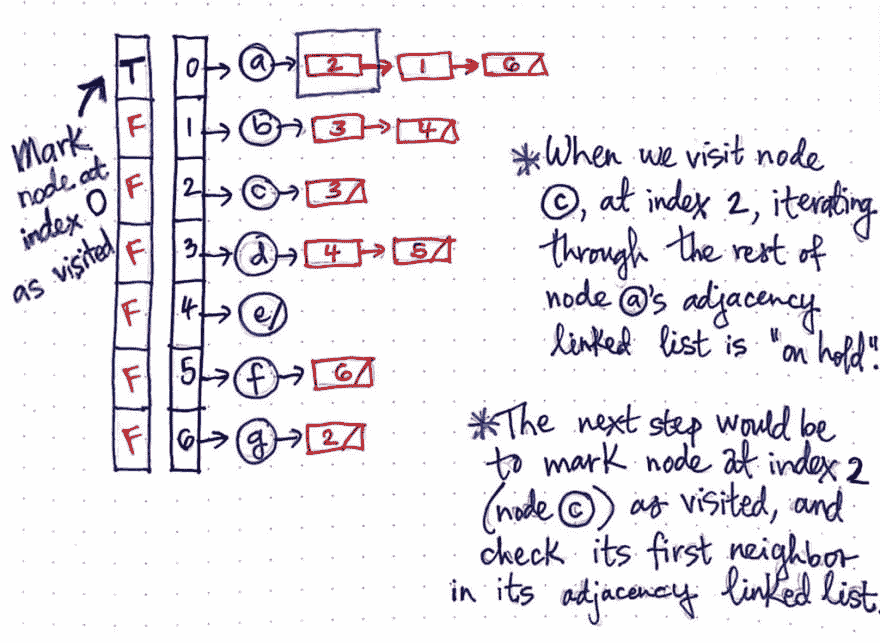](https://res.cloudinary.com/practicaldev/image/fetch/s--crthWQGR--/c_limit%2Cf_auto%2Cfl_progressive%2Cq_auto%2Cw_880/https://cdn-images-1.medium.com/max/1024/1%2AkYMRBN0VD1YuYlOkYJ2JAQ.jpeg) 

<figcaption>使用邻接表实现 DFS，part 1</figcaption>

</figure>

当我们第一次访问“父节点 a”时，我们将它添加到堆栈中，并将其标记为已访问。在邻接表的上下文中，我们标记了“访问过的数组”,并标记了刚刚推入堆栈的顶点的索引(索引 0 ),将其“访问过的状态”标记为真。

接下来，我们来看看节点 a 的邻接链表中的第一项。在这种情况下，列表中的第一项是对索引 2 处的项的引用，它是节点 c。我们接下来将访问节点 c，并且，在这个过程中，我们将把遍历节点 a 的邻接链表的剩余工作“搁置”。换句话说，我们接下来将查找索引 2 处的节点，而不是遍历节点 a 的邻接链表的其余部分，并查看索引 1 处的任何元素。

因为下一步是将索引 2 处的节点标记为已访问，所以我们就这样做。索引 2 处的顶点是节点 c，因此我们将把它添加到堆栈中，标记为已访问，并检查其邻接链表中的第一个邻居。我们之前已经经历过这些步骤，所以让我们跳到我们遇到死胡同的那一点，并且必须返回到*上*到“父节点——*,这就是事情变得有趣的*!

<figure>[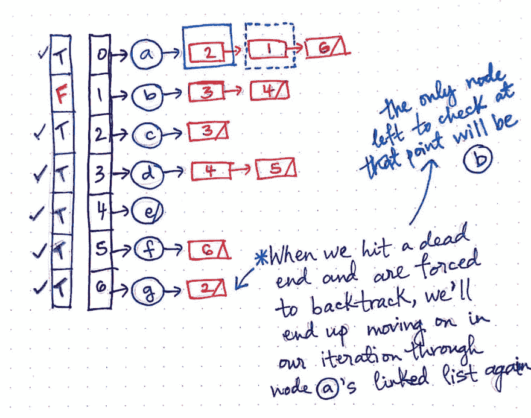](https://res.cloudinary.com/practicaldev/image/fetch/s--hwZvOzjP--/c_limit%2Cf_auto%2Cfl_progressive%2Cq_auto%2Cw_880/https://cdn-images-1.medium.com/max/1024/1%2APLYooMtsFP6mpkxE1Vom0g.jpeg) 

<figcaption>使用邻接表实现 DFS，第二部分</figcaption>

</figure>

在我们一路向下遍历以检查和访问节点 g 之后，我们进入了一个死胡同，并返回到位于索引 0 的节点 a。只有在这一点上，我们从我们停止的地方重新开始；也就是说，我们现在将继续遍历节点 a 的邻接链表( *Finally！*)。

节点 a 的邻接链表中的下一个元素是对索引 1 的引用，索引 1 是对顶点 b 的引用。此时，我们还会注意到，整个“已访问数组”到处都标有 TRUE，只有一个例外:顶点 b。这意味着，一旦我们检查了节点 b 并将其标记为“已访问”,我们就遍历了整个图，瞧——我们完成了！

那并不太可怕，是吗？

<figure>[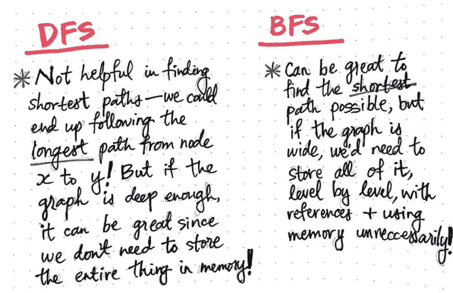](https://res.cloudinary.com/practicaldev/image/fetch/s--JBhlPQTQ--/c_limit%2Cf_auto%2Cfl_progressive%2Cq_auto%2Cw_880/https://cdn-images-1.medium.com/max/1024/1%2Aza_GW1vpyK_JYHcmsPH63A.jpeg) 

<figcaption>深度优先 vs 广度优先:利弊</figcaption>

</figure>

深度优先搜索和广度优先搜索之间的区别一开始可能很微妙，很难注意到！它们都可以在图的邻接表表示上实现，它们都产生相同的运行时间，并涉及遍历图中每个顶点的邻接表。然而，一旦我们看到这些算法的运行，我们就可以开始发现它们在实现上的细微差别。

关于这两种算法，需要记住的重要一点是，没有一种算法一定比另一种算法更好。例如，深度优先搜索在确定两个节点之间是否存在路径方面非常有用，并且不一定需要大量内存，因为遍历整个图不需要初始化或实例化。然而，DFS 对于寻找两个节点之间的最短路径没有帮助；事实上，我们最终可能会无意中发现最长的路径！相比之下，BFS 在寻找两个节点之间的最短路径方面很棒，但通常需要我们在逐层搜索时存储整个图，这可能会耗费大量空间和内存。

每种解决方案都有其优点和缺点。但是，它们是解决问题的两种不同方式，根据我们遇到的问题的类型，它们可能最终会成为这项工作的完美工具。

### 资源

深度优先搜索可以用几种不同的方式来解释和实现，至少在您第一次学习 DFS 算法时，试图理解所有这些方式可能会感到力不从心。然而，一旦您对它的工作方式更加熟悉，了解 DFS 工作方式的不同实现和特性会很有帮助。如果您希望更深入地理解这个算法，这里有一些很好的例子和实现来帮助您入门。

1.  [图的深度优先搜索(DFS)第二部分](https://www.youtube.com/watch?v=uT1p5Eiw9CE)
2.  哈佛大学计算机科学系深度优先搜索
3.  什么时候可以使用 DFS vs BFS？，StackOverflow
4.  [深度优先搜索(DFS)，拓扑排序](https://www.youtube.com/watch?v=AfSk24UTFS8&t=201s)，麻省理工学院开放式课程
5.  [图形遍历-广度优先和深度优先](https://www.youtube.com/watch?v=bIA8HEEUxZI)，学院查询

* * *