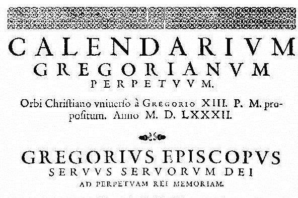
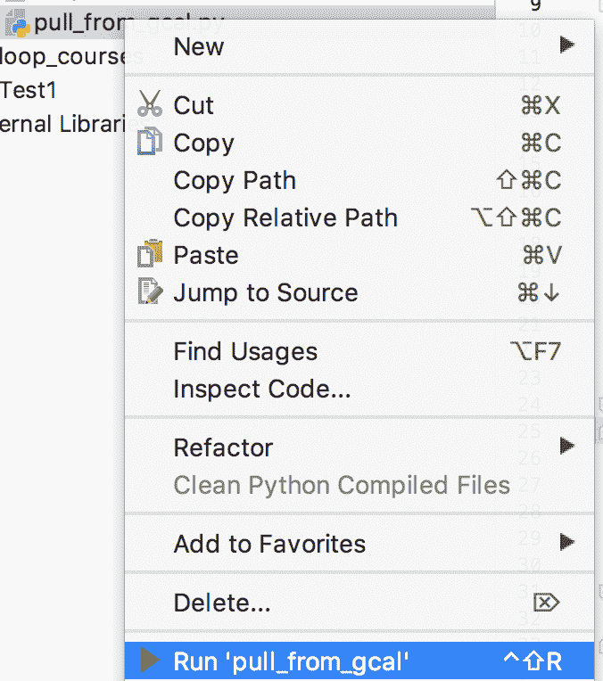
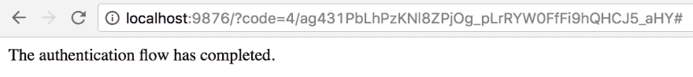

# 创建昨天 Google 日历事件的 CSV

> 原文:[https://dev . to/scripting withpy/create-a-CSV-of-yesterdays-Google-calendar-events-dgm](https://dev.to/scriptingwithpy/create-a-csv-of-yesterdays-google-calendar-events-dgm)

[T2】](https://res.cloudinary.com/practicaldev/image/fetch/s--TvdTph9N--/c_limit%2Cf_auto%2Cfl_progressive%2Cq_auto%2Cw_880/http://scriptingwithpython.com/conteimg/2017/09/gregorian-calendar.jpg)

Python 非常擅长处理结构化数据。有各种各样的库可以用来解析 JSON、CSV、XML 等。有用于解析日历的库(。ics)文件。

几天前，我需要提取一份前一天所有日历事件的 CSV 报告。该任务可能需要多次执行。我的[脚本雷达](http://scriptingwithpython.com/my-lazy-scripter-radar)立即接收到一个 ping，我看到了一个 Python 脚本的完美目标。

当然，我可以从谷歌日历的议程视图中复制并粘贴列表。如果我只需要这样做一次，那就没问题了。然而，我可能会再次这样做，脚本给了我更多的灵活性，让我可以做其他事情。

## 任务是什么？

任务:从 Google 日历中提取所有日历事件的完整列表，并将其保存在 CSV 文件中。输出 CVS 文件必须包含以下列。

| 标题 | 开始日期 | 结束日期 | 期间 |
| --- | --- | --- | --- |
| 午餐 | 2017-09-21 09:00:00-06:00 | 2017-09-21 09:55:00-06:00 | Fifty-five |

## 将 Google 日历事件拉至 CSV 的解决方案

### 先决条件

*   Python 2.7，最好是 Python 3.4 或更高版本[参见我对 Python 版本的看法](https://dev.to/scriptingwithpy/my-take-on-python-version-2-vs-3-c70-temp-slug-9579522)
*   一个好的文本编辑器或者 Python IDE[【1】](http://scriptingwithpython.com/pull-a-list-of-yesterdays-google-calendar-events/#fn1)
*   一个谷歌账户
*   操作系统:
    *   Linux 操作系统
    *   麦克·OS X
    *   Windows 操作系统
*   Python 2.7 或 3.4 或更高版本

### 总结

我搜索了一段时间，寻找一个好的 Python 谷歌日历模块。我确实发现了几个显示出一些潜力的，但大多数似乎有点过时。我最终进入了谷歌自己的开发者页面[【2】](http://scriptingwithpython.com/pull-a-list-of-yesterdays-google-calendar-events/#fn2)。在这个页面上，我找到了一个 Python 示例，它完成了我正在寻找的大部分过程。我心想:

> “自我，没有理由重新创造美好的东西。让我们把这里好的东西拿来，修改一下，使之符合我们的需要。”
> 
> -我

所以我就这么做了。

我修改了在那个页面上找到的代码，导出了一个包含我需要的值的 CSV[【3】](http://scriptingwithpython.com/pull-a-list-of-yesterdays-google-calendar-events/#fn3)文件。您可能还注意到，我对它进行了调整，使其包含的事件超过了示例脚本包含的 10 个事件。稍后你会看到这个。

我对最终结果基本满意。它做它需要做的事情要比我手动做的快得多，而且可以说比我手动做得更好——这就是关键。

本页的大部分说明直接来自谷歌的文章。

## 准备，出发！

### 步骤 1 -设置环境

首先要做的是安装 Google Calendar Python 客户端库。

但是，在此之前，您需要设置一个虚拟环境。我总是建议在安装 Python 库时使用 [virtualenvironment](https://dev.to/scriptingwithpy/setting-up-a-python-virtual-environment-29d-temp-slug-5994947) ，尤其是当你不确定它是做什么的时候:)。

如果您还没有设置虚拟环境，请现在就设置。如果你不确定如何做，请访问[虚拟环境](https://dev.to/scriptingwithpy/setting-up-a-python-virtual-environment-29d-temp-slug-5994947)。现在就去做吧。

我会等的...

 

<small>照片由[Jaime Top](https://unsplash.com/@jaime210?utm_source=ghost&utm_medium=referral&utm_campaign=api-credit)/[Unsplash](https://unsplash.com/?utm_source=ghost&utm_medium=referral&utm_campaign=api-credit)</small>

在进行下一步之前，请确保您处于虚拟环境中。

在终端窗口中，输入以下命令:

`$ pip install --upgrade google-api-python-client dateutil`

不应该提示您输入密码来安装软件包。如果是，那么您要么没有设置虚拟环境，要么没有在其中工作。返回到该页面，确保设置正确。

### 第二步——打开谷歌日历 API

按照[https://developers . Google . com/Google-apps/Calendar/quick start/python](https://developers.google.com/google-apps/calendar/quickstart/python)上的“打开 Google 日历 API”步骤进行操作。

### 第四步——创建 Python 文件`pull_from_gcal.py`

创建 Python 文件来运行该脚本。如果您正在使用 PyCharm，您可能需要创建一个新项目。

### 第五步-保存代码

如果您想直接运行代码，可以在这里复制/粘贴完成的代码。然而，您可能会受益于一行一行(主要是)的走查，以确保您知道它在做什么。

### 步骤 6 -运行脚本

右键单击 PyCharm 中的文件并选择`Run 'pull_from_gcal.py'`，运行。

[T2】](https://res.cloudinary.com/practicaldev/image/fetch/s--2tBeLTuR--/c_limit%2Cf_auto%2Cfl_progressive%2Cq_auto%2Cw_880/http://scriptingwithpython.com/conteimg/2017/09/Screen-Shot-2017-09-24-at-6.33.31-PM.png)

如果一切顺利，脚本将打开一个浏览器窗口，提示您批准应用程序。去做这个吧。该脚本将收集必要的凭据，并将它们保存到本地文件中以供将来使用。如果可以的话，你的浏览器应该会显示如下画面。

[T2】](https://res.cloudinary.com/practicaldev/image/fetch/s--anw4pR2_--/c_limit%2Cf_auto%2Cfl_progressive%2Cq_auto%2Cw_880/http://scriptingwithpython.com/conteimg/2017/09/Screen-Shot-2017-09-24-at-9.30.13-AM.png)

还将创建包含昨天事件的 CSV。

[T2】](https://res.cloudinary.com/practicaldev/image/fetch/s--hJHv4aZ7--/c_limit%2Cf_auto%2Cfl_progressive%2Cq_auto%2Cw_880/http://scriptingwithpython.com/conteimg/2017/09/Screen-Shot-2017-09-24-at-6.37.31-PM.png)

## 总结、总结、跟进

好吧，这就对了。现在你有了一个脚本，如果你需要这样做的话，它可以节省你的时间。感谢您花时间通读并测试这个脚本。

以下是您可能想考虑对脚本进行的一些潜在增强。

*   从您的所有日历中提取事件
*   添加包含与会者列表的字段
*   添加指示事件是否为重复事件的字段
*   添加字段，指明是您创建了活动还是您被邀请了

我正在写一本电子书，里面有很多脚本食谱。我计划在这个版本中加入一些改变。敬请关注，了解更多信息。我鼓励您使用下面的表格进行订阅。

* * *

1.  我喜欢 Pycharm 学习 Python。你可能会看到我经常使用 vim，因为我有太多的肌肉记忆。PyCharm 更适合测试和编辑代码，有很好的语法高亮和代码提示。 [↩︎](http://scriptingwithpython.com/pull-a-list-of-yesterdays-google-calendar-events/#fnref1)

2.  https://developers . Google . com/Google-apps/calendar/quick start/python[↩︎](http://scriptingwithpython.com/pull-a-list-of-yesterdays-google-calendar-events/#fnref2)

3.  在 [↩︎](http://scriptingwithpython.com/pull-a-list-of-yesterdays-google-calendar-events/#fnref3) 找到更多关于操作 CSV 文件的文章